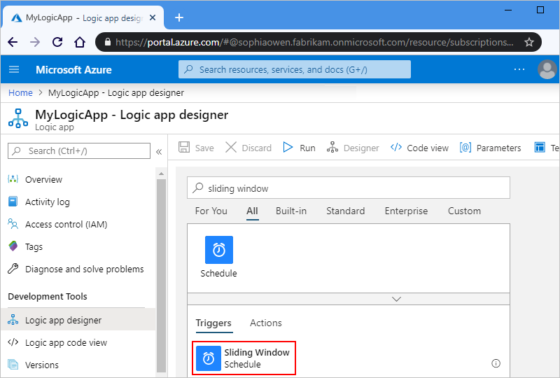
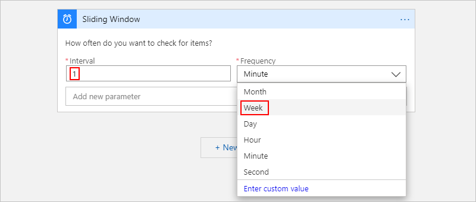
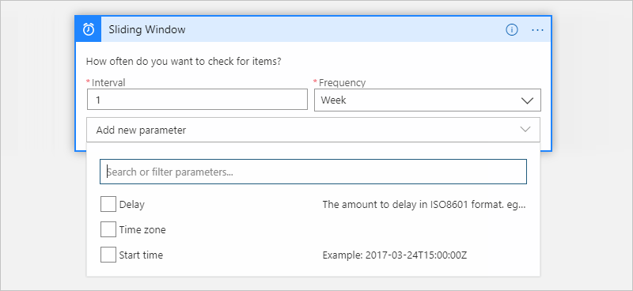

# Create, schedule, and run recurring tasks and workflows with the Sliding Window trigger in Azure Logic Apps

To regularly run tasks, processes, or jobs that must handle data in continuous segments, you can start your logic app workflow with the [built-in](../connectors/apis-list.md) **Sliding Window - Schedule** [trigger](../logic-apps/logic-apps-overview.md#logic-app-concepts). You can set a date and time for starting the workflow and a recurrence interval for repeating that workflow. If recurrences are missed for whatever reason, this trigger processes those missed recurrences. For example, when synchronizing data between your database and backup storage, use the Sliding Window trigger so that the data gets synchronized without incurring gaps.

Here are some patterns that this trigger supports:

* Run immediately and repeat every *n* number of seconds, minutes, hours, days, weeks, or months.
* Start at a specific date and time, then run and repeat every *n* number of seconds, minutes, hours, days, weeks, or months.
* Delay for a specific duration, then run and repeat every *n* number of seconds, minutes, hours, days, weeks, or months.

For differences between this trigger and the Recurrence trigger or for more information about scheduling recurring workflows, see [Schedule and run recurring automated tasks, processes, and workflows with Azure Logic Apps](../logic-apps/concepts-schedule-automated-recurring-tasks-workflows.md).

> [!TIP]
> If you want to trigger your logic app and run only one time in the future, see 
> [Run jobs one time only](../logic-apps/concepts-schedule-automated-recurring-tasks-workflows.md#run-once).

## Prerequisites

* An Azure subscription. If you don't have a subscription, you can [sign up for a free Azure account](https://azure.microsoft.com/free/).

* Basic knowledge about [logic apps](../logic-apps/logic-apps-overview.md). If you're new to logic apps, learn [how to create your first logic app](../logic-apps/quickstart-create-first-logic-app-workflow.md).

## Add Sliding Window trigger

1. Sign in to the [Azure portal](https://portal.azure.com). Create a blank logic app.

1. After Logic App Designer appears, in the search box, enter "sliding window" as your filter. From the triggers list, select this trigger as the first step in your logic app workflow: **Sliding Window**

   

1. Set the interval and frequency for the recurrence. In this example, set these properties to run your workflow every week.

   

   | Property | Required | JSON name | Type | Description |
   |----------|----------|-----------|------|-------------|
   | **Interval** | Yes | interval | Integer | A positive integer that describes how often the workflow runs based on the frequency. <p>The default interval is 1. Here are the minimum and maximum intervals: <p>- Month: 1-16 months </br>- Day: 1-500 days </br>- Hour: 1-12,000 hours </br>- Minute: 1-72,000 minutes </br>- Second: 1-9,999,999 seconds<p>For example, if the interval is 6, and the frequency is "Month", then the recurrence is every 6 months. |
   | **Frequency** | Yes | frequency | String | The unit of time for the recurrence: **Second**, **Minute**, **Hour**, **Day**, **Week**, or **Month** |
   ||||||

   

   For more recurrence options, open the **Add new parameter** list. 
   Any options that you select appear on the trigger after selection.

   | Property | Required | JSON name | Type | Description |
   |----------|----------|-----------|------|-------------|
   | **Delay** | No | delay | String | The duration to delay using the [ISO 8601 date time specification](https://en.wikipedia.org/wiki/ISO_8601#Durations). |
   | **Time zone** | No | timeZone | String | Applies only when you specify a start time because this trigger doesn't accept [UTC offset](https://en.wikipedia.org/wiki/UTC_offset). Select the time zone that you want to apply. |
   | **Start time** | No | startTime | String | Provide a start date and time in this format: <p>YYYY-MM-DDThh:mm:ss if you select a time zone <p>-or- <p>YYYY-MM-DDThh:mm:ssZ if you don't select a time zone <p>So for example, if you want September 18, 2017 at 2:00 PM, then specify "2017-09-18T14:00:00" and select a time zone such as Pacific Standard Time. Or, specify "2017-09-18T14:00:00Z" without a time zone. <p>**Note:** This start time must follow the [ISO 8601 date time specification](https://en.wikipedia.org/wiki/ISO_8601#Combined_date_and_time_representations) in [UTC date time format](https://en.wikipedia.org/wiki/Coordinated_Universal_Time), but without a [UTC offset](https://en.wikipedia.org/wiki/UTC_offset). If you don't select a time zone, you must add the letter "Z" at the end without any spaces. This "Z" refers to the equivalent [nautical time](https://en.wikipedia.org/wiki/Nautical_time). <p>For simple schedules, the start time is the first occurrence, while for advanced recurrences, the trigger doesn't fire any sooner than the start time. [*What are the ways that I can use the start date and time?*](../logic-apps/concepts-schedule-automated-recurring-tasks-workflows.md#start-time) |
   |||||

1. Now build your remaining workflow with other actions. For more actions that you can add, see [Connectors](../connectors/apis-list.md).

## Workflow definition - Sliding Window

In your logic app's underlying workflow definition, which uses JSON, you can view the [Sliding Window trigger definition](../logic-apps/logic-apps-workflow-actions-triggers.md#sliding-window-trigger) with the options that you chose. To view this definition, on the designer toolbar, choose **Code view**. To return to the designer, choose on the designer toolbar, **Designer**.

This example shows how a Sliding Window trigger definition might look in an underlying workflow definition:

``` json
"triggers": {
   "Recurrence": {
      "type": "SlidingWindow",
      "Sliding_Window": {
         "inputs": {
            "delay": "PT5H"
         },
         "recurrence": {
            "frequency": "Week",
            "interval": 1,
            "startTime": "2019-05-13T14:00:00Z",
            "timeZone": "Pacific Standard Time"
         }
      }
   }
}
```

## Next steps

* [Pause workflows with delay actions](../connectors/connectors-native-delay.md)
* [Connectors for Logic Apps](../connectors/apis-list.md)