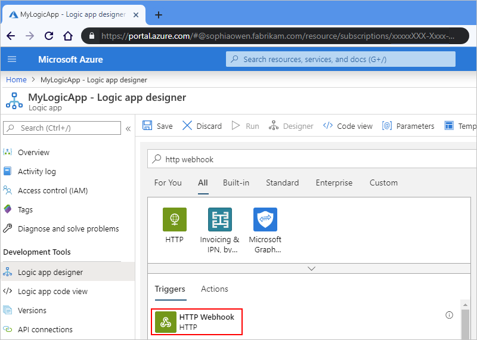
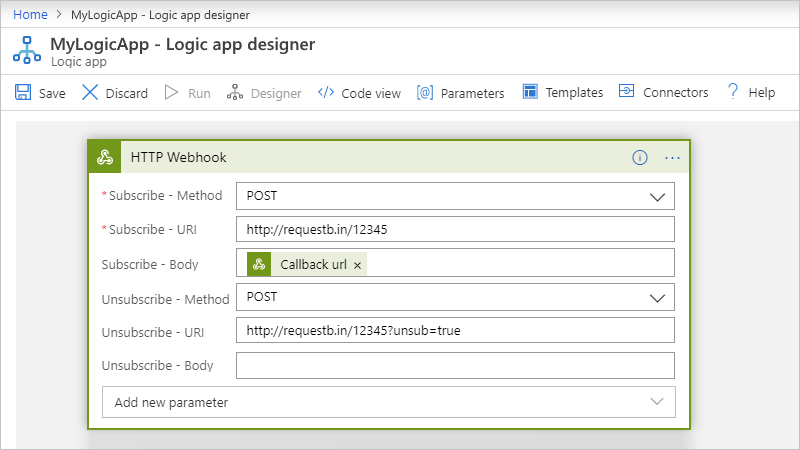
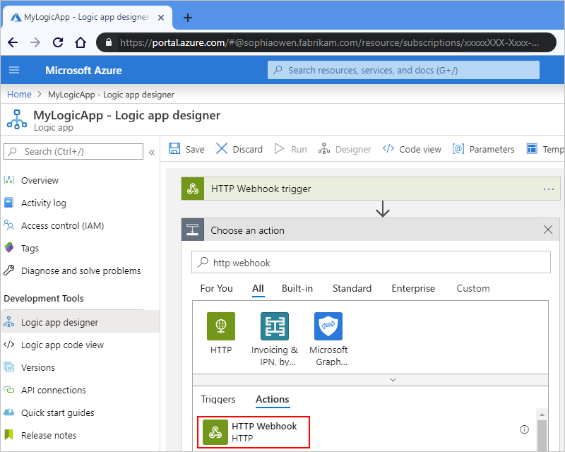

# Create and run automated event-based workflows by using HTTP webhooks in Azure Logic Apps

With [Azure Logic Apps](../logic-apps/logic-apps-overview.md) and the built-in HTTP Webhook connector, you can automate workflows that wait and run based on specific events that happen at an HTTP or HTTPS endpoint by building logic apps. For example, you can create a logic app that monitors a service endpoint by waiting for a specific event before triggering the workflow and running the specified actions, rather than regularly checking or *polling* that endpoint.

Here are some example event-based workflows:

* Wait for an item to arrive from an [Azure Event Hub](https://github.com/logicappsio/EventHubAPI) before triggering a logic app run.
* Wait for an approval before continuing a workflow.

## How do webhooks work?

An HTTP webhook trigger is event-based, which doesn't depend on checking or polling regularly for new items. When you save a logic app that starts with a webhook trigger, or when you change your logic app from disabled to enabled, the webhook trigger *subscribes* to a specific service or endpoint by registering a *callback URL* with that service or endpoint. The trigger then waits for that service or endpoint to call the URL, which starts running the logic app. Similar to the [Request trigger](connectors-native-reqres.md), the logic app fires immediately when the specified event happens. The trigger *unsubscribes* from the service or endpoint if you remove the trigger and save your logic app, or when you change your logic app from enabled to disabled.

An HTTP webhook action is also event-based and *subscribes* to a specific service or endpoint by registering a *callback URL* with that service or endpoint. The webhook action pauses the logic app's workflow and waits until the service or endpoint calls the URL before the logic app resumes running. The action logic app *unsubscribes* from the service or endpoint in these cases:

* When the webhook action successfully finishes
* If the logic app run is canceled while waiting for a response
* Before the logic app times out

For example, the Office 365 Outlook connector's [**Send approval email**](connectors-create-api-office365-outlook.md) action is an example of webhook action that follows this pattern. You can extend this pattern into any service by using the webhook action.

> [!NOTE]
> Logic Apps enforces Transport Layer Security (TLS) 1.2 when 
> receiving the call back to the HTTP webhook trigger or action. 
> If you see SSL handshake errors, make sure that you use TLS 1.2.

For more information, see these topics:

* [HTTP Webhook trigger parameters](../logic-apps/logic-apps-workflow-actions-triggers.md#http-webhook-trigger)
* [Webhooks and subscriptions](../logic-apps/logic-apps-workflow-actions-triggers.md#webhooks-and-subscriptions)
* [Create custom APIs that support a webhook](../logic-apps/logic-apps-create-api-app.md)

## Prerequisites

* An Azure subscription. If you don't have an Azure subscription, [sign up for a free Azure account](https://azure.microsoft.com/free/).

* The URL for an already deployed endpoint or API that supports the webhook subscribe and unsubscribe pattern for [webhook triggers in logic apps](../logic-apps/logic-apps-create-api-app.md#webhook-triggers) or [webhook actions in logic apps](../logic-apps/logic-apps-create-api-app.md#webhook-actions) as appropriate

* Basic knowledge about [how to create logic apps](../logic-apps/quickstart-create-first-logic-app-workflow.md). If you're new to logic apps, review [What is Azure Logic Apps?](../logic-apps/logic-apps-overview.md)

* The logic app where you want to wait for specific events at the target endpoint. To start with the HTTP Webhook trigger, [create a blank logic app](../logic-apps/quickstart-create-first-logic-app-workflow.md). To use the HTTP Webhook action, start your logic app with any trigger that you want. This example uses the HTTP trigger as the first step.

## Add an HTTP Webhook trigger

This built-in trigger registers a callback URL with the specified service and waits for that service to send an HTTP POST request to that URL. When this event happens, the trigger fires and immediately runs the logic app.

1. Sign in to the [Azure portal](https://portal.azure.com). Open your blank logic app in Logic App Designer.

1. On the designer, in the search box, enter "http webhook" as your filter. From the **Triggers** list, select the **HTTP Webhook** trigger.

   

   This example renames the trigger to "HTTP Webhook trigger" so that the step has a more descriptive name. Also, the example later adds an HTTP Webhook action, and both names must be unique.

1. Provide the values for the [HTTP Webhook trigger parameters](../logic-apps/logic-apps-workflow-actions-triggers.md#http-webhook-trigger) that you want to use for the subscribe and unsubscribe calls, for example:

   

1. To add other available parameters, open the **Add new parameter** list, and select the parameters that you want.

   For more information about authentication types available for HTTP Webhook, see [Add authentication to outbound calls](../logic-apps/logic-apps-securing-a-logic-app.md#add-authentication-outbound).

1. Continue building your logic app's workflow with actions that run when the trigger fires.

1. When you're finished, done, remember to save your logic app. On the designer toolbar, select **Save**.

   Saving your logic app calls the subscribe endpoint and registers the callback URL for triggering this logic app.

1. Now, whenever the target service sends an `HTTP POST` request to the callback URL, the logic app fires, and includes any data that is passed through the request.

## Add an HTTP Webhook action

This built-in action registers a callback URL with the specified service, pauses the logic app's workflow, and waits for that service to send an HTTP POST request to that URL. When this event happens, the action resumes running the logic app.

1. Sign in to the [Azure portal](https://portal.azure.com). Open your logic app in Logic App Designer.

   This example uses the HTTP Webhook trigger as the first step.

1. Under the step where you want to add the HTTP Webhook action, select **New step**.

   To add an action between steps, move your pointer over the arrow between steps. Select the plus sign (**+**) that appears, and then select **Add an action**.

1. On the designer, in the search box, enter "http webhook" as your filter. From the **Actions** list, select the **HTTP Webhook** action.

   

   This example renames the action to "HTTP Webhook action" so that the step has a more descriptive name.

1. Provide the values for the HTTP Webhook action parameters, which are similar to the [HTTP Webhook trigger parameters](../logic-apps/logic-apps-workflow-actions-triggers.md##http-webhook-trigger) that you want to use for the subscribe and unsubscribe calls, for example:

   

   During runtime, the logic app calls the subscribe endpoint when running this action. Your logic app then pauses the workflow and waits for the target service to send an `HTTP POST` request to the callback URL. If the action completes successfully, the action unsubscribes from the endpoint, and your logic app resumes running the workflow.

1. To add other available parameters, open the **Add new parameter** list, and select the parameters that you want.

   For more information about authentication types available for HTTP Webhook, see [Add authentication to outbound calls](../logic-apps/logic-apps-securing-a-logic-app.md#add-authentication-outbound).

1. When you're finished, remember to save your logic app. On the designer toolbar, select **Save**.

## Connector reference

For more information about trigger and action parameters, which are similar to each other, see [HTTP Webhook parameters](../logic-apps/logic-apps-workflow-actions-triggers.md##http-webhook-trigger).

### Output details

Here is more information about the outputs from an HTTP Webhook trigger or action, which returns this information:

| Property name | Type | Description |
|---------------|------|-------------|
| headers | object | The headers from the request |
| body | object | JSON object | The object with the body content from the request |
| status code | int | The status code from the request |
|||

| Status code | Description |
|-------------|-------------|
| 200 | OK |
| 202 | Accepted |
| 400 | Bad request |
| 401 | Unauthorized |
| 403 | Forbidden |
| 404 | Not Found |
| 500 | Internal server error. Unknown error occurred. |
|||

## Next steps

* Learn about other [Logic Apps connectors](../connectors/apis-list.md)
