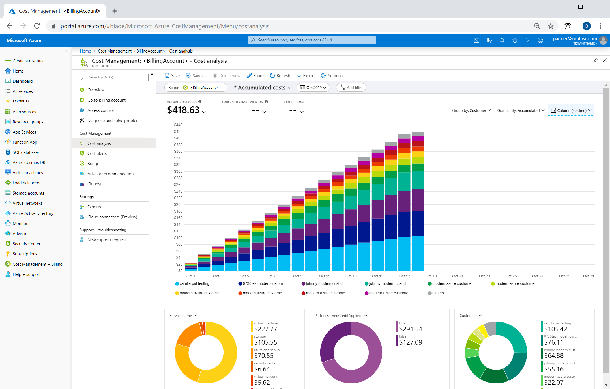
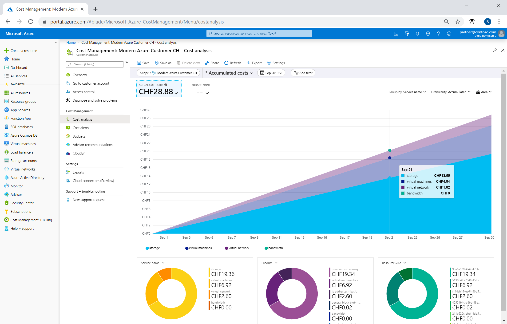
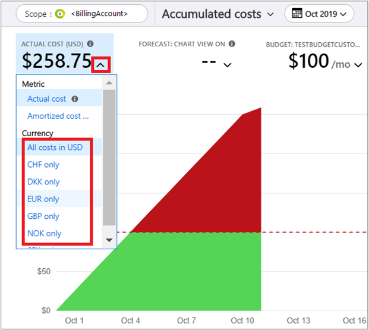
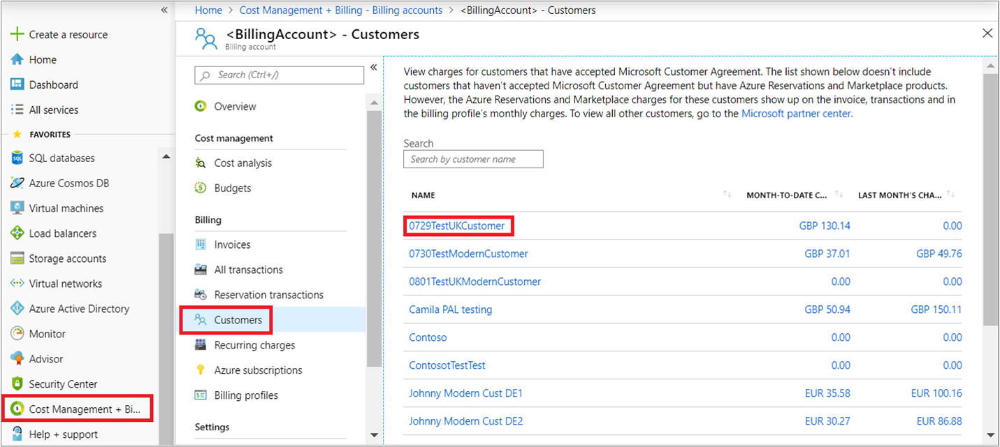
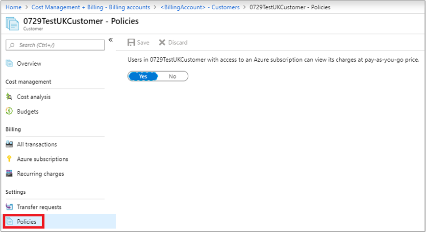
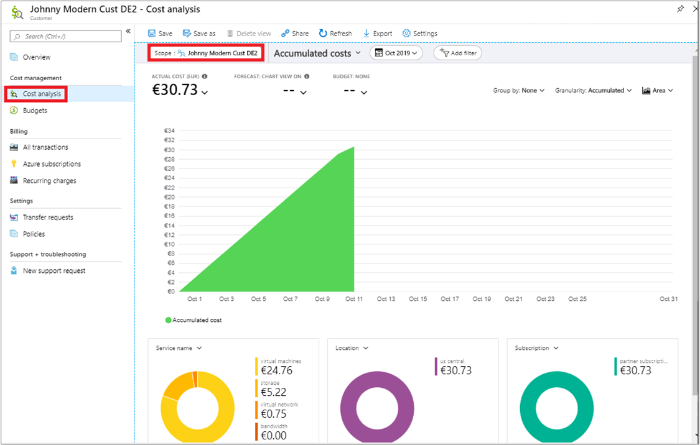
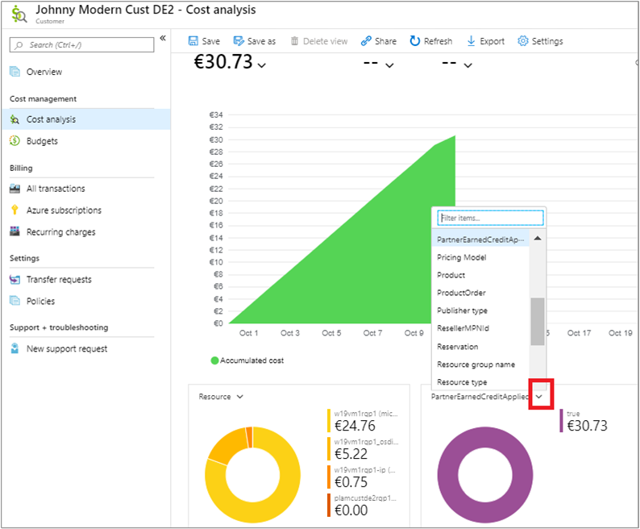
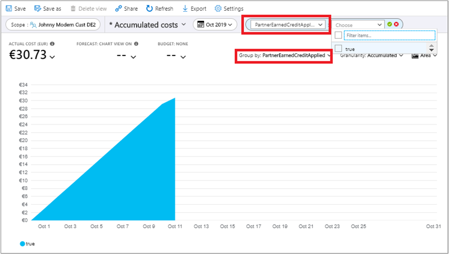
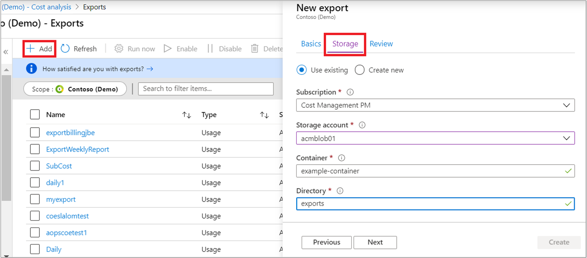

# Get started with Azure Cost Management for partners

Azure Cost Management is natively available for partners who have onboarded their customers to a Microsoft Customer Agreement and have [purchased an Azure Plan](/partner-center/purchase-azure-plan). This article explains how partners use [Azure Cost Management](../index.yml) features to view costs for subscriptions in the Azure Plan. It also describes how partners enable Cost Management access for their customers. Customers can use Cost Management features when enabled by their CSP partner.

CSP partners use Cost Management to:

- Understand invoiced costs and associate the costs to the customer, subscriptions, resource groups, and services.
- Get an intuitive view of Azure costs in [cost analysis](quick-acm-cost-analysis.md) with capabilities to analyze costs by customer, subscription, resource group, resource, meter, service, and many other dimensions.
- View resource costs that have Partner Earned Credit (PEC) applied in Cost Analysis.
- Set up notifications and automation using programmatic [budgets](tutorial-acm-create-budgets.md) and alerts when costs exceed budgets.
- Enable the Azure Resource Manager policy that provides customer access to Cost Management data. Customers can then view consumption cost data for their subscriptions using [pay-as-you-go rates](https://azure.microsoft.com/pricing/calculator/).
- Export their cost and usage data to a storage blob with a pay-as-you-go subscription.

Here's an example showing costs for all customers.


Here's an example showing costs for a single customer.


All functionality available in Azure Cost Management is also available with REST APIs. Use the APIs to automate cost management tasks.

## Prerequisites

As a partner, Azure Cost Management is natively available only for subscriptions that are on the Azure plan.

To enable Azure Cost Management in the Azure portal, you must have confirmed customer acceptance of the Microsoft Customer Agreement (on behalf of the customer) and transitioned the customer to the Azure Plan. Only the costs for subscriptions that are transitioned to the Azure plan are available in Azure Cost Management.

Azure Cost Management requires read access to your billing account or subscription.

For more information about enabling and assigning access to Azure Cost Management for a billing account, see [Assign users roles and permissions](/partner-center/permissions-overview). The **Global admin** and **Admin agent** roles can manage costs for a billing account.

To access Azure Cost Management at the subscription scope, any user with RBAC access to a subscription can view costs at retail (pay-as-you-go) rates. However the cost visibility policy for the customer tenant must be enabled. To view a full list of supported account types, see [Understand Cost Management data](understand-cost-mgt-data.md).


## How Cost Management uses scopes

Scopes are where you manage billing data, have roles specific to payments, view invoices, and conduct general account management. Billing and account roles are managed separately from scopes used for resource management, which use RBAC. To clearly distinguish the intent of the separate scopes, including the access control differences, they are referred to as billing scopes and RBAC scopes, respectively.

To understand billing scopes and RBAC scopes and how cost management works with scopes, see [Understand and work with scopes](understand-work-scopes.md).

## Manage costs with partner tenant billing scopes

After you've onboarded your customers to a Microsoft Customer Agreement, the following _billing scopes_ are available in your tenant. Use the scopes to manage costs in Cost Management.

### Billing account scope

Use the billing account scope to view pre-tax costs across all your customers and billing profiles. Invoice costs are only shown for customer's consumption-based products on the Microsoft Customer Agreement. However, invoice costs are shown for purchased-based products for customers on both the Microsoft Customer Agreement and the CSP offer. Currently, the default currency to view costs in the scope is US dollars. Budgets set for the scope are also in USD.

Regardless of different customer-billed currencies, partners use Billing account scope to set budgets and manage costs in USD across their customers, subscriptions, resources, and resource groups.

Partners also filter costs in a specific billing currency across customers in the cost analysis view. Select the **Actual cost** list to view costs in supported customer billing currencies.



Use the [amortized cost view](quick-acm-cost-analysis.md#customize-cost-views) in billing scopes to view reserved instance amortized costs across a reservation term.

### Billing profile scope

Use the billing profile scope to view pre-tax costs in the billing currency across all your customers for all products and subscriptions included in an invoice. You can filter costs in a billing profile for a specific invoice using the **InvoiceID** filter. The filter shows the consumption and product purchase costs for a specific invoice. You can also filter the costs for a specific customer on the invoice to see pre-tax costs.

After you onboard customers to a Microsoft Customer Agreement, you receive an invoice that includes all charges for all products (consumption, purchases, and entitlements) for these customers on the Microsoft Customer Agreement. When billed in the same currency, these invoices also include the charges for entitlement and purchased products such as SaaS, Azure Marketplace, and reservations for customers who are still in the CSP offer.

To help reconcile charges against the customer invoice, the billing profile scope enables you to see all costs that accrue for an invoice for your customers. Like the invoice, the scope shows costs for every customer in the new Microsoft Customer Agreement. The scope also shows every charge for customer entitlement products still in the current CSP offer.

The billing profile and billing account scopes are the only applicable scopes that show charges for entitlement and purchase-based products like Azure Marketplace and reservation purchases.

Billing profiles define the subscriptions that are included in an invoice. Billing profiles are the functional equivalent of an enterprise agreement enrollment. A billing profile is the scope where invoices are generated.

Currently, the customer's billing currency is the default currency when viewing costs in the billing profile scope. Budgets set at the billing profile scope are in the billing currency.

Partners can use the scope to reconcile to invoices. And, they use the scope to set budgets in the billing currency for the following items:

- Specific filtered invoice
- Customer
- Subscription
- Resource group
- Resource
- Azure service
- Meter
- ResellerMPNID

### Customer scope

Partners use the scope to manage costs associated to customers that are onboarded to the Microsoft Customer Agreement. The scope allows partners to view pre-tax costs for a specific customer. You can also filter the pre-tax costs for a specific subscription, resource group, or resource.

The customer scope doesn't include customers who are on the current CSP offer. The scope only includes customers who have a Microsoft Customer Agreement. Entitlement costs, not Azure usage, for current CSP offer customers are available at the billing account and billing profile scopes when you apply the customer filter.

## Partner access to billing scopes in Cost Management

Only the users with **Global admin** and **Admin agent** roles can manage and view costs for billing accounts, billing profiles, and customers directly in the partner's Azure tenant. For more information about partner center roles, see [Assign users roles and permissions](/partner-center/permissions-overview).

## Enable cost management in the customer tenant

Partners may enable access to Cost Management after customers are onboarded to a Microsoft Customer Agreement. Then partners can then enable a policy allowing customers to view their costs computed at pay-as-you-go retail rates. Costs are shown in the customer's billing currency for their consumed usage at RBAC subscription and resource groups scopes.

When the policy for cost visibility is enabled by the partner, any user with Azure Resource Manager access to the subscription can manage and analyze costs at pay-as-you-go rates. Effectively, resellers and customers that have the appropriate RBAC access to the Azure subscriptions can view cost.

Regardless of the policy, partners can also view the costs if they have access to the subscription and resource group.

### Enable the policy to view Azure usage charges

Partners use the following information to enable to the policy to view Azure usage charges for their customers.

In the Azure portal, sign in to the partner tenant and select **Cost Management + Billing**. Select a billing account and then select **Customers**. The list of customers is associated with the billing account.

In the list of customers, select the customer that you want to allow to view costs.



Under **Settings**, select **Policies**.

The current cost visibility policy is shown for **Azure Usage** charges associated to the subscriptions for the selected customer.


When the policy is set to **No**, Azure Cost Management isn't available for subscription users associated to the customer. Unless enabled by a partner, the cost visibility policy is disabled by default for all subscription users.

When the cost policy is set to **Yes**, subscription users associated to the customer tenant can see usage charges at pay-as-you go rates.

When the cost visibility policy is enabled, all services that have subscription usage show costs at pay-as-you-go rates. Reservation usage appears with zero charges for actual and amortized costs. Purchases and entitlements are not associated to a specific subscription. So, purchases aren't displayed at the subscription scope.

To view costs for the customer tenant, open Cost Management + Billing and then select Billing accounts. In the list of billing accounts, select a billing account.


Under **Billing**, select **Azure subscriptions**, and then select a customer.


select **Cost analysis** and start reviewing costs.
Cost analysis, budgets, and alerts are available for the subscription and resource group RBAC scopes at pay-as-you-go rate-based costs.



Amortized views and actual costs for reserved instances in the RBAC scopes show zero charges. Reserved instance costs are only showing in billing scopes where the purchases were made.

## Analyze costs in cost analysis

Partners with access to billing scopes in the partner tenant can explore and analyze invoiced costs in cost analysis across customers for a specific customer or for an invoice. In the [cost analysis](quick-acm-cost-analysis.md) view, you can also [save views](quick-acm-cost-analysis.md#saving-and-sharing-customized-views) and export data to [CSV and PNG files](quick-acm-cost-analysis.md#automation-and-offline-analysis).

RBAC users with access to the subscription in the customer tenant can also analyze retail costs for subscriptions in the customer tenant, save views, and export data to CSV and PNG files.

You can use filter and group by features in cost analysis to analyze costs by multiple fields. Partner-specific fields are shown in the next section.

## Data fields

The following data fields are found in usage detail files and Cost Management APIs. Where available, Partner Center equivalent information is shown. For the following bold fields, partners can use filter and group by features in cost analysis to analyze costs by multiple fields. Bold fields apply only to Microsoft Customer Agreements supported by partners.

| **Field name** | **Description** | **Partner Center equivalent** |
| --- | --- | --- |
| invoiceId | Invoice ID shown on the invoice for the specific transaction. | Invoice number where the transaction is shown. |
| previousInvoiceID | Reference to an original invoice there is a refund (negative cost). Populated only when there is a refund. | N/A |
| billingAccountName | Name of the billing account representing the partner. It accrues all costs across the customers who have onboarded to a Microsoft customer agreement and the CSP customers that have made entitlement purchases like SaaS, Azure Marketplace, and reservations. | N/A |
| billingAccountID | Identifier for the billing account representing the partner. | MCAPI Partner Commerce Root ID. Used in a request, but not included in a response.|
| billingProfileID | Identifier for the billing profile that groups costs across invoices in a single billing currency across the customers who have onboarded to a Microsoft customer agreement and the CSP customers that have made entitlement purchases like SaaS, Azure Marketplace, and reservations. | MCAPI Partner Billing Group ID. Used in a request, but not included in a response. |
| billingProfileName | Name of the billing profile that groups costs across invoices in a single billing currency across the customers who have onboarded to a Microsoft customer agreement and the CSP customers that have made entitlement purchases like SaaS, Azure Marketplace, and reservations. | N/A |
| invoiceSectionName | Name of the project that is being charged in the invoice. Not applicable for Microsoft Customer Agreements onboarded by partners. | N/A |
| invoiceSectionID | Identifier of the project that is being charged in the invoice. Not applicable for Microsoft Customer Agreements onboarded by partners. | N/A |
| **CustomerTenantID** | Identifier of the Azure Active Directory tenant of the customer's subscription. | Customer's organizational ID - the customer's Azure Active Directory TenantID. |
| **CustomerName** | Name of the Azure Active Directory tenant for the customer's subscription. | Customer's organization name, as shown in the Partner Center. Important for reconciling the invoice with your system information. |
| **CustomerTenantDomainName** | Domain name for the Azure Active Directory tenant of the customer's subscription. | Customer Azure Active Directory tenant domain. |
| **PartnerTenantID** | Identifier for the partner's Azure Active Directory tenant. | Partner Azure Active Directory Tenant ID called as Partner ID, in GUID format. |
| **PartnerName** | Name of the partner Azure Active Directory tenant. | Partner name. |
| **ResellerMPNID** | MPNID for the reseller associated with the subscription. | MPN ID of the reseller on record for the subscription. Not available for current activity. |
| costCenter | Cost center associated to the subscription. | N/A |
| billingPeriodStartDate | Billing period start date, as shown on the invoice. | N/A |
| billingPeriodEndDate | Billing period end date, as shown on the invoice. | N/A |
| servicePeriodStartDate | Start date for the rating period when the service usage was rated for charges. The prices for Azure services are determined for the rating period. | ChargeStartDate in Partner Center. Billing cycle start date, except when presenting dates of previously uncharged latent usage data from a previous billing cycle. The time is always the beginning of the day, 0:00. |
| servicePeriodEndDate | End date for the period when the service usage was rated for charges. The prices for Azure services are determined based on the rating period. | N/A |
| date | For Azure consumption data, it shows date of usage as rated. For reserved instance, it shows the purchased date. For recurring charges and one-time charges such as Marketplace and support, it shows the purchase date. | N/A |
| productID | Identifier for the product that has accrued charges by consumption or purchase. It is the concatenated key of productID and SKuID, as shown in the Partner Center. | The ID of the product. |
| product | Name of the product that has accrued charges by consumption or purchase, as shown on the invoice. | The product name in the catalog. |
| serviceFamily | Shows the service family for the product purchased or charged. For example, Storage or Compute. | N/A |
| productOrderID | The identifier of the asset or Azure plan name that the subscription belongs to. For example, Azure Plan. | N/A |
| productOrderName | The name of the Azure plan that the subscription belongs to. For example, Azure Plan. | N/A|
| consumedService | Consumed service (legacy taxonomy) as used in legacy EA usage details. | Service shown in the Partner Center. For example, Microsoft.Storage, Microsoft.Compute, and microsoft.operationalinsights. |
| meterID | Metered identifier for measured consumption. | The ID of the used meter. |
| meterName | Identifies the name of the meter for measured consumption. | The name of the consumed meter. |
| meterCategory | Identifies the top-level service for usage. | The top-level service for the usage. |
| meterSubCategory | Defines the type or subcategory of Azure service that can affect the rate. | The type of Azure service that can affect the rate.|
| meterRegion | Identifies the location of the datacenter for certain services that are priced based on datacenter location. | The regional location of a data center for services, where applicable and populated. |
| subscription ID | Unique Microsoft generated identifier for the Azure subscription. | N/A |
| subscriptionName | Name of the Azure subscription. | N/A |
| Term | Displays the term for the validity of the offer. For example, reserved instances show 12 months of a yearly term of the reserved instance. For one-time purchases or recurring purchases, the term displays one month for SaaS, Azure Marketplace, and support. Not applicable for Azure consumption. | N/A |
| publisherType (firstParty, thirdPartyReseller, thirdPartyAgency) | Type of publisher that identifies the publisher as first party, third-party reseller, or third-party agency. | N/A |
| partNumber | Part number for the unused reserved instance and Azure Marketplace services. | N/A |
| publisherName | Name of the publisher of the service including Microsoft or third-party publishers. | The name of the product's publisher.|
| reservationId | Identifier for the reserved instance purchase. | N/A |
| reservationName | Name of the reserved instance. | N/A |
| reservationOrderId | OrderID for the reserved instance. | N/A |
| frequency | Payment frequency for a reserved instance. | N/A |
| resourceGroup | Name of the Azure resource group used for lifecycle resource management. | Name of the resource group. |
| instanceID (or) ResourceID | Identifier of the resource instance. | Shown as a ResourceURI that includes complete resource properties. |
| resourceLocation | Name of the resource location. | The location of the resource. |
| Location | Normalized location of the resource. | N/A |
| effectivePrice | The effective unit price of the service, in pricing currency. Unique for a product, service family, meter, and offer. Used with pricing in the price sheet for the billing account. When there is tiered pricing or an included quantity, it shows the blended price for consumption. | The unit price after adjustments are made. |
| Quantity | Measured quantity purchased or consumed. The amount of the meter used during the billing period. | Number of units. Ensure it matches the information in your billing system during reconciliation. |
| unitOfMeasure | Identifies the unit that the service is charged in. For example, GB and hours. | Identifies the unit that the service is charged in. For example, GB, hours, and 10,000 s. |
| pricingCurrency | The currency defining the unit price. | The currency in the price list.|
| billingCurrency | The currency defining the billed cost. | The currency of the customer's geographic region. |
| chargeType | Defines the type of charge that the cost represents in Azure Cost Management like purchase and refund. | The type of charge or adjustment. Not available for current activity. |
| costinBillingCurrency | ExtendedCost or blended cost before tax in the billed currency. | N/A |
| costinPricingCurrency | ExtendedCost or blended cost before tax in pricing currency to correlate with prices. | N/A |
| **costinUSD** | Estimated ExtendedCost or blended cost before tax in USD. | N/A |
| **paygCostInBillingCurrency** | Shows costs if pricing is in retail prices. Shows pay-as-you-go prices in the billing currency. Available only at RBAC scopes. | N/A |
| **paygCostInUSD** | Shows costs if pricing is in retail prices. Shows pay-as-you-go prices in USD. Available only at RBAC scopes. | N/A |
| exchangeRate | Exchange rate used to convert from the pricing currency to the billing currency. | Referred to as PCToBCExchangeRate in the Partner Center. The pricing currency to billing currency exchange rate.|
| exchangeRateDate | The date for the exchange rate that's used to convert from the pricing currency to the billing currency. | Referred to as PCToBCExchangeRateDat in the Partner Center. The pricing currency to billing currency exchange rate date.|
| isAzureCreditEligible | Indicates whether the cost is eligible for payment by Azure credits. | N/A |
| serviceInfo1 | Legacy field that captures optional service-specific metadata. | Internal Azure service metadata. |
| serviceInfo2 | Legacy field that captures optional service-specific metadata. | Service information. For example, an image type for a virtual machine and ISP name for ExpressRoute.|
| additionalInfo | Service-specific metadata. For example, an image type for a virtual machine. | Any additional information not covered in other columns. The service-specific metadata. For example, an image type for a virtual machine.|
| tags | Tag that you assign to the meter. Use tags to group billing records. For example, you can use tags to distribute costs by the department that uses the meter. | Tags added by the customer.|
| **partnerEarnedCreditRate** | Rate of discount applied if there is a partner earned credit (PEC) based on partner admin link access. | The rate of partner earned credit (PEC). For example, 0% or 15%. |
| **partnerEarnedCreditApplied** | Indicates whether the partner earned credit has been applied. | N/A |

## View Partner Earned Credit (PEC) resource costs

In Azure Cost Management, partners can use cost analysis to view costs that received the PEC benefits.

In the Azure portal, sign in to the partner tenant and select **Cost Management + Billing**. Under **Cost Management**, select **Cost analysis**.

The Cost analysis view shows costs of the billing account for the partner. Select the **Scope** as needed for the partner, a specific customer, or a billing profile to reconcile invoices.

In a donut chart, select the drop-down list and select **PartnerEarnedCreditApplied** to drill into PEC costs.



When the **PartnerEarnedCreditApplied** property is _True_, the associated cost has the benefit of the partner earned admin access.

When the **PartnerEarnedCreditApplied** property is _False_, the associated cost hasn't met the required eligibility for the credit. Or, the service purchased isn't eligible for partner earned credit.

Service usage data normally takes 8-24 hours to appear in Cost Management. For more information, see [Usage data update frequency varies](understand-cost-mgt-data.md#usage-data-update-frequency-varies). PEC credits appear within 48 hours from time of access in Azure Cost Management.


You can also group and filter by the **PartnerEarnedCreditApplied** property using the **Group by** options. Use the options to examine costs that do and don't have PEC.



## Export cost data to Azure Storage

Partners with access to billing scopes in a partner tenant can export their cost and usage data to an Azure Storage blob. The blob must be on a subscription in the partner tenant that's not a shared service subscription or a customer’s subscription. To enable cost data export, we recommended that you set up an independent pay-as-you-go subscription in the partner tenant to host the exported cost data. The export storage account is created on the Azure Storage blob hosted in the pay-as-you-go subscription. Based on the scope where the partner creates the export, the associated data is exported to the storage account automatically on a recurring basis.

Users with RBAC access to the subscription can also export the cost data to an Azure storage blob hosted in any subscription in the customer tenant.

### Create an export in a partner tenant or customer tenant

In the Azure portal, sign in to the partner tenant or customer tenant and select **Cost Management + Billing**. Select an appropriate scope, for example a billing account, and then select **Cost Analysis**. When the page loads, select **Export**. Select **View all exports** under Schedule Export.


Next, select  **Add** and type the name and select an export type. Select the **Storage** tab and enter required information.



When you create an export in the partner tenant, select the pay-as-you-go subscription in the partner tenant. Create an Azure Storage account using that subscription.

For RBAC users in the customer tenant, select a subscription in the customer tenant. Create an Azure Storage account using the subscription.

Review the content and then select **Create** to schedule an export.

To verify data in the export list, select the storage account name. On the storage account page, select **Containers** and then select the container. Navigate to the corresponding folder and select the CSV file. select **Download** to get the CSV file and open it. The exported data exported resembles cost data similar to usage details from the Azure portal.


## Cost Management REST APIs

Partners and customers can use Cost Management APIs described in the following sections for common tasks.

### Azure Cost Management APIs - Direct and indirect providers

Partners with access to billing scopes in a partner tenant can use the following APIs to view invoiced costs.

APIs at the subscription scope can be called by a partner regardless of the cost policy if they have access to the subscription. Other users with access to the subscription, like the customer or reseller, can call the APIs only after the partner enables the cost policy for the customer tenant.


#### To get a list of billing accounts

```
GET https://management.azure.com/providers/Microsoft.Billing/billingAccounts?api-version=2019-10-01-preview
```

#### To get a list of customers

```
GET https://management.azure.com/providers/Microsoft.Billing/billingAccounts/{billingAccountName}/customers?api-version=2019-10-01-preview
```

#### To get a list of subscriptions

```
GET https://management.azure.com/providers/Microsoft.Billing/billingAccounts/{billingAccountName}/billingSubscriptions?api-version=2019-10-01-preview
```

#### To get a list of invoices for a period of time

```
GET https://management.azure.com/providers/Microsoft.Billing/billingAccounts/{billingAccountName}/invoices?api-version=2019-10-01-preview&periodStartDate={periodStartDate}&periodEndDate={periodEndDate}
```

The API call returns an array of invoices that has elements similar to the following JSON code.

```
    {
      "id": "/providers/Microsoft.Billing/billingAccounts/{billingAccountID}/billingProfiles/{BillingProfileID}/invoices/{InvoiceID}",
      "name": "{InvoiceID}",
      "properties": {
        "amountDue": {
          "currency": "USD",
          "value": x.xx
        },
        ...
    }
```

Use the preceding returned ID field value and replace it in the following example as the scope to query for usage details.

```
GET https://management.azure.com/{id}/providers/Microsoft.Consumption/UsageDetails?api-version=2019-10-01
```

The example returns the usage records associated with the specific invoice.


#### To get the policy for customers to view costs

```
GET https://management.azure.com/providers/Microsoft.Billing/billingAccounts/{billingAccountName}/customers/{customerID}/policies/default?api-version=2019-10-01-preview
```

#### To set the policy for customers to view costs

```
PUT https://management.azure.com/providers/Microsoft.Billing/billingAccounts/{billingAccountName}/customers/{customerID}/policies/default?api-version=2019-10-01-preview
```

#### To get Azure service usage for a billing account

```
GET https://management.azure.com/providers/Microsoft.Billing/BillingAccounts/{billingAccountName}/providers/Microsoft.Consumption/usageDetails?api-version=2019-10-01
```

#### To download a customer's Azure service usage

The following get call is an asynchronous operation.

```
GET https://management.azure.com/Microsoft.Billing/billingAccounts/{billingAccountName}/customers/{customerID}/providers/Microsoft.Consumption/usageDetails/download?api-version=2019-10-01 -verbose
```

Call the `Location` URI returned in the response to check the operation status. When the status is *Completed*, the `downloadUrl` property contains a link that you can use to download the generated report.


#### To get or download the price sheet for consumed Azure services

First, use the following post.

```
POST https://management.azure.com/providers/Microsoft.Billing/BillingAccounts/{billingAccountName}/billingProfiles/{billingProfileID}/pricesheet/default/download?api-version=2019-10-01-preview&format=csv" -verbose
```

Then, call the asynchronous operation property value. For example:

```
GET https://management.azure.com/providers/Microsoft.Billing/billingAccounts/{billingAccountName}/billingProfiles/{billingProfileID}/pricesheetDownloadOperations/{operation}?sessiontoken=0:11186&api-version=2019-10-01-preview
```
The preceding get call returns the download link containing the price sheet.


#### To get aggregated costs

```
POST https://management.azure.com/providers/microsoft.billing/billingAccounts/{billingAccountName}/providers/microsoft.costmanagement/query?api-version=2019-10-01
```

#### Create a budget for a partner

```
PUT https://management.azure.com/providers/Microsoft.Billing/billingAccounts/{billingAccountName}/providers/Microsoft.CostManagement/budgets/partnerworkshopbudget?api-version=2019-10-01
```

#### Create a budget for a customer

```
PUT https://management.azure.com/providers/Microsoft.Billing/billingAccounts/{billingAccountName}/customers/{customerID}/providers/Microsoft.Consumption/budgets/{budgetName}?api-version=2019-10-01
```

#### Delete a budget

```
PUT
https://management.azure.com/providers/Microsoft.Billing/billingAccounts/{billingAccountId}/providers/Microsoft.CostManagement/budgets/{budgetName}?api-version=2019-10-01
```


## Next steps
- [Start analyzing costs](quick-acm-cost-analysis.md) in Cost Management
- [Create and manage budgets](tutorial-acm-create-budgets.md) in Cost Management
