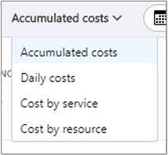
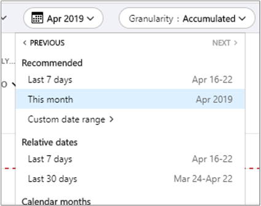
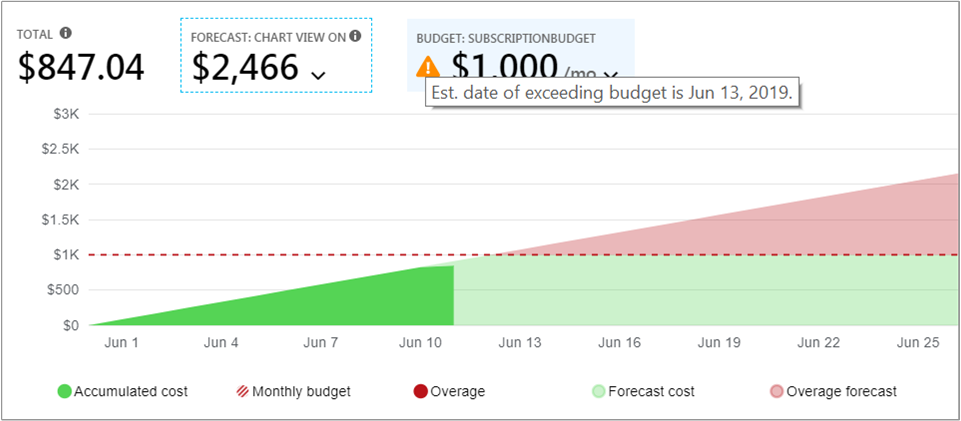
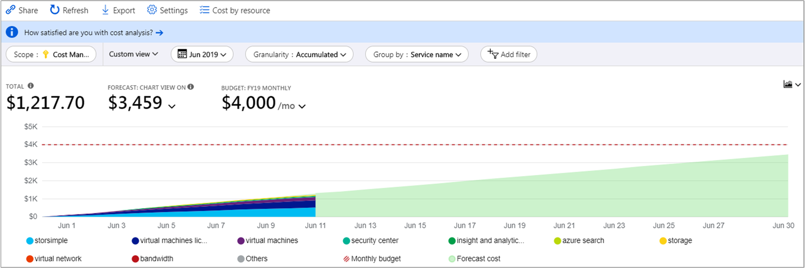
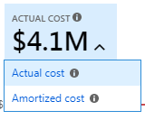
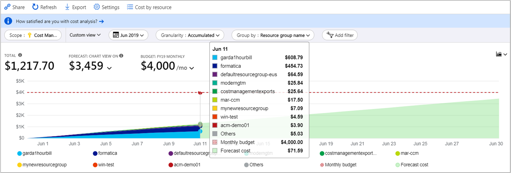
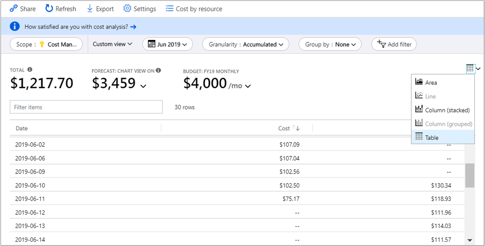

# Quickstart: Explore and analyze costs with cost analysis

Before you can properly control and optimize your Azure costs, you need to understand where costs originated within your organization. It's also useful to know how much money your services cost, and in support of which environments and systems. Visibility into the full spectrum of costs is critical to accurately understand organizational spending patterns. You can use spending patterns to enforce cost control mechanisms, like budgets.

In this quickstart, you use cost analysis to explore and analyze your organizational costs. You can view aggregated costs by organization to understand where costs occur over time and identify spending trends. You can view accumulated costs over time to estimate monthly, quarterly, or even yearly cost trends against a budget. A budget helps to provide adherence to financial constraints. And a budget is used to view daily or monthly costs to isolate spending irregularities. And, you can download the current report's data for further analysis or to use in an external system.

In this quickstart, you learn how to:

- Review costs in cost analysis
- Customize cost views
- Download cost analysis data


## Prerequisites

Cost analysis supports different kinds of Azure account types. To view the full list of supported account types, see [Understand Cost Management data](understand-cost-mgt-data.md). To view cost data, you need at least read access for your Azure account.

For information about assigning access to Azure Cost Management data, see [Assign access to data](../../cost-management/assign-access-acm-data.md).

## Sign in to Azure

- Sign in to the Azure portal at https://portal.azure.com.

## Review costs in cost analysis

To review your costs in cost analysis, open the scope in the Azure portal and select **Cost analysis** in the menu. For example, go to **Subscriptions**, select a subscription from the list, and then select **Cost analysis** in the menu. Use the **Scope** pill to switch to a different scope in cost analysis. For more information about scopes, see [Understand and work with scopes](understand-work-scopes.md).

The scope you select is used throughout Cost Management to provide data consolidation and control access to cost information. When you use scopes, you don't multi-select them. Instead, you select a larger scope, which others roll up to, and then filter down to the nested scopes you need. This approach is important to understand because some people may not have access to a single parent scope, which covers multiple nested scopes.

The initial cost analysis view includes the following areas.

**Accumulated cost view**: Represents the predefined cost analysis view configuration. Each view includes date range, granularity, group by, and filter settings. The default view shows accumulated costs for the current billing period, but you can change to other built-in views. For more information, see [Customize cost views](#customize-cost-views).

**Actual cost**: Shows the total usage and purchase costs for the current month, as they're accrued and will show on your bill.

**Forecast**: Shows the total forecasted costs for time period you choose. (Forecast is in preview.)

**Budget**: Shows the planned spending limit for the selected scope, if available.

**Accumulated granularity**: Shows the total aggregate daily costs, from the beginning of the billing period. After you [create a budget](tutorial-acm-create-budgets.md) for your billing account or subscription, you can quickly see your spending trend against the budget. Hover over a date to view the accumulated cost for that day.

**Pivot (donut) charts**: Provide dynamic pivots, breaking down the total cost by a common set of standard properties. They show the largest to smallest costs for the current month. You can change pivot charts at any time by selecting a different pivot. Costs are categorized by service (meter category), location (region), and child scope by default. For example, enrollment accounts are under billing accounts, resource groups are under subscriptions, and resources are under resource groups.


## Customize cost views

Cost analysis has four built-in views, optimized for the most common goals:

View | Answer questions like
--- | ---
Accumulated cost | How much have I spent so far this month? Will I stay within my budget?
Daily cost | Have there been any increases in the costs per day for the last 30 days?
Cost by service | How has my monthly usage vary over the past three invoices?
Cost by resource | Which resources cost the most so far this month?



However, there are many cases where you need deeper analysis. Customization starts at the top of the page, with the date selection.

Cost analysis shows data for the current month by default. Use the date selector to switch to common date ranges quickly. Examples include the last seven days, the last month, the current year, or a custom date range. Pay-as-you-go subscriptions also include date ranges based on your billing period, which isn't bound to the calendar month, like the current billing period or last invoice. Use the **<PREVIOUS** and **NEXT>** links at the top of the menu to jump to the previous or next period, respectively. For example, **<PREVIOUS** will switch from the **Last 7 days** to **8-14 days ago** or **15-21 days ago**.



Cost analysis shows **accumulated** costs by default. Accumulated costs include all costs for each day plus the previous days, for a constantly growing view of your daily aggregate costs. This view is optimized to show how you're trending against a budget for the selected time range.

Use the forecast chart view to identify potential budget breaches. When there's a potential budget breach, projected overspending is shown in red. An indicator symbol is also shown in the chart. Hovering over the symbol shows the estimated date of the budget breach.



There's also the **daily** view showing costs for each day. The daily view doesn't show a growth trend. The view is designed to show irregularities as cost spikes or dips from day to day. If you've selected a budget, the daily view also shows an estimate of your daily budget.

When your daily costs are consistently above the estimated daily budget, you can expect you'll surpass your monthly budget. The estimated daily budget is a means to help you visualize your budget at a lower level. When you have fluctuations in daily costs, then the estimated daily budget comparison to your monthly budget is less precise.

Here's a daily view of recent spending with spending forecast turned on.


When turn off the spending forecast, you don't see projected spending for future dates. Also, when you look at costs for past time periods, cost forecast doesn't show costs.

Generally, you can expect to see data or notifications for consumed resources within 8 to 12 hours.


**Group by** common properties to break down costs and identify top contributors. To group by resource tags, for example, select the tag key you want to group by. Costs are broken down by each tag value, with an extra segment for resources that don't have that tag applied.

Most [Azure resources support tagging](../../azure-resource-manager/tag-support.md). However, some tags aren't available in Cost Management and billing. Additionally, resource group tags aren't supported. Support for tags applies to usage reported *after* the tag was applied to the resource. Tags aren't applied retroactively for cost rollups.

Watch the [How to review tag policies with Azure Cost Management](https://www.youtube.com/watch?v=nHQYcYGKuyw) video to learn about using Azure tag policy to improve cost data visibility.

Here's a view of Azure service costs for the current month.



By default, cost analysis shows all usage and purchase costs as they are accrued and will show on your invoice, also known as **Actual cost**. Viewing actual cost is ideal for reconciling your invoice. However, purchase spikes in cost can be alarming when you're keeping an eye out for spending anomalies and other changes in cost. To flatten out spikes caused by reservation purchase costs, switch to **Amortized cost**.



Amortized cost breaks down reservation purchases into daily chunks and spreads them over the duration of the reservation term. For example, instead of seeing a $365 purchase on January 1, you'll see a $1 purchase every day from January 1 to December 31. In addition to basic amortization, these costs are also reallocated and associated by using the specific resources that used the reservation. For example, if that $1 daily charge was split between two virtual machines, you'd see two $0.50 charges for the day. If part of the reservation isn't utilized for the day, you'd see one $0.50 charge associated with the applicable virtual machine and another $0.50 charge with a charge type of `UnusedReservation`. Note that unused reservation costs can be seen only when viewing amortized cost.

Due to the change in how costs are represented, it's important to note that actual cost and amortized cost views will show different total numbers. In general, the total cost of months with a reservation purchase will decrease when viewing amortized costs, and months following a reservation purchase will increase. Amortization is available only for reservation purchases and doesn't apply to Azure Marketplace purchases at this time.

The following image shows resource group names. You can group by tag to view total costs per tag or use the **Cost by resource** view to see all tags for a particular resource.



When you're grouping costs by a specific attribute, the top 10 cost contributors are shown from highest to lowest. If there are more than 10, the top nine cost contributors are shown with an **Others** group that represents all remaining groups combined. When you're grouping by tags, an **Untagged** group appears for costs that don't have the tag key applied. **Untagged** is always last, even if untagged costs are higher than tagged costs. Untagged costs will be part of **Others**, if 10 or more tag values exist. Switch to the table view and change granularity to **None** to see all values ranked from highest to lowest cost.

Classic virtual machines, networking, and storage resources don't share detailed billing data. They're merged as **Classic services** when grouping costs.

Pivot charts under the main chart show different groupings, which give you a broader picture of your overall costs for the selected time period and filters. Select a property or tag to view aggregated costs by any dimension.


You can view the full dataset for any view. Whichever selections or filters that you apply affect the data presented. To see the full dataset, select the **chart type** list and then select **Table** view.




## Understanding grouping and filtering options

The following table lists some of the most common grouping and filtering options and when you should use them.

| Property | When to use |
| --- | --- |
| **Billing period** | Break down costs by invoice month. This option is important for pay-as-you-go and development/test subscriptions, which aren't bound to calendar months. EA/MCA accounts can use calendar months in the date picker or monthly granularity to accomplish the same goal. |
| **Charge type** | Break down usage, purchase, refund, and unused reservation costs. Reservation purchases and refunds are available only when using action costs and not when using amortized costs. Unused reservation costs are available only when looking at amortized costs. |
| **Cloud** | Break down costs by AWS and Azure. AWS costs are available only from management groups, external billing accounts, and external subscriptions. |
| **Department** / **Invoice section** | Break down costs by EA department or MCA invoice section. This option is available only for EA/MCA billing accounts and MCA billing profiles. |
| **Enrollment account** | Break down costs by EA account owner. This option is available only for EA billing accounts and departments. |
| **Frequency** | Break down usage-based, one-time, and recurring costs. |
| **Meter** | Break down costs by Azure usage meter. This option is available only for Azure usage. All purchases and Marketplace usage will show as **Not specified** or **unassigned**. |
| **Publisher type** | Break down AWS, Azure, and Marketplace costs. |
| **Reservation** | Break down costs by reservation. Any usage that doesn't include a reservation will show as **Not specified**. |
| **Resource** | Break down costs by resource. All purchases will show as **Not specified**, because they're applied at an EA/PAYG billing account or MCA billing profile level.  |
| **Resource group** | Break down costs by resource group. This option is available only for non-classic usage. Classic resource usage will show as **other**, and purchases will show as **Not specified**. |
| **Resource type** | Break down costs by resource type. This option is available only for non-classic usage. Classic resource usage will show as **other**, and purchases will show as **Not specified**. |
| **Service name** or **Meter category** | Break down cost by Azure service. This option is available only for Azure usage. All purchases and Marketplace usage will show as **Not specified** or **unassigned**. |
| **Service tier** or **Meter subcategory** | Break down cost by Azure usage meter subclassification. This option is available only for Azure usage. All purchases and Marketplace usage will show as **Not specified** or **unassigned**. |
| **Subscription** | Break down costs by subscription. All purchases show as **Not specified**. |
| **Tag** | Break down costs by tag values for a specific tag key. |

For more information about terms, see [Understand the terms used in the Azure usage and charges file](../../billing/billing-understand-your-usage.md).


## Saving and sharing customized views

Save and share customized views with others by pinning cost analysis to the Azure portal dashboard or by copying a link to cost analysis.

To pin cost analysis, select the pin icon in the upper-right corner. Pinning cost analysis will save only the main chart or table view. Share the dashboard to give others access to the tile. Note that this shares only the dashboard configuration and doesn't grant others access to the underlying data. If you don't have access to costs but do have access to a shared dashboard, you'll see an "access denied" message.

To share a link to cost analysis, select **Share** at the top of the blade. A custom URL will show, which opens this specific view for this specific scope. If you don't have cost access and get this URL, you'll see an "access denied" message.

To learn more about granting access to costs for each supported scope, review [Understand and work with scopes](understand-work-scopes.md).

## Automation and offline analysis

There are times when you need to download the data for further analysis, merge it with your own data, or integrate it into your own systems. Cost Management offers a few different options. As a starting point, if you need an ad hoc high-level summary, like what you get within cost analysis, build the view you need. Then download it by selecting **Export** and selecting **Download data to CSV** or **Download data to Excel**. The Excel download provides additional context on the view you used to generate the download, like scope, query configuration, total, and date generated.

If you need the full, unaggregated dataset, download it from the billing account. Then, from the list of services in the portal's left navigation pane, go to **Cost Management + Billing**. Select your billing account, if applicable. Go to **Usage + charges**, and then select the **Download** icon for the desired billing period.

Take a similar approach to automate receiving cost data. Use the [Query API](/rest/api/cost-management/query) for richer analysis with dynamic filtering, grouping, and aggregation, or use the [UsageDetails API](/rest/api/consumption/usageDetails) for the full, unaggregated dataset. The general availability (GA) version of these APIs is 2019-01-01. Use **2019-04-01-preview** to get access to the preview of reservation and Marketplace purchases within these APIs.

For example, following is an aggregated view of amortized costs broken down by charge type (usage, purchase, or refund), publisher type (Azure or Marketplace), resource group (empty for purchases), and reservation (empty if not applicable).

```
POST https://management.azure.com/{scope}/providers/Microsoft.CostManagement/query?api-version=2019-04-01-preview
Content-Type: application/json

{
  "type": "AmortizedCost",
  "timeframe": "Custom",
  "timePeriod": { "from": "2019-04-01", "to": "2019-04-30" },
  "dataset": {
    "granularity": "None",
    "aggregation": {
      "totalCost": { "name": "PreTaxCost", "function": "Sum" }
    },
    "grouping": [
      { "type": "dimension", "name": "ChargeType" },
      { "type": "dimension", "name": "PublisherType" },
      { "type": "dimension", "name": "Frequency" },
      { "type": "dimension", "name": "ResourceGroup" },
      { "type": "dimension", "name": "SubscriptionName" },
      { "type": "dimension", "name": "SubscriptionId" },
      { "type": "dimension", "name": "ReservationName" },
      { "type": "dimension", "name": "ReservationId" },
    ]
  },
}
```

And if you don't need the aggregation and prefer the full, raw dataset:

```
GET https://management.azure.com/{scope}/providers/Microsoft.Consumption/usageDetails?metric=AmortizedCost&$filter=properties/usageStart+ge+'2019-04-01'+AND+properties/usageEnd+le+'2019-04-30'&api-version=2019-04-01-preview
```

If you need actual costs to show purchases as they are accrued, change **type**/**metric** to **ActualCost**. For more information about these APIs, see the [Query](/rest/api/cost-management/query) and [UsageDetails](/rest/api/consumption/usageDetails) API documentation. Note that the published docs are for the GA version. However, they both work the same for the *2019-04-01-preview* API version outside of the new type/metric attribute and changed property names. (Read more about the property names below.)

Cost Management APIs work across all scopes above resources: resource group, subscription, and management group via Azure RBAC access, EA billing accounts (enrollments), departments, and enrollment accounts via EA portal access. Learn more about scopes, including how to determine your scope ID or manage access, in [Understand and work with scopes](understand-work-scopes.md).

## Next steps

Advance to the first tutorial to learn how to create and manage budgets.

> [!div class="nextstepaction"]
> [Create and manage budgets](tutorial-acm-create-budgets.md)
