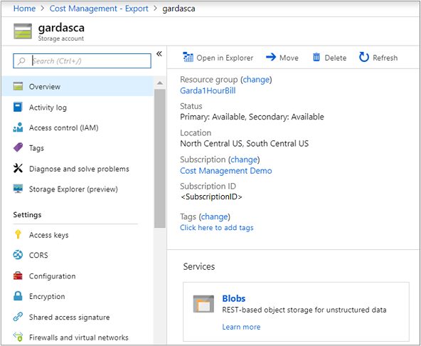
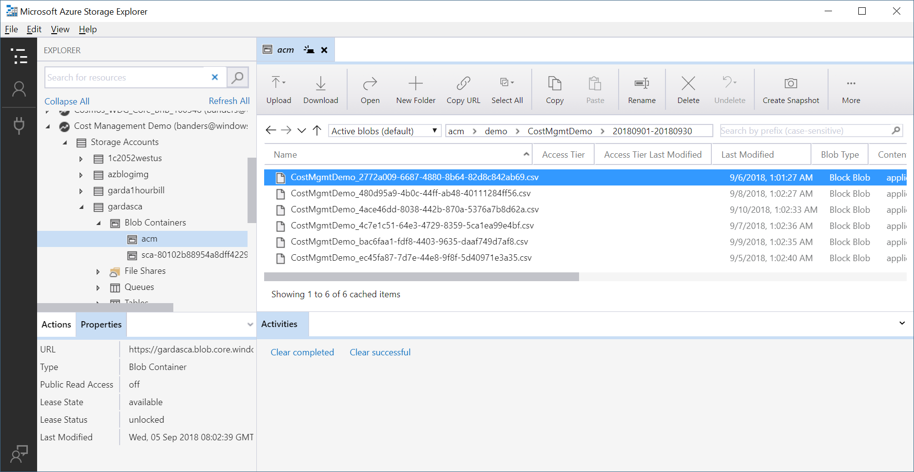
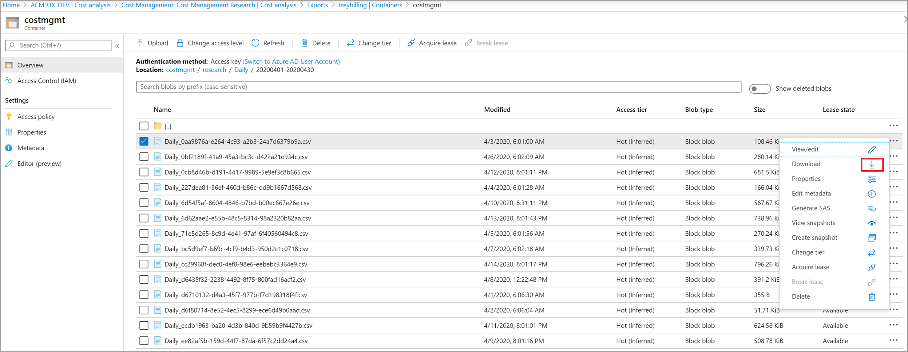

# Tutorial: Create and manage exported data

If you read the Cost Analysis tutorial, then you're familiar with manually downloading your Cost Management data. However, you can create a recurring task that automatically exports your Cost Management data to Azure storage on a daily, weekly, or monthly basis. Exported data is in CSV format and it contains all the information that's collected by Cost Management. You can then use the exported data in Azure storage with external systems and combine it with your own custom data. And you can use your exported data in an external system like a dashboard or other financial system.

Watch the [How to schedule exports to storage with Azure Cost Management](https://www.youtube.com/watch?v=rWa_xI1aRzo) video about creating a scheduled export of your Azure cost data to Azure Storage. To watch other videos, visit the [Cost Management YouTube channel](https://www.youtube.com/c/AzureCostManagement).

>[!VIDEO https://www.youtube.com/embed/rWa_xI1aRzo]

The examples in this tutorial walk you though exporting your cost management data and then verify that the data was successfully exported.

In this tutorial, you learn how to:

> [!div class="checklist"]
> * Create a daily export
> * Verify that data is collected

## Prerequisites
Data export is available for a variety of Azure account types, including [Enterprise Agreement (EA)](https://azure.microsoft.com/pricing/enterprise-agreement/) and [Microsoft Customer Agreement](get-started-partners.md) customers. To view the full list of supported account types, see [Understand Cost Management data](understand-cost-mgt-data.md). The following Azure permissions, or scopes, are supported per subscription for data export by user and group. For more information about scopes, see [Understand and work with scopes](understand-work-scopes.md).

- Owner – Can create, modify, or delete scheduled exports for a subscription.
- Contributor – Can create, modify, or delete their own scheduled exports. Can modify the name of scheduled exports created by others.
- Reader – Can schedule exports that they have permission to.

For Azure Storage accounts:
- Write permissions are required to change the configured storage account, regardless of permissions on the export.
- Your Azure storage account must be configured for blob or file storage.

If you have a new subscription, you can't immediately use Cost Management features. It might take up to 48 hours before you can use all Cost Management features.

## Sign in to Azure
Sign in to the Azure portal at [https://portal.azure.com](https://portal.azure.com/).

## Create a daily export

### [Portal](#tab/azure-portal)

To create or view a data export or to schedule an export, open the desired scope in the Azure portal and select **Cost analysis** in the menu. For example, navigate to **Subscriptions**, select a subscription from the list, and then select **Cost analysis** in the menu. At the top of the Cost analysis page, select **Settings**, then **Exports**.

> [!NOTE]
> - Besides subscriptions, you can create exports on resource groups, management groups, departments, and enrollments. For more information about scopes, see [Understand and work with scopes](understand-work-scopes.md).
>- When you're signed in as a partner at the billing account scope or on a customer's tenant, you can export data to an Azure Storage account that's linked to your partner storage account. However, you must have an active subscription in your CSP tenant.

1. Select **Add** and type a name for the export.
1. For the **Metric**, make a selection:
    - **Actual cost (Usage and Purchases)** - Select to export standard usage and purchases
    - **Amortized cost (Usage and Purchases)** - Select to export amortized costs for purchases like Azure reservations
1. For **Export type**, make a selection:
    - **Daily export of month-to-date costs** – Provides a new export file daily for your month-to-date costs. The latest data is aggregated from previous daily exports.
    - **Weekly export of cost for the last seven days** – Creates a weekly export of your costs for the past seven days from the selected start date of your export.
    - **Monthly export of last month's costs** – Provides you with an export of your last month's costs compared to the current month that you create the export. Moving forward, the schedule runs an export on the fifth day of every new month with your previous months costs.
    - **One-time export** – Allows you to choose a date range for historical data to export to Azure blob storage. You can export a maximum of 90 days of historical costs from the day you choose. This export runs immediately and is available in your storage account within two hours.
        Depending on your export type, either choose a start date, or choose a **From** and **To** date.
1. Specify the subscription for your Azure storage account, then select a resource group or create a new one.
1. Select the storage account name or create a new one.
1. Select the location (Azure region).
1. Specify the storage container and the directory path that you'd like the export file to go to.
    :::image type="content" source="./media/tutorial-export-acm-data/basics_exports.png" alt-text="New export example" lightbox="./media/tutorial-export-acm-data/basics_exports.png":::
1. Review your export details and select **Create**.

Your new export appears in the list of exports. By default, new exports are enabled. If you want to disable or delete a scheduled export, select any item in the list and then select either **Disable** or **Delete**.

Initially, it can take 12-24 hours before the export runs. However, it can take up longer before data is shown in exported files.

### [Azure CLI](#tab/azure-cli)

Start by preparing your environment for the Azure CLI:

[!INCLUDE [azure-cli-prepare-your-environment-no-header.md](../../../includes/azure-cli-prepare-your-environment-no-header.md)]

1. After you sign in, to see your current exports, use the [az costmanagement export list](/cli/azure/ext/costmanagement/costmanagement/export#ext_costmanagement_az_costmanagement_export_list) command:

   ```azurecli
   az costmanagement export list --scope "subscriptions/00000000-0000-0000-0000-000000000000"
   ```

   >[!NOTE]
   >
   >* Besides subscriptions, you can create exports for resource groups and management groups. For more information about scopes, see [Understand and work with scopes](understand-work-scopes.md).
   >* When you're signed in as a partner at the billing account scope or on a customer's tenant, you can export data to an Azure Storage account that's linked to your partner storage account. However, you must have an active subscription in your CSP tenant.

1. Create a resource group or use an existing resource group. To create a resource group, use the [az group create](/cli/azure/group#az_group_create) command:

   ```azurecli
   az group create --name TreyNetwork --location "East US"
   ```

1. Create a storage account to receive the exports or use an existing storage account. To create a storage account, use the [az storage account create](/cli/azure/storage/account#az_storage_account_create) command:

   ```azurecli
   az storage account create --resource-group TreyNetwork --name cmdemo
   ```

1. Run the [az costmanagement export create](/cli/azure/ext/costmanagement/costmanagement/export#ext_costmanagement_az_costmanagement_export_create) command to create the export:

   ```azurecli
   az costmanagement export create --name DemoExport --type ActualCost \
   --scope "subscriptions/00000000-0000-0000-0000-000000000000" --storage-account-id cmdemo \
   --storage-container democontainer --timeframe MonthToDate --recurrence Daily \
   --recurrence-period from="2020-06-01T00:00:00Z" to="2020-10-31T00:00:00Z" \
   --schedule-status Active --storage-directory demodirectory
   ```

   For the **--type** parameter, you can choose `ActualCost`, `AmortizedCost`, or `Usage`.

   This example uses `MonthToDate`. The export creates an export file daily for your month-to-date costs. The latest data is aggregated from previous daily exports this month.

1. To see the details of your export operation, use the [az costmanagement export show](/cli/azure/ext/costmanagement/costmanagement/export#ext_costmanagement_az_costmanagement_export_show) command:

   ```azurecli
   az costmanagement export show --name DemoExport \
      --scope "subscriptions/00000000-0000-0000-0000-000000000000"
   ```

1. Update an export by using the [az costmanagement export update](/cli/azure/ext/costmanagement/costmanagement/export#ext_costmanagement_az_costmanagement_export_update) command:

   ```azurecli
   az costmanagement export update --name DemoExport
      --scope "subscriptions/00000000-0000-0000-0000-000000000000" --storage-directory demodirectory02
   ```

   This example changes the output directory.

>[!NOTE]
>Initially, it can take 12-24 hours before the export runs. However, it can take longer before data is shown in exported files.

You can delete an export by using the [az costmanagement export delete](/cli/azure/ext/costmanagement/costmanagement/export#ext_costmanagement_az_costmanagement_export_delete) command:

```azurecli
az costmanagement export delete --name DemoExport --scope "subscriptions/00000000-0000-0000-0000-000000000000"
```

### [Azure PowerShell](#tab/azure-powershell)

Start by preparing your environment for Azure PowerShell:

[!INCLUDE [azure-powershell-requirements-no-header.md](../../../includes/azure-powershell-requirements-no-header.md)]

* > [!IMPORTANT]
  > While the **Az.CostManagement** PowerShell module is in preview, you must install it separately
  > using the `Install-Module` cmdlet. After this PowerShell module becomes generally available, it
  > will be part of future Az PowerShell module releases and available by default from within Azure
  > Cloud Shell.

  ```azurepowershell-interactive
  Install-Module -Name Az.CostManagement
  ```

1. After you sign in, to see your current exports, use the `Get-AzCostManagementExport` cmdlet:

   ```azurepowershell-interactive
   Get-AzCostManagementExport -Scope 'subscriptions/00000000-0000-0000-0000-000000000000'
   ```

   >[!NOTE]
   >
   >* Besides subscriptions, you can create exports for resource groups and management groups. For more information about scopes, see [Understand and work with scopes](understand-work-scopes.md).
   >* When you're signed in as a partner at the billing account scope or on a customer's tenant, you can export data to an Azure Storage account that's linked to your partner storage account. However, you must have an active subscription in your CSP tenant.

1. Create a resource group or use an existing resource group. To create a resource group, use the [New-AzResourceGroup](/powershell/module/az.resources/new-azresourcegroup) cmdlet:

   ```azurepowershell-interactive
   New-AzResourceGroup -Name TreyNetwork -Location eastus
   ```

1. Create a storage account to receive the exports or use an existing storage account. To create a storage account, use the [New-AzStorageAccount](/powershell/module/az.storage/new-azstorageaccount) cmdlet:

   ```azurepowershell-interactive
   New-AzStorageAccount -ResourceGroupName TreyNetwork -AccountName cmdemo -SkuName Standard_RAGRS -Location eastus
   ```

1. Run the `New-AzCostManagementExport` cmdlet to create the export:

   ```azurepowershell-interactive
   $Params = @{
     Name = 'DemoExport'
     DefinitionType = 'ActualCost'
     Scope = 'subscriptions/00000000-0000-0000-0000-000000000000'
     DestinationResourceId = '/subscriptions/00000000-0000-0000-0000-000000000000/resourceGroups/treynetwork/providers/Microsoft.Storage/storageAccounts/cmdemo'
     DestinationContainer = 'democontainer'
     DefinitionTimeframe = 'MonthToDate'
     ScheduleRecurrence = 'Daily'
     RecurrencePeriodFrom = '2020-06-01T00:00:00Z'
     RecurrencePeriodTo = '2020-10-31T00:00:00Z'
     ScheduleStatus = 'Active'
     DestinationRootFolderPath = 'demodirectory'
     Format = 'Csv'
   }
   New-AzCostManagementExport @Params
   ```

   For the **DefinitionType** parameter, you can choose `ActualCost`, `AmortizedCost`, or `Usage`.

   This example uses `MonthToDate`. The export creates an export file daily for your month-to-date costs. The latest data is aggregated from previous daily exports this month.

1. To see the details of your export operation, use the `Get-AzCostManagementExport` cmdlet:

   ```azurepowershell-interactive
   Get-AzCostManagementExport -Scope 'subscriptions/00000000-0000-0000-0000-000000000000'
   ```

1. Update an export by using the `Update-AzCostManagementExport` cmdlet:

   ```azurepowershell-interactive
   Update-AzCostManagementExport -Name DemoExport -Scope 'subscriptions/00000000-0000-0000-0000-000000000000' -DestinationRootFolderPath demodirectory02
   ```

   This example changes the output directory.

>[!NOTE]
>Initially, it can take 12-24 hours before the export runs. However, it can take longer before data is shown in exported files.

You can delete an export by using the `Remove-AzCostManagementExport` cmdlet:

```azurepowershell-interactive
Remove-AzCostManagementExport -Name DemoExport -Scope 'subscriptions/00000000-0000-0000-0000-000000000000'
```

---

### Export schedule

Scheduled exports are affected by the time and day of week of when you initially create the export. When you create a scheduled export, the export runs at the same frequency for each subsequent export occurrence. For example, for a daily export of month-to-date costs export set at a daily frequency, the export runs daily. Similarly for a weekly export, the export runs every week on the same day as it is scheduled. The exact delivery time of the export is not guaranteed and the exported data is available within four hours of run time.

Each export creates a new file, so older exports aren't overwritten.

#### Create an export for multiple subscriptions

If you have an Enterprise Agreement, then you can use a management group to aggregate subscription cost information in a single container. Then you can export cost management data for the management group.

Exports for management groups of other subscription types aren't supported.

1. If haven't already created a management group, create one group and assign subscriptions to it.
1. In cost analysis, set the scope to your management group and select **Select this management group**.
    :::image type="content" source="./media/tutorial-export-acm-data/management-group-scope.png" alt-text="Example showing the Select this management group option" lightbox="./media/tutorial-export-acm-data/management-group-scope.png":::
1. Create an export at the scope to get cost management data for the subscriptions in the management group.
    :::image type="content" source="./media/tutorial-export-acm-data/new-export-management-group-scope.png" alt-text="Example showing the create new export option with a management group scope":::

## Verify that data is collected

You can easily verify that your Cost Management data is being collected and view the exported CSV file using Azure Storage Explorer.

In the export list, select the storage account name. On the storage account page, select Open in Explorer. If you see a confirmation box, select **Yes** to open the file in Azure Storage Explorer.



In Storage Explorer, navigate to the container that you want to open and select the folder corresponding to the current month. A list of CSV files is shown. Select one and then select **Open**.



The file opens with the program or application that's set to open CSV file extensions. Here's an example in Excel.


### Download an exported CSV data file

You can also download the exported CSV file in the Azure portal. The following steps explain how to find it from cost analysis.

1. In cost analysis, select **Settings**, and then select **Exports**.
1. In the list of exports, select the storage account for an export.
1. In your storage account, select **Containers**.
1. In list of containers, select the container.
1. Navigate through the directories and storage blobs to the date you want.
1. Select the CSV file and then select **Download**.

[](./media/tutorial-export-acm-data/download-export.png#lightbox)

## View export run history

You can view the run history of your scheduled export by selecting an individual export in the exports list page. The exports list page also provides you with quick access to view the run time of your previous exports and the next time and export will run. Here's an example showing the run history.

:::image type="content" source="./media/tutorial-export-acm-data/run-history.png" alt-text="Screenshot shows the Exports pane.":::

Select an export to view its run history.

:::image type="content" source="./media/tutorial-export-acm-data/single-export-run-history.png" alt-text="Screenshot shows the run history of an export.":::

## Access exported data from other systems

One of the purposes of exporting your Cost Management data is to access the data from external systems. You might use a dashboard system or other financial system. Such systems vary widely so showing an example wouldn't be practical.  However, you can get started with accessing your data from your applications at [Introduction to Azure Storage](../../storage/common/storage-introduction.md).

## Next steps

In this tutorial, you learned how to:

> [!div class="checklist"]
> * Create a daily export
> * Verify that data is collected

Advance to the next tutorial to optimize and improve efficiency by identifying idle and underutilized resources.

> [!div class="nextstepaction"]
> [Review and act on optimization recommendations](tutorial-acm-opt-recommendations.md)
