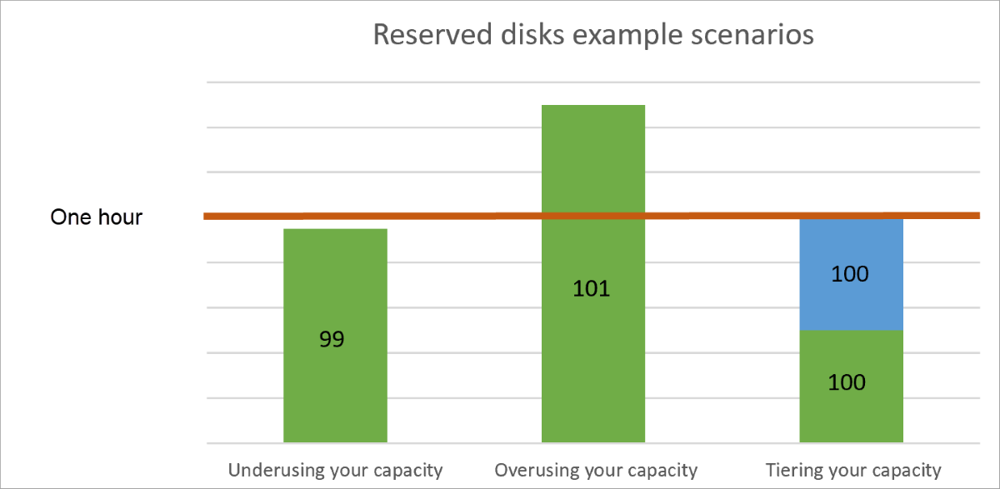

# Understand how your reservation discount is applied to Azure Managed Disks storage

After you purchase Azure Managed Disks reserved capacity, a reservation discount is automatically applied to disk resources that match the terms of your reservation. The reservation discount applies to disk capacity only. Disk snapshots are charged at pay-as-you-go rates.

For more information about Managed Disks reservation, see [Save costs with Azure Managed Disks reservation](../../virtual-machines/linux/disks-reserved-capacity.md).
For information about Managed Disks reservation pricing, see [Managed Disks pricing](https://azure.microsoft.com/pricing/details/managed-disks/).

## How the reservation discount is applied

The Azure disk reservation discount is applied to managed disk resources on an hourly basis. If you have no managed disk resources that meet the terms of your reservation in a given hour, you lose a reservation quantity for that hour. Unused hours do not carry forward.

When you delete a resource, the reservation discount automatically applies to another matching resource in the specified scope. If no matching resources are found in the specified scope, then the reserved hours are lost.

## Discount examples

The following examples show how the Azure Managed Disks reservation discount applies depending on your deployments.

Suppose that you have purchased and reserved 100 P30 disks of Azure Premium Storage in the US West 2 region for a one-year term. Each disk has approximately 1 TiB of storage. Also assume the cost of this sample reservation is $140,100‬. You can choose to pay the full amount up front. You can also choose to pay fixed monthly installments of $11,675 for the next 12 months.

For these examples, assume that you have signed up for a monthly reservation payment plan. The following scenarios describe what happens if you underuse, overuse, or tier your reserved capacity.

### Underusing your capacity

Suppose that in a given hour within the reservation period you have deployed only 99 of your reserved 100 P30 disks. The remaining P30 disk is not applied during that hour and does not carry over.

### Overusing your capacity

Suppose that in a given hour within the reservation period you use 101 Azure Premium SSD P30 disks. The reservation discount applies only to 100 P30 disks. The remaining P30 disk is charged at pay-as-you-go rates for that hour. For the next hour, if your usage decreases to 100 P30 disks, all usage is covered by the reservation.

### Tiering your capacity

Suppose that in a given hour within your reservation period you want to use 200 premium SSD P30 disks. Also suppose that you only use 100 disks for the first 30 minutes. During this period, your use is fully covered because you made a reservation for 100 P30 disks. If you then stop using the first 100 disks and begin using the other 100 disks for the remaining 30 minutes, that usage is also covered under your reservation.

## Need help? Contact us

If you have questions or need help, [create a support request](https://go.microsoft.com/fwlink/?linkid=2083458).

## Next steps

- [Reduce costs with Azure Disks Reservation (Linux)](../../virtual-machines/linux/disks-reserved-capacity.md)
- [Reduce costs with Azure Disks Reservation (Windows)](../../virtual-machines/windows/disks-reserved-capacity.md)
- [What are Azure Reservations?](save-compute-costs-reservations.md)