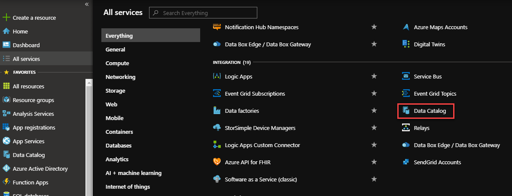
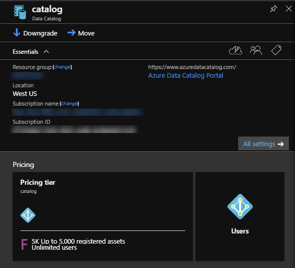

# Quickstart: Create an Azure Data Catalog

Azure Data Catalog is a fully managed cloud service that serves as a system of registration and system of discovery for enterprise data assets. For a detailed overview, see [What is Azure Data Catalog](data-catalog-what-is-data-catalog.md).

This quickstart helps you get started with creating an Azure Data Catalog.

If you don’t have an Azure subscription, create a [free account](https://azure.microsoft.com/free/?WT.mc_id=A261C142F) before you begin.

## Prerequisites

To get started, you need to have:

* A [Microsoft Azure](https://azure.microsoft.com/) subscription.
* You need to have your own [Azure Active Directory tenant](../active-directory/fundamentals/active-directory-access-create-new-tenant.md).

There are a few steps to complete before you can set up Azure Data Catalog. Don’t worry, this process doesn't take long.

## Azure subscription

To set up Data Catalog, you must be the owner or co-owner of an Azure subscription.

Azure subscriptions help you organize cloud-service resources such as Data Catalog. Subscriptions also help you control how resource usage is reported, billed, and paid for. Each subscription can have a separate billing and payment setup, so you can have subscriptions and plans that vary by department, project, regional office, and so on. Every cloud service belongs to a subscription, and you need to have a subscription before you set up Data Catalog. To learn more, see [Manage accounts, subscriptions, and administrative roles](../active-directory/users-groups-roles/directory-assign-admin-roles.md).

## Azure Active Directory

To set up Data Catalog, you must be signed in with an Azure Active Directory (Azure AD) user account.

Azure AD provides an easy way for your business to manage identity and access, both in the cloud and on-premises. Users can use a single work or school account for single sign-in to any cloud and on-premises web application. Data Catalog uses Azure AD to authenticate sign-in. To learn more, see [What is Azure Active Directory?](../active-directory/fundamentals/active-directory-whatis.md).

> [!NOTE]
> By using the [Azure portal](https://portal.azure.com/), you can sign in with either a personal Microsoft account or an Azure Active Directory work or school account. To set up Data Catalog by using either the Azure portal or the [Data Catalog portal](https://www.azuredatacatalog.com), you must sign in with an Azure Active Directory account, not a personal account.

## Active Directory policy configuration

You might encounter a situation where you can sign in to the Data Catalog portal, but when you attempt to sign in to the data source registration tool, you encounter an error message that prevents you from signing in. This problem behavior might occur only when you're on the company network, or it might occur only when you're connecting from outside the company network.

The data source registration tool uses Forms Authentication to validate your user credentials against Active Directory. To sign in, an Active Directory administrator must enable Forms Authentication in the Global Authentication Policy.

In the Global Authentication Policy, authentication methods can be enabled separately for intranet and extranet connections, as shown in the following screenshot. Sign-in errors might occur if Forms Authentication isn't enabled for the network from which you're connecting.

 

## Create a data catalog

You can provision only one data catalog per organization (Azure Active Directory domain). Therefore, if the owner or co-owner of an Azure subscription who belongs to this Azure Active Directory domain has already created a catalog, you will not be able to create a catalog again even if you have multiple Azure subscriptions. To test whether a data catalog has been created by a user in your Azure Active Directory domain, go to the [Azure Data Catalog home page](http://azuredatacatalog.com) and verify whether you see the catalog. If a catalog has already been created for you, skip the following procedure and go to the next section.

1. Go to the [Data Catalog service page](https://azure.microsoft.com/services/data-catalog) and click **Get started**.

    
2. Sign in with a user account that is the owner or co-owner of an Azure subscription. You see the following page after signing in.

    
3. Specify a **name** for the data catalog, the **subscription** you want to use, and the **location** for the catalog.
4. Expand **Pricing** and select an Azure Data Catalog **edition** (Free or Standard).
    
5. Expand **Catalog Users** and click **Add** to add users for the data catalog. You're automatically added to this group.
    
6. Expand **Catalog Administrators** and click **Add** to add additional administrators for the data catalog. You're automatically added to this group.
    
7. Click **Create Catalog** to create the data catalog for your organization. You see the home page for the data catalog after it's created.
    

### Find a data catalog in the Azure portal

1. On a separate tab in the web browser or in a separate web browser window, go to the [Azure portal](https://portal.azure.com) and sign in with the same account that you used to create the data catalog in the previous step.
2. Select **Browse** and then click **Data Catalog**.

    
   You see the data catalog you created.

    
3. Click the catalog that you created. You see the **Data Catalog** blade in the portal.

   
4. You can view properties of the data catalog and update them. For example, click **Pricing tier** and change the edition.

    

## Next Steps

In this quickstart, you've learned how to create an Azure Data Catalog for your organization. You can now try and build reports with the data in your data catalog.

> [!div class="nextstepaction"]
>[Create a Power BI report from data in an Azure Data Catalog](data-catalog-tutorial-power-bi.md)
