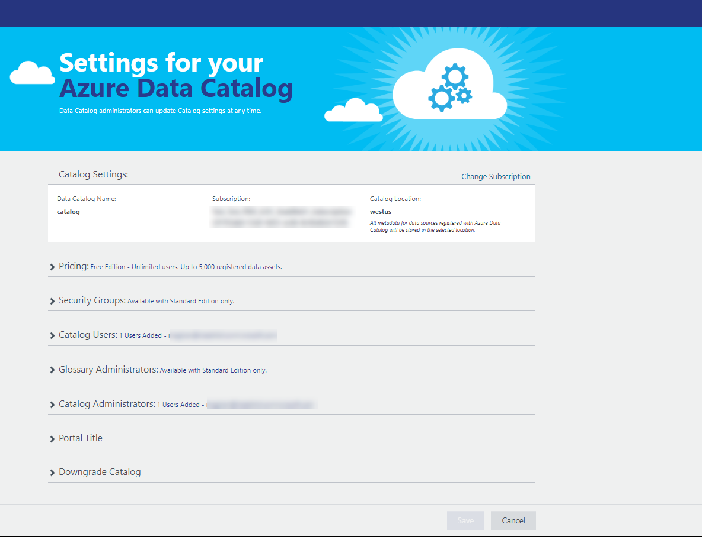
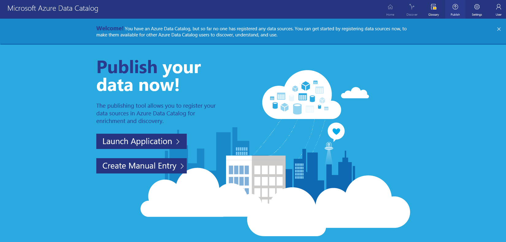

# Quickstart: Create an Azure Data Catalog

Azure Data Catalog is a fully managed cloud service that serves as a system of registration and system of discovery for enterprise data assets. For a detailed overview, see [What is Azure Data Catalog](data-catalog-what-is-data-catalog.md).

This quickstart helps you get started with creating an Azure Data Catalog.

If you don’t have an Azure subscription, create a [free account](https://azure.microsoft.com/free/?WT.mc_id=A261C142F) before you begin.

## Prerequisites

To get started, you need to have:

* A [Microsoft Azure](https://azure.microsoft.com/) subscription.
* You need to have your own [Azure Active Directory tenant](../active-directory/fundamentals/active-directory-access-create-new-tenant.md).

To set up Data Catalog, you must be the owner or co-owner of an Azure subscription.

## Create a data catalog

You can provision only one data catalog per organization (Azure Active Directory domain). Therefore, if the owner or co-owner of an Azure subscription who belongs to this Azure Active Directory domain has already created a catalog, then you can't create a catalog again even if you have multiple Azure subscriptions. To test whether a data catalog has been created by a user in your Azure Active Directory domain, go to the [Azure Data Catalog home page](http://azuredatacatalog.com) and verify whether you see the catalog. If a catalog has already been created for you, skip the following procedure and go to the next section.

1. Go to the [Data Catalog service page](https://azure.microsoft.com/services/data-catalog) and click **Get started**.

    

2. Sign in with a user account that is the owner or co-owner of an Azure subscription. You see the following page after signing in.

    

3. Specify a **name** for the data catalog, the **subscription** you want to use, and the **location** for the catalog.

4. Expand **Pricing** and select an Azure Data Catalog **edition** (Free or Standard).
    

5. Expand **Catalog Users** and click **Add** to add users for the data catalog. You're automatically added to this group.
    

6. Expand **Catalog Administrators** and click **Add** to add additional administrators for the data catalog. You're automatically added to this group.
    

7. Click **Create Catalog** to create the data catalog for your organization.

8. Then you you see the home page for the data catalog after it's created.
    

## Next Steps

In this quickstart, you've learned how to create an Azure Data Catalog for your organization. You can now try to build reports with the data in your data catalog.

> [!div class="nextstepaction"]
> [Create a Power BI report from data in an Azure Data Catalog](data-catalog-tutorial-power-bi.md)
