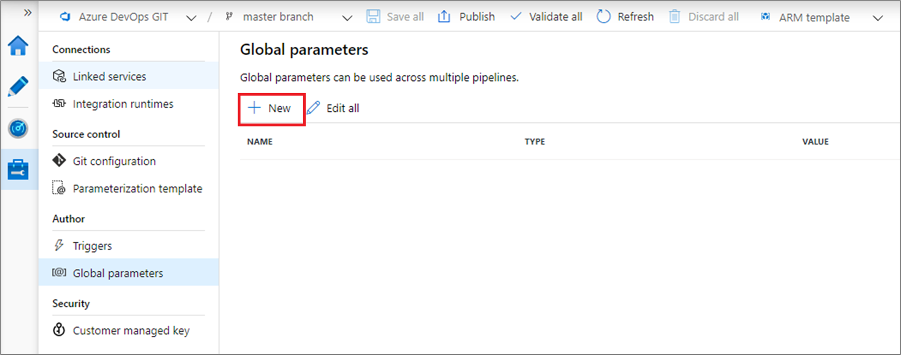
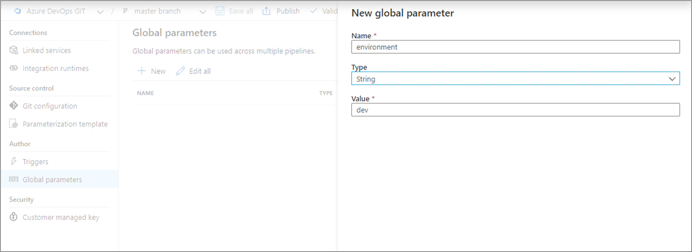
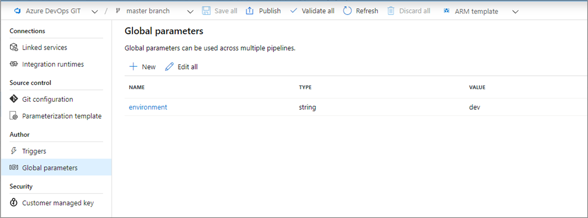
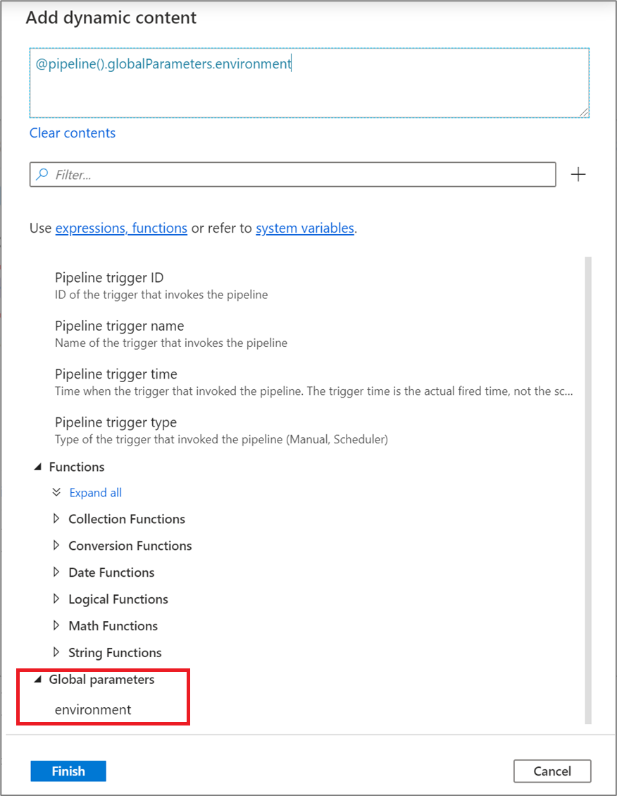

# Global parameters in Azure Data Factory

[!INCLUDE[appliesto-adf-xxx-md](includes/appliesto-adf-xxx-md.md)]

Global parameters are constants across a data factory that can be consumed by a pipeline in any expression. They are useful when you have multiple pipelines with identical parameter names and values. When promoting a data factory using the continuous integration and deployment process (CI/CD), you can override these parameters in each environment. 

## Creating global parameters

To create a global parameter, go to the *Global parameters* tab in the *Author* section. Select **New** to open the creation side-nav.

In the side-nav, enter a name, select a data type, and specify the value of your parameter.

After a global parameter is created, you can edit it by clicking the parameter's name, To alter multiple parameters at once, select **Edit all**.

## Using global parameters in a pipeline

Global parameters can be used in any [pipeline expression](control-flow-expression-language-functions.md). If a pipeline is referencing another resource such as a dataset or data flow, you can pass down the global parameter value via that resource's parameters. Global parameters are referenced as `pipeline().globalParameters.<parameterName>`.

##  Global parameters in CI/CD

## Next steps