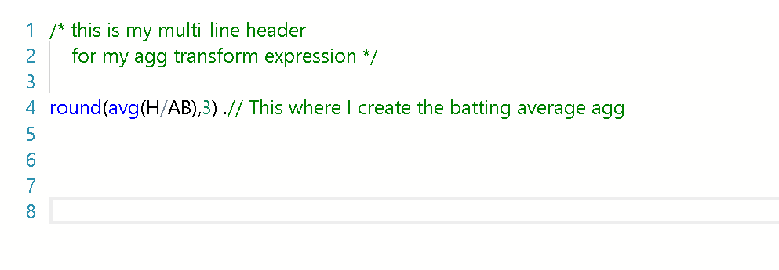

# Mapping data flow Expression Builder

[!INCLUDE[appliesto-adf-xxx-md](includes/appliesto-adf-xxx-md.md)]

In Azure Data Factory mapping data flow, you'll find expression boxes where you can enter expressions for data transformation. Use columns, fields, variables, parameters, functions from your data flow in these boxes. To build the expression, use the Expression Builder, which is launched by clicking in the expression text box inside the transformation. You'll also sometimes see "Computed Column" options when selecting columns for transformation. When you click that, you'll also see the Expression Builder launched.


The Expression Builder tool defaults to the text editor option. the auto-complete feature reads from the entire Azure Data Factory Data Flow object model with syntax checking and highlighting.


## Build schemas in Output Schema pane


In the left-hand Output Schema pane, you will see the columns that you are modifying and adding to your schema. You can interactively build simple and complex data structures here. Add additional fields using "Add column" and build hierarchies by using "Add subcolumn".


## Data Preview in debug mode


When you are working on your data flow expressions, switch on Debug mode from the Azure Data Factory Data Flow design surface, enabling live in-progress preview of your data results from the expression that you are building. Real-time live debugging is enabled for your expressions.


Click the Refresh button to update the results of your expression against a live sample of your source in real-time.


## Comments

Add comments to your expressions using single line and multi-line comment syntax:



## Regular Expressions

The Azure Data Factory Data Flow expression language, [full reference documentation here](https://aka.ms/dataflowexpressions), enables functions that include regular expression syntax. When using regular expression functions, the Expression Builder will try to interpret backslash (\\) as an escape character sequence. When using backslashes in your regular expression, either enclose the entire regex in ticks (\`) or use a double backslash.

Example using ticks

```
regex_replace('100 and 200', `(\d+)`, 'digits')
```

or using double slash

```
regex_replace('100 and 200', '(\\d+)', 'digits')
```

## Addressing array indexes

With expression functions that return arrays, use square brackets [] to address specific indexes inside that return array object. The array is ones-based.


## Handling names with special characters

When you have column names that include special characters or spaces, surround the name with curly braces.
* ```{[dbo].this_is my complex name$$$}```

## Next steps

[Begin building data transformation expressions](data-flow-expression-functions.md)
