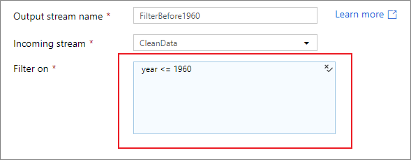

# Building expressions in mapping data flow

In mapping data flow, many transformation properties are entered as expressions. These expressions are comprised of column values, parameters, functions, operators, and literals which are evaluated to a spark data type at run time.

## Opening the expression builder

The expression editing interface in the data factory UX is know as the **Expression Builder**. As you enter in your expression logic, data factory uses [IntelliSense](https://docs.microsoft.com/visualstudio/ide/using-intellisense?view=vs-2019) code completion for hightlighting, syntax checking and auto-completing.


In transformations such as the derived column and filter, where expressions are mandatory, open the expression builder by clicking the blue expression box.



When referencing columns as part of a matching or group by condition, an expression can be used to extract values from columns. This can be done via the 'computed column' option.


In cases where an expression or a literal value are valid inputs, 'add dynamic content' will allow you to build an expression that evaluates to a literal.


## Expression language reference

Mapping data flows has built in functions and operators that can be used in expressions. A list of available functions can be found in the [mapping data flow expression language](data-flow-expression-functions.md) reference page.

## Handling column names with special characters

When you have column names that include special characters or spaces, surround the name with curly braces to reference them in an expression.

```{[dbo].this_is my complex name$$$}```

## Previewing expression results

If [debug-mode](concepts-data-flow-debug-mode.md) is switched on, you can utilize the live spark cluster to see an in-progress preview of what your expression evaluates to. As you are building your logic, you can debug your expression in real-time. 


Click the Refresh button to update the results of your expression against a live sample of your source.


## String interpolation

Use double-quotes to enclose literal string text together with expressions. You can include expression functions, columns, and parameters. This is very useful to avoid extensive use of string concatenation when including parameters in query strings. To use expression syntax, enclose it in curly braces,

Some examples of string interpolation:

* ```"My favorite movie is {iif(instr(title,', The')>0,"The {split(title,', The')[1]}",title)}"```

* ```"select * from {$tablename} where orderyear > {$year}"```

* ```"Total cost with sales tax is {round(totalcost * 1.08,2)}"```

## Commenting expressions

Add comments to your expressions using single line and multi-line comment syntax:


Below are examples of valid comments:

* ```/* This is my comment */```

* ```/* This is a```
*   ```multi-line comment */```
   
* ```// This is a single line comment```

If you put a comment at the top of your expression, it will appear in the transformation text box to document your transformation expressions:


## Regular expressions

Many expression language functions utilize regular expression syntax. When using regular expression functions, the Expression Builder will try to interpret backslash (\\) as an escape character sequence. When using backslashes in your regular expression, either enclose the entire regex in ticks (\`) or use a double backslash.

Example using ticks

```
regex_replace('100 and 200', `(\d+)`, 'digits')
```

or using double slash

```
regex_replace('100 and 200', '(\\d+)', 'digits')
```

## Addressing array indexes

With expression functions that return arrays, use square brackets [] to address specific indexes inside that return array object. The array is ones-based.


## Keyboard shortcuts

* ```Ctrl-K Ctrl-C```: Comments entire line
* ```Ctrl-K Ctrl-U```: Uncomment
* ```F1```: Provide editor help commands
* ```Alt-Down Arrow```: Move current line down
* ```Alt-Up Arrow```: Move current line up
* ```Cntrl-Space```: Show context help

## Convert to dates or timestamps

To include string literals in your timestamp output, you need to wrap your conversion inside of ```toString()```.

```toString(toTimestamp('12/31/2016T00:12:00', 'MM/dd/yyyy\'T\'HH:mm:ss'), 'MM/dd /yyyy\'T\'HH:mm:ss')```

To convert milliseconds from Epoch to a date or timestamp, use `toTimestamp(<number of milliseconds>)`. If time is coming in seconds, multiply by 1000.

```toTimestamp(1574127407*1000l)```

The trailing "l" at the end of the expression above signifies conversion to long as in-line syntax.

## Next steps

[Begin building data transformation expressions](data-flow-expression-functions.md)
