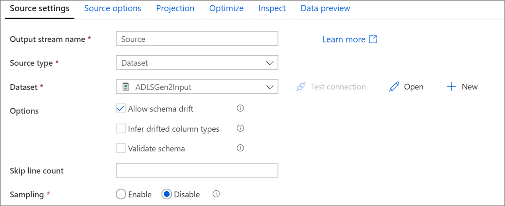
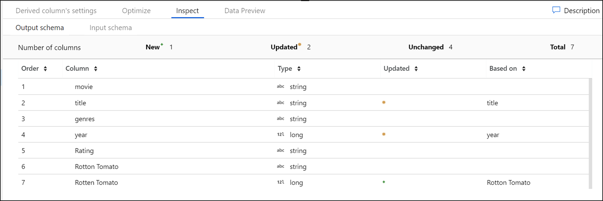
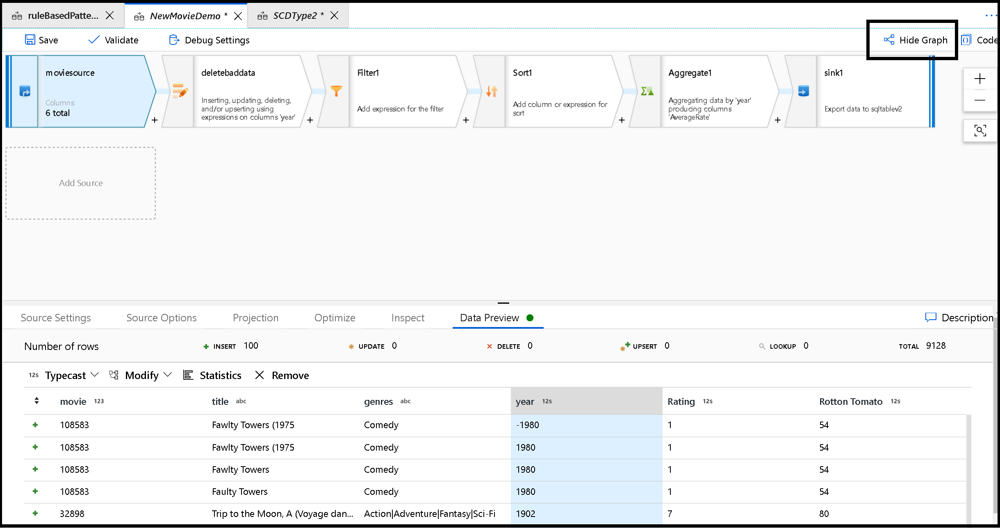

# What Are Mapping Data Flows?

Mapping Data Flows are visually designed data transformations in Azure Data Factory. Data flows allow data engineers to develop graphical data transformation logic without writing code. The resulting data flows are executed as activities within Azure Data Factory pipelines using scaled-out **Spark** clusters. Data flow activities can be operationalized via existing Data Factory scheduling, control, flow, and monitoring capabilities.

Mapping Data Flows provide a fully visual experience with no coding required. Your data flows will execute on your own execution cluster for scaled-out data processing. Azure Data Factory handles all the code translation, path optimization, and execution of your data flow jobs.

## Getting started

To create a data flow, select the plus sign under **Factory Resources**. 

This takes you to the data flow canvas where you can create your transformation logic. Select **Add source** to start configuring your source transformation. For more information, see [Source transformation](data-flow-source.md).

## Data flow canvas

The data flow canvas is separated into three parts: the top bar, the graph, and the configuration panel. 

### Graph

The graph displays the transformation stream. It shows the lineage of source data as it flows into one or more sinks. To add a new source, select **Add source**. To add a new transformation, select the plus sign on the bottom right of an existing transformation.

### Configuration panel

The configuration panel shows the settings specific to the currently selected transformation or, if no transformation is selected, the data flow. In the overall data flow configuration, you can edit the name and description under the **General** tab or add parameters via the **Parameters** tab. For more information, see [Mapping Data Flow parameters](parameters-data-flow.md).

Each transformation has at least four configuration tabs:

#### Transformation settings

The first tab in each transformation's configuration pane contains the settings specific to that transformation. For more information, refer to that transformation's documentation page.

#### Optimize

**Optimize** contains settings to configure partitioning schemes.

The default setting is **Use current partitioning**, which instructs Azure Data Factory to use the partitioning scheme native to data flows running on **Spark**. In most scenarios, this setting is the recommended approach.

There are instances where you may wish to adjust the partitioning. For instance, if you want to output your transformations to a single file in the lake, select **Single partition** in a sink transformation.

Another case where you may wish to control the partitioning schemes is in terms of performance. Adjusting the partitioning provides control over the distribution of your data across compute nodes and data locality optimizations that can have both positive and negative effects on your overall data flow performance. For more information, see the [Data flow performance guide](concepts-data-flow-performance.md).

To change the partitioning on any transformation, select the **Optimize** tab and select **Set partitioning**. You'll then be presented with a series of options for partitioning. The best method of partitioning will differ based on your data volumes, candidate keys, null values, and cardinality. Best practice is to start with default partitioning and then try different partitioning options. You can test using pipeline debug runs, and view execution time and partition usage in each transformation grouping from the monitoring view. For more information, see [Monitoring data flows](concepts-data-flow-monitoring.md).

The available partitioning options are:

##### Round robin 

Round robin is a simple partition that automatically distributes data equally across partitions. Use round robin when you don't have good key candidates to implement a solid, smart partitioning strategy. You can set the number of physical partitions.

##### Hash

Azure Data Factory will produce a hash of columns to produce uniform partitions such that rows with similar values will fall in the same partition. When using the Hash option, test for possible partition skew. You can set the number of physical partitions.

##### Dynamic range

Dynamic range will use **Spark** dynamic ranges based on the columns or expressions that you provide. You can set the number of physical partitions. 

##### Fixed range

Build an expression that provides a fixed range for values within your partitioned data columns. To avoid partition skew, you should have a good understanding of your data before using this option. The values you enter for the expression will be used as part of a partition function. You can set the number of physical partitions.

##### Key

If you have a good understanding of the cardinality of your data, key partitioning may be a good strategy. Key partitioning will create partitions for each unique value in your column. You can't set the number of partitions because the number will be based on unique values in the data.

#### Inspect

**Inspect** provides a view into the metadata of the data stream that you're transforming. You can see the column counts, columns changed, columns added, data types, column ordering, and column references. **Inspect** is a read-only view of your metadata. You don't need to have debug mode enabled to see metadata in **Inspect**.

As you change the shape of your data through transformations, you'll see the metadata changes flow in **Inspect**. If there isn't a defined schema in your source transformation, then metadata won't be visible in **Inspect**. Lack of metadata is common in schema drift scenarios.

#### Data preview

If debug mode is on, **Data preview** gives you an interactive snapshot of the data at each transform. For more information, see [Data preview in debug mode](concepts-data-flow-debug-mode.md#data-preview).

### Top bar

The top bar contains actions that affect the whole data flow, such as saving and validation. You can also toggle between graph and configuration modes using **Show graph** and **Hide graph**.

If you hide your graph, you can navigate through your transformation nodes laterally via **Previous** and **Next**.

## Next steps

* Learn how to create a [Source transformation](data-flow-source.md)
* Learn how to build your data flows in [Debug mode](concepts-data-flow-debug-mode.md)
