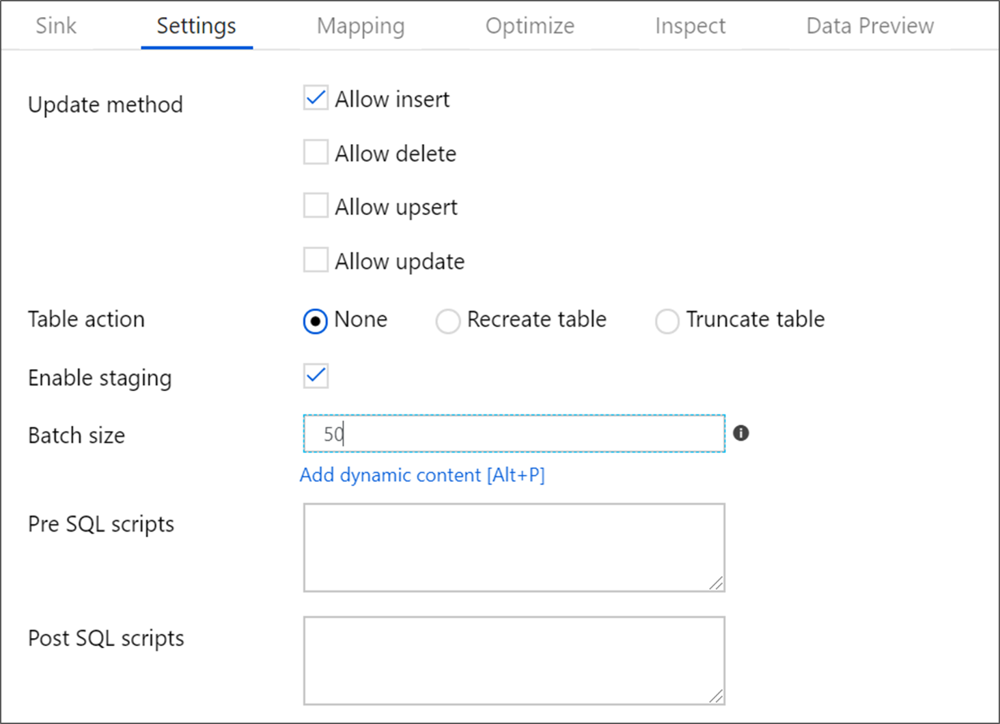
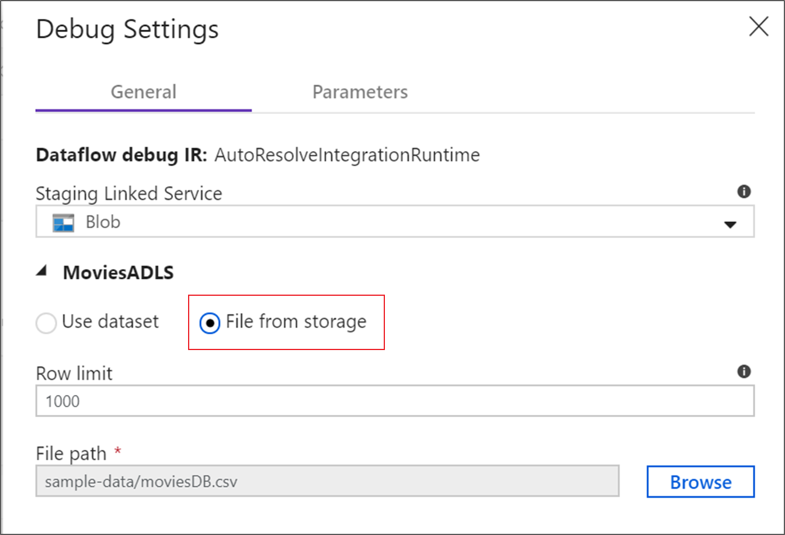

# Mapping data flows performance and tuning guide


Azure Data Factory Mapping Data Flows provide a code-free browser interface to design, deploy, and orchestrate data transformations at scale.

> [!NOTE]
> If you are not familiar with ADF Mapping Data Flows in general, see [Data Flows Overview](concepts-data-flow-overview.md) before reading this article.
>

> [!NOTE]
> When you are designing and testing Data Flows from the ADF UI, make sure to turn on the Debug switch so that you can execute your data flows in real-time without waiting for a cluster to warm up.
>


## Monitor data flow performance

While designing your mapping data flows in the browser, you can unit test each individual transformation by clicking on the data preview tab in the bottom settings pane for each transformation. The next step you should take is to test your data flow end-to-end in the pipeline designer. Add an Execute Data Flow activity and use the Debug button to test the performance of your data flow. In the bottom pane of the pipeline window, you will see an eyeglass icon under "actions":


Clicking that icon will display the execution plan and subsequent performance profile of your data flow. You can use this information to estimate the performance of your data flow against different sized data sources. Note that you can assume 1 minute of cluster job execution set-up time in your overall performance calculations and if you are using the default Azure Integration Runtime, you may need to add 5 minutes of cluster spin-up time as well.


## Optimizing for Azure SQL Database and Azure SQL Data Warehouse


### Partition your source data

* Go to "Optimize" and select "Source". Set either a specific table column or a type in a query.
* If you chose "column", then pick the partition column.
* Also, set the maximum number of connections to your Azure SQL DB. You can try a higher setting to gain parallel connections to your database. However, some cases may result in faster performance with a limited number of connections.
* Your source database tables do not need to be partitioned.
* Setting a query in your Source transformation that matches the partitioning scheme of your database table will allow the source database engine to leverage partition elimination.
* If your source is not already partitioned, ADF will still use data partitioning in the Spark transformation environment based on the key that you select in the Source transformation.

### Set batch size and query on source


* Setting batch size will instruct ADF to store data in sets in memory instead of row-by-row. It is an optional setting and you may run out of resources on the compute nodes if they are not sized properly.
* Setting a query can allow you to filter rows right at the source before they even arrive for Data Flow for processing, which can make the initial data acquisition faster.
* If you use a query, you can add optional query hints for your Azure SQL DB, i.e. READ UNCOMMITTED

### Set isolation level on Source transformation settings for SQL datasets

* Read uncommitted will provide faster query results on Source transformation


### Set sink batch size



* In order to avoid row-by-row processing of your data flows, set the "Batch size" in the sink settings for Azure SQL DB. This will tell ADF to process database writes in batches based on the size provided.

### Set partitioning options on your sink

* Even if you don't have your data partitioned in your destination Azure SQL DB tables, go to the Optimize tab and set partitioning.
* Very often, simply telling ADF to use Round Robin partitioning on the Spark execution clusters results in much faster data loading instead of forcing all connections from a single node/partition.

### Increase size of your compute engine in Azure Integration Runtime


* Increase the number of cores, which will increase the number of nodes, and provide you with more processing power to query and write to your Azure SQL DB.
* Try "Compute Optimized" and "Memory Optimized" options to apply more resources to your compute nodes.

### Unit test and performance test with debug

* When unit testing data flows, set the "Data Flow Debug" button to ON.
* Inside of the Data Flow designer, use the Data Preview tab on transformations to view the results of your transformation logic.
* Unit test your data flows from the pipeline designer by placing a Data Flow activity on the pipeline design canvas and use the "Debug" button to test.
* Testing in debug mode will work against a live warmed cluster environment without the need to wait for a just-in-time cluster spin-up.

### Disable indexes on write
* Use an ADF pipeline stored procedure activity prior to your Data Flow activity that disables indexes on your target tables that are being written to from your Sink.
* After your Data Flow activity, add another stored proc activity that enabled those indexes.

### Increase the size of your Azure SQL DB
* Schedule a resizing of your source and sink Azure SQL DB before your run your pipeline to increase the throughput and minimize Azure throttling once you reach DTU limits.
* After your pipeline execution is complete, you can resize your databases back to their normal run rate.

## Optimizing for Azure SQL Data Warehouse

### Use staging to load data in bulk via Polybase

* In order to avoid row-by-row processing of your data flows, set the "Staging" option in the Sink settings so that ADF can leverage Polybase to avoid row-by-row inserts into DW. This will instruct ADF to use Polybase so that data can be loaded in bulk.
* When you execute your data flow activity from a pipeline, with Staging turned on, you will need to select the Blob store location of your staging data for bulk loading.

### Increase the size of your Azure SQL DW

* Schedule a resizing of your source and sink Azure SQL DW before you run your pipeline to increase the throughput and minimize Azure throttling once you reach DWU limits.

* After your pipeline execution is complete, you can resize your databases back to their normal run rate.

## Optimize for files

* You can control how many partitions that ADF will use. On each Source & Sink transformation, as well as each individual transformation, you can set a partitioning scheme. For smaller files, you may find selecting "Single Partition" can sometimes work better and faster than asking Spark to partition your small files.
* If you do not have enough information about your source data, you can choose "Round Robin" partitioning and set the number of partitions.
* If you explore your data and find that you have columns that can be good hash keys, use the Hash partitioning option.
* When debugging in data preview and pipeline debug, note that the limit and sampling sizes for file-based source datasets only apply to the number of rows returned, not the number of rows read. This is important to note because it can effect the performance of your debug executions and possibly cause the flow to fail.
* Remember that debug clusters are small single-node clusters by default, so use temporary small files for debugging. Go to Debug Settings and point to a small subset of your data using a temporary file.



### File naming options

* The default nature of writing transformed data in ADF Mapping Data Flows is to write to a dataset that has a Blob or ADLS Linked Service. You should set that dataset to point to a folder or container, not a named file.
* Data Flows use Azure Databricks Spark for execution, which means that your output will be split over multiple files based on either default Spark partitioning or the partitioning scheme that you've explicitly chosen.
* A very common operation in ADF Data Flows is to choose "Output to single file" so that all of your output PART files are merged together into a single output file.
* However, this operation requires that the output reduces to a single partition on a single cluster node.
* Keep this in mind when choosing this popular option. You can run out of cluster node resources if you are combining many large source files into a single output file partition.
* To avoid exhausting compute node resources, you can keep the default or explicit partitioning scheme in ADF, which optimizes for performance, and then add a subsequent Copy Activity in the pipeline that merges all of the PART files from the output folder to a new single file. Essentially, this technique separates the action of transformation from file merging and achieves the same result as setting "output to single file".

### Looping through file lists

In most instances, Data Flows in ADF will execute better from a pipeline that allows the Data Flow Source transformation to iterate over multiple files. In other words, it is preferred to use wildcards or file lists inside of your Source in Data Flow than to iterate over a large list of files using ForEach in the pipeline, calling an Execute Data Flow on each iteration. The Data Flow process will execute faster by allowing the looping to occur inside the Data Flow.

For example, if I have a list of data files from July 2019 that I wish to process in a folder in Blob Storage, it would be more performant to call an Execute Data Flow activity one time from your pipeline and use a wildcard in your Source like this:

```DateFiles/*_201907*.txt```

This will perform better than a Lookup against the Blob Store in a pipeline that then iterates across all matched files using a ForEach with an Execute Data Flow activity inside.

## Next steps

See the other Data Flow articles related to performance:

- [Data Flow Optimize Tab](concepts-data-flow-optimize-tab.md)
- [Data Flow activity](control-flow-execute-data-flow-activity.md)
- [Monitor Data Flow performance](concepts-data-flow-monitoring.md)
