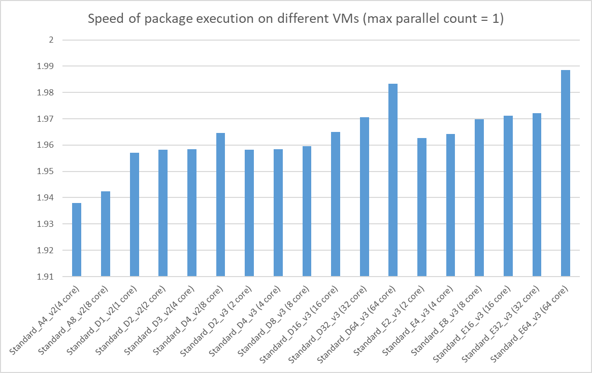
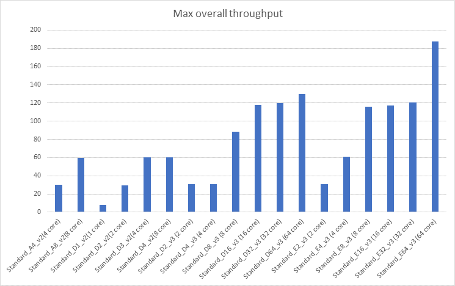

# Configure the Azure-SSIS Integration Runtime for high performance

[!INCLUDE[appliesto-adf-xxx-md](includes/appliesto-adf-xxx-md.md)]


This article describes how to configure an Azure-SSIS Integration Runtime (IR) for high performance. The Azure-SSIS IR allows you to deploy and run SQL Server Integration Services (SSIS) packages in Azure. For more information about Azure-SSIS IR, see [Integration runtime](concepts-integration-runtime.md#azure-ssis-integration-runtime) article. For information about deploying and running SSIS packages on Azure, see [Lift and shift SQL Server Integration Services workloads to the cloud](/sql/integration-services/lift-shift/ssis-azure-lift-shift-ssis-packages-overview).

> [!IMPORTANT]
> This article contains performance results and observations from in-house testing done by members of the SSIS development team. Your results may vary. Do your own testing before you finalize your configuration settings, which affect both cost and performance.

## Properties to configure

The following portion of a configuration script shows the properties that you can configure when you create an Azure-SSIS Integration Runtime. For the complete PowerShell script and description, see [Deploy SQL Server Integration Services packages to Azure](tutorial-deploy-ssis-packages-azure-powershell.md).

```powershell
# If your input contains a PSH special character, e.g. "$", precede it with the escape character "`" like "`$"
$SubscriptionName = "[your Azure subscription name]"
$ResourceGroupName = "[your Azure resource group name]"
$DataFactoryName = "[your data factory name]"
# For supported regions, see https://azure.microsoft.com/global-infrastructure/services/?products=data-factory&regions=all
$DataFactoryLocation = "EastUS"

### Azure-SSIS integration runtime information - This is a Data Factory compute resource for running SSIS packages
$AzureSSISName = "[specify a name for your Azure-SSIS IR]"
$AzureSSISDescription = "[specify a description for your Azure-SSIS IR]"
# For supported regions, see https://azure.microsoft.com/global-infrastructure/services/?products=data-factory&regions=all
$AzureSSISLocation = "EastUS"
# For supported node sizes, see https://azure.microsoft.com/pricing/details/data-factory/ssis/
$AzureSSISNodeSize = "Standard_D8_v3"
# 1-10 nodes are currently supported
$AzureSSISNodeNumber = 2
# Azure-SSIS IR edition/license info: Standard or Enterprise
$AzureSSISEdition = "Standard" # Standard by default, while Enterprise lets you use advanced/premium features on your Azure-SSIS IR
# Azure-SSIS IR hybrid usage info: LicenseIncluded or BasePrice
$AzureSSISLicenseType = "LicenseIncluded" # LicenseIncluded by default, while BasePrice lets you bring your own on-premises SQL Server license with Software Assurance to earn cost savings from Azure Hybrid Benefit (AHB) option
# For a Standard_D1_v2 node, up to 4 parallel executions per node are supported, but for other nodes, up to max(2 x number of cores, 8) are currently supported
$AzureSSISMaxParallelExecutionsPerNode = 8
# Custom setup info
$SetupScriptContainerSasUri = "" # OPTIONAL to provide SAS URI of blob container where your custom setup script and its associated files are stored
# Virtual network info: Classic or Azure Resource Manager
$VnetId = "[your virtual network resource ID or leave it empty]" # REQUIRED if you use Azure SQL Database with virtual network service endpoints/SQL Managed instance/on-premises data, Azure Resource Manager virtual network is recommended, Classic virtual network will be deprecated soon
$SubnetName = "[your subnet name or leave it empty]" # WARNING: Please use the same subnet as the one used with your Azure SQL Database with virtual network service endpoints or a different subnet than the one used for your SQL Managed instance

### SSISDB info
$SSISDBServerEndpoint = "[your logical SQL server name or SQL Managed instance name.DNS prefix].database.windows.net" # WARNING: Please ensure that there is no existing SSISDB, so we can prepare and manage one on your behalf
# Authentication info: SQL or Azure Active Directory (AAD)
$SSISDBServerAdminUserName = "[your server admin username for SQL authentication or leave it empty for AAD authentication]"
$SSISDBServerAdminPassword = "[your server admin password for SQL authentication or leave it empty for AAD authentication]"
$SSISDBPricingTier = "[Basic|S0|S1|S2|S3|S4|S6|S7|S9|S12|P1|P2|P4|P6|P11|P15|…|ELASTIC_POOL(name = <elastic_pool_name>) for Azure SQL Database or leave it empty for SQL Managed instance]"
```

## AzureSSISLocation
**AzureSSISLocation** is the location for the integration runtime worker node. The worker node maintains a constant connection to the SSIS Catalog database (SSISDB) in Azure SQL Database. Set the **AzureSSISLocation** to the same location as [logical SQL server](../sql-database/sql-database-servers.md) that hosts SSISDB, which lets the integration runtime to work as efficiently as possible.

## AzureSSISNodeSize
Data Factory, including the Azure-SSIS IR, supports the following options:
-   Standard\_A4\_v2
-   Standard\_A8\_v2
-   Standard\_D1\_v2
-   Standard\_D2\_v2
-   Standard\_D3\_v2
-   Standard\_D4\_v2
-   Standard\_D2\_v3
-   Standard\_D4\_v3
-   Standard\_D8\_v3
-   Standard\_D16\_v3
-   Standard\_D32\_v3
-   Standard\_D64\_v3
-   Standard\_E2\_v3
-   Standard\_E4\_v3
-   Standard\_E8\_v3
-   Standard\_E16\_v3
-   Standard\_E32\_v3
-   Standard\_E64\_v3

In the unofficial in-house testing by the SSIS engineering team, the D series appears to be more suitable for SSIS package execution than the A series.

-   The performance/price ratio of the D series is higher than the A series and the performance/price ratio of the v3 series is higher than the v2 series.
-   The throughput for the D series is higher than the A series at the same price and the throughput for the v3 series is higher than the v2 series at the same price.
-   The v2 series nodes of Azure-SSIS IR are not suitable for custom setup, so please use the v3 series nodes instead. If you already use the v2 series nodes, please switch to use the v3 series nodes as soon as possible.
-   The E series is memory optimized VM sizes that provides a higher memory-to-CPU ratio than other machines.If your package requires a lot of memory, you can consider choosing E series VM.

### Configure for execution speed
If you don't have many packages to run, and you want packages to run quickly, use the information in the following chart to choose a virtual machine type suitable for your scenario.

This data represents a single package execution on a single worker node. The package loads 3 million records with first name and last name columns from Azure Blob Storage, generates a full name column, and writes the records that have the full name longer than 20 characters to Azure Blob Storage.



### Configure for overall throughput

If you have lots of packages to run, and you care most about the overall throughput, use the information in the following chart to choose a virtual machine type suitable for your scenario.



## AzureSSISNodeNumber

**AzureSSISNodeNumber** adjusts the scalability of the integration runtime. The throughput of the integration runtime is proportional to the **AzureSSISNodeNumber**. Set the **AzureSSISNodeNumber** to a small value at first, monitor the throughput of the integration runtime, then adjust the value for your scenario. To reconfigure the worker node count, see [Manage an Azure-SSIS integration runtime](manage-azure-ssis-integration-runtime.md).

## AzureSSISMaxParallelExecutionsPerNode

When you're already using a powerful worker node to run packages, increasing **AzureSSISMaxParallelExecutionsPerNode** may increase the overall throughput of the integration runtime. For Standard_D1_v2 nodes, 1-4 parallel executions per node are supported. For all other types of nodes, 1-max(2 x number of cores, 8) parallel executions per node are supported. If you want **AzureSSISMaxParallelExecutionsPerNode** beyond the max value we supported, you can open a support ticket and we can increase max value for you and after that you need use Azure Powershell to update **AzureSSISMaxParallelExecutionsPerNode**.
You can estimate the appropriate value based on the cost of your package and the following configurations for the worker nodes. For more information, see [General-purpose virtual machine sizes](../virtual-machines/windows/sizes-general.md).

| Size             | vCPU | Memory: GiB | Temp storage (SSD) GiB | Max temp storage throughput: IOPS / Read MBps / Write MBps | Max data disks / throughput: IOPS | Max NICs / Expected network performance (Mbps) |
|------------------|------|-------------|------------------------|------------------------------------------------------------|-----------------------------------|------------------------------------------------|
| Standard\_D1\_v2 | 1    | 3.5         | 50                     | 3000 / 46 / 23                                             | 2 / 2x500                         | 2 / 750                                        |
| Standard\_D2\_v2 | 2    | 7           | 100                    | 6000 / 93 / 46                                             | 4 / 4x500                         | 2 / 1500                                       |
| Standard\_D3\_v2 | 4    | 14          | 200                    | 12000 / 187 / 93                                           | 8 / 8x500                         | 4 / 3000                                       |
| Standard\_D4\_v2 | 8    | 28          | 400                    | 24000 / 375 / 187                                          | 16 / 16x500                       | 8 / 6000                                       |
| Standard\_A4\_v2 | 4    | 8           | 40                     | 4000 / 80 / 40                                             | 8 / 8x500                         | 4 / 1000                                       |
| Standard\_A8\_v2 | 8    | 16          | 80                     | 8000 / 160 / 80                                            | 16 / 16x500                       | 8 / 2000                                       |
| Standard\_D2\_v3 | 2    | 8           | 50                     | 3000 / 46 / 23                                             | 4 / 6x500                         | 2 / 1000                                       |
| Standard\_D4\_v3 | 4    | 16          | 100                    | 6000 / 93 / 46                                             | 8 / 12x500                        | 2 / 2000                                       |
| Standard\_D8\_v3 | 8    | 32          | 200                    | 12000 / 187 / 93                                           | 16 / 24x500                       | 4 / 4000                                       |
| Standard\_D16\_v3| 16   | 64          | 400                    | 24000 / 375 / 187                                          | 32/ 48x500                        | 8 / 8000                                       |
| Standard\_D32\_v3| 32   | 128         | 800                    | 48000 / 750 / 375                                          | 32 / 96x500                       | 8 / 16000                                      |
| Standard\_D64\_v3| 64   | 256         | 1600                   | 96000 / 1000 / 500                                         | 32 / 192x500                      | 8 / 30000                                      |
| Standard\_E2\_v3 | 2    | 16          | 50                     | 3000 / 46 / 23                                             | 4 / 6x500                         | 2 / 1000                                       |
| Standard\_E4\_v3 | 4    | 32          | 100                    | 6000 / 93 / 46                                             | 8 / 12x500                        | 2 / 2000                                       |
| Standard\_E8\_v3 | 8    | 64          | 200                    | 12000 / 187 / 93                                           | 16 / 24x500                       | 4 / 4000                                       |
| Standard\_E16\_v3| 16   | 128         | 400                    | 24000 / 375 / 187                                          | 32 / 48x500                       | 8 / 8000                                       |
| Standard\_E32\_v3| 32   | 256         | 800                    | 48000 / 750 / 375                                          | 32 / 96x500                       | 8 / 16000                                      |
| Standard\_E64\_v3| 64   | 432         | 1600                   | 96000 / 1000 / 500                                         | 32 / 192x500                      | 8 / 30000                                      |

Here are the guidelines for setting the right value for the **AzureSSISMaxParallelExecutionsPerNode** property: 

1. Set it to a small value at first.
2. Increase it by a small amount to check whether the overall throughput is improved.
3. Stop increasing the value when the overall throughput reaches the maximum value.

## SSISDBPricingTier

**SSISDBPricingTier** is the pricing tier for the SSIS Catalog database (SSISDB) on an Azure SQL database. This setting affects the maximum number of workers in the IR instance, the speed to queue a package execution, and the speed to load the execution log.

-   If you don't care about the speed to queue package execution and to load the execution log, you can choose the lowest database pricing tier. Azure SQL Database with Basic pricing supports 8 workers in an integration runtime instance.

-   Choose a more powerful database than Basic if the worker count is more than 8, or the core count is more than 50. Otherwise the database becomes the bottleneck of the integration runtime instance and the overall performance is negatively impacted.

-   Choose a more powerful database such as s3 if the logging level is set to verbose. According our unofficial in-house testing, s3 pricing tier can support SSIS package execution with 2 nodes, 128 parallel counts and verbose logging level.

You can also adjust the database pricing tier based on [database transaction unit](../sql-database/sql-database-what-is-a-dtu.md) (DTU) usage information available on the Azure portal.

## Design for high performance
Designing an SSIS package to run on Azure is different from designing a package for on-premises execution. Instead of combining multiple independent tasks in the same package, separate them into several packages for more efficient execution in the Azure-SSIS IR. Create a package execution for each package, so that they don’t have to wait for each other to finish. This approach benefits from the scalability of the Azure-SSIS integration runtime and improves the overall throughput.

## Next steps
Learn more about the Azure-SSIS Integration Runtime. See [Azure-SSIS Integration Runtime](concepts-integration-runtime.md#azure-ssis-integration-runtime).
