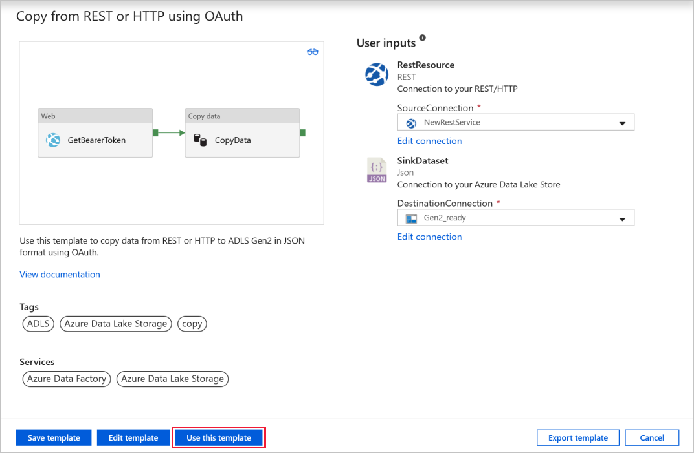
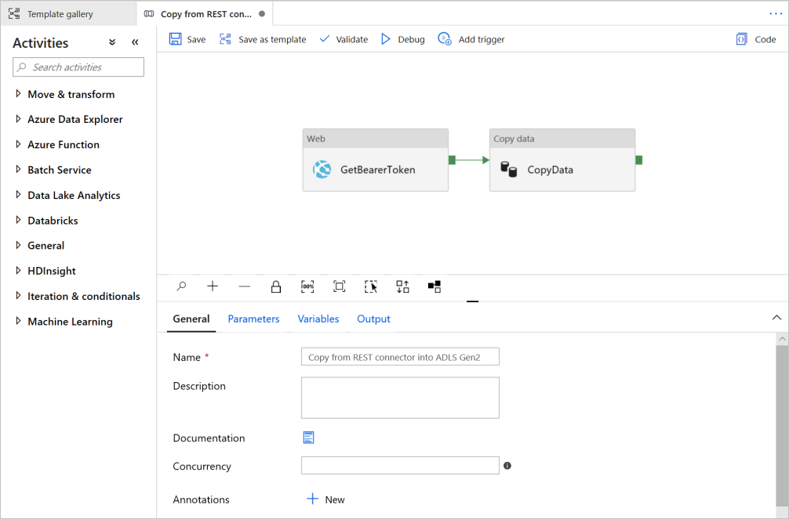
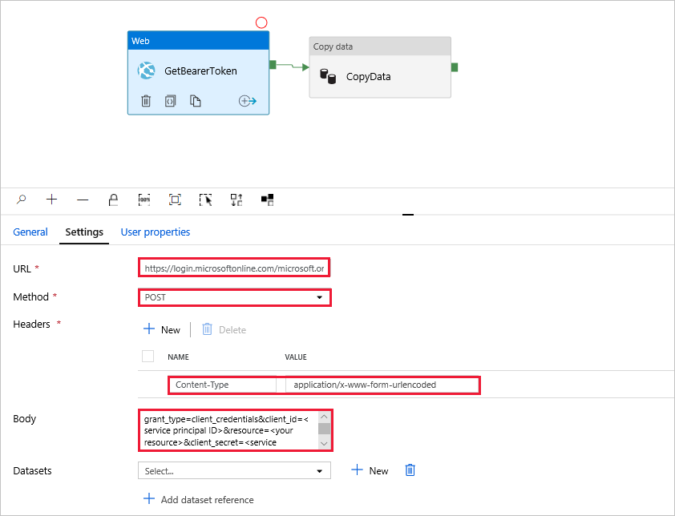
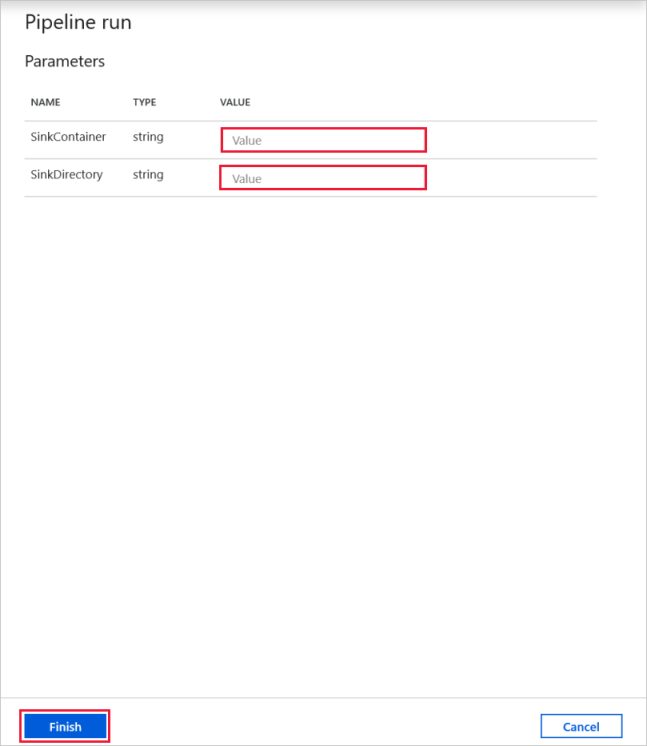
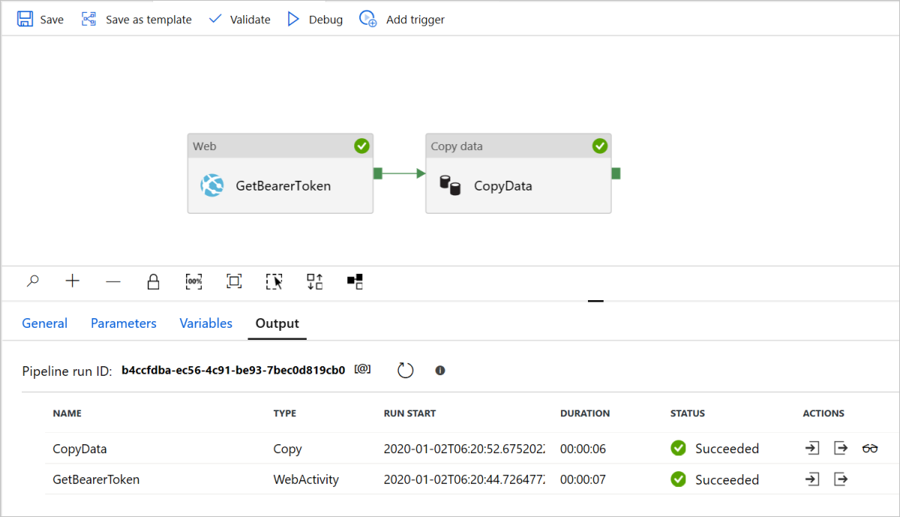

# Copy data from a REST endpoint by using Azure Data Factory

This article outlines how to use Copy Activity in Azure Data Factory to copy data from a REST endpoint. The article builds on [Copy Activity in Azure Data Factory](copy-activity-overview.md), which presents a general overview of Copy Activity.

The difference among this REST connector, [HTTP connector](connector-http.md) and the [Web table connector](connector-web-table.md) are:

- **REST connector** specifically supports copying data from RESTful APIs; 
- **HTTP connector** is generic to retrieve data from any HTTP endpoint, e.g. to download file. Before this REST connector becomes available, you may happen to use HTTP connector to copy data from RESTful API, which is supported but less functional comparing to REST connector.
- **Web table connector** extracts table content from an HTML webpage.

## Supported capabilities

You can copy data from a REST source to any supported sink data store. For a list of data stores that Copy Activity supports as sources and sinks, see [Supported data stores and formats](copy-activity-overview.md#supported-data-stores-and-formats).

Specifically, this generic REST connector supports:

- Retrieving data from a REST endpoint by using the **GET** or **POST** methods.
- Retrieving data by using one of the following authentications: **Anonymous**, **Basic**, **AAD service principal**, and **managed identities for Azure resources**.
- **[Pagination](#pagination-support)** in the REST APIs.
- Copying the REST JSON response [as-is](#export-json-response-as-is) or parse it by using [schema mapping](copy-activity-schema-and-type-mapping.md#schema-mapping). Only response payload in **JSON** is supported.

> [!TIP]
> To test a request for data retrieval before you configure the REST connector in Data Factory, learn about the API specification for header and body requirements. You can use tools like Postman or a web browser to validate.

## Prerequisites

[!INCLUDE [data-factory-v2-integration-runtime-requirements](../../includes/data-factory-v2-integration-runtime-requirements.md)]

## Get started

[!INCLUDE [data-factory-v2-connector-get-started](../../includes/data-factory-v2-connector-get-started.md)]

The following sections provide details about properties you can use to define Data Factory entities that are specific to the REST connector.

## Linked service properties

The following properties are supported for the REST linked service:

| Property | Description | Required |
|:--- |:--- |:--- |
| type | The **type** property must be set to **RestService**. | Yes |
| url | The base URL of the REST service. | Yes |
| enableServerCertificateValidation | Whether to validate server-side SSL certificate when connecting to the endpoint. | No<br /> (the default is **true**) |
| authenticationType | Type of authentication used to connect to the REST service. Allowed values are **Anonymous**, **Basic**, **AadServicePrincipal** and **ManagedServiceIdentity**. Refer to corresponding sections below on more properties and examples respectively. | Yes |
| connectVia | The [Integration Runtime](concepts-integration-runtime.md) to use to connect to the data store. Learn more from [Prerequisites](#prerequisites) section. If not specified, this property uses the default Azure Integration Runtime. |No |

### Use basic authentication

Set the **authenticationType** property to **Basic**. In addition to the generic properties that are described in the preceding section, specify the following properties:

| Property | Description | Required |
|:--- |:--- |:--- |
| userName | The user name to use to access the REST endpoint. | Yes |
| password | The password for the user (the **userName** value). Mark this field as a **SecureString** type to store it securely in Data Factory. You can also [reference a secret stored in Azure Key Vault](store-credentials-in-key-vault.md). | Yes |

**Example**

```json
{
    "name": "RESTLinkedService",
    "properties": {
        "type": "RestService",
        "typeProperties": {
            "authenticationType": "Basic",
            "url" : "<REST endpoint>",
            "userName": "<user name>",
            "password": {
                "type": "SecureString",
                "value": "<password>"
            }
        },
        "connectVia": {
            "referenceName": "<name of Integration Runtime>",
            "type": "IntegrationRuntimeReference"
        }
    }
}
```

### Use AAD service principal authentication

Set the **authenticationType** property to **AadServicePrincipal**. In addition to the generic properties that are described in the preceding section, specify the following properties:

| Property | Description | Required |
|:--- |:--- |:--- |
| servicePrincipalId | Specify the Azure Active Directory application's client ID. | Yes |
| servicePrincipalKey | Specify the Azure Active Directory application's key. Mark this field as a **SecureString** to store it securely in Data Factory, or [reference a secret stored in Azure Key Vault](store-credentials-in-key-vault.md). | Yes |
| tenant | Specify the tenant information (domain name or tenant ID) under which your application resides. Retrieve it by hovering the mouse in the top-right corner of the Azure portal. | Yes |
| aadResourceId | Specify the AAD resource you are requesting for authorization, e.g. `https://management.core.windows.net`.| Yes |

**Example**

```json
{
    "name": "RESTLinkedService",
    "properties": {
        "type": "RestService",
        "typeProperties": {
            "url": "<REST endpoint e.g. https://www.example.com/>",
            "authenticationType": "AadServicePrincipal",
            "servicePrincipalId": "<service principal id>",
            "servicePrincipalKey": {
                "value": "<service principal key>",
                "type": "SecureString"
            },
            "tenant": "<tenant info, e.g. microsoft.onmicrosoft.com>",
            "aadResourceId": "<AAD resource URL e.g. https://management.core.windows.net>"
        },
        "connectVia": {
            "referenceName": "<name of Integration Runtime>",
            "type": "IntegrationRuntimeReference"
        }
    }
}
```

### <a name="managed-identity"></a> Use managed identities for Azure resources authentication

Set the **authenticationType** property to **ManagedServiceIdentity**. In addition to the generic properties that are described in the preceding section, specify the following properties:

| Property | Description | Required |
|:--- |:--- |:--- |
| aadResourceId | Specify the AAD resource you are requesting for authorization, e.g. `https://management.core.windows.net`.| Yes |

**Example**

```json
{
    "name": "RESTLinkedService",
    "properties": {
        "type": "RestService",
        "typeProperties": {
            "url": "<REST endpoint e.g. https://www.example.com/>",
            "authenticationType": "ManagedServiceIdentity",
            "aadResourceId": "<AAD resource URL e.g. https://management.core.windows.net>"
        },
        "connectVia": {
            "referenceName": "<name of Integration Runtime>",
            "type": "IntegrationRuntimeReference"
        }
    }
}
```

## Dataset properties

This section provides a list of properties that the REST dataset supports. 

For a full list of sections and properties that are available for defining datasets, see [Datasets and linked services](concepts-datasets-linked-services.md). 

To copy data from REST, the following properties are supported:

| Property | Description | Required |
|:--- |:--- |:--- |
| type | The **type** property of the dataset must be set to **RestResource**. | Yes |
| relativeUrl | A relative URL to the resource that contains the data. When this property isn't specified, only the URL that's specified in the linked service definition is used. The HTTP connector copies data from the combined URL: `[URL specified in linked service]/[relative URL specified in dataset]`. | No |

If you were setting `requestMethod`, `additionalHeaders`, `requestBody` and `paginationRules` in dataset, it is still supported as-is, while you are suggested to use the new model in activity source going forward.

**Example:**

```json
{
    "name": "RESTDataset",
    "properties": {
        "type": "RestResource",
        "typeProperties": {
            "relativeUrl": "<relative url>"
        },
        "schema": [],
        "linkedServiceName": {
            "referenceName": "<REST linked service name>",
            "type": "LinkedServiceReference"
        }
    }
}
```

## Copy Activity properties

This section provides a list of properties that the REST source supports.

For a full list of sections and properties that are available for defining activities, see [Pipelines](concepts-pipelines-activities.md). 

### REST as source

The following properties are supported in the copy activity **source** section:

| Property | Description | Required |
|:--- |:--- |:--- |
| type | The **type** property of the copy activity source must be set to **RestSource**. | Yes |
| requestMethod | The HTTP method. Allowed values are **Get** (default) and **Post**. | No |
| additionalHeaders | Additional HTTP request headers. | No |
| requestBody | The body for the HTTP request. | No |
| paginationRules | The pagination rules to compose next page requests. Refer to [pagination support](#pagination-support) section on details. | No |
| httpRequestTimeout | The timeout (the **TimeSpan** value) for the HTTP request to get a response. This value is the timeout to get a response, not the timeout to read response data. The default value is **00:01:40**.  | No |
| requestInterval | The time to wait before sending the request for next page. The default value is **00:00:01** |  No |

>[!NOTE]
>REST connector ignores any "Accept" header specified in `additionalHeaders`. As REST connector only support response in JSON, it will auto generate a header of `Accept: application/json`.

**Example 1: Using the Get method with pagination**

```json
"activities":[
    {
        "name": "CopyFromREST",
        "type": "Copy",
        "inputs": [
            {
                "referenceName": "<REST input dataset name>",
                "type": "DatasetReference"
            }
        ],
        "outputs": [
            {
                "referenceName": "<output dataset name>",
                "type": "DatasetReference"
            }
        ],
        "typeProperties": {
            "source": {
                "type": "RestSource",
                "additionalHeaders": {
                    "x-user-defined": "helloworld"
                },
                "paginationRules": {
                    "AbsoluteUrl": "$.paging.next"
                },
                "httpRequestTimeout": "00:01:00"
            },
            "sink": {
                "type": "<sink type>"
            }
        }
    }
]
```

**Example 2: Using the Post method**

```json
"activities":[
    {
        "name": "CopyFromREST",
        "type": "Copy",
        "inputs": [
            {
                "referenceName": "<REST input dataset name>",
                "type": "DatasetReference"
            }
        ],
        "outputs": [
            {
                "referenceName": "<output dataset name>",
                "type": "DatasetReference"
            }
        ],
        "typeProperties": {
            "source": {
                "type": "RestSource",
                "requestMethod": "Post",
                "requestBody": "<body for POST REST request>",
                "httpRequestTimeout": "00:01:00"
            },
            "sink": {
                "type": "<sink type>"
            }
        }
    }
]
```

## Pagination support

Normally, REST API limits its response payload size of a single request under a reasonable number; while to return large amount of data, it splits the result into multiple pages and requires callers to send consecutive requests to get next page of the result. Usually, the request for one page is dynamic and composed by the information returned from the response of previous page.

This generic REST connector supports the following pagination patterns: 

* Next request’s absolute or relative URL = property value in current response body
* Next request’s absolute or relative URL = header value in current response headers
* Next request’s query parameter = property value in current response body
* Next request’s query parameter = header value in current response headers
* Next request’s header = property value in current response body
* Next request’s header = header value in current response headers

**Pagination rules** are defined as a dictionary in dataset which contains one or more case-sensitive key-value pairs. The configuration will be used to generate the request starting from the second page. The connector will stop iterating when it gets HTTP status code 204 (No Content), or any of the JSONPath expressions in "paginationRules" returns null.

**Supported keys** in pagination rules:

| Key | Description |
|:--- |:--- |
| AbsoluteUrl | Indicates the URL to issue the next request. It can be **either absolute URL or relative URL**. |
| QueryParameters.*request_query_parameter* OR QueryParameters['request_query_parameter'] | "request_query_parameter" is user-defined which references one query parameter name in the next HTTP request URL. |
| Headers.*request_header* OR Headers['request_header'] | "request_header" is user-defined which references one header name in the next HTTP request. |

**Supported values** in pagination rules:

| Value | Description |
|:--- |:--- |
| Headers.*response_header* OR Headers['response_header'] | "response_header" is user-defined which references one header name in the current HTTP response, the value of which will be used to issue next request. |
| A JSONPath expression starting with "$" (representing the root of the response body) | The response body should contain only one JSON object. The JSONPath expression should return a single primitive value, which will be used to issue next request. |

**Example:**

Facebook Graph API returns response in the following structure, in which case next page's URL is represented in ***paging.next***:

```json
{
    "data": [
        {
            "created_time": "2017-12-12T14:12:20+0000",
            "name": "album1",
            "id": "1809938745705498_1809939942372045"
        },
        {
            "created_time": "2017-12-12T14:14:03+0000",
            "name": "album2",
            "id": "1809938745705498_1809941802371859"
        },
        {
            "created_time": "2017-12-12T14:14:11+0000",
            "name": "album3",
            "id": "1809938745705498_1809941879038518"
        }
    ],
    "paging": {
        "cursors": {
            "after": "MTAxNTExOTQ1MjAwNzI5NDE=",
            "before": "NDMyNzQyODI3OTQw"
        },
        "previous": "https://graph.facebook.com/me/albums?limit=25&before=NDMyNzQyODI3OTQw",
        "next": "https://graph.facebook.com/me/albums?limit=25&after=MTAxNTExOTQ1MjAwNzI5NDE="
    }
}
```

The corresponding REST copy activity source configuration especially the `paginationRules` is as follows:

```json
"typeProperties": {
    "source": {
        "type": "RestSource",
        "paginationRules": {
            "AbsoluteUrl": "$.paging.next"
        },
        ...
    },
    "sink": {
        "type": "<sink type>"
    }
}
```

## Use OAuth
This section describes how to use a solution template to copy data from REST connector into Azure Data Lake Storage in JSON format using OAuth. 

### About the solution template

The template contains two activities:
- **Web** activity retrieves the bearer token and then pass it to subsequent Copy activity as authorization.
- **Copy** activity copies data from REST to Azure Data Lake Storage.

The template defines two parameters:
- **SinkContainer** is the root folder path where the data is copied to in your Azure Data Lake Storage. 
- **SinkDirectory** is the directory path under the root where the data is copied to in your Azure Data Lake Storage. 

### How to use this solution template

1. Go to the **Copy from REST or HTTP using OAuth** template. Create New connections for both the Source Connection and the Destination Connection. 
    

2. Select **Use this template**.
    

3. You will see the pipeline as shown in the following example:
    

4. Select **Web** activity. In **Settings**->**Body**, specify parameters for **< service principal ID >**, **< your resource >**, and **< service principal key >** according to your own data: 
    

   Below is an example:
    
    ```
        grant_type=client_credentials&client_id=******&resource=https://management.core.windows.net/&client_secret=******
    ```
5. Select **Debug**, enter the **Parameters**, and then select **Finish**.
    

6. When the pipeline run completes successfully, you will see the result similar to the following example:
    

## Export JSON response as-is

You can use this REST connector to export REST API JSON response as-is to various file-based stores. To achieve such schema-agnostic copy, skip the "structure" (also called *schema*) section in dataset and schema mapping in copy activity.

## Schema mapping

To copy data from REST endpoint to tabular sink, refer to [schema mapping](copy-activity-schema-and-type-mapping.md#schema-mapping).

## Next steps

For a list of data stores that Copy Activity supports as sources and sinks in Azure Data Factory, see [Supported data stores and formats](copy-activity-overview.md#supported-data-stores-and-formats).
