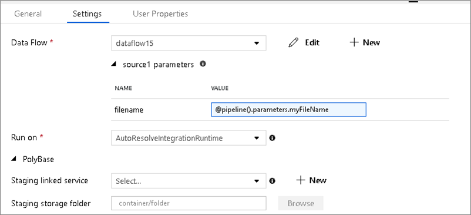

# Execute data flow activity in Azure Data Factory
Use the execute data flow activity to run your ADF data flow in pipeline debug (sandbox) runs and in pipeline triggered runs.

[!INCLUDE [notes](../../includes/data-factory-data-flow-preview.md)]

## Syntax

```json
{
    "name": "MyDataFlowActivity",
    "type": "ExecuteDataFlow",
    "typeProperties": {
      "dataflow": {
         "referenceName": "dataflow1",
         "type": "DataFlowReference"
      },
        "compute": {
          "computeType": "General",
          "coreCount": 8,
      }
}

```

## Type properties

* ```dataflow``` is the name of the data flow entity that you wish to execute
* ```compute``` describes the Spark execution environment
* ```coreCount``` is the number of cores to assign to this activity execution of your data flow


### Run on

Choose the compute environment for this execution of your data flow. The default is the Azure Auto-Resolve Default Integration Runtime. This choice will execute the data flow on the Spark environment in the same region as your data factory. The compute type will be a job cluster, which means the compute environment will take several minutes to start-up.

### Debugging pipelines with data flows


Use the Data Flow Debug to utilize a warmed cluster for testing your data flows interactively in a pipeline debug run. Use the Pipeline Debug option to test your data flows inside a pipeline.

### Run on

This is a required field that defines which Integration Runtime to use for your Data Flow activity execution. By default, Data Factory will use the default auto-resolve Azure Integration runtime. However, you can create your own Azure Integration Runtimes that define specific regions, compute type, core counts, and TTL for your data flow activity execution.

The default setting for Data Flow executions is 8 cores of general compute with a TTL of 60 minutes.

You have control over the Spark execution environment for your Data Flow activities. In the [Azure integration runtime](concepts-integration-runtime.md) are settings to set the compute type (general purpose, memory optimized, and compute optimized), number of worker cores, and time-to-live to match the execution engine with your Data Flow compute requirements. Also, setting TTL will allow you to maintain a warm cluster that is immediately available for job executions.


> [!NOTE]
> The Integration Runtime selection in the Data Flow activity only applies to *triggered executions* of your pipeline. Debugging your pipeline with Data Flows with Debug will execute against the 8-core default Spark cluster.

### Staging area

If you are sinking your data into Azure Data Warehouse, you must choose a staging location for your Polybase batch load.

## Parameterized datasets

If you are using parameterized datasets, be sure to set the parameter values.



### Debugging parameterized data flows

You can only debug data flows with parameterized datasets from the Pipeline Debug run using the execute data flow activity. Currently, interactive debug sessions in ADF Data Flow do not work with parameterized data sets. Pipeline executions and debug runs will work with parameters.

A good practice is to build your data flow with a static dataset so that you have full metadata column propagation available at design-time. Then replace the static dataset with a dynamic parameterized dataset when you operationalize your data flow pipeline.

## Next steps
See other control flow activities supported by Data Factory: 

- [If Condition Activity](control-flow-if-condition-activity.md)
- [Execute Pipeline Activity](control-flow-execute-pipeline-activity.md)
- [For Each Activity](control-flow-for-each-activity.md)
- [Get Metadata Activity](control-flow-get-metadata-activity.md)
- [Lookup Activity](control-flow-lookup-activity.md)
- [Web Activity](control-flow-web-activity.md)
- [Until Activity](control-flow-until-activity.md)
