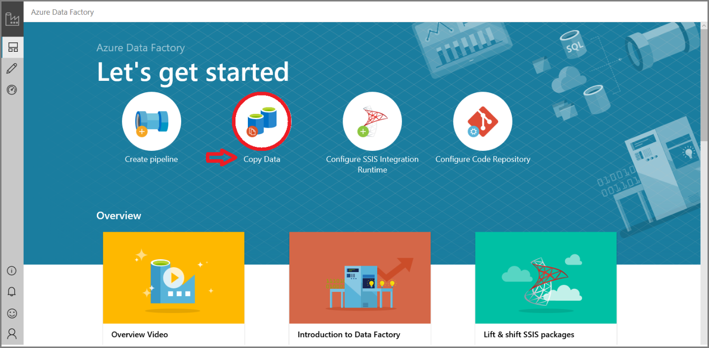

# Copy Data tool in Azure Data Factory
The Azure Data Factory Copy Data tool eases and optimizes the process of ingesting data into a data lake, which is usually a first step in an end-to-end data integration scenario.  It saves time, especially when you use Azure Data Factory to ingest data from a data source for the first time. Some of the benefits of using this tool are:

- When using the the Azure Data Factory Copy Data tool, you do not need understand Data Factory definitions for linked services, datasets, pipelines, activities, and triggers. 
- The flow of Copy Data tool is intuitive for loading data into a data lake. The tool automatically creates all the necessary Data Factory resources to copy data from the selected source data store to the selected destination/sink data store. 
- The Copy Data tool helps you validate the data that is being ingested at the time of authoring, which helps you avoid any potential errors at the beginning itself.
- If you need to implement complex business logic to load data into a data lake, you can still edit the Data Factory resources created by the Copy Data tool by using the per-activity authoring in Data Factory UI. 

The following table provides guidance on when to use the Copy Data tool vs. per-activity authoring in Data Factory UI: 

| Copy Data tool | Per activity (Copy activity) authoring |
| -------------- | -------------------------------------- |
| You want to easily build a data loading task without learning about Azure Data Factory entities (linked services, datasets, pipelines, etc.) | You want to implement complex and flexible logic for loading data into lake. |
| You want to quickly load a large number of data artifacts into a data lake. | You want to chain Copy activity with subsequent activities for cleansing or processing data. |

To start the Copy Data tool, click the **Copy Data** tile on the home page of your data factory.

## Next steps

Advance to the following article to learn about Azure Data Lake Store support: 

> [!div class="nextstepaction"]
>[Azure Data Lake Store connector](connector-azure-data-lake-store.md)