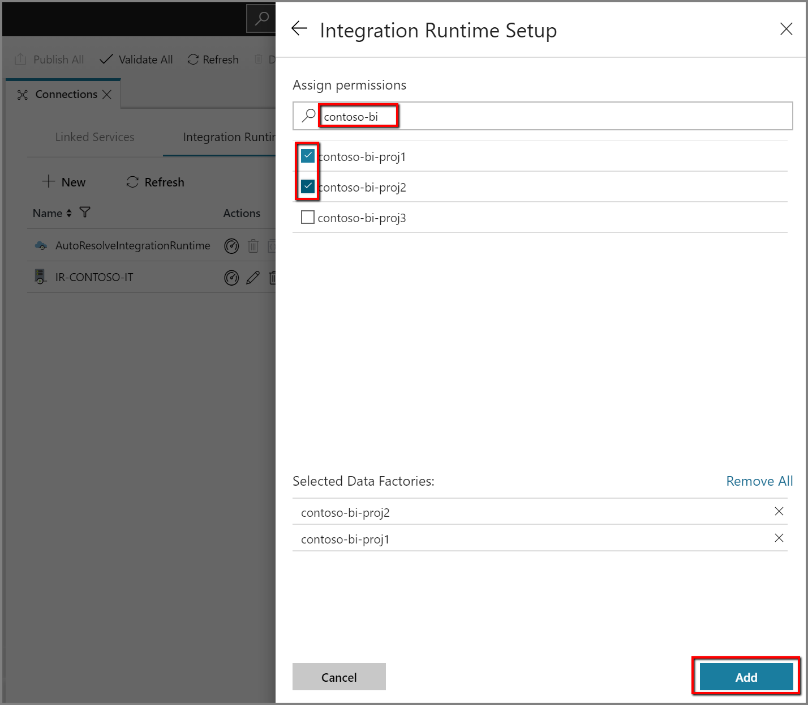
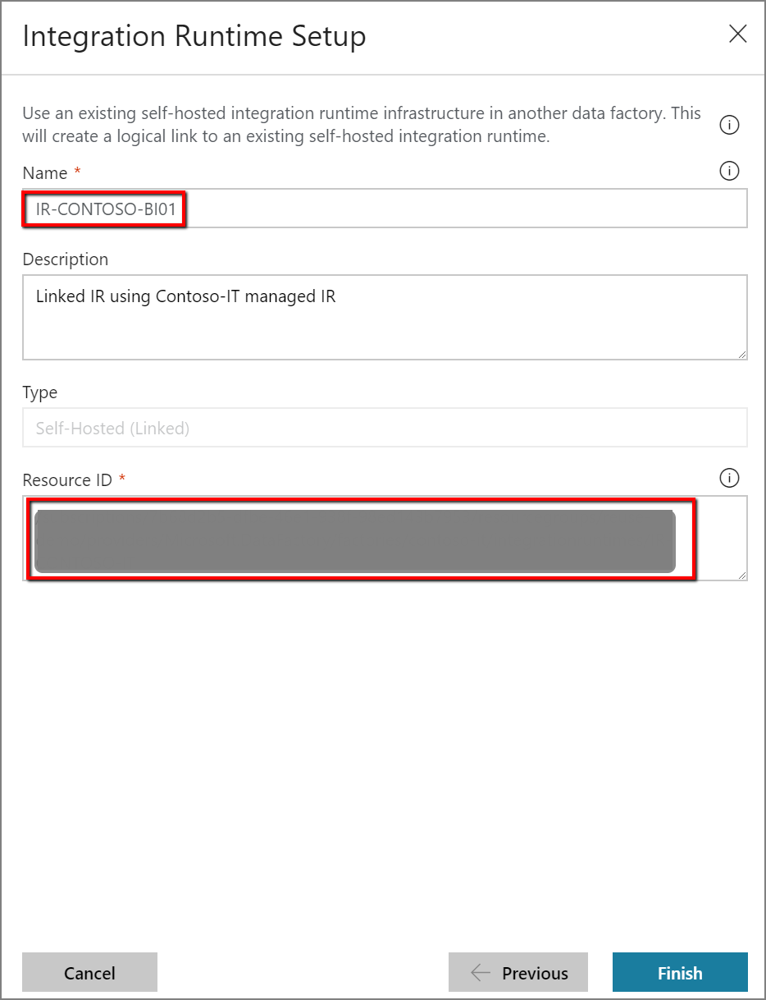

# Create a shared self-hosted integration runtime in Azure Data Factory

[!INCLUDE[appliesto-adf-xxx-md](includes/appliesto-adf-xxx-md.md)]

This guide shows you how to create a shared self-hosted integration runtime in Azure Data Factory. Then you can use the shared self-hosted integration runtime in another data factory.

## Create a shared self-hosted IR using Azure Data Factory UI

To create a shared self-hosted IR using Azure Data Factory UI, you can take following steps:

1. In the self-hosted IR to be shared, grant permission to the data factory in which you want to create the linked IR.
      
    
      
         
    
2. Note the resource ID of the self-hosted IR to be shared.
      
   
    
3. In the data factory to which the permissions were granted, create a new self-hosted IR (linked) and enter the resource ID.
      
   
      
    

## Create a shared self-hosted IR using Azure PowerShell

To create a shared self-hosted IR using Azure PowerShell, you can take following steps: 
1. Create a data factory. 
1. Create a self-hosted integration runtime.
1. Share the self-hosted integration runtime with other data factories.
1. Create a linked integration runtime.
1. Revoke the sharing.

### Prerequisites 

[!INCLUDE [updated-for-az](../../includes/updated-for-az.md)]

- **Azure subscription**. If you don't have an Azure subscription, [create a free account](https://azure.microsoft.com/free/) before you begin. 

- **Azure PowerShell**. Follow the instructions in [Install Azure PowerShell on Windows with PowerShellGet](https://docs.microsoft.com/powershell/azure/install-az-ps). You use PowerShell to run a script to create a self-hosted integration runtime that can be shared with other data factories. 

> [!NOTE]  
> For a list of Azure regions in which Data Factory is currently available, select the regions that interest you on  [Products available by region](https://azure.microsoft.com/global-infrastructure/services/?products=data-factory).

### Create a data factory

1. Launch the Windows PowerShell Integrated Scripting Environment (ISE).

1. Create variables. Copy and paste the following script. Replace the variables, such as **SubscriptionName** and **ResourceGroupName**, with actual values: 

    ```powershell
    # If input contains a PSH special character, e.g. "$", precede it with the escape character "`" like "`$". 
    $SubscriptionName = "[Azure subscription name]" 
    $ResourceGroupName = "[Azure resource group name]" 
    $DataFactoryLocation = "EastUS" 

    # Shared Self-hosted integration runtime information. This is a Data Factory compute resource for running any activities 
    # Data factory name. Must be globally unique 
    $SharedDataFactoryName = "[Shared Data factory name]" 
    $SharedIntegrationRuntimeName = "[Shared Integration Runtime Name]" 
    $SharedIntegrationRuntimeDescription = "[Description for Shared Integration Runtime]"

    # Linked integration runtime information. This is a Data Factory compute resource for running any activities
    # Data factory name. Must be globally unique
    $LinkedDataFactoryName = "[Linked Data factory name]"
    $LinkedIntegrationRuntimeName = "[Linked Integration Runtime Name]"
    $LinkedIntegrationRuntimeDescription = "[Description for Linked Integration Runtime]"
    ```

1. Sign in and select a subscription. Add the following code to the script to sign in and select your Azure subscription:

    ```powershell
    Connect-AzAccount
    Select-AzSubscription -SubscriptionName $SubscriptionName
    ```

1. Create a resource group and a data factory.

    > [!NOTE]  
    > This step is optional. If you already have a data factory, skip this step. 

    Create an [Azure resource group](../azure-resource-manager/resource-group-overview.md) by using the [New-AzResourceGroup](https://docs.microsoft.com/powershell/module/az.resources/new-azresourcegroup) command. A resource group is a logical container into which Azure resources are deployed and managed as a group. The following example creates a resource group named `myResourceGroup` in the WestEurope location: 

    ```powershell
    New-AzResourceGroup -Location $DataFactoryLocation -Name $ResourceGroupName
    ```

    Run the following command to create a data factory: 

    ```powershell
    Set-AzDataFactoryV2 -ResourceGroupName $ResourceGroupName `
                             -Location $DataFactoryLocation `
                             -Name $SharedDataFactoryName
    ```

### Create a self-hosted integration runtime

> [!NOTE]  
> This step is optional. If you already have the self-hosted integration runtime that you want to share with other data factories, skip this step.

Run the following command to create a self-hosted integration runtime:

```powershell
$SharedIR = Set-AzDataFactoryV2IntegrationRuntime `
    -ResourceGroupName $ResourceGroupName `
    -DataFactoryName $SharedDataFactoryName `
    -Name $SharedIntegrationRuntimeName `
    -Type SelfHosted `
    -Description $SharedIntegrationRuntimeDescription
```

#### Get the integration runtime authentication key and register a node

Run the following command to get the authentication key for the self-hosted integration runtime:

```powershell
Get-AzDataFactoryV2IntegrationRuntimeKey `
    -ResourceGroupName $ResourceGroupName `
    -DataFactoryName $SharedDataFactoryName `
    -Name $SharedIntegrationRuntimeName
```

The response contains the authentication key for this self-hosted integration runtime. You use this key when you register the integration runtime node.

#### Install and register the self-hosted integration runtime

1. Download the self-hosted integration runtime installer from [Azure Data Factory Integration Runtime](https://aka.ms/dmg).

2. Run the installer to install the self-hosted integration on a local computer.

3. Register the new self-hosted integration with the authentication key that you retrieved in a previous step.

### Share the self-hosted integration runtime with another data factory

#### Create another data factory

> [!NOTE]  
> This step is optional. If you already have the data factory that you want to share with, skip this step.

```powershell
$factory = Set-AzDataFactoryV2 -ResourceGroupName $ResourceGroupName `
    -Location $DataFactoryLocation `
    -Name $LinkedDataFactoryName
```
#### Grant permission

Grant permission to the data factory that needs to access the self-hosted integration runtime you created and registered.

> [!IMPORTANT]  
> Do not skip this step!

```powershell
New-AzRoleAssignment `
    -ObjectId $factory.Identity.PrincipalId ` #MSI of the Data Factory with which it needs to be shared
    -RoleDefinitionId 'b24988ac-6180-42a0-ab88-20f7382dd24c' ` #This is the Contributor role
    -Scope $SharedIR.Id
```

### Create a linked self-hosted integration runtime

Run the following command to create a linked self-hosted integration runtime:

```powershell
Set-AzDataFactoryV2IntegrationRuntime `
    -ResourceGroupName $ResourceGroupName `
    -DataFactoryName $LinkedDataFactoryName `
    -Name $LinkedIntegrationRuntimeName `
    -Type SelfHosted `
    -SharedIntegrationRuntimeResourceId $SharedIR.Id `
    -Description $LinkedIntegrationRuntimeDescription
```

Now you can use this linked integration runtime in any linked service. The linked integration runtime uses the shared integration runtime to run activities.

### Revoke integration runtime sharing from a data factory

To revoke the access of a data factory from the shared integration runtime, run the following command:

```powershell
Remove-AzRoleAssignment `
    -ObjectId $factory.Identity.PrincipalId `
    -RoleDefinitionId 'b24988ac-6180-42a0-ab88-20f7382dd24c' `
    -Scope $SharedIR.Id
```

To remove the existing linked integration runtime, run the following command against the shared integration runtime:

```powershell
Remove-AzDataFactoryV2IntegrationRuntime `
    -ResourceGroupName $ResourceGroupName `
    -DataFactoryName $SharedDataFactoryName `
    -Name $SharedIntegrationRuntimeName `
    -Links `
    -LinkedDataFactoryName $LinkedDataFactoryName
```

### Next steps

- Review [integration runtime concepts in Azure Data Factory](https://docs.microsoft.com/azure/data-factory/concepts-integration-runtime).

- Learn how to [create a self-hosted integration runtime in the Azure portal](https://docs.microsoft.com/azure/data-factory/create-self-hosted-integration-runtime).
