# Data Management Gateway - high availability and scalability (Preview)
This article helps you configure high availability and scalability solution with Data Management Gateway.    

> [!NOTE]
> This article assumes that you are already familiar with basics of Data Management Gateway. If you are not, see [Data Management Gateway](data-factory-data-management-gateway.md).  

## Overview
You can associate data management gateways that are installed on multiple on-premises machines with a single logical gateway from the portal. These machines are called **nodes**. You can have up to **four nodes** associated with a logical gateway. The benefits of having multiple nodes (on-premises machines with gateway installed) for a logical gateway are:  

- Improve performance of data movement between on-premises and cloud data stores.  
- If one of the nodes goes down for some reason, other nodes are still available for moving the data. 
- If one of the nodes need to be taken offline for maintenance, other nodes are still available for moving the data.

You can also configure the number of **concurrent data movement jobs** that can run on a node to scale up the capability of moving data between on-premises and cloud data stores. 

Using the Azure portal, you can monitor the status of these nodes, which helps you decide whether to add or remove a node from the logical gateway. 

## Architecture 
The following diagram provides the architecture overview of scalability and availability feature of the Data Management Gateway: 

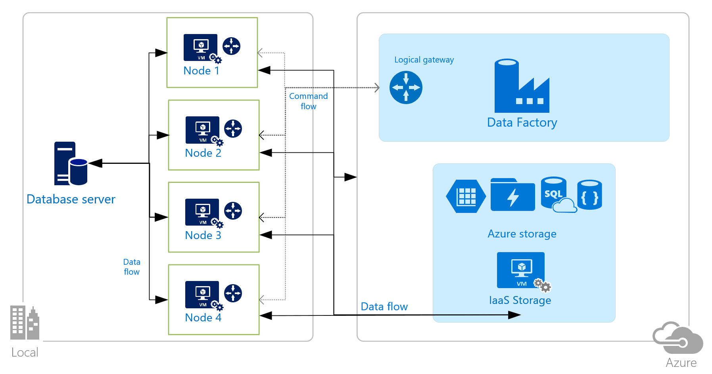

A **logical gateway** is the gateway you add to a data factory in the Azure portal. Earlier, you could associate only one on-premises Windows machine with Data Management Gateway installed with a logical gateway. This on-premises gateway machine is called a node. Now, you can associate up to **four physical nodes** with a logical gateway. A logical gateway with multiple nodes is called a **multi-node gateway**.  

All these nodes are **active**. They all can process data movement jobs to move data between on-premises and cloud data stores. One of the nodes act as both dispatcher and worker. Other nodes in the groups are worker nodes. A **dispatcher** node pulls data movement tasks/jobs from the cloud service and dispatches them to worker nodes (including itself). A **worker** node executes data movement jobs to move data between on-premises and cloud data stores. All nodes are workers. Only one node can be both dispatch and worker.    

You may typically start with one node and **scale out** to add more nodes as the existing node(s) are overwhelmed with the data movement load. You can also **scale up** the data movement capability of a gateway node by increasing the number of concurrent jobs that are allowed to run on the node. This capability is also available with a single-node gateway (even when the scalability and availability feature is not enabled). 

A gateway with multiple nodes keeps the data store credentials in sync across all nodes. If there is a node-to-node connectivity issue, the credentials may be out of sync. When you set credentials for an on-premises data store that uses a gateway, it saves credentials on the dispatcher/worker node. The dispatcher node syncs with other worker nodes. This process is known as **credentials sync**. The communication channel between nodes can be **encrypted** by a public SSL/TLS certificate. 

## Set up a multi-node gateway
This section assumes that you have gone through the following two articles or familiar with concepts in these articles: 

- [Data Management Gateway](data-factory-data-management-gateway.md) - provides a detailed overview of the gateway.
- [Move data between on-premises and cloud data stores](data-factory-move-data-between-onprem-and-cloud.md) - contains a walkthrough with step-by-step instructions for using a gateway with a single node.  

> [!NOTE]
> Before you install a data management gateway on an on-premises Windows machine, see prerequisites listed in [the main article](data-factory-data-management-gateway.md#prerequisites).

1. In the [walkthrough](data-factory-move-data-between-onprem-and-cloud.md#create-gateway), while creating a logical gateway, enable the **High Availability & Scalability** feature. 

	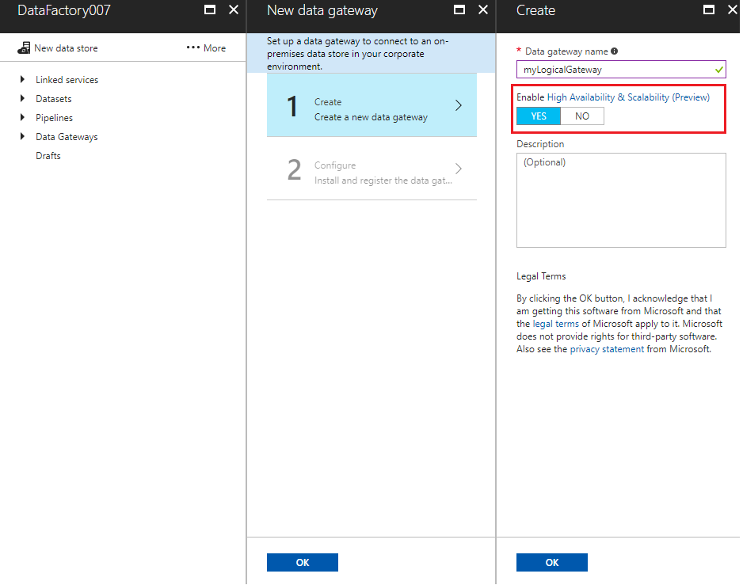
2. In the **Configure** page, use either **Express Setup** or **Manual Setup** link to install a gateway on the first node (an on-premises Windows machine).

	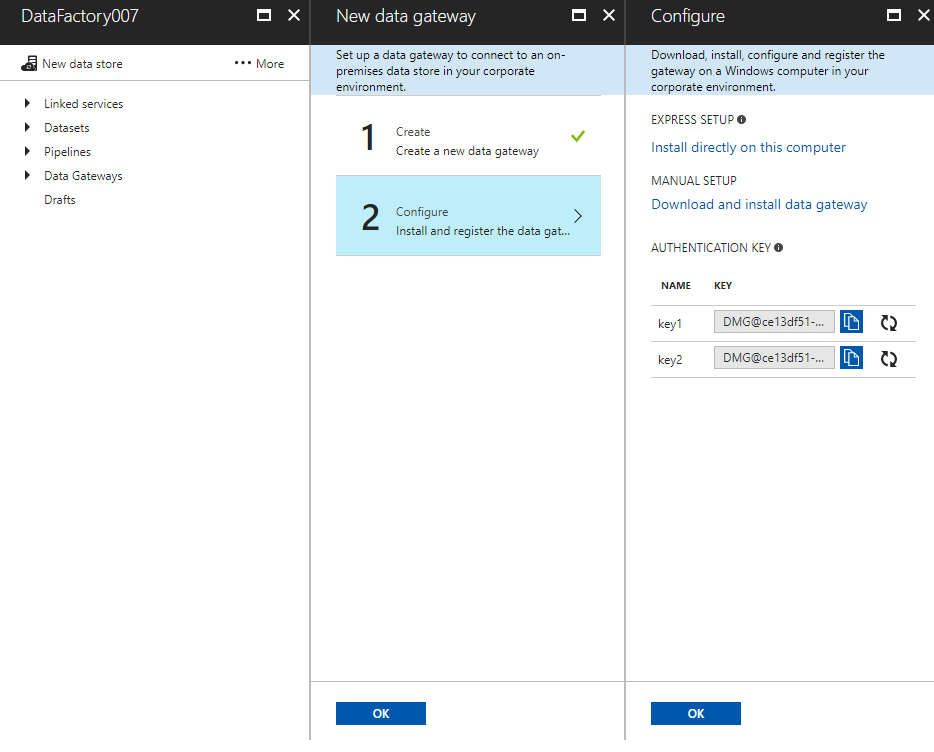

	> [!NOTE]
	> If you use the express setup option, the node-to-node communication is done without encryption. The node name is same as the machine name. Use manual setup if the node-node communication needs to be encrypted or you want to specify a node name of your choice. Node names cannot be edited later.
3. If you choose **express setup**
	1. You see the following message after the gateway is successfully installed:

		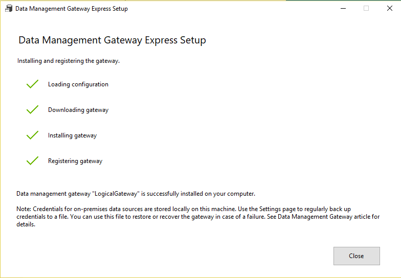
	2. Launch Data Management Configuration Manager for the gateway by following [these instructions](data-factory-data-management-gateway.md#configuration-manager). You see the gateway name, node name, status, etc.

		
4. If you choose **manual setup**:
	1. Download the installation package from the Microsoft Download Center, run it to install gateway on your machine.
	2. Use the **authentication key** from the **Configure** page to register the gateway.
	
		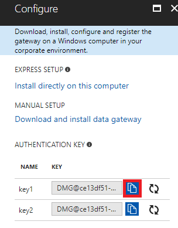
	3. In the **New gateway node** page, you can provide a custom **name** to the gateway node. By default, node name is same as the machine name.    

		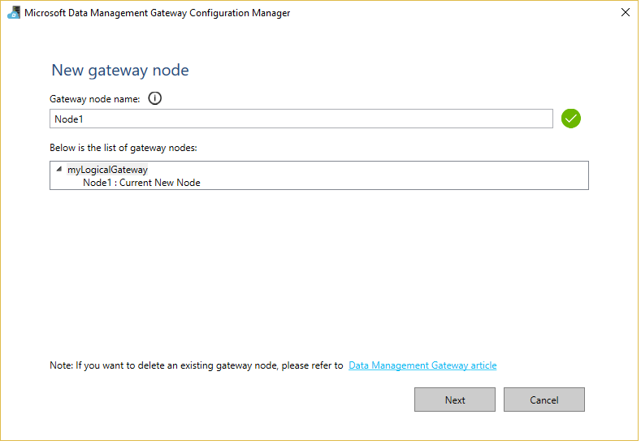
	4. In the next page, you can choose whether to **enable encryption for node-to-node communication**. Click **Skip** to disable encryption (default).

		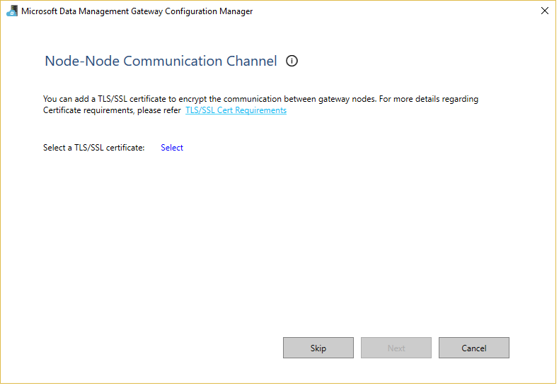  
	
		> [!NOTE]
		> Changing of encryption mode is only supported when you have a single gateway node in the logical gateway. To change the encryption mode when a gateway has multiple nodes, do the following steps: delete all the nodes except one node, change the encryption mode, and then add the nodes again.
		> 
		> See [TLS/SSL certificate requirements](#tlsssl-certificate-requirements) section for a list of requirements for using an TLS/SSL certificate. 
	5. After the gateway is successfully installed, click Launch Configuration Manager:
	
		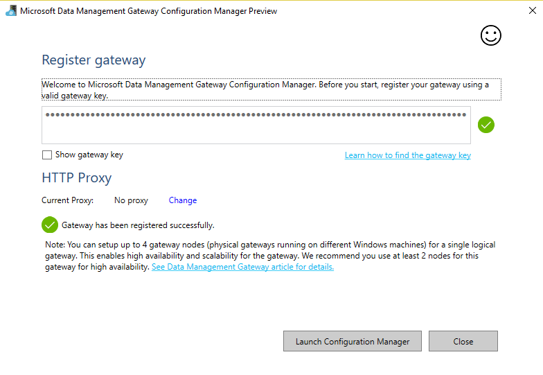	 
	6. you see Data Management Gateway Configuration Manager on the node (on-premises Windows machine), which shows connectivity status, **gateway name**, and **node name**.  

		

		> [!NOTE]
		> If you are provisioning the gateway on an Azure VM, you can use [this Azure Resource Manager template on GitHub](https://github.com/xiaoyingLJ/vms-with-multiple-data-management-gateway). This script creates a logical gateway, sets up VMs with Data Management Gateway software installed, and registers them with the logical gateway. 
6. In Azure portal, launch the **Gateway** page: 
	1. On the data factory home page in the portal, click **Linked Services**.
	
		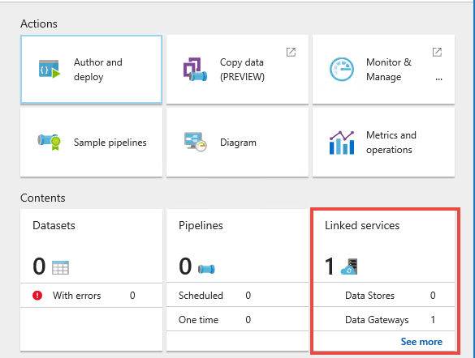
	2. select the **gateway** to see the **Gateway** page:
	
		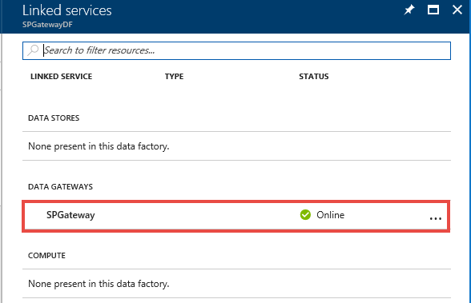
	4. You see the **Gateway** page:   

    	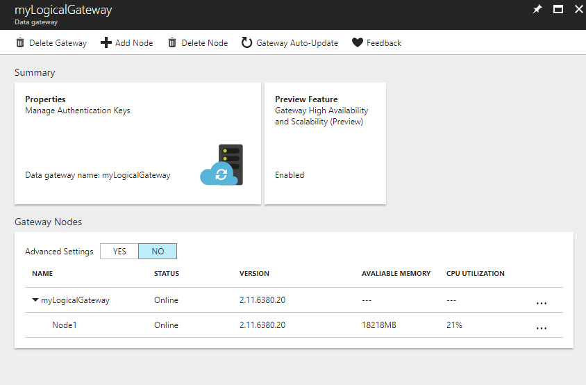 
7. Click **Add Node** on the toolbar to add a node to the logical gateway. If you are planning to use express setup, do this step from the on-premises machine that will be added as a node to the gateway. 

	
8. Steps are similar to setting up the first node. The Configuration Manager UI lets you set the node name if you choose the manual installation option: 

    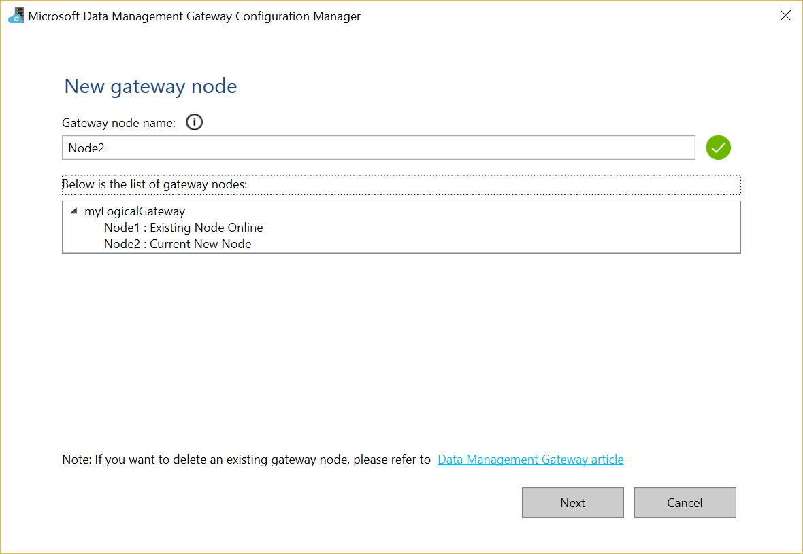
9. After the gateway is installed successfully on the node, the Configuration Manager tool displays the following screen:  

    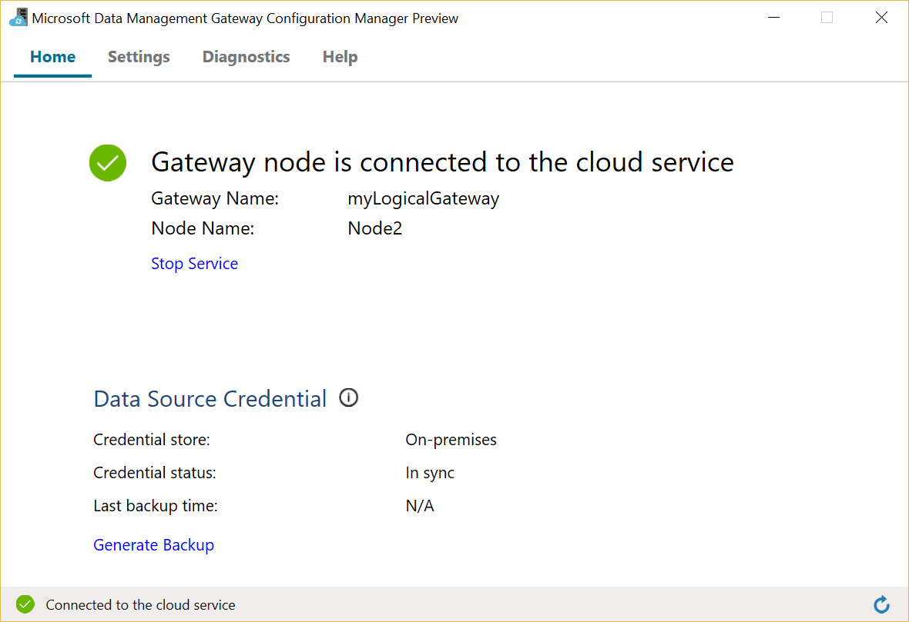
10. If you open the **Gateway** page in the portal, you see two gateway nodes now: 

    
11. To delete a gateway node, click **Delete Node** on the toolbar, select the node you want to delete, and then click **Delete** from the toolbar. This action deletes the selected node from the group. Note that this action does not uninstall the data management gateway software from the node (on-premises Windows machine). Use **Add or remove programs** in Control Panel on the on-premises to uninstall the gateway. When you uninstall gateway from the node, it's automatically deleted in the portal.   

## Upgrade an existing gateway
You can upgrade an existing gateway to use the high availability and scalability feature. This feature works only with nodes that have the data management gateway of version >= 2.9.xxxx. You can see the version of data management gateway installed on a machine in the **Help** tab of the Data Management Gateway Configuration Manager. 

1. Update the gateway on the on-premises machine to the latest version by following by downloading and running an MSI setup package from the [Microsoft Download Center](https://www.microsoft.com/download/details.aspx?id=39717). See [installation](data-factory-data-management-gateway.md#installation) section for details.  
2. Navigate to the Azure portal. Launch the **Data Factory page** for your data factory. Click Linked services tile to launch the **linked services page**. Select the gateway to launch the **gateway page**. Click and enable **Preview Feature** as shown in the following image: 

	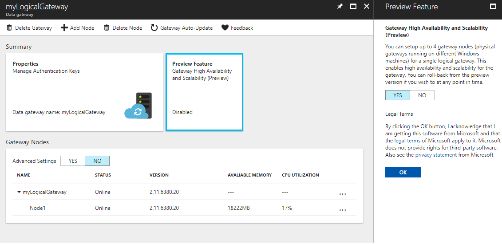   
2. Once the preview feature is enabled in the portal, close all pages. Reopen the **gateway page** to see the new preview user interface (UI).
 
	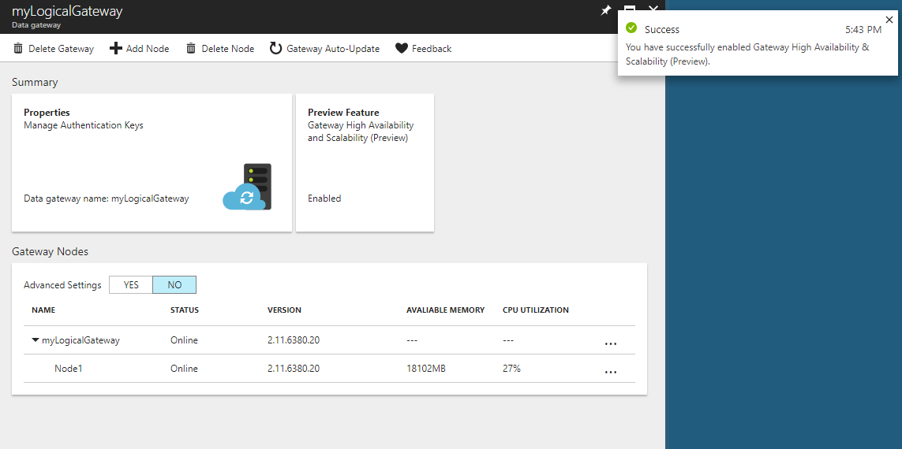

	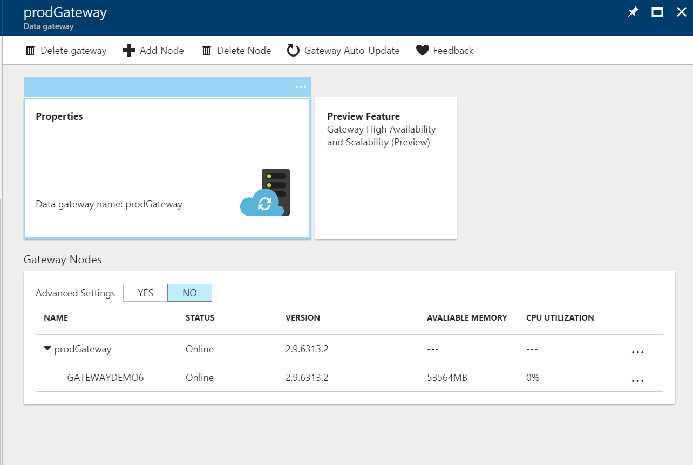

	> [!NOTE]
	> During the upgrade, name of the first node is the name of the machine. 
3. Now, add a node. In the **Gateway** page, click **Add Node**.  

	

	Follow instructions from the previous section to set up the node. 

### Installation best practices

- Configure power plan on the host machine for the gateway so that the machine does not hibernate. If the host machine hibernates, the gateway does not respond to data requests.
- Back up the certificate associated with the gateway.
- Ensure all nodes are of similar configuration (recommended) for ideal performance. 
- Add at least two nodes to ensure high availability.  

### TLS/SSL certificate requirements
Here are the requirements for the TLS/SSL certificate that is used for securing communications between gateway nodes:

- The certificate must be a publicly trusted X509 v3 certificate.
- All gateway nodes must trust this certificate. 
- We recommend that you use certificates that are issued by a public (third-party) certification authority (CA).
- Supports any key size supported by Windows Server 2012 R2 for SSL certificates.
- Does not support certificates that use CNG keys.
- Wild-card certificates are supported. 

## Monitor a multi-node gateway
### Multi-node gateway monitoring
In the Azure portal, you can view near-real time snapshot of resource utilization (CPU, memory, network(in/out), etc.) on each node along with statuses of gateway nodes. 

You can enable **Advanced Settings** in the **Gateway** page to see advanced metrics like **Network**(in/out), **Role & Credential Status**, which is helpful in debugging gateway issues, and **Concurrent Jobs** (Running/ Limit) which can be modified/ changed accordingly during performance tuning. The following table provides descriptions of columns in the **Gateway Nodes** list:  

Monitoring Property | Description
:------------------ | :---------- 
Name | Name of the logical gateway and nodes associated with the gateway.  
Status | Status of the logical gateway and the gateway nodes. Example: Online/Offline/Limited/etc. For information about these statuses, See [Gateway status](#gateway-status) section. 
Version | Shows the version of the logical gateway and each gateway node. The version of the logical gateway is determined based on version of majority of nodes in the group. If there are nodes with different versions in the logical gateway setup, only the nodes with the same version number as the logical gateway function properly. Others are in the limited mode and need to be manually updated (only in case auto-update fails). 
Available memory | Available memory on a gateway node. This value is a near real-time snapshot. 
CPU utilization | CPU utilization of a gateway node. This value is a near real-time snapshot. 
Networking (In/Out) | Network utilization of a gateway node. This value is a near real-time snapshot. 
Concurrent Jobs (Running/ Limit) | Number of jobs or tasks running on each node. This value is a near real-time snapshot. Limit signifies the maximum concurrent jobs for each node. This value is defined based on the machine size. You can increase the limit to scale up concurrent job execution in advanced scenarios, where CPU/ memory/ network is under-utilized, but activities are timing out. This capability is also available with a single-node gateway (even when the scalability and availability feature is not enabled). For more information, see [scale considerations](#scale-considerations) section. 
Role | There are two types of roles – Dispatcher and worker. All nodes are workers, which means they can all be used to execute jobs. There is only one dispatcher node, which is used to pull tasks/jobs from cloud services and dispatch them to different worker nodes (including itself). 

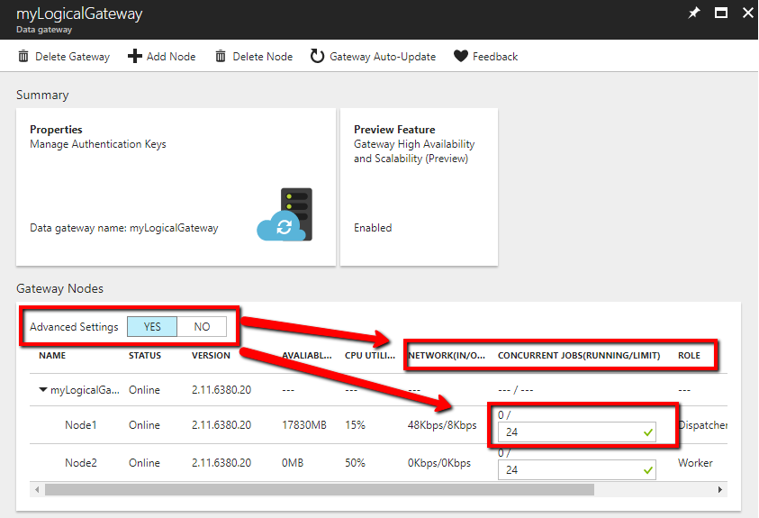

### Gateway status

The following table provides possible statuses of a **gateway node**: 

Status	| Comments/Scenarios
:------- | :------------------
Online | Node connected to Data Factory service.
Offline | Node is offline.
Upgrading | The node is being auto-updated.
Limited | Due to Connectivity issue. May be due to HTTP port 8050 issue, service bus connectivity issue, or credential sync issue. 
Inactive | Node is in a configuration different from the configuration of other majority nodes.   A node can be inactive when it cannot connect to other nodes. 

The following table provides possible statuses of a **logical gateway**. The gateway status depends on statuses of the gateway nodes. 

Status | Comments
:----- | :-------
Needs Registration | No node is yet registered to this logical gateway
Online | Gateway Nodes are online
Offline | No node in online status.
Limited | Not all nodes in this gateway are in healthy state. This status is a warning that some node might be down!   Could be due to credential sync issue on dispatcher/worker node. 

### Pipeline/ activities monitoring
The Azure portal provides a pipeline monitoring experience with granular node level details. For example, it shows which activities ran on which node. This information can be helpful in understanding performance issues on a particular node, say due to network throttling. 

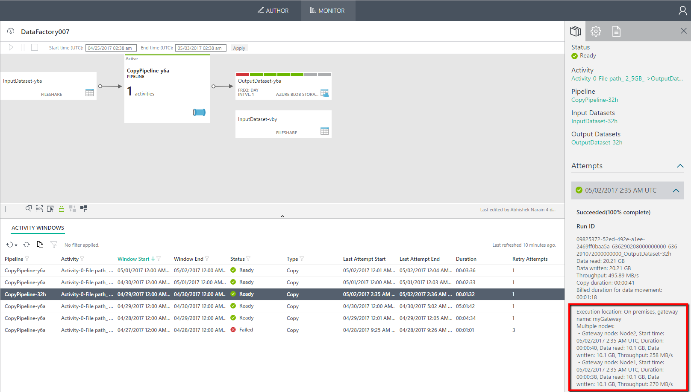

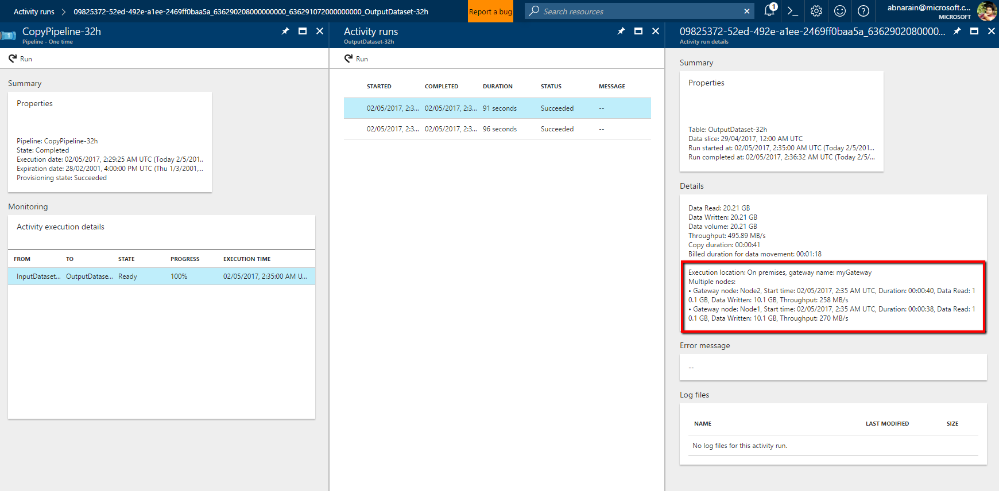

## Scale considerations

### Scale out
When the **available memory is low** and the **CPU usage is high**, adding a new node helps scale out the load across machines. If activities are failing due to time-out or gateway node being offline, it helps if you add a node to the gateway.
 
### Scale up
When the available memory and CPU are not utilized well, but the idle capacity is 0, you should scale up by increasing the number of concurrent jobs that can run on a node. You may also want to scale up when activities are timing out because the gateway is overloaded. As shown in the following image, you can increase the maximum capacity for a node. We suggest doubling it to start with.  

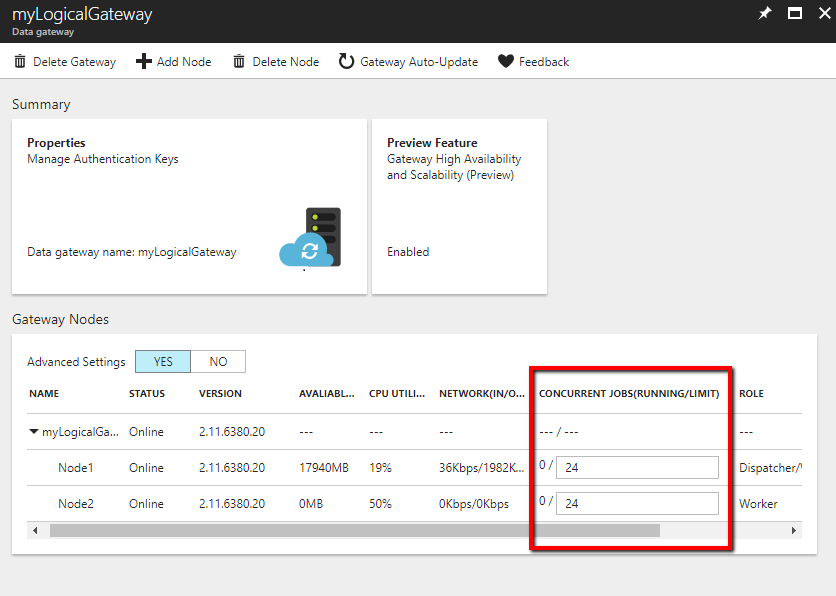

## Known issues/breaking changes

- Currently, you can have up to four physical gateway nodes for a single logical gateway. If you need more than four nodes for performance reasons, send an email to [DMGHelp@microsoft.com](mailto:DMGHelp@microsoft.com).
- You cannot re-register a gateway node with the authentication key from another logical gateway to switch from the current logical gateway. To re-register, uninstall the gateway from the node, reinstall the gateway, and register it with the authentication key for the other logical gateway. 
- If HTTP proxy is required for all your gateway nodes, set the proxy in diahost.exe.config and diawp.exe.config, and use the server manager to make sure all nodes have the same diahost.exe.config and diawip.exe.config. See [configure proxy settings](data-factory-data-management-gateway.md#configure-proxy-server-settings) section for details. 
- To change encryption mode for node-to-node communication in Gateway Configuration Manager, delete all the nodes in the portal except one. Then, add nodes back after changing the encryption mode.
- Use an official SSL certificate if you choose to encrypt the node-to-node communication channel. Self-signed certificate may cause connectivity issues as the same certificate may not be trusted in certifying authority list on other machines. 
- You cannot register a gateway node to a logical gateway when the node version is lower than the logical gateway version. Delete all nodes of the logical gateway from portal so that you can register a lower version node(downgrade) it. If you delete all nodes of a logical gateway, manually install and register new nodes to that logical gateway. Express setup is not supported in this case.
- You cannot use express setup to install nodes to an existing logical gateway, which is still using cloud credentials. You can check where the credentials are stored from the Gateway Configuration Manager on the Settings tab.
- You cannot use express setup to install nodes to an existing logical gateway, which has node-to-node encryption enabled. As setting the encryption mode involves manually adding certificates, express install is no more an option. 
- For a file copy from on-premises environment, you should not use \\localhost or C:\files anymore since localhost or local drive might not be accessible via all nodes. Instead, use \\ServerName\files to specify files’ location.

## Rolling back from the preview 
To roll back from the preview, delete all nodes but one node. It doesn’t matter which nodes you delete, but ensure you have at least one node in the logical gateway. You can delete a node either by uninstalling gateway on the machine or by using the Azure portal. In the Azure portal, in the **Data Factory** page, click Linked services to launch the **Linked services** page. Select the gateway to launch the **Gateway** page. In the Gateway page, you can see the nodes associated with the gateway. The page lets you delete a node from the gateway.
 
After deleting, click **preview features** in the same Azure portal page, and disable the preview feature. You have reset your gateway to one node GA (general availability) gateway.

## Next steps
Review the following articles:
- [Data Management Gateway](data-factory-data-management-gateway.md) - provides a detailed overview of the gateway.
- [Move data between on-premises and cloud data stores](data-factory-move-data-between-onprem-and-cloud.md) - contains a walkthrough with step-by-step instructions for using a gateway with a single node. 