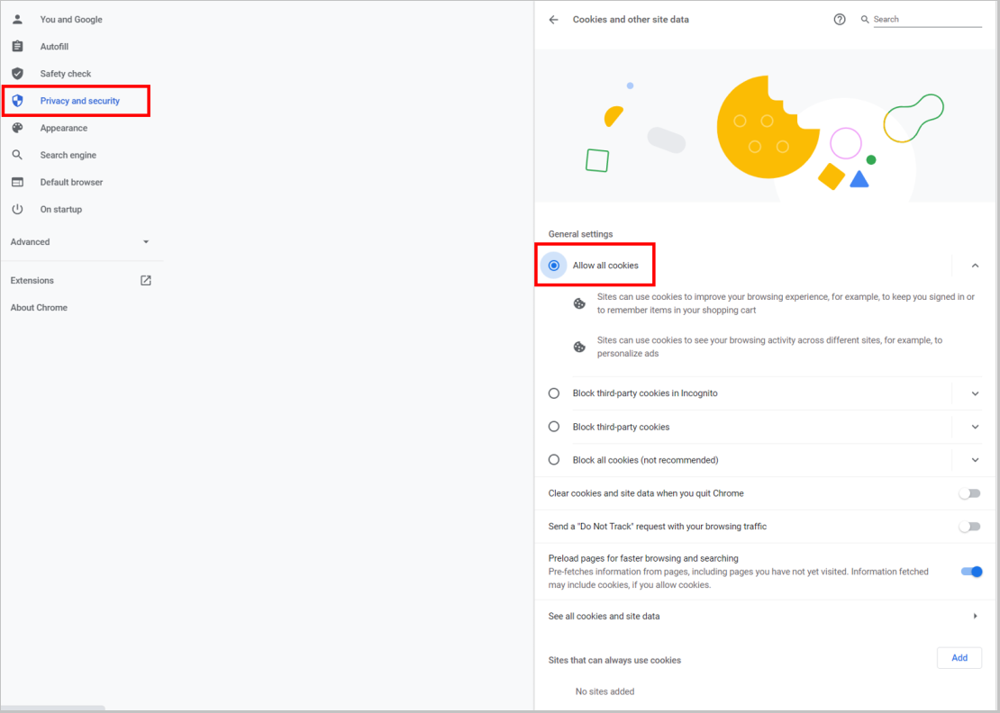
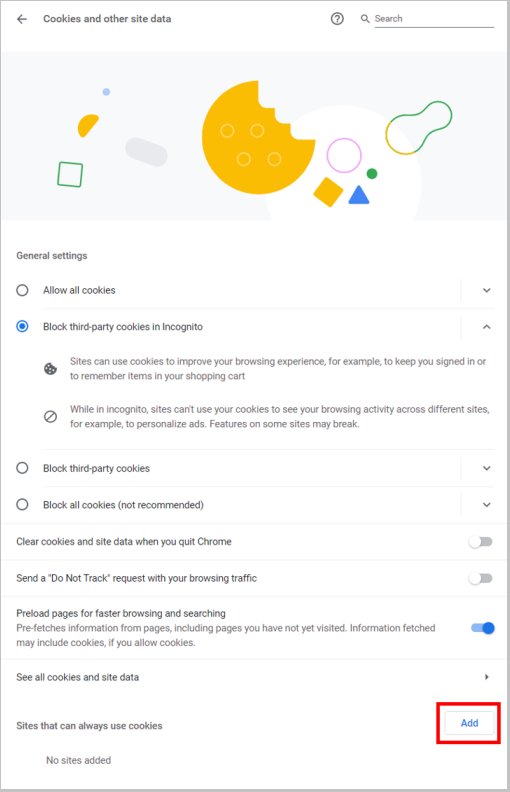
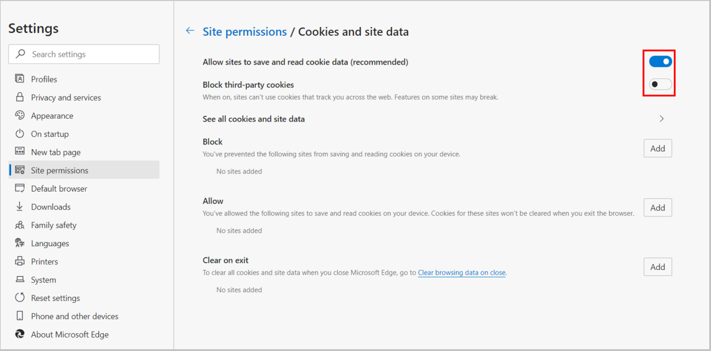
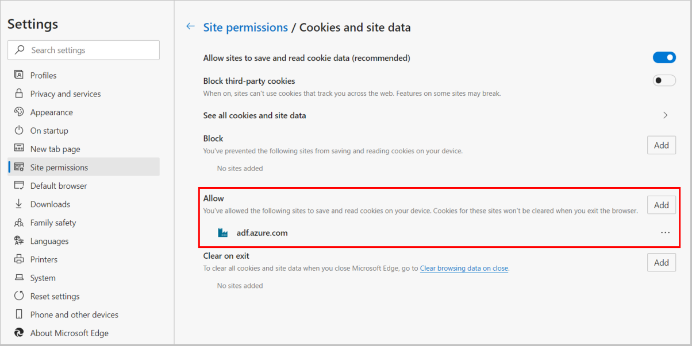
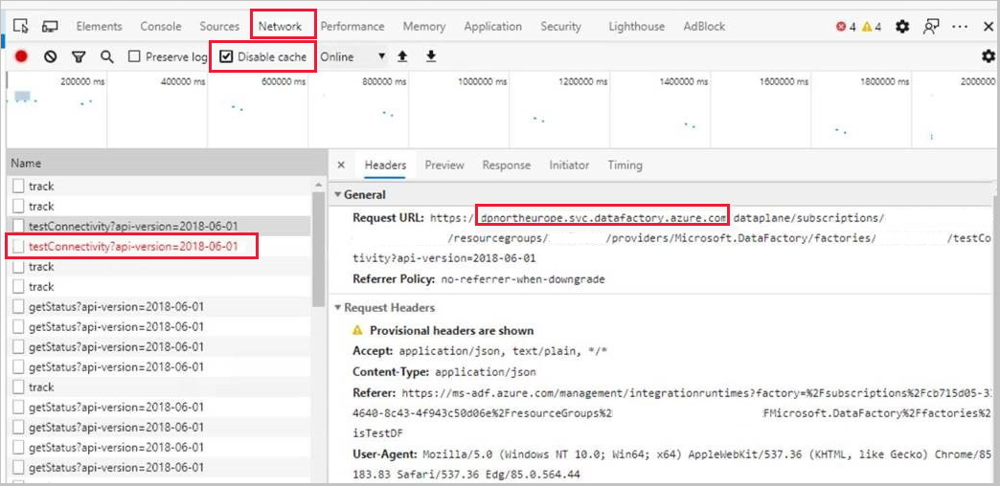
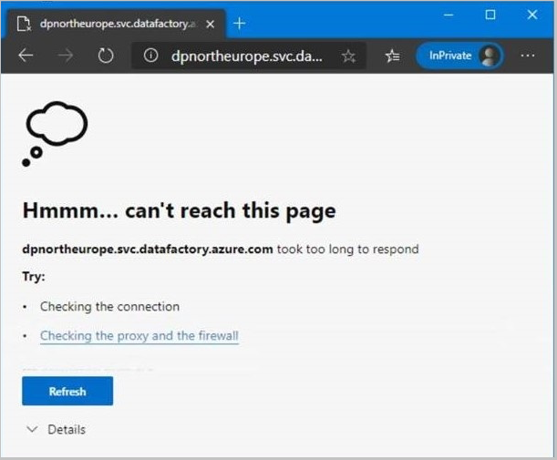
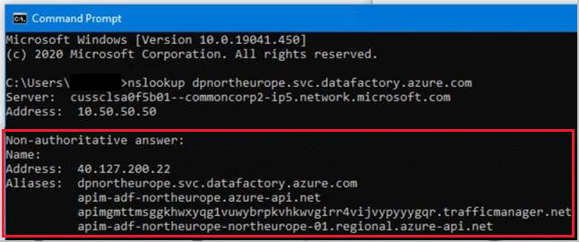
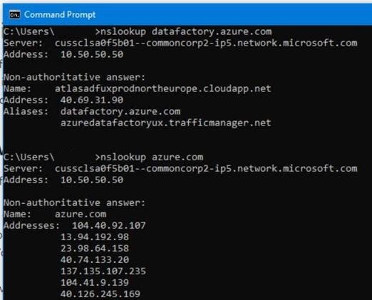

# Troubleshoot Azure Data Factory UX Issues

[!INCLUDE[appliesto-adf-asa-md](includes/appliesto-adf-asa-md.md)]

This article explores common troubleshooting methods for Azure Data Factory UX.

## ADF UX not loading

> [!NOTE]
> The Azure Data Factory UX officially supports Microsoft Edge and Google Chrome. Using other web browsers may lead to unexpected or undocumented behavior.

### Third-party cookies blocked

ADF UX uses browser cookies to persist user session and enable interactive development and monitoring experiences. 
It is possible your browser blocks third-party cookies  because you are using an incognito session or have an ad blocker enabled. Blocking third-party cookies can cause issues when loading the portal, such as being redirected to a blank page, https://adf.azure.com/accesstoken.html, or getting a warning message saying that third-party cookies are blocked. To solve this problem, enable third-party cookies options on your browser using the following steps:

### Google Chrome

#### Allow all cookies

1. Visit **chrome://settings/cookies** in your browser.
1. Select **Allow all cookies** option 

    
1. Refresh ADF UX and try again.

#### Only allow ADF UX to use cookies
If you do not want to allow all cookies, you can optionally just allow ADF UX:
1. Visit **chrome://settings/cookies**.
1. Click **add** under **Sites that can always use cookies** option 

    
1. Add **adf.azure.com** site, check **all cookies** option, and save. 

    
1. Refresh ADF UX and try again.

### Microsoft Edge

1. Visit **edge://settings/content/cookies** in your browser.
1. Ensure **Allow sites to save and read cookie data** is enabled and that **Block third-party cookies** option is disabled 

    
1. Refresh ADF UX and try again.

#### Only allow ADF UX to use cookies

If you do not want to allow all cookies, you can optionally just allow ADF UX:

1. Visit **edge://settings/content/cookies**.
1. Under **Allow** section, click **Add** and add **adf.azure.com** site. 

    
1. Refresh ADF UX and try again.

## Connection failed on ADF UX

Sometimes you would see "Connection failed" errors on ADF UX similar to the screenshot below after clicking **Test Connection**, **Preview**, etc.

In this case, you can first try the same operation with InPrivate browsing mode in your browser.

If it’s still not working, in the browser, press F12 to open **Developer Tools**. Go to the **Network** tab, check **Disable Cache**, retry the failed operation and find the failed request (in red).

Then please find the **host name** (in this case, **dpnortheurope.svc.datafactory.azure.com**) from the **Request URL** of the failed request.

Type the **host name** directly in the address bar of your browser. If you see 404 in the browser, this usually means your client side is OK and the issue is at ADF service side. Please file a support ticket with the **Activity ID** from the ADF UX error message.

If not or you see similar error below in the browser, this usually means you have some client-side issue. Please further follow the troubleshooting steps.

Please open **Command Prompt** and type **nslookup dpnortheurope.svc.datafactory.azure.com**. A normal response should look like below:

If you see a normal DNS response, please further contact your local IT support to check the firewall settings on whether HTTPS connection to this host name is blocked or not. If the issue could not be resolved, please file a support ticket with the **Activity ID** from the ADF UX error message.

If you see anything else than this, this usually means there is something wrong with your DNS server when resolving the DNS name. Usually changing ISP could be a possible workaround to try. If the issue persists, you could further try **nslookup datafactory.azure.com** and **nslookup azure.com** to see at which level your DNS resolution is failed and submit all these information to your local IT support or your ISP for troubleshooting. If they believe the issue is still at Microsoft side, please file a support ticket with the **Activity ID** from the ADF UX error message.

## Next steps

For more troubleshooting help, try these resources:

* [Data Factory blog](https://azure.microsoft.com/blog/tag/azure-data-factory/)
* [Data Factory feature requests](https://feedback.azure.com/forums/270578-data-factory)
* [Stack Overflow forum for Data Factory](https://stackoverflow.com/questions/tagged/azure-data-factory)
* [Twitter information about Data Factory](https://twitter.com/hashtag/DataFactory)
* [Azure videos](https://azure.microsoft.com/resources/videos/index/)
* [Microsoft Q&A question page](https://docs.microsoft.com/answers/topics/azure-data-factory.html)
