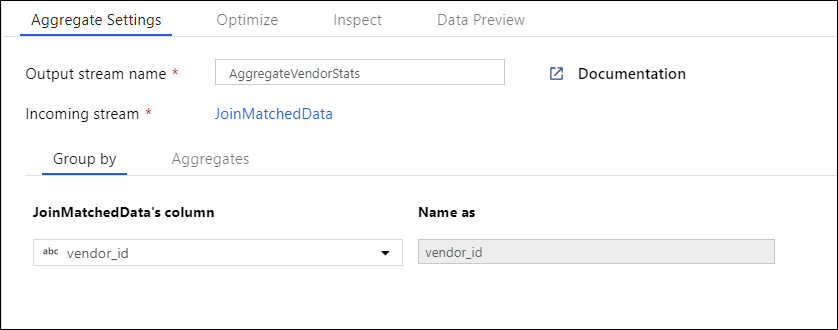
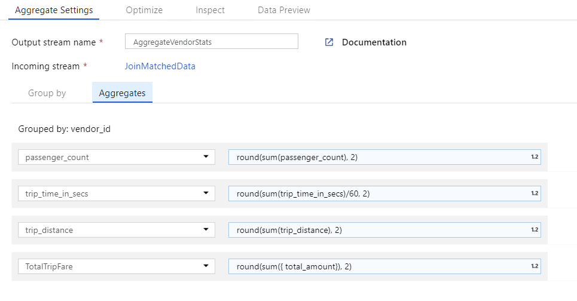
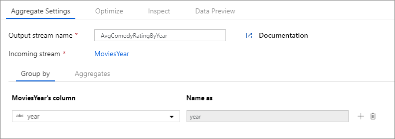

# Aggregate transformation in mapping data flow

[!INCLUDE[appliesto-adf-xxx-md](includes/appliesto-adf-xxx-md.md)]

The Aggregate transformation defines aggregations of columns in your data streams. Using the Expression Builder, you can define different types of aggregations such as SUM, MIN, MAX, and COUNT grouped by existing or computed columns.

## Group by

Select an existing column or create a new computed column to use as a group by clause for your aggregation. To use an existing column, select it from the dropdown. To create a new computed column, hover over the clause and click **Computed column**. This opens the [data flow expression builder](concepts-data-flow-expression-builder.md). Once you create your computed column, enter the output column name under the **Name as** field. If you wish to add an additional group by clause, hover over an existing clause and click the plus icon.



A group by clause is optional in an Aggregate transformation.

## Aggregate column 

Go to the **Aggregates** tab to build aggregation expressions. You can either overwrite an existing column with an aggregation, or create a new field with a new name. The aggregation expression is entered in the right-hand box next to the column name selector. To edit the expression, click on the text box to open up the expression builder. To add additional aggregations, hover over an existing expression and click plus icon to create a new aggregation column or [column pattern](concepts-data-flow-column-pattern.md).

Each aggregation expression must contain at least one aggregate function.




> [!NOTE]
> In Debug mode, the expression builder cannot produce data previews with aggregate functions. To view data previews for aggregate transformations, close the expression builder and view the data via the 'Data Preview' tab.

## Reconnect rows and columns

Aggregate transformations are similar to SQL aggregate select queries. Columns that aren't included in your group by clause or aggregate functions won't flow through to the output of your aggregate transformation. If you wish to include other columns in your aggregated output, do one of the following methods:

* Use an aggregate function such as `last()` or `first()` to include that additional column.
* Rejoin the columns to your output stream using the [self join pattern](https://mssqldude.wordpress.com/2018/12/20/adf-data-flows-self-join/).

## Data flow script

### Syntax

```
<incomingStream>
    aggregate(
           groupBy(
                <groupByColumnName> = <groupByExpression1>,
                <groupByExpression2>
               ),
           <aggregateColumn1> = <aggregateExpression1>,
           <aggregateColumn2> = <aggregateExpression2>,
           each(
                match(matchExpression),
                <metadataColumn1> = <metadataExpression1>,
                <metadataColumn2> = <metadataExpression2>
               )
          ) ~> <aggregateTransformationName>
```

### Example

The below example takes an incoming stream `MoviesYear` and groups rows by column `year`. The transformation creates an aggregate column `avgrating` that evaluates to the average of column `Rating`. This aggregate transformation is named `AvgComedyRatingsByYear`.

In the Data Factory UX, this transformation looks like the below image:




The data flow script for this transformation is in the snippet below.

```
MoviesYear aggregate(
                groupBy(year),
	            avgrating = avg(toInteger(Rating))
            ) ~> AvgComedyRatingByYear
```

## Next steps

* Define window-based aggregation using the [Window transformation](data-flow-window.md)
