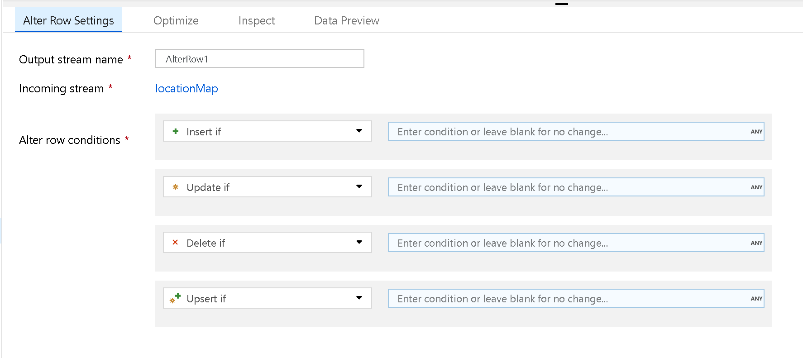

# Alter row transformation in mapping data flow

Use the Alter Row transformation to set insert, delete, update, and upsert policies on rows. You can add one-to-many conditions as expressions. These conditions should be specified in order of priority, as each row will be marked with the policy corresponding to the first-matching expression. Each of those conditions can result in a row (or rows) being inserted, updated, deleted, or upserted. Alter Row can produce both DDL & DML actions against your database.



> [!NOTE]
> Alter Row transformations will only operate on database or CosmosDB sinks in your data flow. The actions that you assign to rows (insert, update, delete, upsert) will not occur during debug sessions. You must add an Execute Data Flow task to a pipeline and use pipeline debug or triggers to enact the alter row policies on your database tables.

## Indicate a default row policy

Create an Alter Row transformation and specify a row policy with a condition of `true()`. Each row that does not meet any of the previously defined expressions will be marked for the specified row policy. By default, each row that does not meet any conditional expression will be marked for `Insert`.


> [!NOTE]
> To mark all rows with one policy, you can create a condition for that policy and specify the condition as `true()`.

## View policies

Turn on Data Flow Debug mode to view the results of your alter row policies in the Data Preview pane. Executing an alter row in Data Flow Debug mode will not produce DDL or DML actions against your target. In order to have those actions occur, execute the data flow inside an Execute Data Flow activity within a pipeline.


This will allow you to verify and view the state of each row based on your conditions. There are icon represents for each insert, update, delete, and upsert action that will occur in your data flow, indicating which action will take place when you execute the data flow inside a pipeline.

## Sink settings

You must have a database sink type for Alter Row to work. In the sink Settings, you should set each action corresponding to your Alter Row conditions to be allowed.


The default behavior in ADF Data Flow with database sinks is to insert rows. If you want to allow updates, upserts, and deletes as well, you must also check these boxes in the sink to allow the actions.

> [!NOTE]
> If your inserts, updates, or upserts modify the schema of the target table in the sink, your data flow will fail. In order to modify the target schema in your database, you must choose the "Recreate table" option in the sink. This will drop and recreate your table with the new schema definition.

## Data flow script

### Syntax

```
<incomingStream>
    alterRow(
           insertIf(<condition>?),
           updateIf(<condition>?),
           deleteIf(<condition>?),
           upsertIf(<condition>?),
        ) ~> <alterRowTransformationName>
```

### Example

The below example is an alter row transformation named `CleanData` that takes an incoming stream `SpecifyUpsertConditions` and creates three alter row conditions. In the previous transformation, a column named `alterRowCondition` is calculated that determines whether or not a row is inserted, updated, or deleted in the database. If the value of the column has a string value that matches the alter row rule, it is assigned that policy.

In the Data Factory UX, this transformation looks like the below image:


The data flow script for this transformation is in the snippet below:

```
SpecifyUpsertConditions alterRow(insertIf(alterRowCondition == 'insert'),
	updateIf(alterRowCondition == 'update'),
	deleteIf(alterRowCondition == 'delete')) ~> AlterRow
```

## Next steps

After the Alter Row transformation, you may want to [sink your data into a destination data store](data-flow-sink.md).
