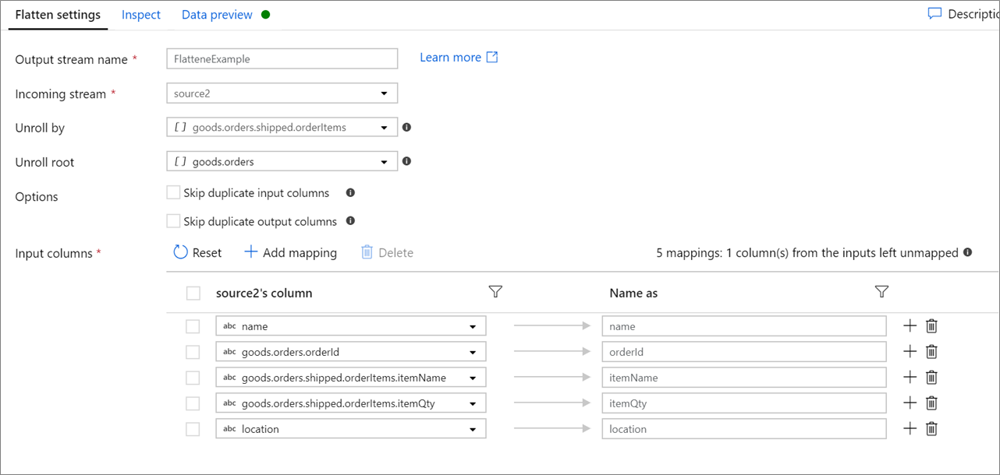

# Azure Data Factory Flatten Transformation

The flatten transformation can be used to pivot array values inside of a hierarchical structure into new rows, essentially denormalizing your data.


## Unroll by

First, choose the array column that you wish to unroll and pivot.



## Unroll root

By default ADF will flatten the structure at the unroll array that you chose above. Or, you can choose a different part of the hierarchy to unroll to. This is an optional setting.

## Input columns

Lastly, choose the projection of your new structure based upon the incoming fields as well as the normalized column that you unrolled.

## Data flow script

### Syntax

```
<incomingStream>
foldDown(unroll(<unroll cols>),
    mapColumn(
        name,
        each(<array>(type == '<arrayDataType>')),
        each(<array>, match(true())),
        location
    )) ~> <transformationName>
```

### Example

```
source(output(
        name as string,
        location as string,
        satellites as string[],
        goods as (trade as boolean, customers as string[], orders as (orderId as string, orderTotal as double, shipped as (orderItems as (itemName as string, itemQty as string)[]))[])
    ),
    allowSchemaDrift: true,
    validateSchema: false) ~> source2
source2 foldDown(unroll(goods.orders.shipped.orderItems),
    mapColumn(
        name,
        each(goods.orders, match(type == 'integer')),
        each(goods.orders.shipped.orderItems, match(true())),
        location
    )) ~> Flatten1
Flatten1 sink(allowSchemaDrift: true,
    validateSchema: false,
    skipDuplicateMapInputs: true,
    skipDuplicateMapOutputs: true) ~> sink1
```    

## Next steps

* Use the [Pivot transformation](data-flow-pivot.md) to pivot rows to columns.
* Use the [Unpivot transformation](data-flow-unpivot.md) to pivot columns to rows.
