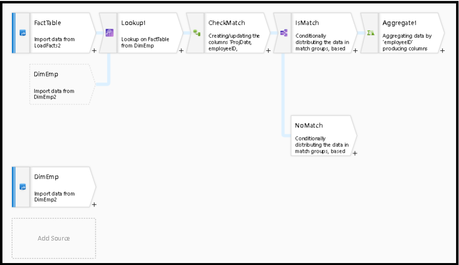
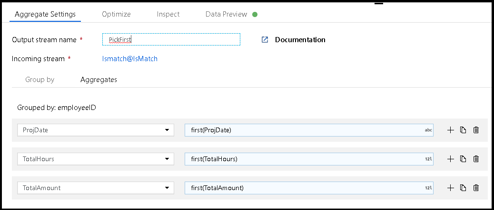
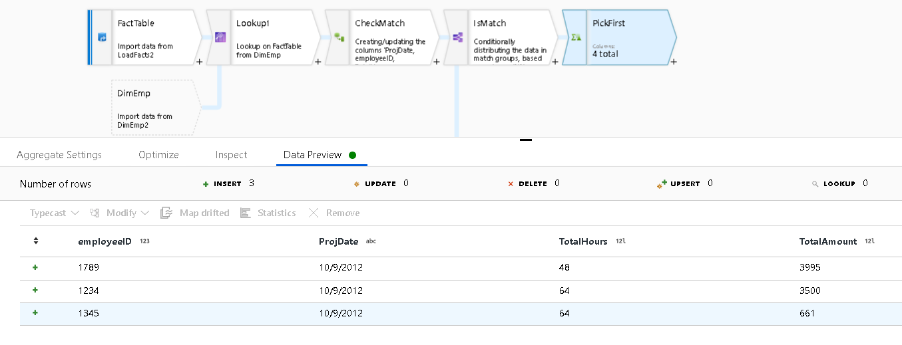

# Azure Data Factory mapping data flow Lookup Transformation

[!INCLUDE[appliesto-adf-xxx-md](includes/appliesto-adf-xxx-md.md)]

Use Lookup to add reference data from another source to your Data Flow. The Lookup transform requires a defined source that points to your reference table and matches on key fields.


Select the key fields that you wish to match on between the incoming stream fields and the fields from the reference source. You must first have created a new source on the Data Flow design canvas to use as the right-side for the lookup.

When matches are found, the resulting rows and columns from the reference source will be added to your data flow. You can choose which fields of interest that you wish to include in your Sink at the end of your Data Flow. Alternatively, use a Select transformation following your Lookup to prune the field list to keep only the fields from both streams that you'd like to retain.

The Lookup transformation performs the equivalent of a left outer join. So, you'll see all rows from your left source combine with matches from your right side. If you have multiple matching values on your lookup, or if you'd like to customize the lookup expression, it is preferable to switch to a Join transformation and use a cross join. This will avoid any possible cartesian product errors on execution.

## Match / No match

After your Lookup transformation, you can use subsequent transformations to inspect the results of each match row by using the expression function `isMatch()` to make further choices in your logic based on whether or not the Lookup resulted in a row match or not.



After you use the Lookup transformation, you can add a Conditional Split transformation splitting on the ```isMatch()``` function. In the example above, matching rows go through the top stream and non-matching rows flow through the ```NoMatch``` stream.

## First or last value

The Lookup Transformation is implemented as a left outer join. When you have multiple matches from your Lookup, you may want to reduce the multiple matched rows by picking the first matched row, the last match, or any random row.

### Option 1


* Match multiple rows: Leave it blank to return single row match
* Match on: Select first, last, or any match
* Sort conditions: If you select first or last, ADF requires your data to be ordered so that there is logic behind first and last

> [!NOTE]
> Only use the first or last option on your single row selector if you need to control which value to bring back from your lookup. Using "any" or multi-row lookups will perform faster.

### Option 2

You can also do this using an Aggregate transformation after your Lookup. In this case, an Aggregate transformation called ```PickFirst``` is used to pick the first value from the lookup matches.





## Optimizations

In Data Factory, Data Flows execute in scaled-out Spark environments. If your dataset can fit into worker node memory space, we can optimize your Lookup performance.


### Broadcast join

Select Left and/or Right side broadcast join to request ADF to push the entire dataset from either side of the Lookup relationship into memory. For smaller datasets, this can greatly improve your lookup performance.

### Data partitioning

You can also specify partitioning of your data by selecting "Set Partitioning" on the Optimize tab of the Lookup transformation to create sets of data that can fit better into memory per worker.

## Next steps

* [Join](data-flow-join.md) and [Exists](data-flow-exists.md) transformations perform similar tasks in ADF mapping data flows. Take a look at those transformations next.
* Use a [Conditional Split](data-flow-conditional-split.md) with ```isMatch()``` to split rows on matching and non-matching values
