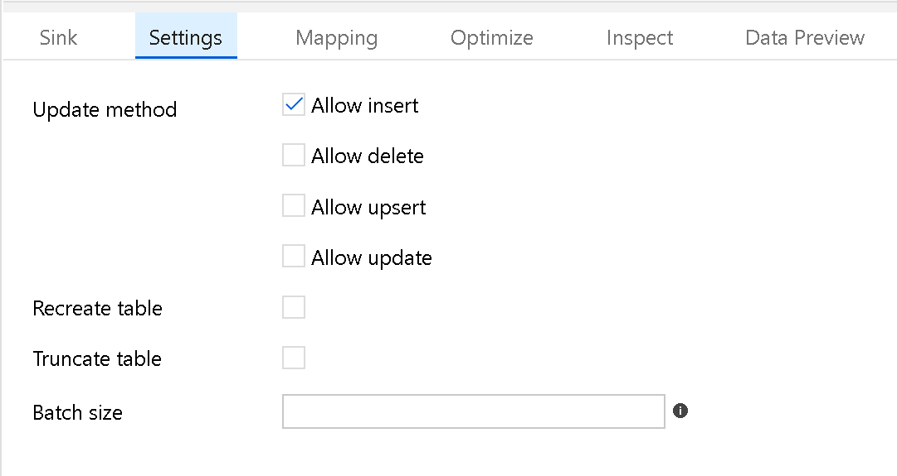

---
title: Azure Data Factory Mapping Data Flow Sink Transformation
description: Azure Data Factory Mapping Data Flow Sink Transformation
author: kromerm
ms.author: makromer
ms.reviewer: douglasl
ms.service: data-factory
ms.topic: conceptual
ms.date: 02/03/2019
--- 

# Mapping Data Flow Sink Transformation

[!INCLUDE [notes](../../includes/data-factory-data-flow-preview.md)]

At the completion of your data flow transformation, you can sink your transformed data into a destination dataset. In the Sink transformation, you can choose the dataset definition that you wish to use for the destination output data. You may have as many Sink transformation as your data flow requires.

A common practice to account for changing incoming data and to account for schema drift is to sink the output data to a folder without a defined schema in the output dataset. You can additionally account for all column changes in your sources by selecting "Allow Schema Drift" at the Source and then automap all fields in the Sink.

You can choose to overwrite, append, or fail the data flow when sinking to a dataset.

You can also choose "automap" to sink all incoming fields. If you wish to choose the fields that you want to sink to the destination, or if you would like to change the names of the fields at the destination, choose "Off" for "automap" and then click on the Mapping tab to map output fields:

## Output to one File
For Azure Storage Blob or Data Lake sink types, you will output the transformed data into a folder. Spark will generate partitioned output data files based on the partitioning scheme being used in the Sink transform. You can set the partitioning scheme by clicking on the "Optimize" tab. If you would like ADF to merge your output into a single file, click on the "Single Partition" radio button.

#### Field Mapping

On the Mapping tab of your Sink transformation, you can map the incoming (left side) columns to the destination (right side). When you sink data flows to files, ADF will always write new files to a folder. When you map to a database dataset, you can choose to either generate a new table with this schema (set Save Policy to "overwrite") or insert new rows to an existing table and map the fields to the existing schema.

You can use multi-select in the mapping table to Link multiple columns with one click, delink multiple columns or map multiple rows to the same column name.

When you wish to always take the incoming set of fields and map them to a target as-is, set the "Allow Schema Drift" setting.

If you'd like to reset your columns mappings, press the "Remap" button to reset the mappings.

* Allow Schema Drift and Validate Schema options are now available in Sink. This will allow you to instruct ADF to either fully accept flexible schema definitions (Schema Drift) or fail the Sink if the schema changes (Validate Schema).

* Clear the Folder. ADF will truncate the sink folder contents before writing the destination files in that target folder.

* File name options

   * Default: Allow Spark to name files based on PART defaults
   * Pattern: Enter a name for your output files
   * Per partition: Enter a file name per partition
   * As data in column: Set the output file to the value of a column

> [!NOTE]
> File operations will only execute when you are running the Execute Data Flow activity, not while in Data Flow Debug mode

With database dataset sinks, you will have additional options:

* Allow insert, update, delete, upserts. The default is to allow inserts. If you wish to update, upsert, or insert rows, you must first add an alter row transformation to tag rows for those specific actions.
* Truncate table (removes all rows from your target table before completing the data flow)
* Recreate table (performs drop/create of your target table before completing the data flow)
* Batch size for large data loads. Enter a number to bucket writes into chunks.

## Next steps

Now that you've created your data flow, add an [Execute Data Flow activity to your pipeline](concepts-data-flow-overview.md).
