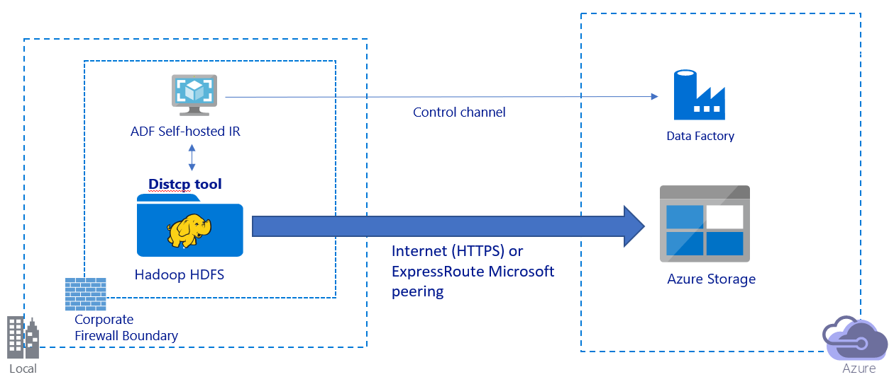
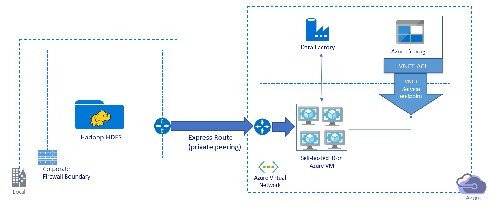
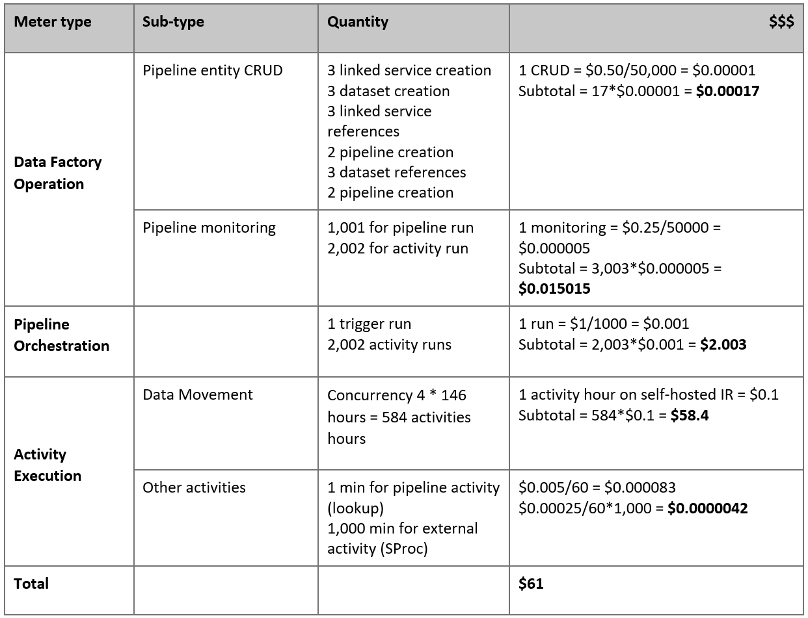

# Use Azure Data Factory to migrate data from on-premise Hadoop cluster to Azure Storage 

Azure Data Factory provides a performant, robust, and cost-effective mechanism to migrate data at scale from on-premise HDFS to Azure Blob Storage or Azure Data Lake Storage Gen2. Basically, Azure Data Factory contains two approaches to migrate data from on-premise HDFS to Azure. You can select each of them based on your scenario. 

- ADF DistCp mode. ADF support using [DistCp](https://hadoop.apache.org/docs/current3/hadoop-distcp/DistCp.html) to copy files as-is into Azure Blob (including [staged copy](https://docs.microsoft.com/azure/data-factory/copy-activity-performance#staged-copy)) or Azure Data Lake Store, in which case it can fully leverage your cluster's power instead of running on the self-hosted integration runtime (IR). It will provide better copy throughput especially when your cluster is very powerful. Based on your configuration in Azure Data Factory, copy activity automatically constructs a DistCp command, submits to your Hadoop cluster, and monitors the copy status. By using ADF integrated with DistCp, customer can not only leverage your existing powerful cluster to achieve the best copy throughput but also get the benefit of flexible scheduling and unified monitoring experience from ADF. By default, ADF DistCp mode is the recommended way to migrate data from on-premise hadoop cluster to Azure.
- ADF native IR mode. In some scenarios, DistCp cannot work for your cases (For example, in VNET environment, DistCp tool does not support Express Route private peering + Azure Storage VNet endpoint). Besides, sometime you do not want to use your existing hadoop cluster as the engine to migrate the data since it will bring heavy loads on your cluster, which may impact the performance of existing ETL jobs. If that case, you can use ADF native capability, where ADF’s integration runtime (IR) can be the engine to copy the data from on-prem HDFS to Azure.

This article provides the following information of both approaches for data engineers and developers:
> [!div class="checklist"]
> * Performance​ 
> * Copy resilience
> * Network security
> * High-level solution architecture 
> * Implementation best practices  

## Performance

In ADF DistCp mode, the throughput is same as using DistCp tool independently, which leverages the capacity of your existing hadoop cluster. DistCp (distributed copy) is a tool used for large inter/intra-cluster copying. It uses MapReduce to effect its distribution, error handling and recovery, and reporting. It expands a list of files and directories into input to map tasks, each of which will copy a partition of the files specified in the source list. By using ADF integrated with DistCp, you can build pipelines to fully utilize your network bandwidth as well as storage IOPS and bandwidth to maximize data movement throughput for your environment.  

In ADF native IR mode, it also allows parallelism at different levels, which can fully utilize your network bandwidth as well as storage IOPS and bandwidth to maximize data movement throughput by manually scaling up the self-hosted IR machine or scale out to self-hosted IR multiple machines.

- A single copy activity can take advantage of scalable compute resources. With self-hosted integration runtime, you can manually scale up the machine or scale out to multiple machines  ([up to 4 nodes](https://docs.microsoft.com/azure/data-factory/create-self-hosted-integration-runtime#high-availability-and-scalability)), and a single copy activity will partition its file set across all nodes. 
- A single copy activity reads from and writes to the data store using multiple threads. 
- ADF control flow can start multiple copy activities in parallel, for example using [For Each loop](https://docs.microsoft.com/azure/data-factory/control-flow-for-each-activity). 

You can get more details from [copy activity performance guide](https://docs.microsoft.com/azure/data-factory/copy-activity-performance)

## Resilience

In ADF DistCp mode, you can leverage different DistCp command-line parameters (For example, -i, ignore failures; -update, write data when source file and destination file differ in size) to achieve different levels of resilience.

In ADF native IR mode, within a single copy activity run, ADF has built-in retry mechanism so it can handle a certain level of transient failures in the data stores or in the underlying network. When doing binary copying from on-premise HDFS to Blob and from on-premise HDFS to ADLS Gen2, ADF automatically performs checkpointing to a large extent. If a copy activity run has failed or timed out, on a subsequent retry (make sure to retry count > 1), the copy resumes from the last failure point instead of starting from the beginning.

## Network security 

By default, ADF transfers data from on-premise HDFS to Azure Blob Storage or Azure Data Lake Storage Gen2 using encrypted connection over HTTPS protocol.  HTTPS provides data encryption in transit and prevents eavesdropping and man-in-the-middle attacks. 

Alternatively, if you do not want data to be transferred over public Internet, you can achieve higher security by transferring data over a private peering link via Azure Express Route. Refer to the solution architecture below on how this can be achieved.

## Solution architecture

Migrate data over public Internet:

- In this architecture, data is transferred securely using HTTPS over public Internet. 
- ADF DistCp mode is recommended to use in public network environment. By doing so, you can not only leverage your existing powerful cluster to achieve the best copy throughput but also get the benefit of flexible scheduling and unified monitoring experience from ADF.
- You need to install ADF self-hosted IR on a Windows machine behind corporate firewall for submitting DistCp command to your hadoop cluster, and monitoring the copy status. Given this machine will not be the engine to move data (for control purpose only), the capacity of the machine does not impact the throughput of data movement.
- The existing parameters from DistCp command are supported.

Migrate data over private link: 

- In this architecture, data migration is done over a private peering link via Azure Express Route such that data never traverses over public Internet.
- DistCp tool does not support Express Route private peering + Azure Storage VNet endpoint, so you are encouraged to use ADF native capability via integration runtime to migrate the data.
- You need to install ADF self-hosted integration runtime on a Windows VM within your Azure virtual network to achieve this architecture. You can manually scale up your VM or scale out to multiple VMs to fully utilize your network and storage IOPS/bandwidth.
- The recommend configuration to start with for each Azure VM (with ADF self-hosted integration runtime installed) is Standard_D32s_v3 with 32 vCPU and 128-GB memory. You can keep monitoring the CPU and memory utilization of the VM during data migration to see if you need to further scale up the VM for better performance or scale down the VM to save cost.
- You can also scale out by associating up to 4 VM nodes with a single self-hosted IR. A single copy job running against a self-hosted IR will automatically partition the file set and leverage all VM nodes to copy the files in parallel. For high availability, you are recommended to start with two VM nodes to avoid single point of failure during the data migration.
- Both initial snapshot data migration and delta data migration can be achieved using this architecture.

## Implementation best practices 

### Authentication and credential management 

- To authenticate to HDFS, you can use [either Windows (Kerberos) or Anonymous](https://docs.microsoft.com/azure/data-factory/connector-hdfs#linked-service-properties). 
- Multiple authentication types are supported to connect to Azure Blob Storage.  Use of [managed identities for Azure resources](https://docs.microsoft.com/azure/data-factory/connector-azure-blob-storage#managed-identity) is highly recommended: built on top of an automatically managed ADF identify in Azure AD, it allows you to configure pipelines without supplying credentials in Linked Service definition.  Alternatively, you can authenticate to Azure Blob Storage using [Service Principal](https://docs.microsoft.com/azure/data-factory/connector-azure-blob-storage#service-principal-authentication), [shared access signature](https://docs.microsoft.com/azure/data-factory/connector-azure-blob-storage#shared-access-signature-authentication), or [storage account key](https://docs.microsoft.com/azure/data-factory/connector-azure-blob-storage#account-key-authentication). 
- Multiple authentication types are also supported to connect to Azure Data Lake Storage Gen2.  Use of [managed identities for Azure resources](https://docs.microsoft.com/azure/data-factory/connector-azure-data-lake-storage#managed-identity) is highly recommended, although [service principal](https://docs.microsoft.com/azure/data-factory/connector-azure-data-lake-storage#service-principal-authentication) or [storage account key](https://docs.microsoft.com/azure/data-factory/connector-azure-data-lake-storage#account-key-authentication) can also be used. 
- When you are not using managed identities for Azure resources, [storing the credentials in Azure Key Vault](https://docs.microsoft.com/azure/data-factory/store-credentials-in-key-vault) is highly recommended to make it easier to centrally manage and rotate keys without modifying ADF linked services.  This is also one of the [best practices for CI/CD](https://docs.microsoft.com/azure/data-factory/continuous-integration-deployment#best-practices-for-cicd). 

### Initial snapshot data migration 

In ADF DistCp mode, you can create one copy activity to submit the DistCp command with different parameters to control the initial data migration behavior. 

In ADF native IR mode, data partition is recommended especially when migrating more than 10 TB of data. To partition the data, leverage the folder names on HDFS, and then each ADF copy job can copy one folder partition at a time. You can run multiple ADF copy jobs concurrently for better throughput.
If any of the copy jobs fail due to network or data store transient issue, you can rerun the failed copy job to reload that specific partition again from HDFS. All other copy jobs loading other partitions will not be impacted.

### Delta data migration 

In ADF DistCp mode, you can leverage DistCp command-line parameters “-update, write data when source file and destination file differ in size” to achieve the delta data migration.

In ADF native IR mode, the most performant way to identify new or changed files from HDFS is by using time-partitioned naming convention – when your data in HDFS has been time partitioned with time slice information in the file or folder name (for example, /yyyy/mm/dd/file.csv), then your pipeline can easily identify which files/folders to copy incrementally.
Alternatively, if your data in HDFS is not time partitioned, ADF can identify new or changed files by their LastModifiedDate. The way it works is that ADF will scan all the files from HDFS, and only copy the new and updated file whose last modified timestamp is greater than a certain value. Be aware that if you have a large number of files in HDFS, the initial file scanning could take a long time regardless of how many files match the filter condition. In this case you are suggested to partition the data first, using the same partition for initial snapshot migration, so that the file scanning can happen in parallel.

### Estimating Price 

> [!NOTE]
> This is a hypothetical pricing example.  Your actual pricing depends on the actual throughput in your environment.

Consider the following pipeline constructed for migrating data from HDFS to Azure Blob Storage: 

Let us assume the following: 

- Total data volume is 1 PB
- Migrating data using second solution architecture (ADF native IR mode)
- 1 PB is divided into 1000 partitions and each copy moves one partition
- Each copy activity is configured with one self-hosted IR associated to 4 machines and achieves 500 MBps throughput.
- ForEach concurrency is set to 4 and aggregate throughput is 2 GBps
- In total, it takes 146 hours to complete the migration.

Here is the estimated price based on the above assumptions: 

### Additional references 
- [HDFS connector](https://docs.microsoft.com/azure/data-factory/connector-hdfs)
- [Azure Blob Storage connector](https://docs.microsoft.com/azure/data-factory/connector-azure-blob-storage)
- [Azure Data Lake Storage Gen2 connector](https://docs.microsoft.com/azure/data-factory/connector-azure-data-lake-storage)
- [Copy activity performance tuning guide](https://docs.microsoft.com/azure/data-factory/copy-activity-performance)
- [Creating and configuring self-hosted Integration Runtime](https://docs.microsoft.com/azure/data-factory/create-self-hosted-integration-runtime)
- [Self-hosted integration runtime HA and scalability](https://docs.microsoft.com/azure/data-factory/create-self-hosted-integration-runtime#high-availability-and-scalability)
- [Data movement security considerations](https://docs.microsoft.com/azure/data-factory/data-movement-security-considerations)
- [Store credentials in Azure Key Vault](https://docs.microsoft.com/azure/data-factory/store-credentials-in-key-vault)
- [Copy file incrementally based on time partitioned file name](https://docs.microsoft.com/azure/data-factory/tutorial-incremental-copy-partitioned-file-name-copy-data-tool)
- [Copy new and changed files based on LastModifiedDate](https://docs.microsoft.com/azure/data-factory/tutorial-incremental-copy-lastmodified-copy-data-tool)
- [ADF pricing page](https://azure.microsoft.com/pricing/details/data-factory/data-pipeline/)

## Next steps

- [Copy files from multiple containers with Azure Data Factory](solution-template-copy-files-multiple-containers.md)