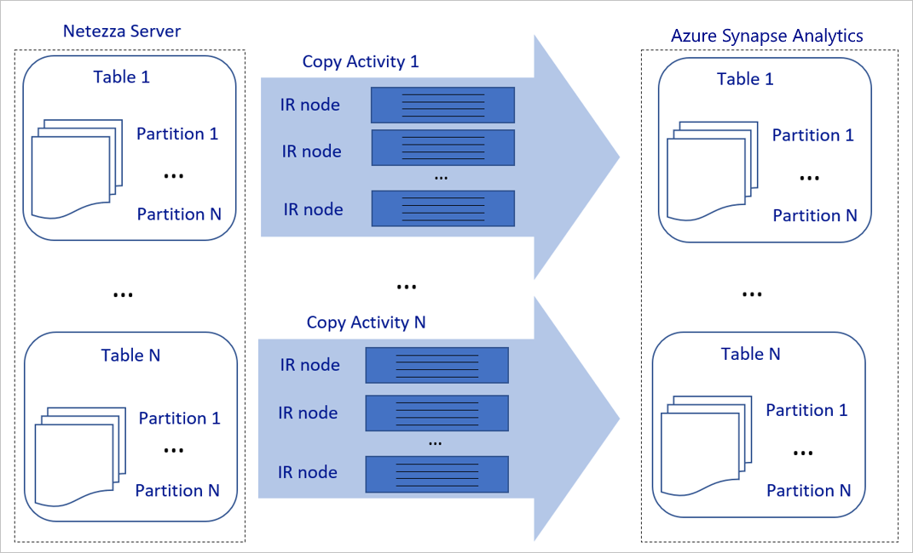
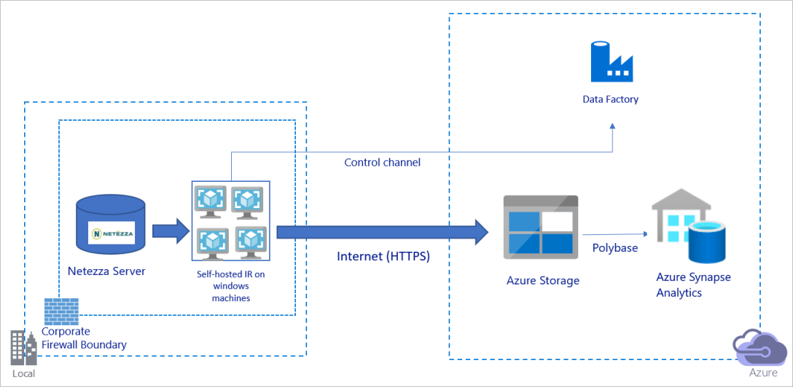
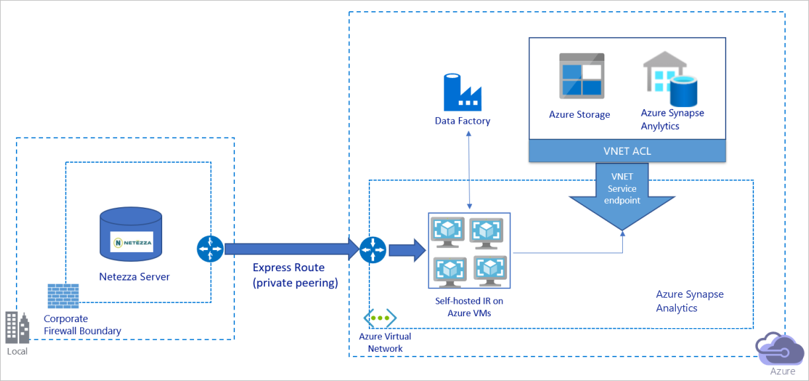
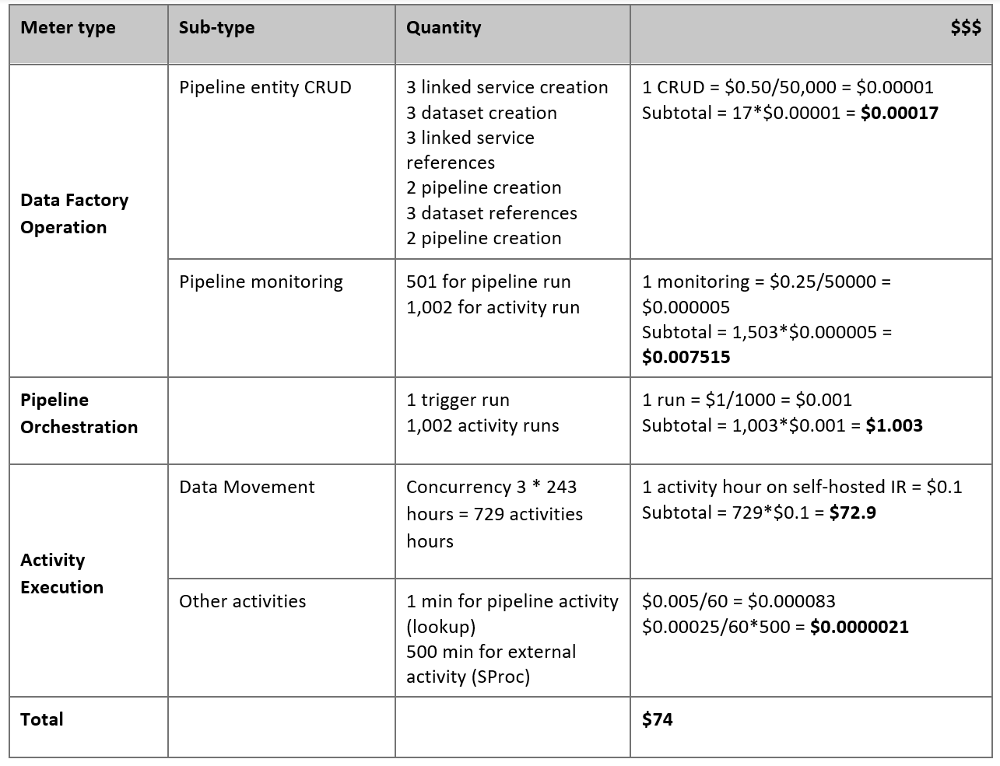

# Use Azure Data Factory to migrate data from on-premise Netezza server to Azure 

Azure Data Factory provides a performant, robust, and cost-effective mechanism to migrate data at scale from on-premise Netezza server to Azure Storage or Azure SQL Data Warehouse. This article provides the following information for data engineers and developers:

> [!div class="checklist"]
> * Performance​ 
> * Copy resilience
> * Network security
> * High-level solution architecture 
> * Implementation best practices  

## Performance

ADF offers a serverless architecture that allows parallelism at different levels, which allows developers to build pipelines to fully utilize your network bandwidth as well as database bandwidth to maximize data movement throughput for your environment.

- A single copy activity can take advantage of scalable compute resources: when using Azure Integration Runtime, you can specify [up to 256 DIUs](https://docs.microsoft.com/azure/data-factory/copy-activity-performance#data-integration-units) for each copy activity in a serverless manner; when using self-hosted Integration Runtime, you can manually scale up the machine or scale out to multiple machines ([up to 4 nodes](https://docs.microsoft.com/azure/data-factory/create-self-hosted-integration-runtime#high-availability-and-scalability)), and a single copy activity will distribute its partition across all nodes. 
- A single copy activity reads from and writes to the data store using multiple threads. 
- ADF control flow can start multiple copy activities in parallel, for example using [For Each loop](https://docs.microsoft.com/azure/data-factory/control-flow-for-each-activity). 

You can get more details from [copy activity performance guide](https://docs.microsoft.com/azure/data-factory/copy-activity-performance)

## Resilience

Within a single copy activity run, ADF has built-in retry mechanism so it can handle a certain level of transient failures in the data stores or in the underlying network.

ADF copy activity also offers you two ways to handle incompatible rows when copying data between source and sink data stores. You can either abort and fail the copy activity when incompatible data is encountered or continue to copy the rest data by skipping incompatible data rows. In addition, you can log the incompatible rows in Azure Blob storage or Azure Data Lake Store in order to learn the cause for the failure, fix the data on the data source, and retry the copy activity.

## Network security 

By default, ADF transfers data from on-premise Netezza server to Azure Storage or Azure SQL Data Warehouse using encrypted connection over HTTPS protocol. It provides data encryption in transit and prevents eavesdropping and man-in-the-middle attacks.

Alternatively, if you do not want data to be transferred over public Internet, you can achieve higher security by transferring data over a private peering link via Azure Express Route. Refer to the solution architecture below on how this can be achieved.

## Solution architecture

Migrate data over public Internet:

- In this architecture, data is transferred securely using https over public Internet.
- You need to install ADF self-hosted integration runtime on a windows machine behind corporate firewall to achieve this architecture. Make sure your ADF self-hosted integration runtime on a windows machine can directly get access to your Netezza server. You can manually scale up your machine or scale out to multiple machines to fully utilize your network and data stores bandwidth to copy data.
- Both initial snapshot data migration and delta data migration can be achieved using this architecture.

Migrate data over private link: 

- In this architecture, data migration is done over a private peering link via Azure Express Route such that data never traverses over public Internet. 
- You need to install ADF self-hosted integration runtime on a Windows VM within your Azure virtual network to achieve this architecture. You can manually scale up your VMs or scale out to multiple VMs to fully utilize your network and data stores bandwidth to copy data.
- Both initial snapshot data migration and delta data migration can be achieved using this architecture.

## Implementation best practices 

### Authentication and credential management 

- To authenticate to Netezza, you can use [ODBC authentication via connection string](https://docs.microsoft.com/azure/data-factory/connector-netezza#linked-service-properties). 
- Multiple authentication types are supported to connect to Azure Blob Storage.  Use of [managed identities for Azure resources](https://docs.microsoft.com/azure/data-factory/connector-azure-blob-storage#managed-identity) is highly recommended: built on top of an automatically managed ADF identify in Azure AD, it allows you to configure pipelines without supplying credentials in Linked Service definition.  Alternatively, you can authenticate to Azure Blob Storage using [Service Principal](https://docs.microsoft.com/azure/data-factory/connector-azure-blob-storage#service-principal-authentication), [shared access signature](https://docs.microsoft.com/azure/data-factory/connector-azure-blob-storage#shared-access-signature-authentication), or [storage account key](https://docs.microsoft.com/azure/data-factory/connector-azure-blob-storage#account-key-authentication). 
- Multiple authentication types are also supported to connect to Azure Data Lake Storage Gen2.  Use of [managed identities for Azure resources](https://docs.microsoft.com/azure/data-factory/connector-azure-data-lake-storage#managed-identity) is highly recommended, although [service principal](https://docs.microsoft.com/azure/data-factory/connector-azure-data-lake-storage#service-principal-authentication) or [storage account key](https://docs.microsoft.com/azure/data-factory/connector-azure-data-lake-storage#account-key-authentication) can also be used. 
- Multiple authentication types are also supported to connect to Azure SQL Data Warehouse. Use of [managed identities for Azure resources](https://docs.microsoft.com/azure/data-factory/connector-azure-sql-data-warehouse#managed-identity) is highly recommended, although [service principal](https://docs.microsoft.com/azure/data-factory/connector-azure-sql-data-warehouse#service-principal-authentication) or [SQL authentication](https://docs.microsoft.com/azure/data-factory/connector-azure-sql-data-warehouse#sql-authentication) can also be used.
- When you are not using managed identities for Azure resources, [storing the credentials in Azure Key Vault](https://docs.microsoft.com/azure/data-factory/store-credentials-in-key-vault) is highly recommended to make it easier to centrally manage and rotate keys without modifying ADF linked services.  This is also one of the [best practices for CI/CD](https://docs.microsoft.com/azure/data-factory/continuous-integration-deployment#best-practices-for-cicd). 

### Initial snapshot data migration 

For small tables when their volume size is smaller than 100 GB, or it can be migrated to Azure within 2 hours, you can make each copy job load data per table. You can run multiple ADF copy jobs to load different tables concurrently for better throughput. 

Within each copy job, you can also reach some level of parallelism by using [parallelCopies setting](https://docs.microsoft.com/azure/data-factory/copy-activity-performance#parallel-copy) with data partition option to run parallel queries and copy data by partitions. There are two data partition options to be chosen with details below.
- You are encouraged to start from data slice since it is more efficient.  Make sure the number of parallelism in parallelCopies setting is below the total number of data slice partitions in your table on Netezza server.  
- If the volume size for each data slice partition is still large (For example, bigger than 10 GB), you are encouraged to switch to dynamic range partition, where you will have more flexibility to define the number of the partitions and the size of volume for each partition by partition column, upper bound and lower bound.

For the large tables when their volume size is bigger than 100 GB, or it cannot be migrated to Azure within 2 hours, you are recommended to partition the data by custom query and then make each copy job copies one partition at a time. You can run multiple ADF copy jobs concurrently for better throughput. Be aware that, for each copy job target to load one partition by custom query, you can still enable the parallelism via either data slice or dynamic range to increase the throughput. 

If any of the copy jobs fail due to network or data store transient issue, you can rerun the failed copy job to reload that specific partition again from the table. All other copy jobs loading other partitions will not be impacted.

When loading data into Azure SQL Data Warehouse, Polybase is suggested to be enabled within copy job with an Azure blob storage as staging.

### Delta data migration 

The way to identify the new or updated rows from your table is using a timestamp column or incrementing key within the schema, and then store the latest value as high watermark in an external table, which can be used to filter the delta data for next time data loading. 

Different tables can use different watermark column to identify the new or updated rows. We would suggest you to create an external control table where each row represents one table on Netezza server with its specific watermark column name and high watermark value. 

### Self-hosted Integration runtime configuration on Azure VM or machine

Given you are migrating data from Netezza server to Azure, no matter Netezza server is on promise behind your corporation firewall or within a VNET environment, you need to install self-hosted Integration runtime on windows machine or VM, which is the engine to move data.

- The recommend configuration to start with for each machine or VM is with 32 vCPU and 128-GB memory. You can keep monitoring CPU and memory utilization of the IR machine during the data migration to see if you need to further scale up the machine for better performance or scale down the machine to save cost.
- You can also scale out by associating up to 4 nodes with a single self-hosted IR. A single copy job running against a self-hosted IR will automatically leverage all VM nodes to copy the data in parallel. For high availability, you are recommended to start with 2 VM nodes to avoid single point of failure during the data migration.

### Rate limiting

As a best practice, conduct a performance POC with a representative sample dataset, so that you can determine an appropriate partition size for each copy activity. We suggest you to make each partition be loaded to Azure within 2 hours.  

Start with a single copy activity with single self-hosted IR machine to copy a table. Gradually increase parallelCopies setting based on the number of data slice partitions in your table, and see if the entire table can be loaded to Azure within 2 hours according to the throughput you see from the copy job. 

If it cannot be achieved, and at the same time the capacity of the self-hosted IR node and the data store are not fully utilized, gradually increase the number of concurrent copy activities until you reach limits of your network or bandwidth limit of the data stores. 

Keep monitoring the CPU/memory utilization on self-hosted IR machine, and be ready to scale up the machine or scale out to multiple machines when you see the CPU/memory are fully utilized. 

When you encounter throttling errors reported by ADF copy activity, either reduce the concurrency or parallelCopies setting in ADF, or consider increasing the bandwidth/IOPS limits of the network and data stores. 

### Estimating Price 

Consider the following pipeline constructed for migrating data from on-premise Netezza server to Azure SQL data warehouse:

Let us assume the following: 

- Total data volume is 50 TB. 
- Migrating data using first solution architecture (Netezza server is on-premise behind the firewall)
- 50 TB is divided into 500 partitions and each copy activity moves one partition.
- Each copy activity is configured with one self-hosted IR against 4 machines and achieves 20-MBps throughput. (Within copy activity, parallelCopies is set to 4, and each thread to load data from the table achieves 5-MBps throughput)
- ForEach concurrency is set to 3 and aggregate throughput is 60 MBps.
- In total, it takes 243 hours to complete the migration.

Here is the estimated price based on the above assumptions: 

> [!NOTE]
> This is a hypothetical pricing example. Your actual pricing depends on the actual throughput in your environment. The price for the windows machine (with self-hosted integration runtime installed) is not included. 

### Additional references 
- [White-paper: Data Migration from on-premise relational Data Warehouse to Azure using Azure Data Factory](https://azure.microsoft.com/mediahandler/files/resourcefiles/data-migration-from-on-premise-relational-data-warehouse-to-azure-data-lake-using-azure-data-factory/Data_migration_from_on-prem_RDW_to_ADLS_using_ADF.pdf)
- [Netezza connector](https://docs.microsoft.com/en-us/azure/data-factory/connector-netezza)
- [ODBC connector](https://docs.microsoft.com/en-us/azure/data-factory/connector-odbc)
- [Azure Blob Storage connector](https://docs.microsoft.com/azure/data-factory/connector-azure-blob-storage)
- [Azure Data Lake Storage Gen2 connector](https://docs.microsoft.com/azure/data-factory/connector-azure-data-lake-storage)
- [Azure SQL Data Warehouse connector](https://docs.microsoft.com/en-us/azure/data-factory/connector-azure-sql-data-warehouse)
- [Copy activity performance tuning guide](https://docs.microsoft.com/azure/data-factory/copy-activity-performance)
- [Creating and configuring self-hosted Integration Runtime](https://docs.microsoft.com/azure/data-factory/create-self-hosted-integration-runtime)
- [Self-hosted integration runtime HA and scalability](https://docs.microsoft.com/azure/data-factory/create-self-hosted-integration-runtime#high-availability-and-scalability)
- [Data movement security considerations](https://docs.microsoft.com/azure/data-factory/data-movement-security-considerations)
- [Store credentials in Azure Key Vault](https://docs.microsoft.com/azure/data-factory/store-credentials-in-key-vault)
- [Copy data incrementally from one table](https://docs.microsoft.com/en-us/azure/data-factory/tutorial-incremental-copy-portal)
- [Copy data incrementally from multiple tables](https://docs.microsoft.com/en-us/azure/data-factory/tutorial-incremental-copy-multiple-tables-portal)
- [ADF pricing page](https://azure.microsoft.com/pricing/details/data-factory/data-pipeline/)

## Next steps

- [Copy files from multiple containers with Azure Data Factory](solution-template-copy-files-multiple-containers.md)