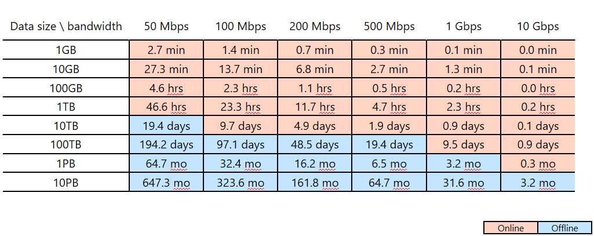

# Use Azure Data Factory to migrate data from your data lake or data warehouse to Azure 

Azure Data Factory can be the tool to do data migration when you want to migrate your data lake or enterprise data warehouse (EDW) to Azure. The data lake migration and data warehouse migration are related to the following scenarios: 

1. Big data workload migration from AWS S3, on-prem Hadoop File System to Azure.​ 
2. EDW migration from Oracle Exadata, Netezza, Teradata, AWS Redshift to Azure. 

Azure Data Factory can move PBs' level of data for data lake migration and tens of TB data for data warehouse migration​. 

## Why Azure Data Factory can be used for data migration 

1. Azure Data Factory can easily scale up amount of horsepower to move data in serverless manner with high performance, resilience, and scalability and only pay for what you use.  
	* Azure Data Factory has no limitation on data volume and number of files.
	* Azure Data Factory can 100% utilize your network and storage bandwidth to achieve the highest data movement throughput in your environment.   
	* Azure Data Factory follows the pay-as-you-go strategy, so that you only need to pay for the time when you are using Azure Data Factory to do the data migration to Azure.  
2. Azure Data Factory has ability to perform one-time historical load as well as scheduled incremental load. 
3. Azure Data Factory uses Azure IR for moving data between publicly accessible data lake/warehouse endpoints, or alternatively use self-hosted IR for moving data for data lake/warehouse endpoints inside VNet or behind firewall. 
4. Azure Data Factory has enterprise-grade security: either use MSI or Service Identity for secured service-to-service integration, or alternatively leverage Azure Key Vault for credential management. 
5. Azure Data Factory provides a code-free authoring experience and rich built-in monitoring dashboard.  

## Online vs. offline data migration

Azure Data Factory is a typical online data migration tool to transfer data over network (Internet, ER, or VPN), where offline data migration is letting people physically ship data transfer devices from your organization to Azure Data Center.  

There are three key considerations when selecting online vs. offline migration approach:  

1. Size of data to be migrated. 
2. Network bandwidth. 
3. Migration window.   

If you want to complete the data migration within two weeks (migration window), you can see a cut line in the picture below to show when it is good to use online migration tool (Azure Data Factory) with different data size and network bandwidth.   

> [!NOTE]
> The benefit of online migration approach is that you can achieve both historical data loading and incremental feeds end to end by one tool.  By doing so, the data can be keeping synchronized between existing and new store during the entire migration window so that you can rebuild your ETL logic on the new store with refreshed data. 

## Next steps

- [Copy files from multiple containers with Azure Data Factory](solution-template-copy-files-multiple-containers.md)