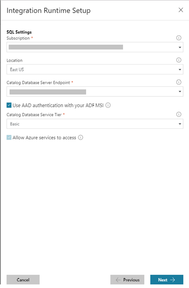

# Enable Azure Active Directory Authentication for the Azure-SSIS Integration Runtime

Azure Active Directory Authentication with the MSI for the Azure-SSIS integration runtime lets you use ADF MSI instead of SQL authentication to create an Azure-SSIS integration runtime.

In this article, we show you how to create an Azure-SSIS IR with Azure data factory service identity. For more info about the ADF MSI, see [Azure Data Factory service identity](https://docs.microsoft.com/en-us/azure/data-factory/data-factory-service-identity).

> [!NOTE]
> If you have already created an Azure-SSIS integration runtime with SQL authentication, you can't reconfigure the IR to use AAD authentication with PowerShell at this time.

## Create a group in Azure AD and make the ADF MSI a member of the group

You can use an existing Azure AD group, or create a new one using Azure AD PowerShell.

1.  Install the [Azure AD PowerShell](https://docs.microsoft.com/powershell/azure/active-directory/install-adv2) module.

2.  Sign in using `Connect-AzureAD`, and run the following command to create the group, and save it in a variable:

    ```powershell
    $Group = New-AzureADGroup -DisplayName "SSISIrGroup" -MailEnabled $false -SecurityEnabled $true -MailNickName "NotSet"
    ```

    The output looks like the following, which also examines the value of the variable:

    ```powershell
    $Group

    ObjectId DisplayName Description
    -------- ----------- -----------
    6de75f3c-8b2f-4bf4-b9f8-78cc60a18050 SSISIr Group
    ```

3.  Add the ADF MSI to the group. You can follow [Azure Data Factory service identity](https://docs.microsoft.com/en-us/azure/data-factory/data-factory-service-identity) to get the service identity id (for example,     765ad4ab-XXXX-XXXX-XXXX-51ed985819dc).

    ```powershell
    Add-AzureAdGroupMember -ObjectId $Group.ObjectId -RefObjectId 765ad4ab-XXXX-XXXX-XXXX-51ed985819dc
    ```

    You also can examine the group membership afterward.

    ```powershell
    Get-AzureAdGroupMember -ObjectId $Group.ObjectId
    ```

## Enable Azure AD on Azure SQL Database

Azure SQL Database supports creating a database with an Azure AD user. So, you can set an Azure AD user as the Active Directory admin, and then log in to SSMS using the Azure AD user. Then you can create a contained user for the Azure AD group to enable the IR to create the SSIS catalog in the server.

### Enable Azure AD authentication for the Azure SQL Database

You can [configure Azure AD authentication for the SQL Database](https://docs.microsoft.com/en-us/azure/sql-database/sql-database-aad-authentication-configure)
using the following steps:

1.  In the Azure portal, select **All services** -> **SQL servers** from the left-hand navigation.

2.  Click the SQL server to be enabled for Azure AD authentication.

3.  In the **Settings** section of the blade, click **Active Directory admin**.

4.  In the command bar, click **Set admin**.

5.  Select an Azure AD user account to be made an administrator of the server, and click **Select.**

6.  In the command bar, click **Save.**

### Create a contained user in the database that represents the Azure AD group

For this next step, you need [Microsoft SQL Server Management Studio](https://docs.microsoft.com/sql/ssms/download-sql-server-management-studio-ssms) (SSMS).

1.  Start SQL Server Management Studio.

2.  In the **Connect to Server** dialog, enter your SQL server name in
    the **Server name** field.

3.  In the **Authentication** field, select **Active Directory - Universal with MFA support**. (You can also use other two Active Directory authentications. See [Configure and manage Azure Active Directory authentication with SQL Database, Managed Instance](https://docs.microsoft.com/en-us/azure/sql-database/sql-database-aad-authentication-configure).)

4.  In the **User name** field, enter the name of the Azure AD account that you set as the server administrator, for example, testuser@xxxonline.com.

5.  Click **Connect**. Complete the sign-in process.

6.  In the **Object Explorer**, expand the **Databases** -> System Databases folder.

7.  Right-click on **master** database and click **New query**.

8.  In the query window, enter the following line, and click **Execute** in the toolbar:

    ```sql
    CREATE USER [SSISIrGroup] FROM EXTERNAL PROVIDER
    ```

The command should complete successfully, creating the contained user for the group.

9.  Clear the query window, enter the following line, and click **Execute** in the toolbar:

    ```sql
    ALTER ROLE dbmanager ADD MEMBER [SSISIrGroup]
    ```

    The command should complete successfully, granting the contained user the ability to create database.

## Enable Azure AD on Azure SQL Database Managed Instance

Azure SQL Database Managed Instance doesn't support creating database with any AAD user other than AD admin. As a result, you have to set the Azure AD Group as
the Active Directory admin. You don't need to create the contained user.

You can [configure Azure AD authentication for the SQL Database Managed Instance server](https://docs.microsoft.com/en-us/azure/sql-database/sql-database-aad-authentication-configure) using the following steps:

7.  In the Azure portal, select **All services** -> **SQL servers** from the left-hand navigation.

8.  Click the SQL server to be enabled for Azure AD authentication.

9.  In the **Settings** section of the blade, click **Active Directory admin**.

10. In the command bar, click **Set admin**.

11. Search and select the Azure AD Group (for example, SSISIrGroup), and click **Select.**

12. In the command bar, click **Save.**

## Provision the Azure-SSIS IR in the portal

When you provision your Azure-SSIS IR with the Azure portal, on the **SQL Settings** page, check the "Use AAD authentication with your ADF MSI" option. (The following screenshot shows the settings for IR with Azure SQL Database. For the IR with Managed Instance, the "Catalog Database Service Tier" property is not available; other settings are the same.)

For more info about how to create an Azure-SSIS integration runtime, see [Create an Azure-SSIS integration runtime in Azure Data Factory](https://docs.microsoft.com/en-us/azure/data-factory/create-azure-ssis-integration-runtime).



## Provision the Azure-SSIS IR with PowerShell

To provision your Azure-SSIS IR with PowerShell, do the following things:

1.  Install the [Azure PowerShell](https://github.com/Azure/azure-powershell/releases/tag/v5.5.0-March2018) module.

2.  In your script, do not set the *CatalogAdminCredential* parameter. For example:

    ```powershell
    Set-AzureRmDataFactoryV2IntegrationRuntime -ResourceGroupName $ResourceGroupName `
                                               -DataFactoryName $DataFactoryName `
                                               -Name $AzureSSISName `
                                               -Type Managed `
                                               -CatalogServerEndpoint $SSISDBServerEndpoint `
                                               -CatalogPricingTier $SSISDBPricingTier `
                                               -Description $AzureSSISDescription `
                                               -Edition $AzureSSISEdition `
                                               -Location $AzureSSISLocation `
                                               -NodeSize $AzureSSISNodeSize `
                                               -NodeCount $AzureSSISNodeNumber `
                                               -MaxParallelExecutionsPerNode $AzureSSISMaxParallelExecutionsPerNode `
                                               -SetupScriptContainerSasUri $SetupScriptContainerSasUri

    Start-AzureRmDataFactoryV2IntegrationRuntime -ResourceGroupName $ResourceGroupName `
                                                 -DataFactoryName $DataFactoryName `
                                                 -Name $AzureSSISName
   ```
