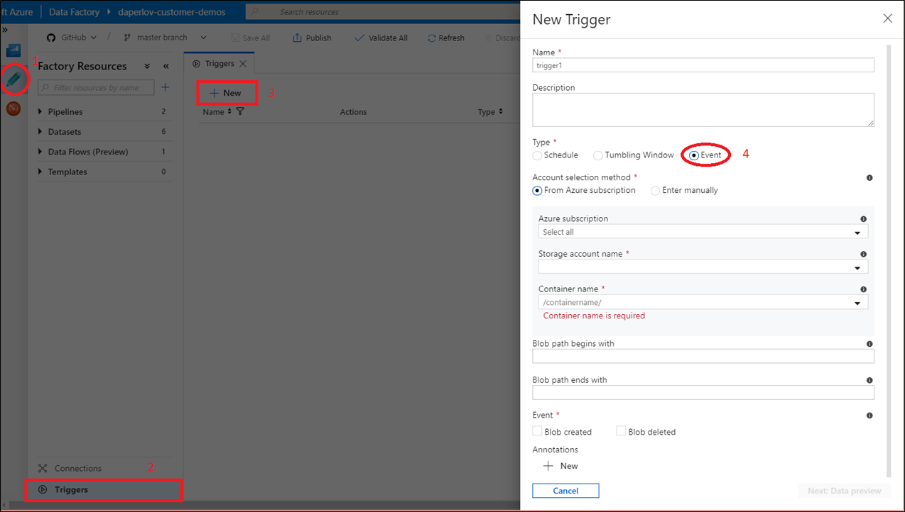
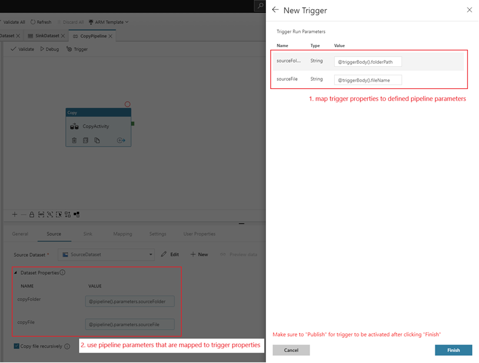

# Create a trigger that runs a pipeline in response to an event
[!INCLUDE[appliesto-adf-arc-md](includes/appliesto-adf-arc-md.md)]

This article describes the event-based triggers that you can create in your Data Factory pipelines.

Event-driven architecture (EDA) is a common data integration pattern that involves production, detection, consumption, and reaction to events. Data integration scenarios often require Data Factory customers to trigger pipelines based on events such as the arrival or deletion of a file in your Azure Storage account. Data Factory is now integrated with [Azure Event Grid](https://azure.microsoft.com/services/event-grid/), which lets you trigger pipelines on an event.

For a ten-minute introduction and demonstration of this feature, watch the following video:

> [!VIDEO https://channel9.msdn.com/Shows/Azure-Friday/Event-based-data-integration-with-Azure-Data-Factory/player]

> [!NOTE]
> The integration described in this article depends on [Azure Event Grid](https://azure.microsoft.com/services/event-grid/). Make sure that your subscription is registered with the Event Grid resource provider. For more info, see [Resource providers and types](../azure-resource-manager/resource-manager-supported-services.md#azure-portal).

## Data Factory UI

This section shows you how to create an event trigger within the Azure Data Factory User Interface.

1. Go to the **Authoring Canvas**

2. In the bottom-left corner, click on the **Triggers** button

3. Click **+ New** which will open up the create trigger side nav

4. Select trigger type **Event**

5. Select your storage account from the Azure subscription dropdown or manually using its Storage account resource ID. Choose which container you wish the events to occur on. Container selection is optional, but be mindful that selecting all containers can lead to a large number of events.

   > [!NOTE]
   > The Event Trigger currently supports only Azure Data Lake Storage Gen2 and General-purpose version 2 storage accounts. Due to an Azure Event Grid limitation, Azure Data Factory only supports a maximum of 500 event triggers per storage account.

6. The **Blob path begins with** and **Blob path ends with** properties allow you to specify the containers, folders, and blob names for which you want to receive events. Your event trigger requires at least one of these properties to be defined. You can use variety of patterns for both **Blob path begins with** and **Blob path ends with** properties, as shown in the examples later in this article.

    * **Blob path begins with:** The blob path must start with a folder path. Valid values include `2018/` and `2018/april/shoes.csv`. This field can't be selected if a container isn't selected.
    * **Blob path ends with:** The blob path must end with a file name or extension. Valid values include `shoes.csv` and `.csv`. Container and folder name are optional but, when specified, they must be separated by a `/blobs/` segment. For example, a container named 'orders' can have a value of `/orders/blobs/2018/april/shoes.csv`. To specify a folder in any container, omit the leading '/' character. For example, `april/shoes.csv` will trigger an event on any file named `shoes.csv` in folder a called 'april' in any container. 

7. Select whether your trigger will respond to a **Blob created** event, **Blob deleted** event, or both. In your specified storage location, each event will trigger the Data Factory pipelines associated with the trigger.

    

8. Once you've configured you trigger, click on **Next: Data preview**. This screen shows the existing blobs matched by your event trigger configuration. Make sure you've specific filters. Configuring filters that are too broad can match a large number of files created/deleted and may significantly impact your cost. Once your filter conditions have been verified, click **Finish**.

    

9. To attach a pipeline to this trigger, go to the pipeline canvas and click **Add trigger** and select **New/Edit**. When the side nav appears, click on the **Choose trigger...** dropdown and select the trigger you created. Click **Next: Data preview** to confirm the configuration is correct and then **Next** to validate the Data preview is correct.

10. If your pipeline has parameters, you can specify them on the trigger runs parameter side nav. The event trigger captures the folder path and file name of the blob into the properties `@triggerBody().folderPath` and `@triggerBody().fileName`. To use the values of these properties in a pipeline, you must map the properties to pipeline parameters. After mapping the properties to parameters, you can access the values captured by the trigger through the `@pipeline().parameters.parameterName` expression throughout the pipeline. Click **Finish** once you are done.

    

In the preceding example, the trigger is configured to fire when a blob path ending in .csv is created in the folder event-testing in the container sample-data. The **folderPath** and **fileName** properties capture the location of the new blob. For example, when MoviesDB.csv is added to the path sample-data/event-testing, `@triggerBody().folderPath` has a value of `sample-data/event-testing` and `@triggerBody().fileName` has a value of `moviesDB.csv`. These values are mapped in the example to the pipeline parameters `sourceFolder` and `sourceFile` which can be used throughout the pipeline as `@pipeline().parameters.sourceFolder` and `@pipeline().parameters.sourceFile` respectively.

## JSON schema

The following table provides an overview of the schema elements that are related to event-based triggers:

| **JSON Element** | **Description** | **Type** | **Allowed Values** | **Required** |
| ---------------- | --------------- | -------- | ------------------ | ------------ |
| **scope** | The Azure Resource Manager resource ID of the Storage Account. | String | Azure Resource Manager ID | Yes |
| **events** | The type of events that cause this trigger to fire. | Array    | Microsoft.Storage.BlobCreated, Microsoft.Storage.BlobDeleted | Yes, any combination of these values. |
| **blobPathBeginsWith** | The blob path must begin with the pattern provided for the trigger to fire. For example, `/records/blobs/december/` only fires the trigger for blobs in the `december` folder under the `records` container. | String   | | You have to provide a value for at least one of these properties: `blobPathBeginsWith` or `blobPathEndsWith`. |
| **blobPathEndsWith** | The blob path must end with the pattern provided for the trigger to fire. For example, `december/boxes.csv` only fires the trigger for blobs named `boxes` in a `december` folder. | String   | | You have to provide a value for at least one of these properties: `blobPathBeginsWith` or `blobPathEndsWith`. |

## Examples of event-based triggers

This section provides examples of event-based trigger settings.

> [!IMPORTANT]
> You have to include the `/blobs/` segment of the path, as shown in the following examples, whenever you specify container and folder, container and file, or container, folder, and file. For **blobPathBeginsWith**, the Data Factory UI will automatically add `/blobs/` between the folder and container name in the trigger JSON.

| Property | Example | Description |
|---|---|---|
| **Blob path begins with** | `/containername/` | Receives events for any blob in the container. |
| **Blob path begins with** | `/containername/blobs/foldername/` | Receives events for any blobs in the `containername` container and `foldername` folder. |
| **Blob path begins with** | `/containername/blobs/foldername/subfoldername/` | You can also reference a subfolder. |
| **Blob path begins with** | `/containername/blobs/foldername/file.txt` | Receives events for a blob named `file.txt` in the `foldername` folder under the `containername` container. |
| **Blob path ends with** | `file.txt` | Receives events for a blob named `file.txt` in any path. |
| **Blob path ends with** | `/containername/blobs/file.txt` | Receives events for a blob named `file.txt` under container `containername`. |
| **Blob path ends with** | `foldername/file.txt` | Receives events for a blob named `file.txt` in `foldername` folder under any container. |

## Next steps
For detailed information about triggers, see [Pipeline execution and triggers](concepts-pipeline-execution-triggers.md#triggers).
