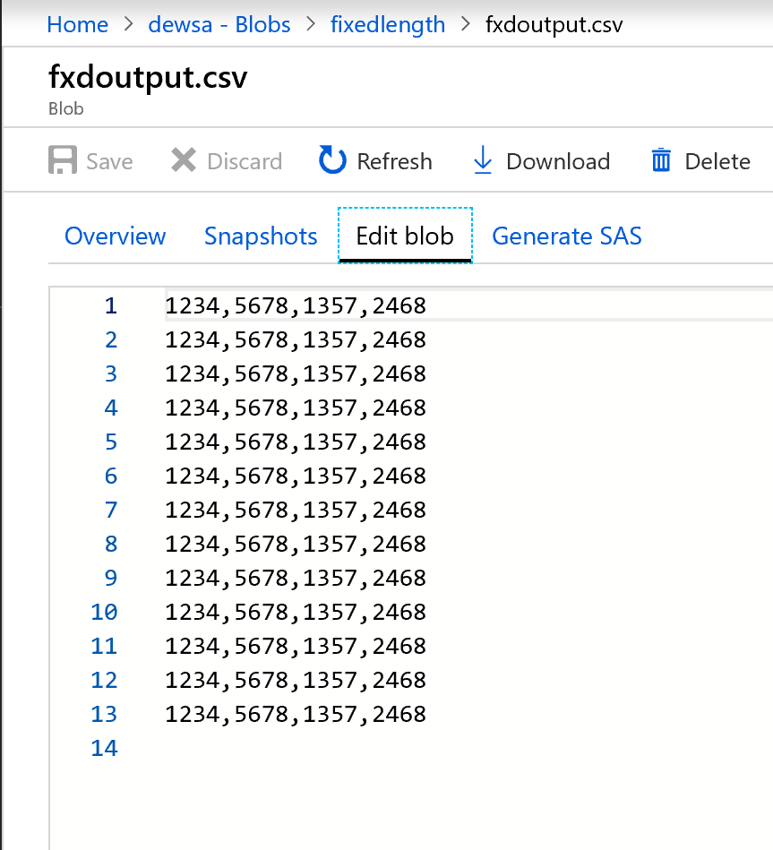

# Dedupe rows and find nulls using data flow snippets

[!INCLUDE[appliesto-adf-asa-md](includes/appliesto-adf-asa-md.md)]

By using code snippets in mapping data flows, you can very easily perform common tasks like data deduplication and null filtering. This how-to guide will explain how to add those functions to your pipelines very easily using data flow script snippets.

## Create a pipeline

1. Select **+New Pipeline** to create a new pipeline.

2. Add a data flow activity.

3. Add a Source transformation and connect it to one of your datasets

    

5. Configure the Source transformation to use a new dataset, which will be of the Delimited Text type.

6. Don't set any column delimiter or headers.

7. On the **Projection** tab of your Source transformation, you should see a string column that's named *Column_1*.

8. In the Derived column, create a new column.

9. We'll give the columns simple names like *col1*.

10. In the expression builder, type the following:

    ```substring(Column_1,1,4)```

    

11. Repeat step 10 for all the columns you need to parse.

12. Select the **Inspect** tab to see the new columns that will be generated:

    

13. Use the Select transform to remove any of the columns that you don't need for transformation:

    

14. Use Sink to output the data to a folder:

    

    Here's what the output looks like:

    

  The fixed-width data is now split, with four characters each and assigned to Col1, Col2, Col3, Col4, and so on. Based on the preceding example, the data is split into four columns.

## Next steps

* Build the rest of your data flow logic by using mapping data flows [transformations](concepts-data-flow-overview.md).
