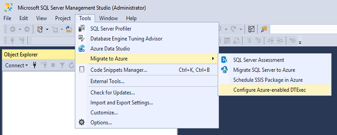
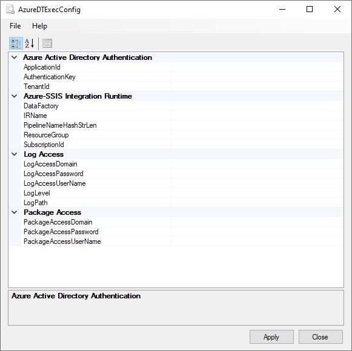

# Run SQL Server Integration Services (SSIS) packages with Azure-enabled dtexec utility
This article describes the Azure-enabled **dtexec** (**AzureDTExec**) command prompt utility.  It is used to run SSIS packages on Azure-SSIS Integration Runtime (IR) in Azure Data Factory (ADF).

The traditional **dtexec** utility comes with SQL Server, see [dtexec utility](https://docs.microsoft.com/sql/integration-services/packages/dtexec-utility?view=sql-server-2017) documentation for more info.  It is often invoked by third party orchestrators/schedulers, such as Active Batch, Control-M, etc., to run SSIS packages on premises.  The modern **AzureDTExec** utility comes with SQL Server Management Studio (SSMS) tool.  It can also be invoked by third party orchestrators/schedulers to run SSIS packages in Azure.  It facilitates the lifting & shifting/migration of your SSIS packages to the cloud.  After migration, if you want to keep using third party orchestrators/schedulers in your day-to-day operations, they can now invoke **AzureDTExec** instead of **dtexec**.

**AzureDTExec** will run your packages as Execute SSIS Package activities in ADF pipelines, see [Run SSIS packages as ADF activities](https://docs.microsoft.com/azure/data-factory/how-to-invoke-ssis-package-ssis-activity) article for more info.  It can be configured via SSMS to use an Azure Active Directory (AAD) application that generates pipelines in your ADF.  It can also be configured to access file systems/file shares/Azure Files where you store your packages.  Based on the values you give for its invocation options, **AzureDTExec** will generate and run a unique ADF pipeline with Execute SSIS Package activity in it.  Invoking **AzureDTExec** with the same values for its options will rerun the existing pipeline.

## Prerequisites
To use **AzureDTExec**, download and install the latest SSMS (version 18.3 or later) from [here](https://docs.microsoft.com/sql/ssms/download-sql-server-management-studio-ssms?view=sql-server-2017).

## Configure AzureDTExec utility
Installing SSMS on your local machine will also install **AzureDTExec**.  To configure its settings, launch SSMS with **Run as administrator** option and select the cascaded dropdown menu item **Tools -> Migrate to Azure -> Configure Azure-enabled DTExec**.



This action will pop up **AzureDTExecConfig** window that needs to be opened with administrative privileges for it to write into **AzureDTExec.settings** file.  If you have not run SSMS as an administrator, a User Account Control (UAC) window will pop up for you to enter your admin password in order to elevate your privileges.



On **AzureDTExecConfig** window, you can enter your configuration settings as follows:

- **ApplicationId**: Enter the unique identifier of AAD app that you create with the right permissions to generate pipelines in your ADF, see [Create an AAD app and service principal via Azure portal](https://docs.microsoft.com/azure/active-directory/develop/howto-create-service-principal-portal) article for more info.

- **AuthenticationKey**: Enter the authentication key for your AAD app.

- **TenantId**: Enter the unique identifier of AAD tenant, under which your AAD app is created.

- **SubscriptionId**: Enter the unique identifier of Azure subscription, under which your ADF was created.

- **ResourceGroup**: Enter the name of Azure resource group, in which your ADF was created.

- **DataFactory**:  Enter the name of your ADF, in which unique pipelines with Execute SSIS Package activity in them are generated based on the values of options provided when invoking **AzureDTExec**.

- **IRName**: Enter the name of Azure-SSIS IR in your ADF, on which the packages specified in their Universal Naming Convention (UNC) path when invoking **AzureDTExec** will run.

- **PackageAccessDomain**: Enter the domain credential to access your packages in their UNC path specified when invoking **AzureDTExec**.

- **PackageAccessUserName**:  Enter the username credential to access your packages in their UNC path specified when invoking **AzureDTExec**.

- **PackageAccessPassword**: Enter the password credential to access your packages in their UNC path specified when invoking **AzureDTExec**.

- **LogPath**:  Enter the UNC path of log folder, into which log files from your package executions on Azure-SSIS IR will be written.

- **LogLevel**:  Enter the selected scope of logging from predefined **null**/**Basic**/**Verbose**/**Performance** options for your package executions on Azure-SSIS IR.

- **LogAccessDomain**: Enter the domain credential to access your log folder in its UNC path when writing log files, required when **LogPath** is specified and **LogLevel** is not **null**.

- **LogAccessUserName**: Enter the username credential to access your log folder in its UNC path when writing log files, required when **LogPath** is specified and **LogLevel** is not **null**.

- **LogAccessPassword**: Enter the password credential to access your log folder in its UNC path when writing log files, required when **LogPath** is specified and **LogLevel** is not **null**.

- **PipelineNameHashStrLen**: Enter the length of hash strings to be generated from the values of options you provide when invoking **AzureDTExec**.  The strings will be used to form unique names for ADF pipelines that run your packages on Azure-SSIS IR.  Usually a length of 32 characters is sufficient.

If you plan to store your packages and log files in file systems/file shares on premises, you should join your Azure-SSIS IR to a VNet connected to your on-premises network, so it can fetch your packages and write your log files, see [Join Azure-SSIS IR to a VNet](https://docs.microsoft.com/azure/data-factory/join-azure-ssis-integration-runtime-virtual-network) article for more info.

To avoid showing sensitive values written into **AzureDTExec.settings** file in plain text, we will encode them into strings of Base64 encoding.  When you invoke **AzureDTExec**, all Base64-encoded strings will be decoded back into their original values.  You can further secure **AzureDTExec.settings** file by limiting the accounts that can access it.

## Invoke AzureDTExec utility
You can invoke **AzureDTExec** at the command line prompt and provide the relevant values for specific options in your use case scenario.

The utility is installed at `{SSMS Folder}\Common7\IDE\CommonExtensions\Microsoft\SSIS\150\Binn`. You can add the path to 'PATH' environment variable so that it can be triggered anywhere if needed.

```dos
> cd "C:\Program Files (x86)\Microsoft SQL Server Management Studio 18\Common7\IDE\CommonExtensions\Microsoft\SSIS\150\Binn"
> AzureDTExec.exe  ^
  /F \\MyStorageAccount.file.core.windows.net\MyFileShare\MyPackage.dtsx  ^
  /Conf \\MyStorageAccount.file.core.windows.net\MyFileShare\MyConfig.dtsConfig  ^
  /Conn "MyConnectionManager;Data Source=MyDatabaseServer.database.windows.net;User ID=MyAdminUsername;Password=MyAdminPassword;Initial Catalog=MyDatabase"  ^
  /Set \package.variables[MyVariable].Value;MyValue  ^
  /De MyEncryptionPassword
```

Invoking **AzureDTExec** offers similar options as invoking **dtexec**, see [dtexec utility](https://docs.microsoft.com/sql/integration-services/packages/dtexec-utility?view=sql-server-2017) documentation for more info.  Here are the options that are currently supported:

- **/F[ile]**: Loads a package that is stored in file system/file share/Azure Files.  As the value for this option, you can specify the UNC path for your package file in file system/file share/Azure Files with its dtsx extension.  If the UNC path specified contains any space, you must put quotation marks around the whole path.

- **/Conf[igFile]**: Specifies a configuration file to extract values from.  Using this option, you can set a run-time configuration for your package that differs from the one specified at design time.  You can store different settings in an XML configuration file and then load them before your package execution.  See [SSIS Package Configurations](https://docs.microsoft.com/sql/integration-services/packages/package-configurations?view=sql-server-2017) article for more info.  As the value for this option, you can specify the UNC path for your configuration file in file system/file share/Azure Files with its dtsConfig extension.  If the UNC path specified contains any space, you must put quotation marks around the whole path.

- **/Conn[ection]**: Specifies connection strings for existing connection managers in your package.  Using this option, you can set run-time connection strings for existing connection managers in your package that differ from the ones specified at design time.  As the value for this option, you can specify it as follows: `connection_manager_name_or_id;connection_string [[;connection_manager_name_or_id;connection_string]...]`.

- **/Set**: Overrides the configuration of a parameter, variable, property, container, log provider, Foreach enumerator, or connection in your package.  This option can be specified multiple times.  As the value for this option, you can specify it as follows: `property_path;value`, for example `\package.variables[counter].Value;1` overrides the value of `counter` variable as 1.  You can use Package Configuration Wizard to find, copy, and paste the value of `property_path` for items in your package whose value you want to override, see [Package Configuration Wizard](https://docs.microsoft.com/sql/integration-services/package-configuration-wizard-ui-reference?view=sql-server-2014) documentation for more info.

- **/De[crypt]**: Sets the decryption password for your package that is configured with **EncryptAllWithPassword**/**EncryptSensitiveWithPassword** protection level.

> [!NOTE]
Invoking **AzureDTExec** with new values for its options will generate a new pipeline except for the option **/De[cript]**.

## Next steps

Once unique pipelines with Execute SSIS Package activity in them are generated and run after invoking **AzureDTExec**, they can be monitored on ADF portal. See [Run SSIS packages as ADF activities](https://docs.microsoft.com/azure/data-factory/how-to-invoke-ssis-package-ssis-activity) article for more info.

> [!WARNING]
The generated pipeline is expected to be used by **AzureDTExec** and its properties and parameters may change in the future so it's not recommended to modify or reuse them for any other purpose which may break **AzureDTExec**. In case the pipeline is broken unexpected, you can always delete the pipeline so that **AzureDTExec" would regenerate the pipeline next time when it's triggered.
