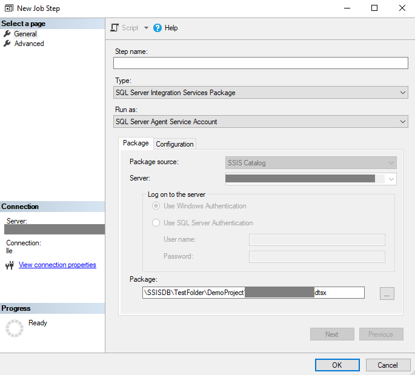
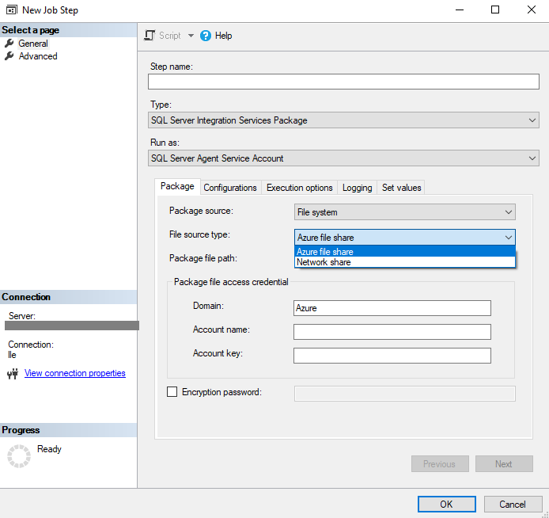

# Execute SSIS packages by Azure SQL Managed Instance Agent
This article describes how to run a SQL Server Integration Services (SSIS) package by using Azure SQL Managed Instance Agent. This feature provides similar behaviors just like when you schedule SSIS packages by SQL Server Agent in your on-prem environment.

With this feature, you can run SSIS packages that are stored in SSISDB of Azure SQL Managed Instance or File System such as Azure Files.

## Prerequisites
To use this feature, download and install the latest version of SSMS, which is version 18.5 or later. Download it from [this website](https://docs.microsoft.com/sql/ssms/download-sql-server-management-studio-ssms?view=sql-server-2017).

And you need to provision an Azure-SSIS Integration Runtime in Azure Data Factory, which uses Azure SQL Managed Instance as endpoint server. If you have not provisioned it already, provision it by following instructions in the [tutorial](tutorial-create-azure-ssis-runtime-portal.md). 

## Run SSIS packages in SSISDB by Azure SQL Managed Instance Agent
In this step, you use Azure SQL Managed Instance Agent to invoke SSIS packages that is stored in SSISDB in Azure SQL Managed Instance.
1. In the latest version of SSMS, connect to Azure SQL Managed Instance.
2. Create a new Agent Job and a new Job step.


3. In the **New Job Step** page, choose **SQL Server Integration Services Package** type.


4. In the **Package** tab, choose **SSIS Catalog** as package source type.
5. Because the SSISDB is in the same Azure SQL Managed Instance, you don't need to specify authentication.
6. Specify an SSIS package from your SSISDB.



7. In the **Configurations** tab, you can specify **parameter** values, override values in **Connection Managers**, override **Property** and choose **Logging level**.


8. After you finished all configuration above, click **OK** to save the Agent Job configuration.
9. Start the Agent Job to execute the SSIS package.


## Run SSIS packages in File System by Azure SQL Managed Instance Agent
In this step, you use Azure SQL Managed Instance Agent to invoke SSIS packages that is stored in File System to run.
1. In the latest version of SSMS, connect to Azure SQL Managed Instance.
2. Create a new Agent Job and a new Job step.

   

3. In the **New Job Step** page, choose **SQL Server Integration Services Package** type.

   

4. In the **Package** tab, choose **File system** as package source type.

   

   1. If your package is uploaded to Azure File, choose **Azure file share** as file source type.
      - The package path is **\\<storage account name>.file.core.windows.net\<file share name>\<package name>.dtsx**
      - Type in the Azure file account name and account key in **Package file access credential** to access the Azure file. The domain is set as **Azure**.
   2. If your package is uploaded to a network share, choose **Network share** as file source type.
      - The package path is the **UNC path** of your package file with its dtsx extension.
      - Type in corresponding **domain**, **username**, and **password** to access the network share package file.
   3. If your package file is encrypted with password, select **Encryption password** and type in the password.

 5. In the **Configurations** tab, type the **configuration file path** if your need a configuration file to execute the SSIS package.
 6. In the **Execution options** tab, you can choose whether to use **windows authentication** or **32-bit runtime** to execute the SSIS package.
 7. In the **Logging** tab, you can choose the **logging path** and corresponding logging access credential to store the log files. By default, the logging path will be the same as the package folder path and the logging access credential will be the same as the package access credential.
 8. In the **Set values** tab, you can type in the **Property Path** and **Value** to override the package properties.
 For example, to override the value of your user variable, enter its path in the following format: **\Package.Variables[User::<variable name>].Value**.
 9. After you finished all configuration above, click **OK** to save the Agent Job configuration.
 10. Start the Agent Job to execute the SSIS package.


 ## Cancel SSIS Package Execution
 To cancel package execution from an Azure SQL Managed Agent job, you should follow below steps instead of directly stopping the agent job.
 1. Find your SQL agent **jobId** from **msdb.dbo.sysjobs**.
 2. Find corresponding SSIS **executionId** based on the job ID by below query:
    ```sql
    select * from ssisdb.internal.execution_parameter_values_noncatalog where  parameter_value = 'SQL_Agent_Job_{jobId}' order by execution_id desc
    ```
 3. Select **Active Operations** under SSIS catalog.

    

 4. Stop corresponding operation based on **executionId**.

## Next Steps
 You can also schedule SSIS packages using Azure Data Factory. For step-by-step instructions, see [Azure Data Factory Event Trigger](how-to-create-event-trigger.md).