# Execute SSIS packages in Azure from SSDT

[!INCLUDE[appliesto-adf-xxx-md](includes/appliesto-adf-xxx-md.md)]

This article describes the feature of Azure-enabled SQL Server Integration Services (SSIS) projects on SQL Server Data Tools (SSDT), which allows you to run packages on Azure-SSIS Integration Runtime (IR) in Azure Data Factory (ADF).  You can use this feature to test your existing SSIS packages before you lift & shift/migrate them to Azure or to develop new SSIS packages to run in Azure.

With this feature, you can create a new Azure-SSIS IR or attach an existing one to SSIS projects and then execute your packages on it.  We support running packages to be deployed into SSIS catalog (SSISDB) in Project Deployment Model and those to be deployed into file systems/file shares/Azure Files in Package Deployment Model. 

## Prerequisites
To use this feature, please download and install the latest SSDT with SSIS Projects extension for Visual Studio from [here](https://marketplace.visualstudio.com/items?itemName=SSIS.SqlServerIntegrationServicesProjects) or as a standalone installer from [here](https://docs.microsoft.com/sql/ssdt/download-sql-server-data-tools-ssdt?view=sql-server-2017#ssdt-for-vs-2017-standalone-installer).

## Azure-enable SSIS projects
### Create new Azure-enabled SSIS projects
On SSDT, you can create new Azure-enabled SSIS projects using the **Integration Services Project (Azure-Enabled)** template.

   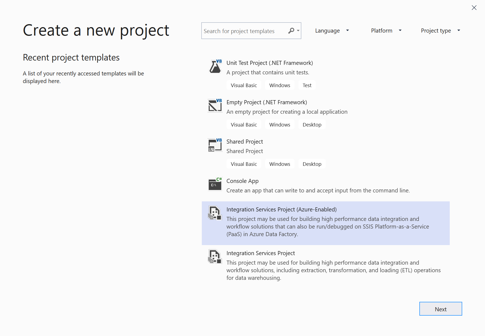

After the Azure-enabled project is created, you will be prompted to connect to SSIS in Azure Data Factory.

   

If you want to connect to your Azure-SSIS IR right away, please refer to [Connect to Azure-SSIS IR](#irconnect) for details. You can also connect later by right-clicking on the project node in Solution Explorer panel of SSDT to pop up a menu and then selecting the **Connect to SSIS in Azure Data Factory** menu item under the **SSIS in Azure Data Factory** submenu.

### Azure-enable existing SSIS projects
For existing SSIS projects, you can Azure-enable them by following these steps:

1. Right-click on the project node in Solution Explorer panel of SSDT to pop up a menu and then selecting the **Azure-Enabled Project** menu item under the **SSIS in Azure Data Factory** submenu to launch the **Azure-Enabled Project Wizard**.

   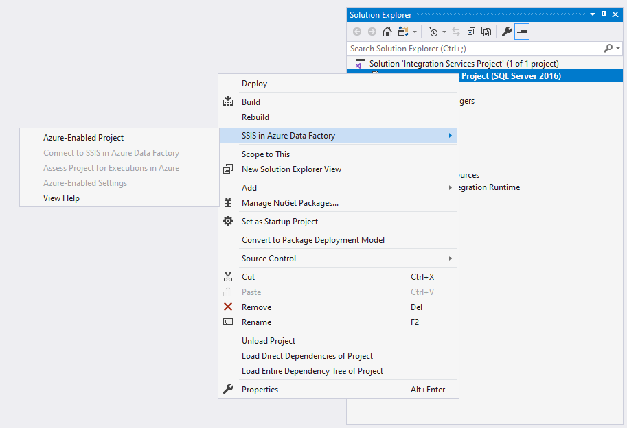

2. On the **Select Visual Studio Configuration** page, select the Visual Studio configuration to apply package execution settings in Azure. A good practice is to create a new Visual Studio configuration for cloud and Azure-enable your project against the cloud configuration. With multiple configurations, you can assign different values to your parameters based on the different environments (either locally or in Azure). Please refer to [this example](#example) for more details.

   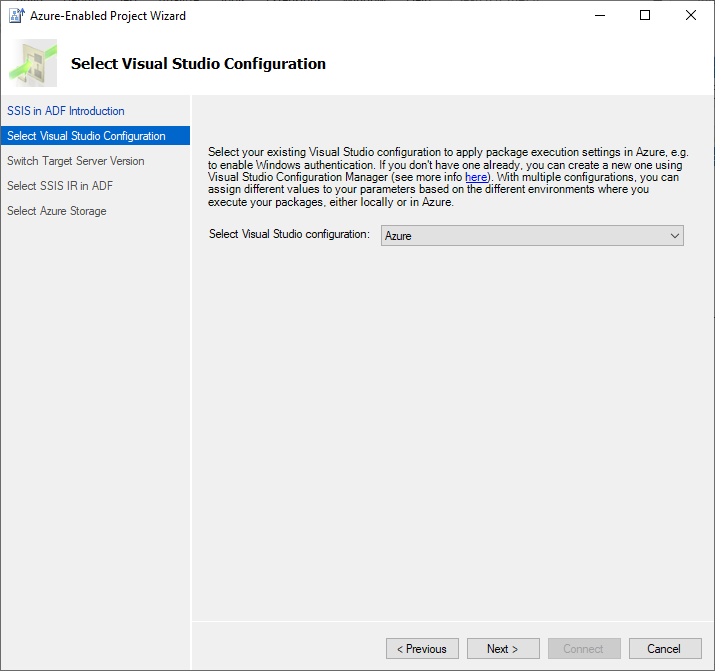

3. Azure-enabling your existing SSIS projects requires you to set their target server version to be the latest one supported by Azure-SSIS IR, which is currently **SQL Server 2017**. So if you have not done so already, you need to check if your package contains additional components that are not supported on SQL Server 2017 and click on the Next button to continue if there is no concern.

   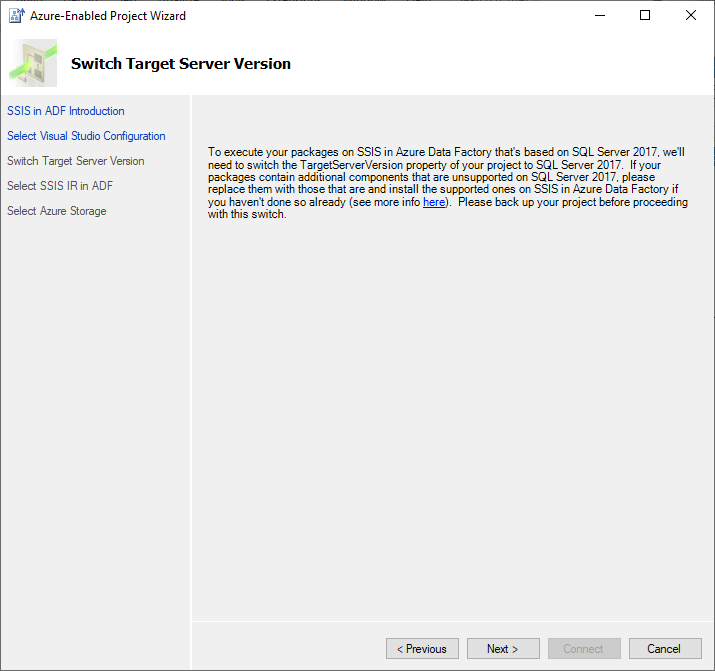

4. Refer to [Connect to Azure-SSIS IR](#irconnect) to complete the connection to Azure-SSIS IR.

##  Connect Azure-enabled projects to SSIS in Azure Data Factory

By connecting your Azure-enabled projects to SSIS in ADF, you can upload your packages into Azure Files and run them on Azure-SSIS IR. To do so, please follow these steps:

1. On the **SSIS in ADF Introduction** page, review the introduction and click on the **Next** button to continue.

   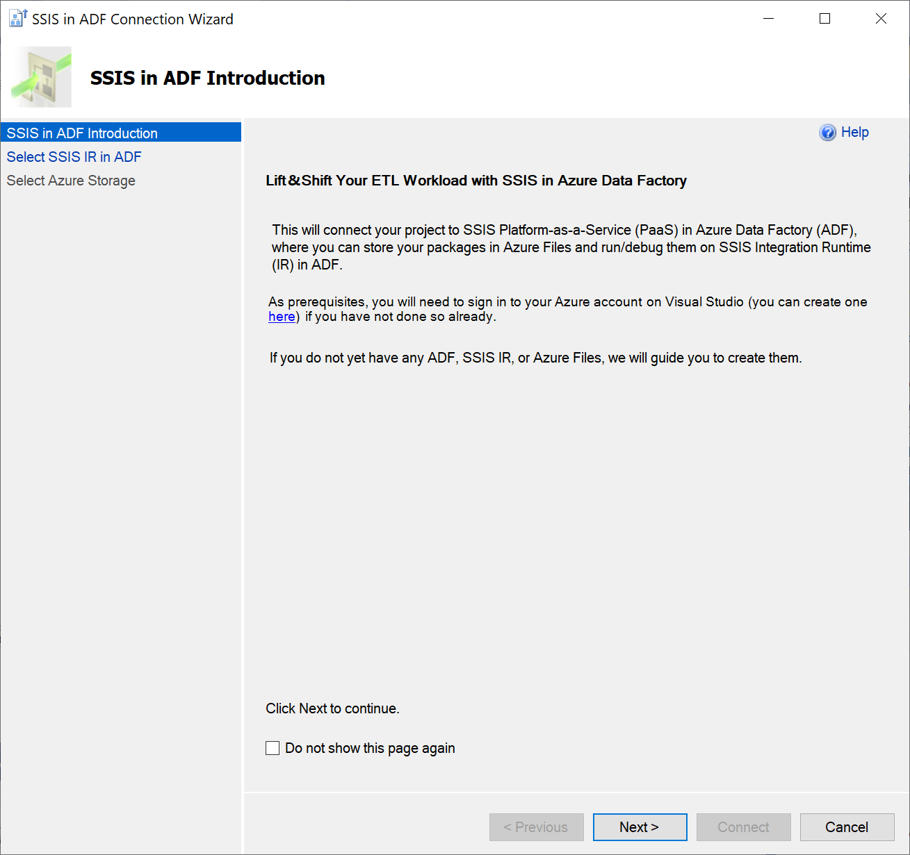

2. On the **Select SSIS IR in ADF** page, select your existing ADF and Azure-SSIS IR to run packages or create new ones if you do not have any.
   - To select your existing Azure-SSIS IR, select the relevant Azure subscription and ADF first.
   - If you select your existing ADF that does not have any Azure-SSIS IR, click on the **Create SSIS IR** button to create a new one on ADF portal/app.
   - If you select your existing Azure subscription that does not have any ADF, click on the **Create SSIS IR** button to launch the **Integration Runtime Creation Wizard**, where you can enter the location and prefix for us to automatically create a new Azure Resource Group, Data Factory, and SSIS IR on your behalf, named in the following pattern: **YourPrefix-RG/DF/IR-YourCreationTime**.

   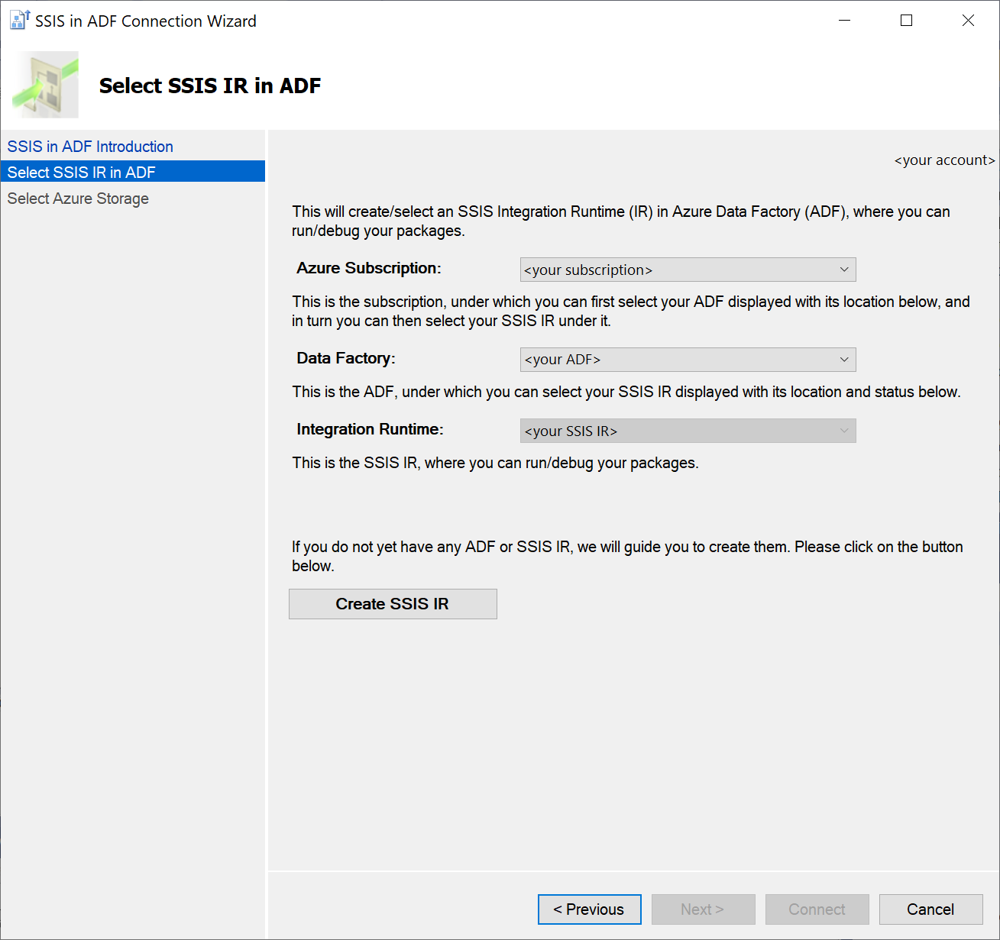

3. On the **Select Azure Storage** page, select your existing Azure Storage account to upload packages into Azure Files or create a new one if you do not have any.
   - To select your existing Azure Storage account, select the relevant Azure subscription first.
   - If you select the same Azure subscription as your Azure-SSIS IR that does not have any Azure Storage account, click on the **Create Azure Storage** button for us to automatically create a new one on your behalf in the same location as your Azure-SSIS IR, named by combining a prefix of your Azure-SSIS IR name and its creation date.
   - If you select a different Azure subscription that does not have any Azure Storage account, click on the **Create Azure Storage** button to create a new one on Azure portal.

   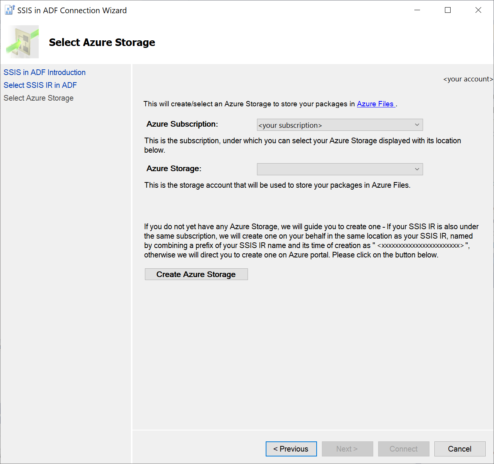

4. Click on the **Connect** button to complete your connection.  We will display your selected Azure-SSIS IR and Azure Storage account under the **Linked Azure Resources** node in Solution Explorer panel of SSDT.  We will also refresh the status of your Azure-SSIS IR, while you can manage it by right-clicking on its node to pop up a menu and then selecting the **Start\Stop\Manage** menu item that takes you to ADF portal/app to do so.

## Assess SSIS project for Executions in Azure
### Assess SSIS project or package
Before executing your packages in Azure, you can assess your package to evaluate whether there is any potential migration blocker or information you need to be aware. 
-  You can either assess all packages under project or single package.

   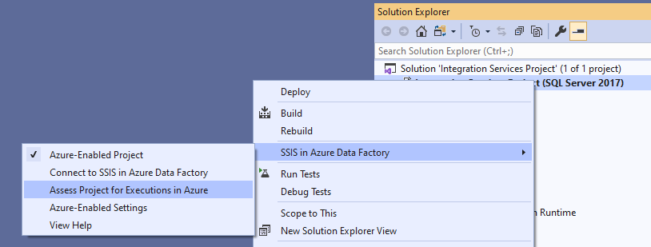
   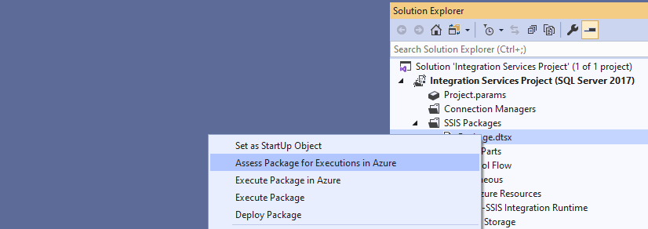

-  You can get assessment report to check each assessment issue and each issue will have detailed description and recommendation if it apply. You can also export assessment report as csv file. 

   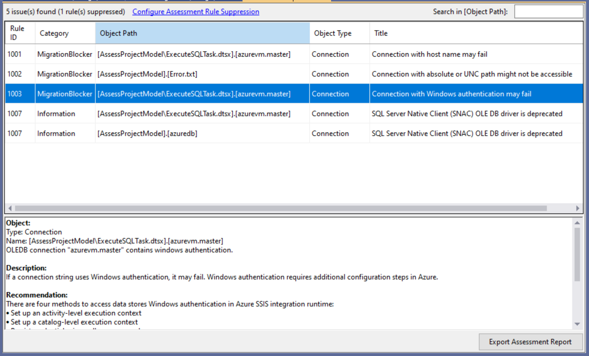

### Suppress Assessment Rule
If you are sure some assessment rule not applied for your package, you can choose to suppress it. 
-  You can directly click the link **Configure Assessment Rule Suppression** in Assessment report.

   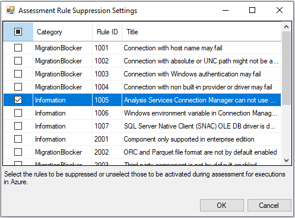

-  You can also configure via **Azure-Enabled Settings**.

   

   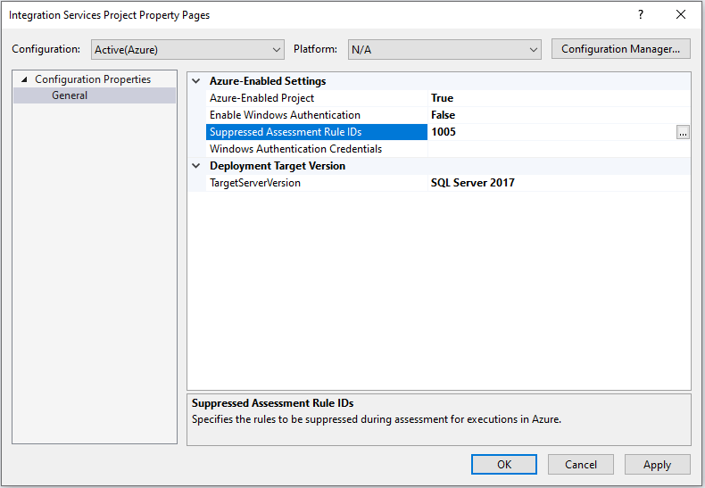

## Execute SSIS packages in Azure
### Azure-enabled Setting
Before executing your packages in Azure, you can choose to configure execution settings. If you want to enable Windows authentication for your SSIS packages, please follow below steps:

1. Right-click on the project node in Solution Explorer panel of SSDT to pop up a menu and then selecting the **Azure-Enabled Settings** menu item under the **SSIS in Azure Data Factory** submenu.

   

2. Click the **Enable Windows Authentication** drop down list and choose **True**. Then click the edit button for **Windows Authentication Credentials** option to enter the credentials.

   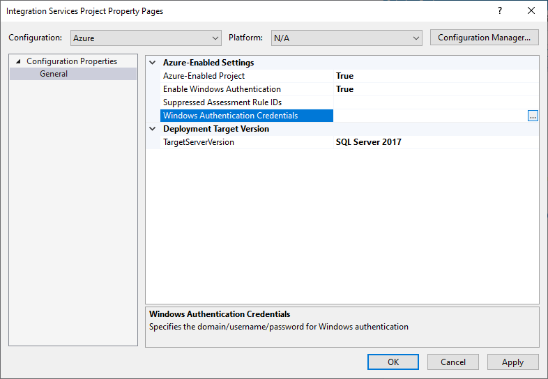

3. Provide credentials in the **Windows Authentication Credentials** editor.

   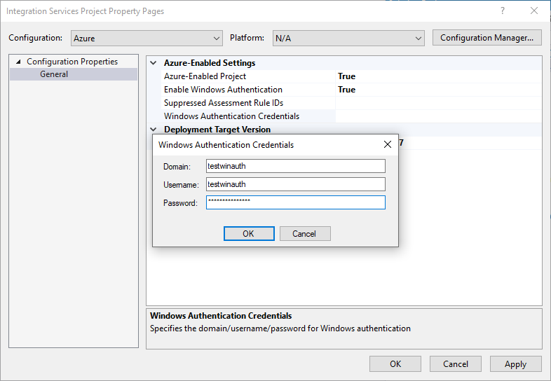

### Starting package executions
After connecting your projects to SSIS in ADF, you can execute packages on Azure-SSIS IR.  You have two options to start package executions:
-  Click on the **Start** button in SSDT toolbar to drop down a menu and select the **Execute in Azure** menu item 

   

-  Right-click on the package node in Solution Explorer panel of SSDT to pop up a menu and select the **Execute Package in Azure** menu item.

   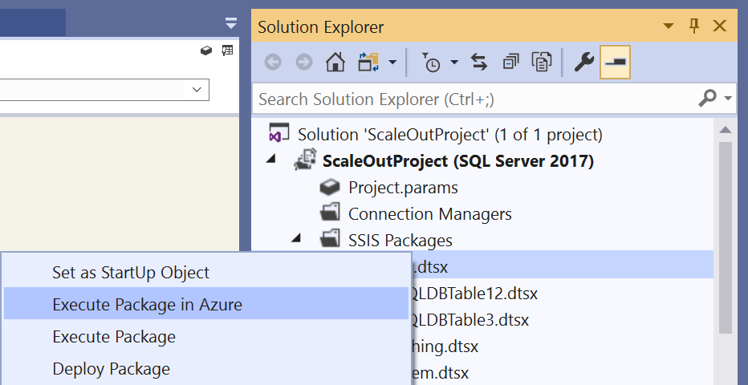

> [!NOTE]
> Executing your packages in Azure requires you to have a running Azure-SSIS IR, so if your Azure-SSIS IR is stopped, a dialog window will pop up to start it.  Excluding any custom setup time, this process should be completed within 5 minutes, but could take approximately 20 - 30 minutes for Azure-SSIS IR joining a virtual network.  After executing your packages in Azure, you can stop your Azure-SSIS IR to manage its running cost by right-clicking on its node in Solution Explorer panel of SSDT to pop up a menu and then selecting the **Start\Stop\Manage** menu item that takes you to ADF portal/app to do so.

### Checking package execution logs
When you start your package execution, we will format and display its log in the Progress window of SSDT.  For a long running package, we will periodically update its log by the minutes.  You can stop your package execution by clicking on the **Stop** button in SSDT toolbar that will immediately cancel it.  You can also temporarily find the log raw data in its Universal Naming Convention (UNC) path: `\\<YourConnectedAzureStorage>.file.core.windows.net\ssdtexecution\<YourProjectName-FirstConnectTime>\<YourPackageName-tmp-ExecutionTime>\logs`, but we will clean it up after one day.

### Switching package protection level
Executing SSIS packages in Azure does not support **EncryptSensitiveWithUserKey**/**EncryptAllWithUserKey** protection levels.  Consequently, if your packages are configured with those, we will temporarily switch them into **EncryptSensitiveWithPassword**/**EncryptAllWithPassword**, respectively, with randomly generated passwords when we upload your packages into Azure Files for execution on your Azure-SSIS IR.

> [!NOTE]
> If your packages contain Execute Package Tasks that refer to other packages configured with **EncryptSensitiveWithUserKey**/**EncryptAllWithUserKey** protection levels, you need to manually reconfigure those other packages to use **EncryptSensitiveWithPassword**/**EncryptAllWithPassword**, respectively, before executing your packages.

If your packages are already configured with **EncryptSensitiveWithPassword**/**EncryptAllWithPassword** protection levels, we will keep them unchanged, but will still use randomly generated passwords when we upload your packages into Azure Files for execution on your Azure-SSIS IR.

### Using package configuration file
If you use package configuration files in the Package Deployment Model to change variable values at run time, we will automatically upload those files with your packages into Azure Files for execution on your Azure-SSIS IR.

### Using Execute Package Task
If your packages contain Execute Package Tasks that refer to other packages stored on local file systems, you need to perform the following additional setups:

1. Upload the other packages into Azure Files under the same Azure Storage account connected to your projects and get their new UNC path, e.g. `\\test.file.core.windows.net\ssdtexecution\Package1.dtsx`

2. Replace the file path of those other packages in the File Connection Manager of Execute Package Tasks with their new UNC path
   - If your machine running SSDT cannot access the new UNC path, you can change the file path on Properties panel of File Connection Manager
   - Alternatively, you can use a variable for the file path to assign the right value at run time

If your packages contain Execute Package Tasks that refer to other packages in the same project, no additional setup is necessary.

##  Switching package execution environments with Azure-enabled projects

To switch package execution environments with Azure-enabled projects, you can create multiple Visual Studio configurations to apply different values for environment-specific parameters. For example, there is a simple SSIS package with a **File System Task** which sets attributes of the specified file, you can simply migrate it to cloud using the following steps:

1. Define a parameter **FilePath** of string type, which is the file path of the target file.

   

2. Associate the **Source Connection** with this parameter. 

   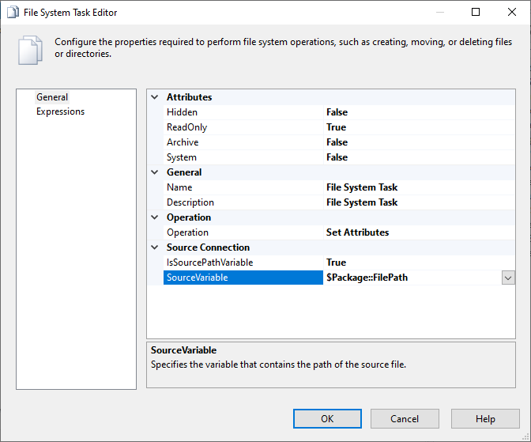

3. Create new Visual Studio configuration for cloud in Visual Studio Configuration Manager.

4. Define the values for this parameter against each Visual Studio configuration.

   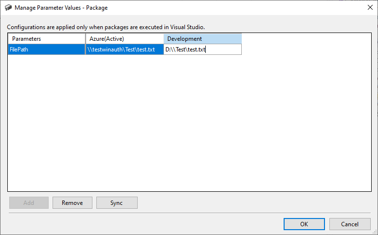

5. Azure-enabled this SSIS project against the Visual Studio configuration for cloud.

6. Execute this package in Azure. You can easily switch the environment back to the local one by switching the current Visual Studio configuration.

   

## Current limitations
-  This SSDT feature hasn't support national cloud yet.

## Next steps
Once you are satisfied with running your packages in Azure from SSDT, you can deploy and run them as Execute SSIS Package activities in ADF pipelines, see [Run SSIS packages as Execute SSIS Package activities in ADF pipelines](https://docs.microsoft.com/azure/data-factory/how-to-invoke-ssis-package-ssis-activity).
