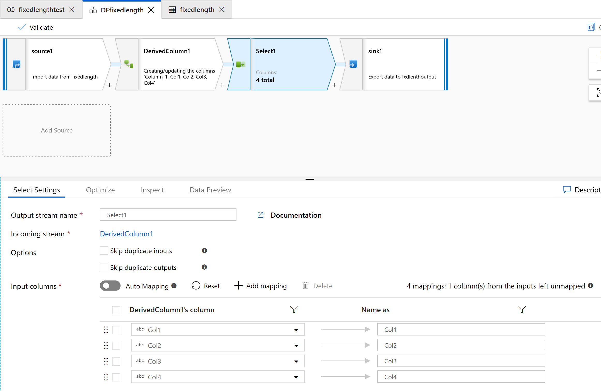

# Process fixed-length text files using Data Factory Mapping Data Flows

## Create a pipeline

* Go to **+New Pipeline** to start a new pipeline

* Add a data flow activity which will be used for processing fixed-width files


* In the Data Flow activity, select New Mappign Data Flow

* Add a Source transformation, Derived Column, Select, and Sink Transformation


* Configure the Source transformation to use a new dataset that will be of type Delimited Text

* Set no column delimiter and no headers

We're going to simply set field starting points and lengths for this file contents:

```
1234567813572468
1234567813572468
1234567813572468
1234567813572468
1234567813572468
1234567813572468
1234567813572468
1234567813572468
1234567813572468
1234567813572468
1234567813572468
1234567813572468
1234567813572468
```

* On the Projection tab of your Source transformation, you should see one string column called "Column_1"

* Now in the Derived Column, create a new column

* Give column name col1 and then in expression type: substring(Column_1,1,4)


* Repeat this for all the columns you need to parse

* Click on the Inspect tab to see the new columns that will be generated


* Use the Select transform to remove any of the columns that you will not need for transformation



* Finally, use Sink to output the data to a folder:


* Here is an example output:


* The fixed-width data is now split with 4 characters each and assigned to Col1, Col2, Col3, Col4, etc,=. based on the above example I am splitting into 4 columns

## Next steps

* Build the rest of your data flow logic using Mapping Data Flow [transformations](concepts-data-flow-overview.md)
