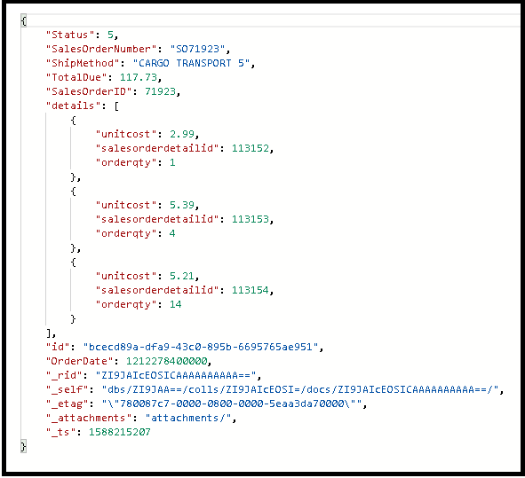

# Migrate normalized database schema from Azure SQL Database to Azure CosmosDB denormalized container

This guide will explain how to take an existing normalized database schema in Azure SQL Database and convert it into an Azure CosmosDB denomarlized schema in Azure CosmosDB. SQL schemas are typically modeled using third normal form and normalized schemas to provide high levels of data integrity and fewer duplicate data. Queries can join entities together across tables. CosmosDB is optimized for super-quick transactions and querying within a collection or container via denormalized schemas with data self-contained inside a document.

Using Azure Data Factory, we'll build a pipeline that uses a single Mapping Data Flow to read from two Azure SQL Database normalized tables that contain primary and foreign keys as the entity relationship. ADF will join those tables into a single stream using the data flow Spark engine, collect joined rows into arrays and produce individual cleansed documents for insert into a new Azure CosmosDB container.

This guide will build a new container on the fly called "Orders" that will use ```SalesOrderHeader``` and ```SalesOrderDetail``` from the standard SQL Server AdventureWorks sample database. Those tables represent sales transactions joined by ```SalesOrderID```. Each unique detail records has its own primary key of ```SalesOrderDetailID```. The relationship between header and detail is ```1:M```. We'll join on ```SalesOrderID``` in ADF and then roll each related detail record into an array called "detail".

The representative SQL query for this guide is:

```
  SELECT
  o.SalesOrderID,
  o.OrderDate,
  o.Status,
  o.ShipDate,
  o.SalesOrderNumber,
  o.ShipMethod,
  o.SubTotal,
  (select SalesOrderDetailID, UnitPrice, OrderQty from SalesLT.SalesOrderDetail od where od.SalesOrderID = o.SalesOrderID for json auto) as OrderDetails
FROM SalesLT.SalesOrderHeader o;
```

The resulting CosmosDB container will embed the inner query into a single document and look like this:



## Create a pipeline

1. Select **+New Pipeline** to create a new pipeline.

2. Add a data flow activity

3. In the data flow activity, select **New mapping data flow**.

4. We will construct this data flow graph below


5. Define the source for "SourceOrderDetails". For dataset, create a new Azure SQL Database dataset that points to the ```SalesOrderDetail``` table.

6. Define the source for "SourceOrderHeader". For dataset, create a new Azure SQL Database dataset that points to the ```SalesOrderHeader``` table.

7. On the top source, add a Derived Column transformation after "SourceOrderDetails". Call the new transformation "TypeCast". We need to round the ```UnitPrice``` column and cast it to a double data type for CosmosDB. Set the formula to: ```toDouble(round(UnitPrice,2))```.

8. 

## Next steps

* Build the rest of your data flow logic by using mapping data flows [transformations](concepts-data-flow-overview.md).
