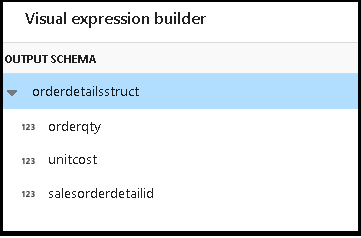
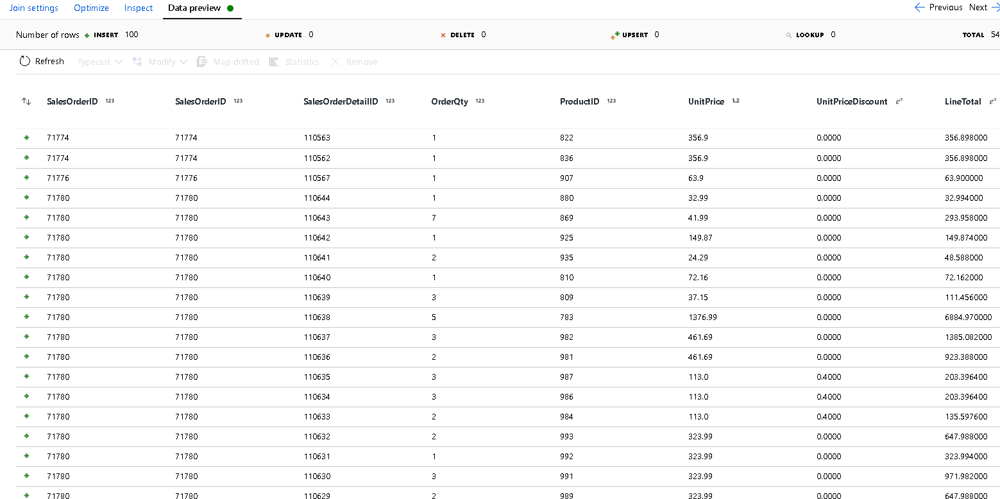
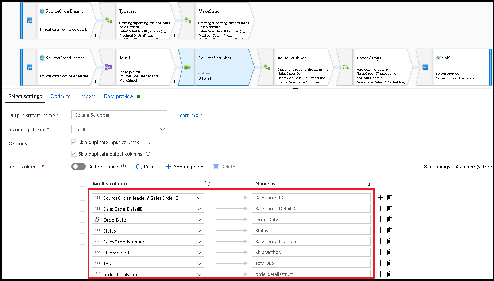
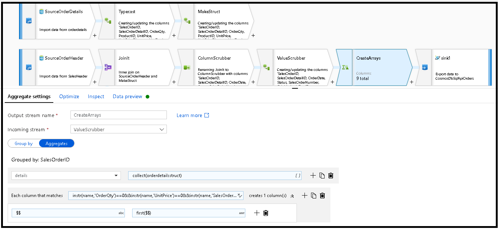
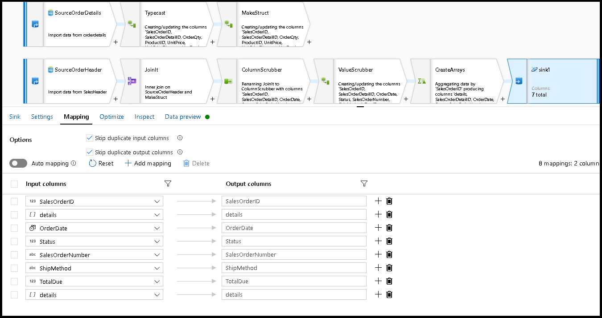
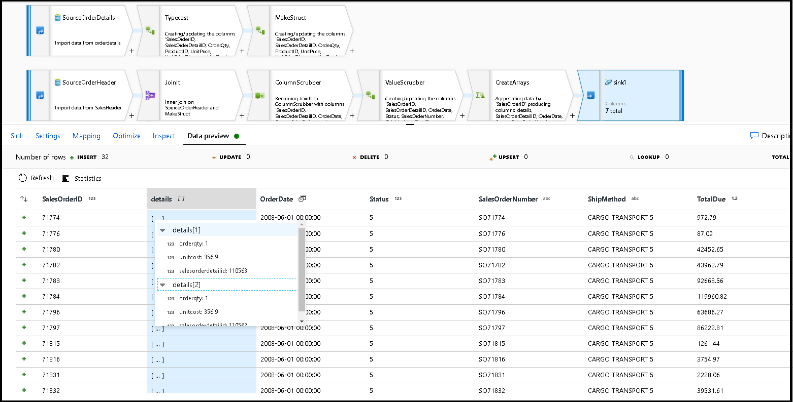

# Migrate normalized database schema from Azure SQL Database to Azure CosmosDB denormalized container

This guide will explain how to take an existing normalized database schema in Azure SQL Database and convert it into an Azure CosmosDB denormarlized schema for loading into Azure CosmosDB.

SQL schemas are typically modeled using third normal form, resulting in normalized schemas that provide high levels of data integrity and fewer duplicate data values. Queries can join entities together across tables for reading. CosmosDB is optimized for super-quick transactions and querying within a collection or container via denormalized schemas with data self-contained inside a document.

Using Azure Data Factory, we'll build a pipeline that uses a single Mapping Data Flow to read from two Azure SQL Database normalized tables that contain primary and foreign keys as the entity relationship. ADF will join those tables into a single stream using the data flow Spark engine, collect joined rows into arrays and produce individual cleansed documents for insert into a new Azure CosmosDB container.

This guide will build a new container on the fly called "orders" that will use the ```SalesOrderHeader``` and ```SalesOrderDetail``` tables from the standard SQL Server AdventureWorks sample database. Those tables represent sales transactions joined by ```SalesOrderID```. Each unique detail records has its own primary key of ```SalesOrderDetailID```. The relationship between header and detail is ```1:M```. We'll join on ```SalesOrderID``` in ADF and then roll each related detail record into an array called "detail".

The representative SQL query for this guide is:

```
  SELECT
  o.SalesOrderID,
  o.OrderDate,
  o.Status,
  o.ShipDate,
  o.SalesOrderNumber,
  o.ShipMethod,
  o.SubTotal,
  (select SalesOrderDetailID, UnitPrice, OrderQty from SalesLT.SalesOrderDetail od where od.SalesOrderID = o.SalesOrderID for json auto) as OrderDetails
FROM SalesLT.SalesOrderHeader o;
```

The resulting CosmosDB container will embed the inner query into a single document and look like this:


## Create a pipeline

1. Select **+New Pipeline** to create a new pipeline.

2. Add a data flow activity

3. In the data flow activity, select **New mapping data flow**.

4. We will construct this data flow graph below


5. Define the source for "SourceOrderDetails". For dataset, create a new Azure SQL Database dataset that points to the ```SalesOrderDetail``` table.

6. Define the source for "SourceOrderHeader". For dataset, create a new Azure SQL Database dataset that points to the ```SalesOrderHeader``` table.

7. On the top source, add a Derived Column transformation after "SourceOrderDetails". Call the new transformation "TypeCast". We need to round the ```UnitPrice``` column and cast it to a double data type for CosmosDB. Set the formula to: ```toDouble(round(UnitPrice,2))```.

8. Add another derived column and call it "MakeStruct". This is where we will create a hierarchical structure to hold the values from the details table. Remember, details is a ```M:1``` relation to header. Name the new structure ```orderdetailsstruct``` and create the hierarchy in this way, setting each subcolumn to the incoming column name:



9. Now, let's go to the sales header source. Add a Join transformation. For the right-side select "MakeStruct". Leave it set to inner join and choose ```SalesOrderID``` for both sides of the join condition.

10. Click on the Data Preview tab in the new join that you added so that you can see your results up to this point. You should see all of the header rows joined with the detail rows. This is the result of the join being formed from the ```SalesOrderID```. Next, we'll combine the details from the common rows into the details struct and aggregate the common rows.



11. Before we can create the arrays to denormalize these rows, we first need to remove unwanted columns and make sure the data values will match CosmosDB data types.

12. Add a Select transformation next and set the field mapping to look like this:



13. Now let's again cast a currency column, this time ```TotalDue```. Like we did above in step 7, set the formula to: ```toDouble(round(TotalDue,2))```.

14. Here's where we will denormalize the rows by grouping by the common key ```SalesOrderID```. Add an Aggregate transformation and set the group by to ```SalesOrderID```.

15. In the aggregate formula, add a new column called "details" and use this formula to collect the values in the structure that we created earlier called ```orderdetailsstruct```: ```collect(orderdetailsstruct)```.

16. The aggregate transformation will only output columns that are part of aggregate or group by formulas. So, we need to include the columns from the sales header as well. To do that, add a column pattern in that same aggregate transformation. This pattern will include all other columns in the output:

```instr(name,'OrderQty')==0&&instr(name,'UnitPrice')==0&&instr(name,'SalesOrderID')==0```

17. Use the "this" syntax in the other properties so that we maintain the same column names and use the ```first()``` function as an aggregate:



18. We're ready to finish the migration flow by adding a sink transformation. Click "new" next to dataset and add a CosmosDB dataset that points to your CosmosDB database. For the collection, we'll call it "orders" and it will have no schema and no documents because it will be created on the fly.

19. In Sink Settings, Partition Key to ```\SalesOrderID``` and collection action to "recreate". Make sure your mapping tab looks like this:



20. Click on data preview to make sure that you are seeing these 32 rows set to insert as new documents into your new container:



If everything looks good, you are now ready to create a new pipeline, add this data flow activity to that pipeline and execute it. You can execute from debug or a triggered run. After a few minutes, you should have a new denormalized container of orders called "orders" in your CosmosDB database.

## Next steps

* Build the rest of your data flow logic by using mapping data flows [transformations](concepts-data-flow-overview.md).
