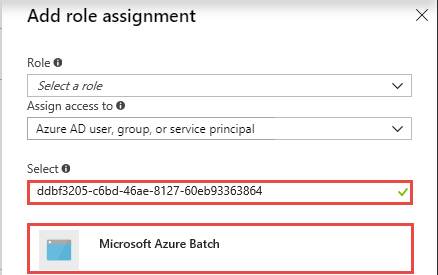
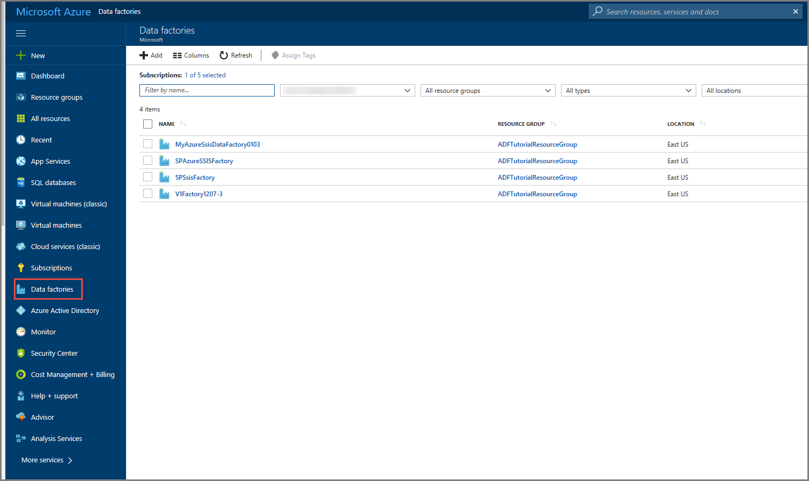
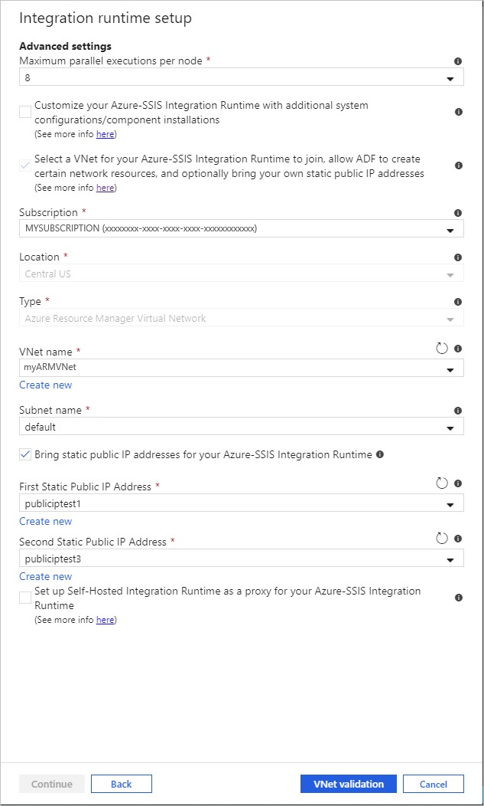

# Join an Azure-SSIS integration runtime to a virtual network
Join your Azure-SSIS integration runtime (IR) to an Azure virtual network in the following scenarios: 

- You are hosting the SQL Server Integration Services (SSIS) catalog database on Azure SQL Database Managed Instance (private preview) in a virtual network.
- You want to connect to on-premises data stores from SSIS packages running on an Azure-SSIS integration runtime.

 Azure Data Factory version 2 (Preview) lets you join your Azure-SSIS integration runtime to a virtual network created through the classic deployment model or the Azure Resource Manager deployment model. 

> [!NOTE]
> This article applies to version 2 of Data Factory, which is currently in preview. If you are using version 1 of the Data Factory service, which is in generally availability (GA), see the [Data Factory version 1 documentation](v1/data-factory-introduction.md).

## Access to on-premises data stores
If SSIS packages access only public cloud data stores, you don't need to join the Azure-SSIS IR to a virtual network. If SSIS packages access on-premises data stores, you must join the Azure-SSIS IR to a virtual network that is connected to the on-premises network. 

If the SSIS catalog is hosted in an Azure SQL Database instance that is not in the virtual network, you need to open appropriate ports. 

If the SSIS catalog is hosted in SQL Database Managed Instance in a virtual network, you can join an Azure-SSIS IR to:

- The same virtual network.
- A different virtual network that has a network-to-network connection with the one that has SQL Database Managed Instance. 

The virtual network can be deployed through the classic deployment model or the Azure Resource Manager deployment model. If you're planning to join the Azure-SSIS IR in the *same virtual network* that has SQL Database Managed Instance, ensure that the Azure-SSIS IR is in a *different subnet* from the one that has SQL Database Managed Instance.   

The following sections provide more details.

Here are a few important points to note: 

- If there is no existing virtual network connected to your on-premises network, first create an [Azure Resource Manager virtual network](../virtual-network/quick-create-portal.md#create-a-virtual-network) or a [classic virtual network](../virtual-network/virtual-networks-create-vnet-classic-pportal.md) for your Azure-SSIS integration runtime to join. Then, configure a site-to-site [VPN gateway connection](../vpn-gateway/vpn-gateway-howto-site-to-site-classic-portal.md) or [ExpressRoute](../expressroute/expressroute-howto-linkvnet-classic.md) connection from that virtual network to your on-premises network.
- If there is an existing Azure Resource Manager or classic virtual network connected to your on-premises network in the same location as your Azure-SSIS IR, you can join the IR to that virtual network.
- If there is an existing classic virtual network connected to your on-premises network in a different location from your Azure-SSIS IR, you can first create a [classic virtual network](../virtual-network/virtual-networks-create-vnet-classic-pportal.md) for your Azure-SSIS IR to join. Then, configure a [classic-to-classic virtual network](../vpn-gateway/vpn-gateway-howto-vnet-vnet-portal-classic.md) connection. Or you can create an [Azure Resource Manager virtual network](../virtual-network/quick-create-portal.md#create-a-virtual-network) for your Azure-SSIS integration runtime to join. Then configure a [classic-to-Azure Resource Manager virtual network](../vpn-gateway/vpn-gateway-connect-different-deployment-models-portal.md) connection.
- If there is an existing Azure Resource Manager virtual network connected to your on-premises network in a different location from your Azure-SSIS IR, you can first create an [Azure Resource Manager virtual network](../virtual-network/quick-create-portal.md##create-a-virtual-network) for your Azure-SSIS IR to join. Then, configure an Azure Resource Manger-to-Azure Resource Manager virtual network connection. Or, you can create a [classic virtual network](../virtual-network/virtual-networks-create-vnet-classic-pportal.md) for your Azure-SSIS IR to join. Then, configure a [classic-to-Azure Resource Manager virtual network](../vpn-gateway/vpn-gateway-connect-different-deployment-models-portal.md) connection.

## Domain Name Services server 
If you need to use your own Domain Name Services (DNS) server in a virtual network joined by your Azure-SSIS integration runtime, follow guidance to [ensure that the nodes of your Azure-SSIS integration runtime in the virtual network can resolve Azure endpoints](../virtual-network/virtual-networks-name-resolution-for-vms-and-role-instances.md#name-resolution-using-your-own-dns-server).

## Network security group
If you need to implement a network security group (NSG) in a virtual network joined by your Azure-SSIS integration runtime, allow inbound/outbound traffic through the following ports:

| Ports | Direction | Transport protocol | Purpose | Inbound source/outbound destination |
| ---- | --------- | ------------------ | ------- | ----------------------------------- |
| 10100, 20100, 30100 (if you join the IR to a classic virtual network)<br/><br/>29876, 29877 (if you join the IR to an Azure Resource Manager virtual network) | Inbound | TCP | Azure services use these ports to communicate with the nodes of your Azure-SSIS integration runtime in the virtual network. | Internet | 
| 443 | Outbound | TCP | The nodes of your Azure-SSIS integration runtime in the virtual network use this port to access Azure services, like Azure Storage and Azure Event Hubs. | Internet | 
| 1433<br/>11000-11999<br/>14000-14999  | Outbound | TCP | The nodes of your Azure-SSIS integration runtime in the virtual network use these ports to access SSISDB hosted by your Azure SQL Database server (This purpose is not applicable to SSISDB hosted by SQL Database Managed Instance.) | Internet | 

## Azure portal (Data Factory UI)
This section shows you how to join an existing Azure-SSIS runtime to a virtual network (classic or Azure Resource Manager) by using the Azure portal and Data Factory UI. First, you need to configure the virtual network appropriately before joining your Azure-SSIS IR to it. Go through one of the next two sections based on the type of your virtual network (classic or Azure Resource Manager). Then, continue with the third section to join your Azure-SSIS IR to the virtual network. 

### Use the portal to configure a classic virtual network
You need to configure a virtual network before you can join an Azure-SSIS IR to it.

1. Start Microsoft Edge or Google Chrome. Currently, the Data Factory UI is supported only in these web browsers.
2. Sign in to the [Azure portal](https://portal.azure.com).
3. Select **More services**. Filter for and select **Virtual networks (classic)**.
4. Filter for and select your virtual network in the list. 
5. On the **Virtual network (classic)** page, select **Properties**. 

	
5. Select the copy button for **RESOURCE ID** to copy the resource ID for the classic network to the clipboard. Save the ID from the clipboard in OneNote or a file.
6. Select **Subnets** on the left menu. Ensure that the number of **available addresses** is greater than the nodes in your Azure-SSIS integration runtime.

	
7. Join **MicrosoftAzureBatch** to the **Classic Virtual Machine Contributor** role for the virtual network.

	a. Select **Access control (IAM)** on the left menu, and select **Add** on the toolbar.	
	   

	b. On the **Add permissions** page, select **Classic Virtual Machine Contributor** for **Role**. Paste **ddbf3205-c6bd-46ae-8127-60eb93363864** in the **Select** box, and then select **Microsoft Azure Batch** from the list of search results. 	
	   

	c. Select **Save** to save the settings and to close the page.	
	   

	d. Confirm that you see **Microsoft Azure Batch** in the list of contributors.	
	   

5. Verify that the Azure Batch provider is registered in the Azure subscription that has the virtual network. Or, register the Azure Batch provider. If you already have an Azure Batch account in your subscription, then your subscription is registered for Azure Batch.

   a. In Azure portal, select **Subscriptions** on the left menu.

   b. Select your subscription.

   c. Select **Resource providers** on the left, and confirm that **Microsoft.Batch** is a registered provider. 	
      

   If you don't see **Microsoft.Batch** in the list, to register it, [create an empty Azure Batch account](../batch/batch-account-create-portal.md) in your subscription. You can delete it later. 

### Use the portal to configure an Azure Resource Manager virtual network
You need to configure a virtual network before you can join an Azure-SSIS IR to it.

1. Start Microsoft Edge or Google Chrome. Currently, the Data Factory UI is supported only in those web browsers.
2. Sign in to the [Azure portal](https://portal.azure.com).
3. Select **More services**. Filter for and select **Virtual networks**.
4. Filter for and select your virtual network in the list. 
5. On the **Virtual network** page, select **Properties**. 
6. Select the copy button for **RESOURCE ID** to copy the resource ID for the virtual network to the clipboard. Save the ID from the clipboard in OneNote or a file.
7. Select **Subnets** on the left menu. Ensure that the number of **available addresses** is greater than the nodes in your Azure-SSIS integration runtime.
8. Verify that the Azure Batch provider is registered in the Azure subscription that has the virtual network. Or, register the Azure Batch provider. If you already have an Azure Batch account in your subscription, then your subscription is registered for Azure Batch.

   a. In Azure portal, select **Subscriptions** on the left menu.

   b. Select your subscription. 
   
   c. Select **Resource providers** on the left, and confirm that **Microsoft.Batch** is a registered provider. 	
      

   If you don't see **Microsoft.Batch** in the list, to register it, [create an empty Azure Batch account](../batch/batch-account-create-portal.md) in your subscription. You can delete it later.

### Join the Azure-SSIS IR to a virtual network


1. Start Microsoft Edge or Google Chrome. Currently, the Data Factory UI is supported only in those web browsers.
2. In the [Azure portal](https://portal.azure.com), select **Data factories** on the left menu. If you don't see **Data factories** on the menu, select **More services**, and the select **Data factories** in the **INTELLIGENCE + ANALYTICS** section. 
    
   
2. Select your data factory with the Azure-SSIS integration runtime in the list. You see the home page for your data factory. Select the **Author & Deploy** tile. You see the Data Factory UI on a separate tab. 

   
3. In the Data Factory UI, switch to the **Edit** tab, select **Connections**, and switch to the **Integration Runtimes** tab. 

   
4. If your Azure-SSIS IR is running, in the integration runtime list, select the **Stop** button in the **Actions** column for your Azure-SSIS IR. You cannot edit an IR until you stop it. 

   
1. In the integration runtime list, select the **Edit** button in the **Actions** column for your Azure-SSIS IR.

   
5. On the **General settings** page of the **Integration Runtime Setup** window, select **Next**. 

   
6. On the **SQL Settings** page, enter the administrator password, and select **Next**.

   
7. On the **Advanced Settings** page, do the following actions: 

   a. Select the check box for **Select a VNet for your Azure-SSIS Integration Runtime to join and allow Azure services to configure VNet permissions/settings**.

   b. For **Type**, specify whether the virtual network is a classic virtual network or an Azure Resource Manager virtual network. 

   c. For **VNet Name**, select your virtual network.

   d. For **Subnet Name**, select your subnet in the virtual network.

   e. Select **Update**. 

   
8. Now, you can start the IR by using the **Start** button in the **Actions** column for your Azure-SSIS IR. It takes approximately 20 minutes to start an Azure-SSIS IR. 


## Azure PowerShell

### Configure a virtual network
You need to configure a virtual network before you can join an Azure-SSIS IR to it. To automatically configure virtual network permissions/settings for your Azure-SSIS integration runtime to join the virtual network, add the following script:

```powershell
# Register to the Azure Batch resource provider
if(![string]::IsNullOrEmpty($VnetId) -and ![string]::IsNullOrEmpty($SubnetName))
{
    $BatchObjectId = (Get-AzureRmADServicePrincipal -ServicePrincipalName "MicrosoftAzureBatch").Id
    Register-AzureRmResourceProvider -ProviderNamespace Microsoft.Batch
    while(!(Get-AzureRmResourceProvider -ProviderNamespace "Microsoft.Batch").RegistrationState.Contains("Registered"))
    {
    Start-Sleep -s 10
    }
    if($VnetId -match "/providers/Microsoft.ClassicNetwork/")
    {
        # Assign the VM contributor role to Microsoft.Batch
        New-AzureRmRoleAssignment -ObjectId $BatchObjectId -RoleDefinitionName "Classic Virtual Machine Contributor" -Scope $VnetId
    }
}
```

### Create an Azure-SSIS IR and join it to a virtual network
You can create an Azure-SSIS IR and join it to a virtual network at the same time. For the complete script and instructions, see [Create an Azure-SSIS integration runtime](create-azure-ssis-integration-runtime.md#azure-powershell).

### Join an existing Azure-SSIS IR to a virtual network
The script in the [Create an Azure-SSIS integration runtime](create-azure-ssis-integration-runtime.md) article shows you how to create an Azure-SSIS IR and join it to a virtual network in the same script. If you have an existing Azure-SSIS IR, perform the following steps to join it to the virtual network: 

1. Stop the Azure-SSIS IR.
2. Configure the Azure-SSIS IR to join the virtual network. 
3. Start the Azure-SSIS IR. 

### Define the variables

```powershell
$ResourceGroupName = "<Azure resource group name>"
$DataFactoryName = "<Data factory name>" 
$AzureSSISName = "<Specify Azure-SSIS IR name>"
## These two parameters apply if you are using a virtual network and Azure SQL Database Managed Instance (private preview) 
# Specify information about your classic or Azure Resource Manager virtual network.
$VnetId = "<Name of your Azure virtual network>"
$SubnetName = "<Name of the subnet in the virtual network>"
```

### Stop the Azure-SSIS IR
Stop the Azure-SSIS integration runtime before you can join it to a virtual network. This command releases all of its nodes and stops billing:

```powershell
Stop-AzureRmDataFactoryV2IntegrationRuntime -ResourceGroupName $ResourceGroupName `
                                             -DataFactoryName $DataFactoryName `
                                             -Name $AzureSSISName `
                                             -Force 
```
### Configure virtual network settings for the Azure-SSIS IR to join
Register to the Azure Batch resource provider:

```powershell
if(![string]::IsNullOrEmpty($VnetId) -and ![string]::IsNullOrEmpty($SubnetName))
{
    $BatchObjectId = (Get-AzureRmADServicePrincipal -ServicePrincipalName "MicrosoftAzureBatch").Id
    Register-AzureRmResourceProvider -ProviderNamespace Microsoft.Batch
    while(!(Get-AzureRmResourceProvider -ProviderNamespace "Microsoft.Batch").RegistrationState.Contains("Registered"))
    {
        Start-Sleep -s 10
    }
    if($VnetId -match "/providers/Microsoft.ClassicNetwork/")
    {
        # Assign VM contributor role to Microsoft.Batch
        New-AzureRmRoleAssignment -ObjectId $BatchObjectId -RoleDefinitionName "Classic Virtual Machine Contributor" -Scope $VnetId
    }
}
```

### Configure the Azure-SSIS IR
To configure the Azure-SSIS integration runtime to join the virtual network, run the `Set-AzureRmDataFactoryV2IntegrationRuntime` command: 

```powershell
Set-AzureRmDataFactoryV2IntegrationRuntime  -ResourceGroupName $ResourceGroupName `
                                            -DataFactoryName $DataFactoryName `
                                            -Name $AzureSSISName `
                                            -Type Managed `
                                            -VnetId $VnetId `
                                            -Subnet $SubnetName
```

### Start the Azure-SSIS IR
To start the Azure-SSIS integration runtime, run the following command: 

```powershell
Start-AzureRmDataFactoryV2IntegrationRuntime -ResourceGroupName $ResourceGroupName `
                                             -DataFactoryName $DataFactoryName `
                                             -Name $AzureSSISName `
                                             -Force

```
This command takes 20 to 30 minutes to finish.

## Next steps
For more information about the Azure-SSIS runtime, see the following topics: 

- [Azure-SSIS integration runtime](concepts-integration-runtime.md#azure-ssis-integration-runtime). This article provides conceptual information about integration runtimes in general, including the Azure-SSIS IR. 
- [Tutorial: deploy SSIS packages to Azure](tutorial-create-azure-ssis-runtime-portal.md). This article provides step-by-step instructions to create an Azure-SSIS IR. It uses an Azure SQL database to host the SSIS catalog. 
- [Create an Azure-SSIS integration runtime](create-azure-ssis-integration-runtime.md). This article expands on the tutorial and provides instructions on using Azure SQL Database Managed Instance (private preview) and joining the IR to a virtual network. 
- [Monitor an Azure-SSIS IR](monitor-integration-runtime.md#azure-ssis-integration-runtime). This article shows you how to retrieve information about an Azure-SSIS IR and descriptions of statuses in the returned information. 
- [Manage an Azure-SSIS IR](manage-azure-ssis-integration-runtime.md). This article shows you how to stop, start, or remove an Azure-SSIS IR. It also shows you how to scale out your Azure-SSIS IR by adding nodes. 
