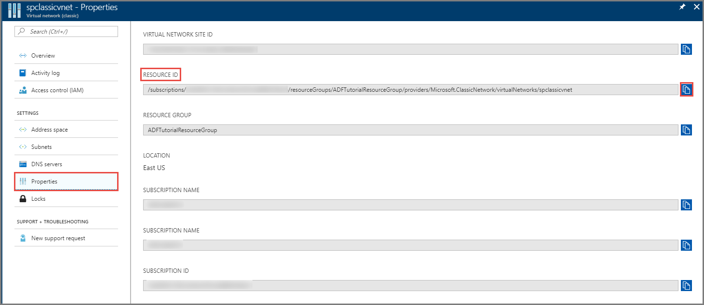

# Join an Azure-SSIS integration runtime to a virtual network
If you use an Azure SQL Managed Instance (Private Preview) to host the SQL Server Integration Services (SSIS) catalog inside a virtual network (VNet), you must also join your Azure-SSIS integration runtime to the same virtual network. Azure Data Factory version 2 (Preview) lets you join your Azure-SSIS integration runtime to a classic VNet. Currently, Azure Resource Manager VNet is not supported yet. However, you can work it around by doing the following steps: 

1. Create a [classic VNet](../virtual-network/virtual-networks-create-vnet-classic-pportal.md) for your Azure-SSIS integration runtime to join. 
2. Configure a connection between your class VNet and Azure Resource Manager VNet. For more information, see [Connect virtual networks from different deployment models using the portal](../vpn-gateway/vpn-gateway-connect-different-deployment-models-portal.md). 

## Access on-premises data stores
If your SSIS packages access on-premises data stores, join your Azure-SSIS integration runtime to a VNet that is connected to your on-premises network. Here are a few important points to note: 

- If there is no existing VNet connected to your on-premises network, first create a [classic VNet](../virtual-network/virtual-networks-create-vnet-classic-pportal.md) for your Azure-SSIS integration runtime to join. Then, configure a site-to-site [VPN gateway connection](../vpn-gateway/vpn-gateway-howto-site-to-site-classic-portal.md)/[ExpressRoute](../expressroute/expressroute-howto-linkvnet-classic.md) connection from that VNet to your on-premises network.
- If there is an existing classic VNet connected to your on-premises network in the same location as your Azure-SSIS integration runtime, you can join your Azure-SSIS integration runtime to it.
- If there is an existing classic VNet connected to your on-premises network in a different location from your Azure-SSIS Integration Runtime, you can first create a [classic VNet](../virtual-network/virtual-networks-create-vnet-classic-pportal.md) for your Azure-SSIS Integration Runtime to join. Then, configure a [classic-to-classic VNet](../vpn-gateway/vpn-gateway-howto-vnet-vnet-portal-classic.md) connection.
- If there is an existing Azure Resource Manager VNet connected to your on-premises network, first create a [classic VNet](../virtual-network/virtual-networks-create-vnet-classic-pportal.md) for your Azure-SSIS integration runtime to join. Then, configure a [classic-to-Azure Resource Manager VNet](../vpn-gateway/vpn-gateway-connect-different-deployment-models-portal.md) connection.

## Domain Name Services server 
If you need to use your own Domain Name Services (DNS) server in a VNet joined by your Azure-SSIS integration runtime, follow this guidance and ensure that the nodes of your Azure-SSIS integration runtime in VNet can resolve Azure endpoints.

If you need to implement Network Security Group (NSG) in a VNet joined by your Azure-SSIS Integration Runtime, allow inbound/outbound traffics through the following ports:

| Ports | Direction | Transport Protocol | Purpose | Inbound Source/Outbound Destination |
| ---- | --------- | ------------------ | ------- | ----------------------------------- |
| 10100 20100 30100  | Inbound | TCP | Azure services use these ports to communicate with the nodes of your Azure-SSIS integration runtime in VNet. | Internet | 
| 443 | Outbound | TCP | The nodes of your Azure-SSIS integration runtime in VNet use this port to access Azure services, for example, Azure Storage, Event Hub, etc. | INTERNET | 
| 1433 11000-11999 14000-14999  | Outbound | TCP | The nodes of your Azure-SSIS integration runtime in VNet use these ports to access SSISDB hosted by your Azure SQL Database server (not applicable to SSISDB hosted by Azure SQL Managed Instance). | Internet | 

## Script to configure VNet 
You can use the guided PowerShell script from [this article](create-azure-ssis-integration-runtime.md) to provision an Azure-SSIS integration runtime in a VNet. The script automatically configures VNet permissions and settings so that you can join you Azure-SSIS integration runtime to the VNet.  

## Use portal to configure VNet
Running the script is the easiest way to configure VNet. If you do not have access to configure that VNet/the automatic configuration fails, the owner of that VNet/you can try to configure them manually in the following steps:

### Find the resource ID for your Azure VNet.
 
1. Log in to [Azure portal](https://portal.azure.com).
2. Click **More services**. Filter for and select **Virtual networks (classic)**.
3. Filter for and select your **virtual network** in the list. 
4. In the Virtual network (classic) page, select **Properties**. 

	
5. Click the copy button for the **RESOURCE ID** to copy the resource ID for the classic network to the clipboard. Save the ID from the clipboard in OneNote or a file.
6. Click **Subnets** on the left menu, and ensure that the number of **available addresses** is greater than the nodes in your Azure-SSIS integration runtime.

	
7. Join **MicrosoftAzureBatch** to **Classic Virtual Machine Contributor** role for the VNet. 
	1. Click Access control (IAM) on the left menu, and click **Add** in the toolbar.
	
		 
	2. In **Add permissions** page, select **Classic Virtual Machine Contributor** for **Role**. Type **MicrosoftAzureBatch** in the **Select** text box, and then select **MicrosoftAzureBatch** from the list of search results. 
	
		
	3. Click Save to save the settings and to close the page.
	
		
	4. Confirm that you see **MicrosoftAzureBatch** in the list of contributors.
	
		
5. Verify that Azure Batch provider is registered in the Azure subscription that has the VNet or register the Azure Batch provider. If you already have an Azure Batch account in your subscription, then your subscription is registered for Azure Batch.
	1. In Azure portal, click **Subscriptions** on the left menu. 
	2. Select your **subscription**. 
	3. Click **Resource providers** on the left, and confirm that `Microsoft.Batch` is a registered provider. 
	
		

	If you don't see `Microsoft.Batch` is in the list, to register it, [create an empty Azure Batch account](../batch/batch-account-create-portal.md) in your subscription. You can delete it later. 
	     

## Next steps
For more information about Azure-SSIS runtime, see the following topics: 

- [Azure-SSIS Integration Runtime](concepts-integration-runtime#azure-ssis-integration-runtime)
- [Manage Azure-SSIS Integration Runtime](manage-azure-ssis-integration-runtime.md)
- [Provision a Azure-SSIS integration runtime](tutorial-deploy-ssis-packages-azure.md).

