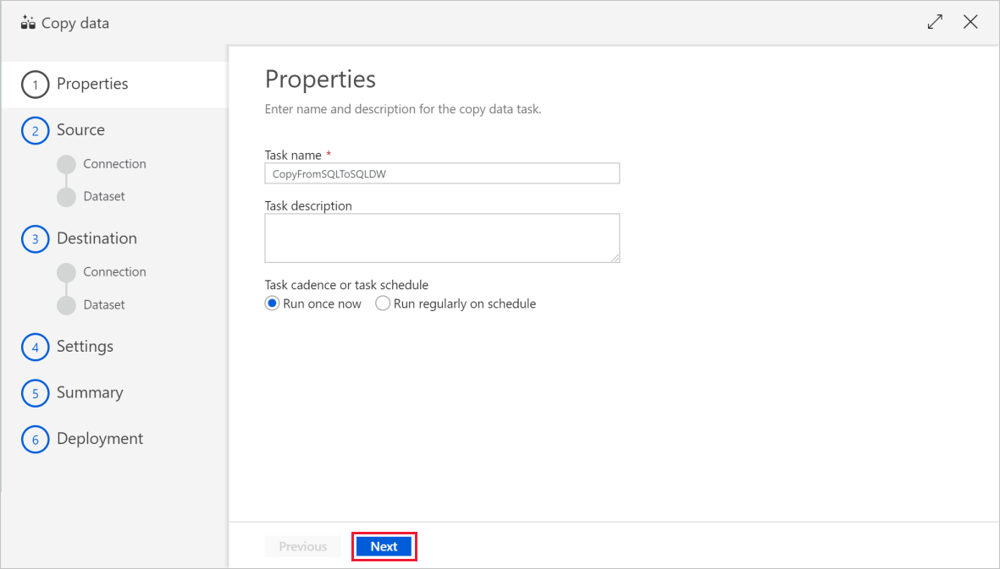
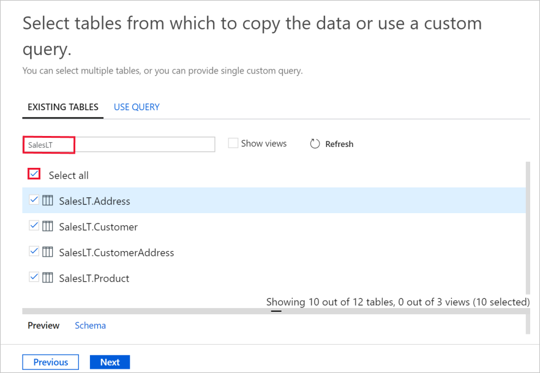

# Load data into Azure SQL Data Warehouse using Azure Data Factory

[Azure SQL Data Warehouse](../sql-data-warehouse/sql-data-warehouse-overview-what-is.md) is a cloud-based, scale-out database capable of processing massive volumes of data, both relational and non-relational.  Built on massively parallel processing (MPP) architecture, SQL Data Warehouse is optimized for enterprise data warehouse workloads.  It offers cloud elasticity with the flexibility to scale storage and compute independently.

Getting started with Azure SQL Data Warehouse is now easier than ever using **Azure Data Factory**.  Azure Data Factory is a fully managed cloud-based data integration service, which can be used to populate a SQL Data Warehouse with the data from your existing system, and saving you valuable time while evaluating SQL Data Warehouse and building your analytics solutions. Here are the key benefits of loading data into Azure SQL Data Warehouse using Azure Data Factory:

* **Easy to set up**: 5-step intuitive wizard with no scripting required.
* **Rich data store support**: built-in support for a rich set of on-premises and cloud-based data stores, see detailed list in [supported data stores](copy-activity-overview.md#supported-data-stores-and-formats) table.
* **Secure and compliant**: data is transferred over HTTPS or ExpressRoute, and global service presence ensures your data never leaves the geographical boundary
* **Unparalleled performance by using PolyBase**: Using Polybase is the most efficient way to move data into Azure SQL Data Warehouse. Using the staging blob feature, you can achieve high load speeds from all types of data stores besides Azure Blob storage and Data Lake Store, which the Polybase supports by default. Learn details from [copy activity performance](copy-activity-performance).

This article shows you how to use Data Factory Copy Data tool to **load data from Azure SQL Database into Azure SQL Data Warehouse**. You can follow the similar steps to copy data from other types of data stores.

> [!NOTE]
>  For general information about capabilities of Data Factory in copying data to/from Azure SQL Data Warehouse, see [Copy data to or from Azure SQL Data Warehouse by using Azure Data Factory](connector-azure-sql-data-warehouse.md) article.
>
> This article applies to version 2 of Data Factory, which is currently in preview. If you are using version 1 of the Data Factory service, which is generally available (GA), see [Copy Activity in V1](v1/data-factory-data-movement-activities.md).

## Prerequisites

* **Azure subscription**. If you don't have an Azure subscription, create a [free](https://azure.microsoft.com/free/) account before you begin.
* **Azure SQL Data Warehouse**. This data warehouse holds the data copied over from the SQL Database. If you don't have an Azure SQL Data Warehouse, see the [Create a SQL Data Warehouse](../sql-data-warehouse/sql-data-warehouse-get-started-tutorial.md) article for steps to create one.
* **Azure SQL Database**. This tutorial copies data from an Azure SQL Database with Adventure Works LT sample data, you can create one following [Create an Azure SQL database](../sql-database/sql-database-get-started-portal.md) article. 
* **Azure Storage account**. The Azure Storage is used as **staging** blob in the bulk copy operation. If you don't have an Azure storage account, see the [Create a storage account](../storage/common/storage-create-storage-account.md#create-a-storage-account) article for steps to create one.

## Create a data factory

1. Click **NEW** on the left menu, click **Data + Analytics**, and click **Data Factory**. 
   
   
2. In the **New data factory** page, provide the values as shown in the following screenshot:
      
     
 
   * **Name.** Enter a global unique name for the data factory. If you receive the following error, change the name of the data factory (for example, yournameADFTutorialDataFactory) and try creating again. See [Data Factory - Naming Rules](naming-rules.md) article for naming rules for Data Factory artifacts.
  
            `Data factory name "LoadSQLDWDemo" is not available`

    * **Subscription.** Select your Azure **subscription** in which you want to create the data factory. 
    * **Resource Group.** Select an existing resource group from the drop-down list, or select **Create new** option and enter the name of a resource group. To learn about resource groups, see [Using resource groups to manage your Azure resources](../azure-resource-manager/resource-group-overview.md).  
    * **Version.** Select **V2 (Preview)**.
    * **Location.** Select the location for the data factory. Only supported locations are displayed in the drop-down list. The data stores (Azure Storage, Azure SQL Database, etc.) used by data factory can be in other locations/regions. 

3. Click **Create**.
4. After the creation is complete, go to your data factory, and you see the **Data Factory** page as shown in the image. Click **Author & Monitor** tile to launch the Data Integration Application in a separate tab.
   
   

## Load data into Azure SQL Data Warehouse

1. In the get started page, click **Copy Data** tile to launch the Copy Data tool. 

   
2. In the **Properties** page of the Copy Data tool, specify **CopyFromSQLToSQLDW** for the **Task name**, and click **Next**. 

    
3. In the **Source data store** page, select **Azure SQL Database**, and click **Next**.

    
4. In the **Specify the Azure SQL database** page, do the following steps: 
    1. Select your Azure SQL server for the **Server name**.
    2. Select your Azure SQL database for the **Database name**.
    3. Specify the name of the user for **User name**.
    4. Specify the password of the user for **Password**.
    5. Click **Next**. 

        
5. In the **Select tables from which to copy the data or use a custom query** page, filter the tables by specify "SalesLT" in the input box, then check the **(Select all)** checkbox to select all tables, and then click **Next**. 

    

6. In the **Destination data store** page, select **Azure SQL Data Warehouse**, and click **Next**. 

    
7. In the **Specify the Azure SQL Data Warehouse** page, do the following steps: 

    1. Select your Azure SQL server for the **Server name**.
    2. Select your Azure SQL Data Warehouse for the **Database name**.
    3. Specify the name of the user for **User name**.
    4. Specify the password of the user for **Password**.
    5. Click **Next**. 

        
8. In the **Table mapping** page, rreview and click **Next**. An intelligent table mapping appears that maps source to destination tables based on table names. If the table does not exist in the destination, by default ADF will create one with the same name. You can also choose to map to an existing table. 

    > [!NOTE]
    > Auto table creation for SQL Data Warehouse sink applies when SQL Server or Azure SQL Database is source. If you copy data from other source data store, you need to pre create the schema in sink Azure SQL Data Warehouse before data copy.

    

9. In the **Schema mapping** page, rreview and click **Next**. Intelligent mapping is based on column name. If you choose to let Data Factory auto create the tables, proper data type conversion may happen if needed to fix the incompatibility between source and destination stores. If there is an unsupported data type conversion between the source and destination column, you see an error message alongside the corresponding table.

    

11. In the **Settings** page, select an Azure Storage in the **Storage account name** drop down list. It is used for staging the data before it loads into SQL Data Warehouse performantly using PolyBase. After the copy is done, the interim data in storage will be cleaned up automatically. 

    Under "Advanced settings", uncheck "use type default" option.

    
12. In the **Summary** page, review the settings, and click **Next**.

    
13. In the **Deployment page**, click **Monitor** to monitor the pipeline (task).

    
14. Notice that the **Monitor** tab on the left is automatically selected. You see the links to view activity run details and to rerun the pipeline in the **Actions** column. 

    
15. To view activity runs associated with the pipeline run, click **View Activity Runs** link in the **Actions** column. There are 10 copy activities in the pipeline, each copies one table of data. To switch back to the pipeline runs view, click **Pipelines** link at the top. Click **Refresh** to refresh the list. 

    

## Next steps

Advance to the following article to learn about Azure SQL Data Warehouse support: 

> [!div class="nextstepaction"]
>[Azure SQL Data Warehouse connector](connector-azure-sql-data-warehouse.md)