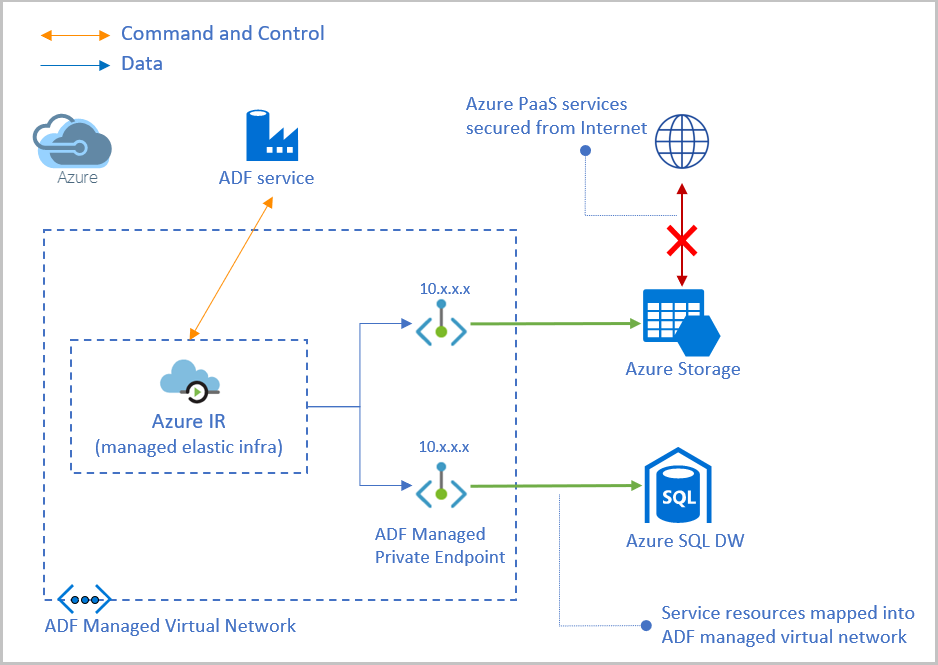

# Azure Data Factory Managed Virtual Network (preview)

[!INCLUDE[appliesto-adf-asa-md](includes/appliesto-adf-asa-md.md)]

This article will explain Managed Virtual Network and Managed Private endpoints in Azure Data Factory.

## Managed virtual network

When you create an Azure Integration Runtime (IR) within Azure Data Factory Managed Virtual Network (VNET), the integration runtime will be provisioned with the managed Virtual Network and will leverage private endpoints to securely connect to supported data stores. 

Creating an Azure IR within managed Virtual Network ensures that data integration process is isolated and secure. 

Benefits of using Managed Virtual Network:

- With a Managed Virtual Network, you can offload the burden of managing the Virtual Network to Azure Data Factory. You don't need to create a subnet for Azure Integration Runtime that could eventually use many private IPs from your Virtual Network and would require prior network infrastructure planning. 
- It does not require deep Azure networking knowledge to do data integrations securely. Instead getting started with secure ETL is much simplified for data engineers. 
- Managed Virtual Network along with Managed private endpoints protects against data exfiltration. 

> [!IMPORTANT]
>Currently, the managed VNet is only supported in the same region as Azure Data Factory region.
 

## Managed private endpoints

Managed private endpoints are private endpoints created in the Azure Data Factory Managed Virtual Network establishing a private link to Azure resources. Azure Data Factory manages these private endpoints on your behalf. 

Azure Data Factory supports private links. Private link enables you to access Azure (PaaS) services (such as Azure Storage, Azure Cosmos DB, Azure Synapse Analytics (formerly Azure SQL Data Warehouse)).

When you use a private link, traffic between your data stores and managed Virtual Network traverses entirely over the Microsoft backbone network. Private Link protects against data exfiltration risks. You establish a private link to a resource by creating a private endpoint.

Private endpoint uses a private IP address in the managed Virtual Network to effectively bring the service into it. Private endpoints are mapped to a specific resource in Azure and not the entire service. Customers can limit connectivity to a specific resource approved by their organization. Learn more about [private links and private endpoints](https://docs.microsoft.com/azure/private-link/).

> [!NOTE]
> It's recommended that you create Managed private endpoints to connect to all your Azure data sources. 
 
> [!WARNING]
> If a PaaS data store (Blob, ADLS Gen2, Azure Synapse Analytics) has a private endpoint already created against it, and even if it allows access from all networks, ADF would only be able to access it using managed private endpoint. Make sure you create a Private endpoint in such scenarios. 

A private endpoint connection is created in a "Pending" state when you create a Managed private endpoint in Azure Data Factory. An approval workflow is initiated. The private link resource owner is responsible to approve or reject the connection.

If the owner approves the connection, the private link is established. Otherwise, the private link won't be established. In either case, the Managed private endpoint will be updated with the status of the connection.

Only a Managed private endpoint in an approved state can send traffic to a given private link resource.

## Limitations and known issues
### Supported Data Sources
Below data sources are supported to connect through private link from ADF Managed Virtual Network.
- Azure Blob Storage
- Azure Table Storage
- Azure Files
- Azure Data Lake Gen2
- Azure SQL Database (not including Azure SQL Managed Instance)
- Azure Synapse Analytics (formerly Azure SQL Data Warehouse)
- Azure CosmosDB SQL
- Azure Key Vault
- Azure Private Link Service
- Azure Search
- Azure Database for MySQL
- Azure Database for PostgreSQL
- Azure Database for MariaDB

### Azure Data Factory Managed Virtual Network is available in the following Azure regions:
- East US
- East US 2
- West Central US
- West US 2
- South Central US
- Central US
- North Europe
- West Europe
- UK South
- Southeast Asia
- Australia East

### Outbound communications through public endpoint from ADF Managed Virtual Network
- Only port 443 is opened for outbound communications.
- Azure Storage and Azure Data Lake Gen2 are not supported to be connected through public endpoint from ADF Managed Virtual Network.

### Linked Service creation of Azure Key Vault 
- When you create a Linked Service for Azure Key Vault, there is no Azure Integration Runtime reference. So you can't create Private Endpoint during Linked Service creation of Azure Key Vault. But when you create Linked Service for data stores which references Azure Key Vault Linked Service and this Linked Service references Azure Integration Runtime with Managed Virtual Network enabled, then you are able to create a Private Endpoint for the Azure Key Vault Linked Service during the creation. 
- **Test connection** operation for Linked Service of Azure Key Vault only validates the URL format, but doesn't do any network operation.

## Next steps

- Tutorial: [Build a copy pipeline using managed Virtual Network and private endpoints](tutorial-copy-data-portal-private.md) 
- Tutorial: [Build mapping dataflow pipeline using managed Virtual Network and private endpoints](tutorial-data-flow-private.md)
