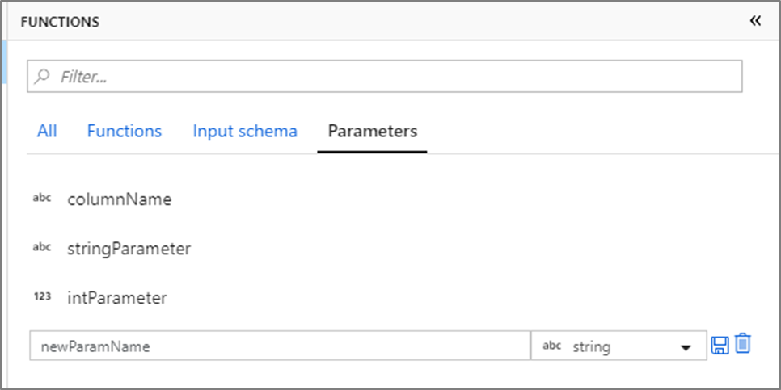
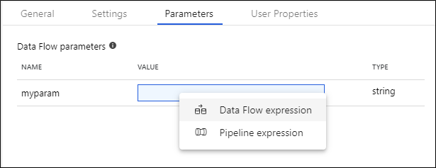
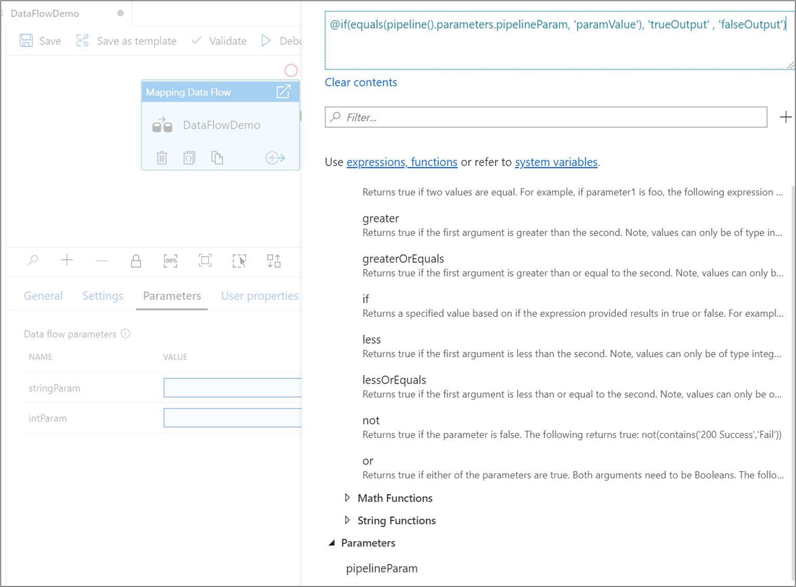

# Parameterizing mapping data flows

[!INCLUDE[appliesto-adf-asa-md](includes/appliesto-adf-asa-md.md)] 

Mapping data flows in Azure Data Factory support the use of parameters. Define parameters inside of your data flow definition and use them throughout your expressions. The parameter values are set by the calling pipeline via the Execute Data Flow activity. You have three options for setting the values in the data flow activity expressions:

* Use the pipeline control flow expression language to set a dynamic value
* Use the data flow expression language to set a dynamic value
* Use either expression language to set a static literal value

Use this capability to make your data flows general-purpose, flexible, and reusable. You can parameterize data flow settings and expressions with these parameters.

## Create parameters in a mapping data flow

To add parameters to your data flow, click on the blank portion of the data flow canvas to see the general properties. In the settings pane, you will see a tab called **Parameter**. Select **New** to generate a new parameter. For each parameter, you must assign a name, select a type, and optionally set a default value.


## Use parameters in a mapping data flow 

Parameters can be referenced in any data flow expression. Parameters begin with $ and are immutable. You will find the list of available parameters inside of the Expression Builder under the **Parameters** tab.


You can quickly add additional parameters by selecting **New parameter** and specifying the name and type.



## Assign parameter values from a pipeline

Once you've created a data flow with parameters, you can execute it from a pipeline with the Execute Data Flow Activity. After you add the activity to your pipeline canvas, you will be presented with the available data flow parameters in the activity's **Parameters** tab.

When assigning parameter values, you can use either the [pipeline expression language](control-flow-expression-language-functions.md) or the [data flow expression language](data-flow-expression-functions.md) based on spark types. Each mapping data flow can have any combination of pipeline and data flow expression parameters.



### Pipeline expression parameters

Pipeline expression parameters allow you to reference system variables, functions, pipeline parameters, and variables similar to other pipeline activities. When you click **Pipeline expression**, a side-nav will open allowing you to enter an expression using the expression builder.



When referenced, pipeline parameters are evaluated and then their value is used in the data flow expression language. The pipeline expression type doesn't need to match the data flow parameter type. 

#### Example

Say you have an integer parameter `intParam` that is referencing a pipeline parameter of type String, `@pipeline.parameters.pipelineParam`. 


`@pipeline.parameters.pipelineParam` is assigned a value of `abs(1)` at runtime.


When `$intParam` is referenced in an expression such as a derived column, it will evaluate `abs(1)` return `1`. 


### Data flow expression parameters

Select **Data flow expression** will open up the data flow expression builder. You will be able to reference functions, other parameters and any defined schema column throughout your data flow. This expression will be evaluated as is when referenced.

> [!Note]
> If you pass in an invalid expression or reference a schema column that doesn't exist in that transformation, the parameter will evaluate to null.

### String parameters

If your parameter data type is string, when you click the text box to set parameter values, you can choose to enter either a pipeline or a data flow expression. If you choose pipeline expression, you will be presented with the pipeline expression panel. Make sure to include pipeline functions inside string interpolation syntax using `'@{<expression>}'`, for example:

```'@{pipeline().RunId}'```

If your parameter is not of type string, you will always be presented with the Data Flow Expression Builder. Here, you can enter any expression or literal values that you wish that matches the data type of the parameter. Below are examples of data flow expression and a literal string from the expression builder:

* ```toInteger(Role)```
* ```'this is my static literal string'```


### Passing in a column name as a parameter

A common pattern is to pass in a column name as a parameter value. To reference the column associated with the parameter, use the `byName()` function. Remember to cast the column to its appropriate type with a casting function such as `toString()`.

For example, if you wanted to map a string column based upon a parameter `columnName`, you can add a derived column transformation equal to `toString(byName($columnName))`.


## Next steps
* [Execute data flow activity](control-flow-execute-data-flow-activity.md)
* [Control flow expressions](control-flow-expression-language-functions.md)
