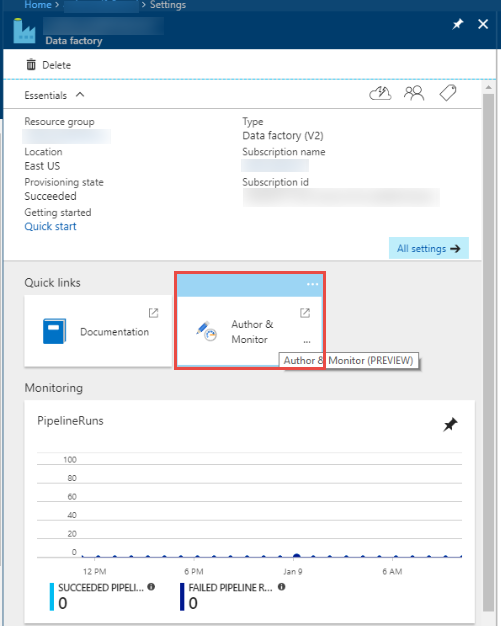
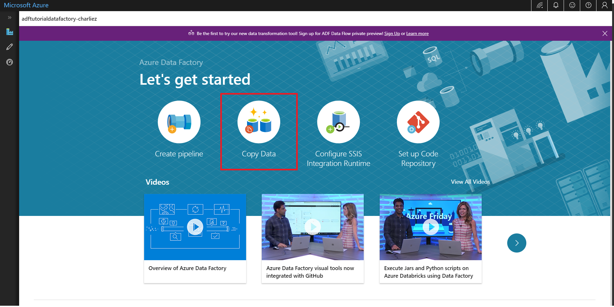
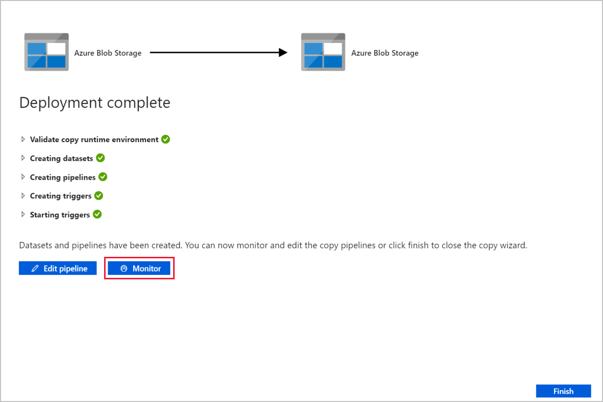

# Use Copy Data tool to copy data 
> [!div class="op_single_selector" title1="Select the version of Data Factory service you are using:"]
> * [Version 1 - GA](v1/data-factory-copy-data-from-azure-blob-storage-to-sql-database.md)
> * [Version 2 - Preview](quickstart-create-data-factory-copy-data-tool.md)

In this quickstart, you use Azure portal to create a data factory. Then, you use the Copy Data tool to create a pipeline that copies data from a folder in an Azure blob storage to another folder. 

> [!NOTE]
> This article applies to version 2 of Data Factory, which is currently in preview. If you are using version 1 of the Data Factory service, which is generally available (GA), see [get started with Data Factory version 1](v1/data-factory-copy-data-from-azure-blob-storage-to-sql-database.md).
>
> This article does not provide a detailed introduction of the Data Factory service. For an introduction to the Azure Data Factory service, see [Introduction to Azure Data Factory](introduction.md).

[!INCLUDE [data-factory-quickstart-prerequisites](../../includes/data-factory-quickstart-prerequisites.md)] 

## Create a data factory

1. Click **New** on the left menu, click **Data + Analytics**, and click **Data Factory**. 
   
   
2. In the **New data factory** page, enter **ADFTutorialDataFactory** for the **name**. 
      
     
 
   The name of the Azure data factory must be **globally unique**. If you see the following error for the name field, change the name of the data factory (for example, yournameADFTutorialDataFactory) and try creating again. See [Data Factory - Naming Rules](naming-rules.md) article for naming rules for Data Factory artifacts.
  
       `Data factory name “ADFTutorialDataFactory” is not available`
3. Select your Azure **subscription** in which you want to create the data factory. 
4. For the **Resource Group**, do one of the following steps:
     
      - Select **Use existing**, and select an existing resource group from the drop-down list. 
      - Select **Create new**, and enter the name of a resource group.   
         
      To learn about resource groups, see [Using resource groups to manage your Azure resources](../azure-resource-manager/resource-group-overview.md).  
4. Select **V2 (Preview)** for the **version**.
5. Select the **location** for the data factory. Only supported locations are displayed in the drop-down list. The data stores (Azure Storage, Azure SQL Database, etc.) and computes (HDInsight, etc.) used by data factory can be in other locations/regions.
6. Select **Pin to dashboard**.     
7. Click **Create**.
8. On the dashboard, you see the following tile with status: **Deploying data factory**. 

	
9. After the creation is complete, you see the **Data Factory** page as shown in the image.
   
   
10. Click **Author & Monitor** tile to launch the Azure Data Factory user interface (UI) in a separate tab. 

## Launch Copy Data tool

1. In the get started page, click **Copy Data** tile to launch the Copy Data tool. 

   
2. In the **Properties** page of the Copy Data tool, click **Next**. You can specify a name for the pipeline and its description in this page. 

    
3. In the **Source data store** page, select **Azure Blob Storage**, and click **Next**.

    
4. In the **Specify the Azure Blob storage account** page, select your storage account name from the drop-down list, and click Next. 

    
5. In the **Choose the input file or folder** page, click **Browse**, navigate to the **adftutorial/input** folder, select **emp.txt** file, click **Choose**, and then click **Next**. 

    
6. In the **File format settings** page, notice that the tool automatically detects the column and row delimiters, and click **Next**. You can also preview data and view schema of the input data on this page. 

    
7. In the **Destination data store** page, select **Azure Blob Storage**, and click **Next**. 

        
8. In the **Specify the Azure Blob storage account** page, select your Azure Blob storage account, and click **Next**. 

    
9. In the **Choose the output file or folder** page,  enter **adftutorial/output** for the **folder path**, enter **emp.txt** for the **file name**, and then click **Next**. 

     
10. In the **File format settings** page, click **Next**. 

    
11. Click **Next** on the **Settings** page. 

    
12. Review all settings on the summary page, and click Next. 

    
13. On the **Deployment complete** page, click **Monitor** to monitor the pipeline you created. 

    
14. The application switches to the **Monitor** tab. You see the status of the pipeline in this page. Click **Refresh** to refresh the list. 
    
    
15. Click the **View Activity Runs** link in the Actions column. The pipeline has only one activity of type **Copy**. 

    
16. To view the details about copy operation, click the link in the **Output** column. Here is the sample output: In the following example, the number of bytes read and written were 20, and the number of files read and written were 1. The copy operation took 2 seconds to complete. For details about the properties, see [Copy Activity overview](copy-activity-overview.md). If there was an error, you see a link to the error message in the **Error** column. 

    ```json
    {
        "dataRead": 20,
        "dataWritten": 20,
        "filesRead": 1,
        "filesWritten": 1,
        "copyDuration": 2,
        "throughput": 0.01,
        "errors": [],
        "effectiveIntegrationRuntime": "DefaultIntegrationRuntime (East US)",
        "usedCloudDataMovementUnits": 4,
        "usedParallelCopies": 1,
        "billedDuration": 11,
        "effectiveIntegrationRuntimes": [
            {
                "name": "DefaultIntegrationRuntime",
                "type": "Managed",
                "location": "East US",
                "billedDuration": 0.06666666666666666,
                "nodes": null
            }
        ]
    }
    ```
17. Verify that the **emp.txt** file is created in the **output** folder of the **adftutorial** container. If the output folder does not exist, the Data Factory service automatically creates it. 
18. Switch to the **Edit** tab to be able to edit linked services, datasets, and pipelines. To learn about editing them in the Data Factory UI, see [Create a data factory using Azure portal](quickstart-create-data-factory-portal.md).

    

## Next steps
The pipeline in this sample copies data from one location to another location in an Azure blob storage. Go through the [tutorials](tutorial-copy-data-portal.md) to learn about using Data Factory in more scenarios. 