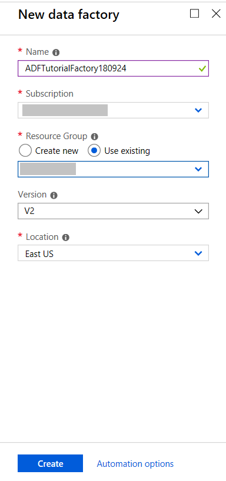
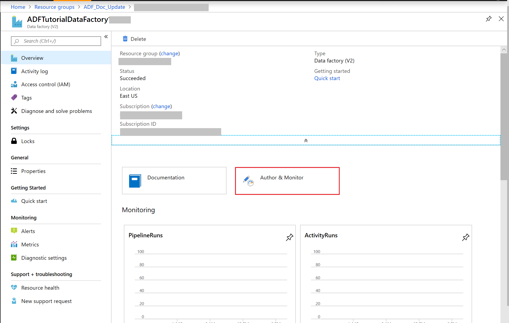

# Create a data factory using the Azure portal
In This quickstart, you use Azure portal to create a data factory. Currently, you cannot create pipelines in a data factory by using Azure portal. After you create the data factory, use the code or PowerShell commands from other quickstarts to create a data pipeline. 

## Prerequisites

* **Azure subscription**. If you don't have a subscription, you can create a [free trial](http://azure.microsoft.com/pricing/free-trial/) account.

## Steps
Here are the steps you perform as part of this tutorial:
1. After logging in to the [Azure portal](https://portal.azure.com/), click **New** on the left menu, click **Data + Analytics**, and click **Data Factory**. 
   
   
2. In the **New data factory** blade, enter **ADFTutorialDataFactory** for the **name**. 
      
     
 
   The name of the Azure data factory must be **globally unique**. If you receive the following error, change the name of the data factory (for example, yournameADFTutorialDataFactory) and try creating again. See [Data Factory - Naming Rules](naming-rules.md) topic for naming rules for Data Factory artifacts.
  
       `Data factory name “ADFTutorialDataFactory” is not available`
3. Select your Azure **subscription** in which you want to create the data factory. 
4. For the **Resource Group**, do one of the following steps:
     
      - Select **Use existing**, and select an existing resource group from the drop-down list. 
      - Select **Create new**, and enter the name of a resource group.   
         
      Some of the steps in this tutorial assume that you use the name: **ADFTutorialResourceGroup** for the resource group. To learn about resource groups, see [Using resource groups to manage your Azure resources](../azure-resource-manager/resource-group-overview.md).  
4. Select **V2 (Preview)** for the **version**.
5. Select the **location** for the data factory. Currently, you can create V2 data factories only in **East US** region. However, the compute and data stores used in data factories can be in other regions. 
6. Select **Pin to dashboard**.     
7. Click **Create**.
      
      > [!IMPORTANT]
      > To create Data Factory instances, you must be a member of the [Data Factory Contributor](../active-directory/role-based-access-built-in-roles.md#data-factory-contributor) role at the subscription/resource group level.
      > 
      > The name of the data factory may be registered as a DNS name in the future and hence become publically visible.             
3. On the dashboard, you see the following tile with status: **Deploying data factory**. 

	
1. After the creation is complete, you see the **Data Factory** blade as shown in the image.
   
   

## Next steps
See the following tutorial for step-by-step instructions for creating pipelines and datasets by using one of these tools or SDKs. 

- [Quickstart: create a data factory using .NET](quickstart-create-data-factory-dot-net.md)
- [Quickstart: create a data factory using PowerShell](quickstart-create-data-factory-powershell.md)
- [Quickstart: create a data factory using REST API](quickstart-create-data-factory-rest-api.md)
