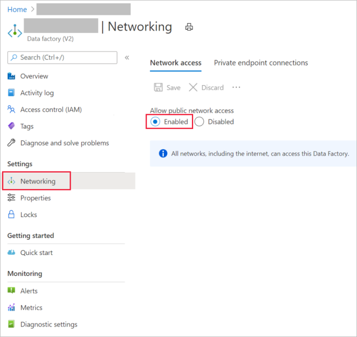

# Troubleshoot Azure Data Factory security and access control issues

[!INCLUDE[appliesto-adf-asa-md](includes/appliesto-adf-asa-md.md)]

This article explores common troubleshooting methods for security and access control in Azure Data Factory.

## Common errors and messages

### Invalid or empty authentication key issue after public network access is disabled

#### Symptoms

After you disable public network access for Data Factory, the self-hosted integration runtime throws the following error: “The Authentication key is invalid or empty.”

#### Cause

The problem is most likely caused by a Domain Name System (DNS) resolution issue, because disabling public connectivity and establishing a private endpoint prevents reconnection.

#### Resolution

To resolve the issue, do the following:

1. Run a PsPing to the Azure Data Factory server's fully qualified domain name (FQDN), and note whether the buffer goes to a public endpoint of the Data Factory server, even after it's disabled.

1. Edit the host file in the virtual machine (VM) to map the private IP to the FQDN and run a PsPing again. The buffer should then be able to go to the correct private IP address of the Data Factory server.

1. Re-register the self-hosted integration runtime, and you should find that it's up and running.
 

### Unable to register IR authentication key on Self-hosted VMs due to private link

#### Symptoms

You are unable to register the integration runtime (IR) authentication key on the self-hosted VM because the private link is enabled. You receive the following error message:

"Failed to get service token from ADF service with key *************** and time cost is: 0.1250079 seconds, the error code is: InvalidGatewayKey, activityId is: XXXXXXX and detailed error message is Client IP address is not valid private ip Cause Data factory couldn’t access the public network thereby not able to reach out to the cloud to make the successful connection."

#### Cause

The issue could be caused by the VM in which you're trying to install the self-hosted IR. To connect to the cloud, you should ensure that public network access is enabled.

#### Resolution

**Solution 1**
 
To resolve the issue, do the following:

1. Go to the [Factories - Update](https://docs.microsoft.com/rest/api/datafactory/Factories/Update) page.

1. At the upper right, select the **Try it** button.
1. Under **Parameters**, complete the required information. 
1. Under **Body**, paste the following property:

    ```
    { "tags": { "publicNetworkAccess":"Enabled" } }
    ``` 

1. Select **Run** to run the function. 
1. Confirm that **Response Code: 200** is displayed. The property you pasted should be displayed in the JSON definition as well.

1. Add the IR authentication key again in the integration runtime.


**Solution 2**

To resolve the issue, go to [Azure Private Link for Azure Data Factory](https://docs.microsoft.com/azure/data-factory/data-factory-private-link).

Try to enable public network access on the user interface, as shown in the following screenshot:



## Next steps

For more help with troubleshooting, try the following resources:

*  [Private Link for Data Factory](data-factory-private-link.md)
*  [Data Factory blog](https://azure.microsoft.com/blog/tag/azure-data-factory/)
*  [Data Factory feature requests](https://feedback.azure.com/forums/270578-data-factory)
*  [Azure videos](https://azure.microsoft.com/resources/videos/index/?sort=newest&services=data-factory)
*  [Microsoft Q&A page](/answers/topics/azure-data-factory.html)
*  [Stack overflow forum for Data Factory](https://stackoverflow.com/questions/tagged/azure-data-factory)
*  [Twitter information about Data Factory](https://twitter.com/hashtag/DataFactory)
