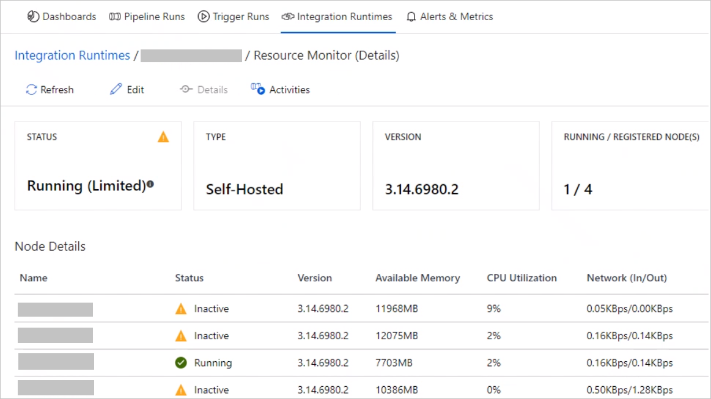

# Troubleshoot self-hosted integration runtime

This article explores common troubleshooting methods for self-hosted integration runtime in Azure Data Factory.

## Common errors and resolutions

### Error message: Self-hosted integration runtime can't connect to cloud service


#### Cause 

The self-hosted integration runtime can't connect to the Data Factory service (backend). This issue is typically caused by network settings in the firewall.

#### Resolution

1. Check whether the integration runtime service is running.
    

    
1. If the service is running, go on to step 3.

1. If there's no proxy configured on the self-hosted integration runtime (which is the default setting), run the following PowerShell command on the machine where the self-hosted integration runtime is installed:

    ```powershell
    (New-Object System.Net.WebClient).DownloadString("https://wu2.frontend.clouddatahub.net/")
    ```
        
   > [!NOTE]     
   > The service URL may vary, depending on your Data Factory location. You can find the service URL under **ADF UI** > **Connections** > **Integration runtimes** > **Edit Self-hosted IR** > **Nodes** > **View Service URLs**.
            
    The following is the expected response:
            
    
            
1. If you don't receive the expected response, use one of the following methods as appropriate to your situation:
            
    * If you receive a "Remote name could not be resolved" message, there's a Domain Name System (DNS) issue. Contact your network team to fix this issue.
    * If you receive an "ssl/tls cert is not trusted" message, check whether the certificate for https://wu2.frontend.clouddatahub.net/ is trusted on the machine, and then install the public certificate by using Certificate Manager. This action should mitigate the issue.
    * Go to **Windows** > **Event viewer (logs)** > **Applications and Services Logs** > **Integration Runtime** and check for any failure that's caused by DNS, a firewall rule, or company network settings. (If you find such a failure, forcibly close the connection.) Because every company has customized network settings, contact your network team to troubleshoot these issues.

1. If "proxy" has been configured on the self-hosted integration runtime, verify that your proxy server can access the service endpoint. For a sample command, see [PowerShell, web requests, and proxies](https://stackoverflow.com/questions/571429/powershell-web-requests-and-proxies).    
                
    ```powershell
    $user = $env:username
    $webproxy = (get-itemproperty 'HKCU:\Software\Microsoft\Windows\CurrentVersion\Internet
    Settings').ProxyServer
    $pwd = Read-Host "Password?" -assecurestring
    $proxy = new-object System.Net.WebProxy
    $proxy.Address = $webproxy
    $account = new-object System.Net.NetworkCredential($user,[Runtime.InteropServices.Marshal]::PtrToStringAuto([Runtime.InteropServices.Marshal]::SecureStringToBSTR($pwd)), "")
    $proxy.credentials = $account
    $url = "https://wu2.frontend.clouddatahub.net/"
    $wc = new-object system.net.WebClient
    $wc.proxy = $proxy
    $webpage = $wc.DownloadData($url)
    $string = [System.Text.Encoding]::ASCII.GetString($webpage)
    $string
    ```

The following is the expected response:
            


> [!NOTE] 
> Proxy considerations:
> *	Check whether the proxy server needs to be put on the Safe Recipients list. If so, make sure [these domains](https://docs.microsoft.com/azure/data-factory/data-movement-security-considerations#firewall-requirements-for-on-premisesprivate-network) are on the Safe Recipients list.
> *	Check whether the TLS/SSL certificate "wu2.frontend.clouddatahub.net/" is trusted on the proxy server.
> *	If you're using Active Directory authentication on the proxy, change the service account to the user account that can access the proxy as "Integration Runtime Service."

### Error message: Self-hosted integration runtime node/ logical SHIR is in Inactive/ "Running (Limited)" state

#### Cause 

The self-hosted integrated runtime node might have an **Inactive** status, as shown in the following screenshot:



This behavior occurs when nodes can't communicate with each other.

#### Resolution

1. Log in to the node-hosted VM. Under **Applications and Services Logs** > **Integration Runtime**, open Event Viewer, and filter all the error logs.

1. Check whether an error log contains the following error: 
    
    ```System.ServiceModel.EndpointNotFoundException: Could not connect to net.tcp://xxxxxxx.bwld.com:8060/ExternalService.svc/WorkerManager. The connection attempt lasted for a time span of 00:00:00.9940994. TCP error code 10061: No connection could be made because the target machine actively refused it 10.2.4.10:8060. 
    System.Net.Sockets.SocketException: No connection could be made because the target machine actively refused it. 
    10.2.4.10:8060
        
    at System.Net.Sockets.Socket.DoConnect(EndPoint endPointSnapshot, SocketAddress socketAddress)
               
    at System.Net.Sockets.Socket.Connect(EndPoint remoteEP)
               
    at System.ServiceModel.Channels.SocketConnectionInitiator.Connect(Uri uri, TimeSpan timeout)
       
1. If you see this error, run the following on a command line: 

   **telnet 10.2.4.10 8060**.
1. If you receive the following error, contact your IT department for help with fixing this issue. After you can successfully telnet, contact Microsoft Support if you still have issues with the integrative runtime node status.
        
   
        
1.	Check whether the error log contains the following:

    ```Error log: Cannot connect to worker manager: net.tcp://xxxxxx:8060/ExternalService.svc/ No DNS entries exist for host azranlcir01r1. No such host is known Exception detail: System.ServiceModel.EndpointNotFoundException: No DNS entries exist for host xxxxx. ---> System.Net.Sockets.SocketException: No such host is known at System.Net.Dns.GetAddrInfo(String name) at System.Net.Dns.InternalGetHostByName(String hostName, Boolean includeIPv6) at System.Net.Dns.GetHostEntry(String hostNameOrAddress) at System.ServiceModel.Channels.DnsCache.Resolve(Uri uri) --- End of inner exception stack trace --- Server stack trace: at System.ServiceModel.Channels.DnsCache.Resolve(Uri uri)```
    
1. To resolve the issue, try one or both of the following methods:
    - Put all the nodes in the same domain.
    - Add the IP to host mapping in all the hosted VM's host files.


## Next steps

For more help with troubleshooting, try the following resources:

*  [Data Factory blog](https://azure.microsoft.com/blog/tag/azure-data-factory/)
*  [Data Factory feature requests](https://feedback.azure.com/forums/270578-data-factory)
*  [Azure videos](https://azure.microsoft.com/resources/videos/index/?sort=newest&services=data-factory)
*  [MSDN forum](https://social.msdn.microsoft.com/Forums/home?sort=relevancedesc&brandIgnore=True&searchTerm=data+factory)
*  [Stack overflow forum for Data Factory](https://stackoverflow.com/questions/tagged/azure-data-factory)
*  [Twitter information about Data Factory](https://twitter.com/hashtag/DataFactory)
*  [Mapping data flows performance guide](concepts-data-flow-performance.md)
