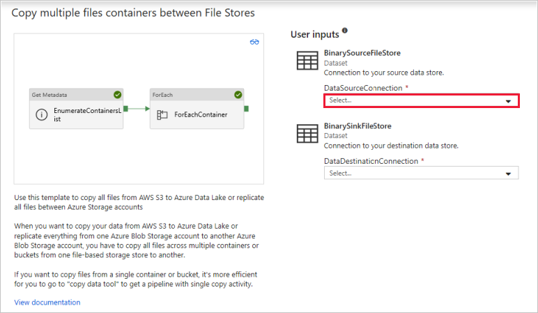
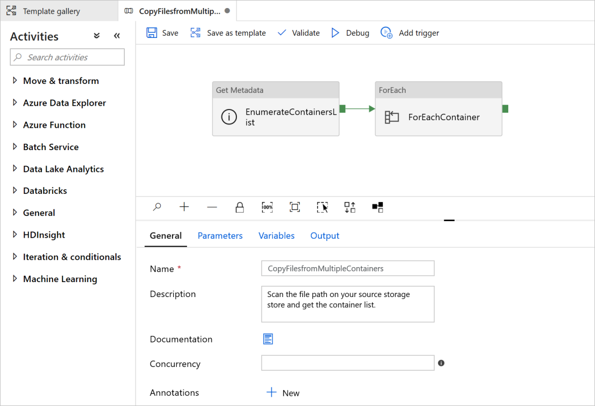
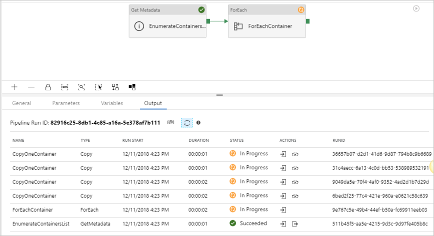

# Copy files from multiple containers with Azure Data Factory

The solution template described in this article helps you to copy files from multiple files, containers, or buckets between file stores. For example, maybe you want to migrate your data lake from AWS S3 to Azure Data Lake Store. Or maybe you want to replicate everything from one Azure Blob Storage account to another Azure Blob Storage account. This template is designed for these use cases.

If you want to copy files from a single container or bucket, it's more efficient to use the **Copy Data Tool** to create a pipeline with a single Copy activity. This template is more than you need for this simple use case.

## About this solution template

This template enumerates the containers from your source storage store, and then copies each of the containers from the source storage store to the destination store. 

The template contains three activities:
1. A **GetMetadata** activity to scan your source storage store and get the container list.
2. A **ForEach** activity to get the container list from the **GetMetadata** activity and then iterate over the list and pass each container to the Copy activity.
3. A **Copy** activity to copy each container from the source storage store to the destination store.

The template defines two parameters:
1. The parameter *SourceFilePath* is the path of your data source store, where you can get a list of the containers or buckets. In most cases, the path is the root directory, which contains multiple container folders. The default value of this parameter is `/`.
2. The parameter *DestinationFilePath* is the path where the files will be copied in your destination store. The default value of this parameter is `/`.

## How to use this solution template

1. Go to template **Copy multiple files containers between File Stores**, and create a **new connection** to your source storage store. The source storage store is the place where you want to copy files from multiple containers or buckets.

    

2. Create a **new connection** to your destination storage store.

    

3. Click **Use this template**.

    
	
4. You will see the pipeline available in the panel, as shown in the following example:

    

5. Click **Debug**, input **Parameters** and click **Finish**.

    

6. Review the result.

    

## Next steps

- [Introduction to Azure Data Factory](introduction.md)
