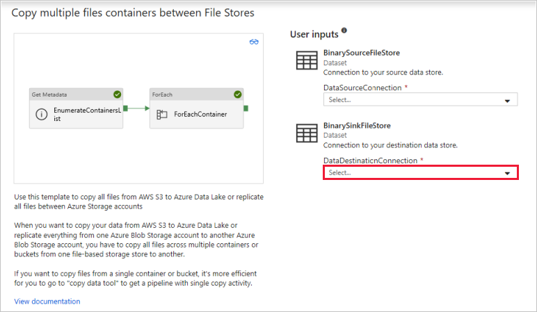
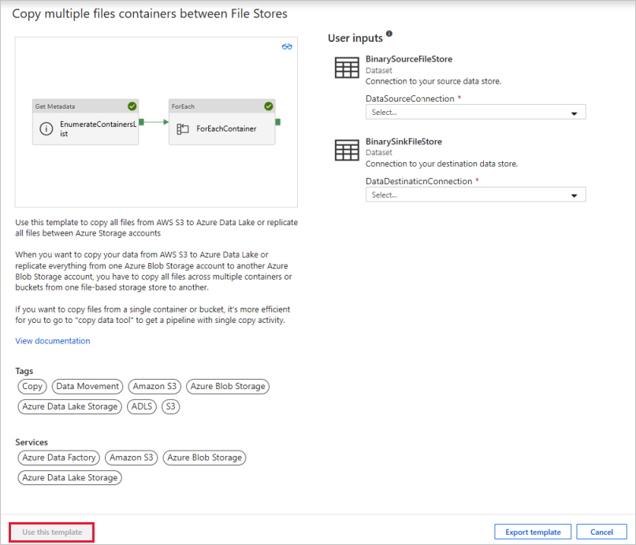
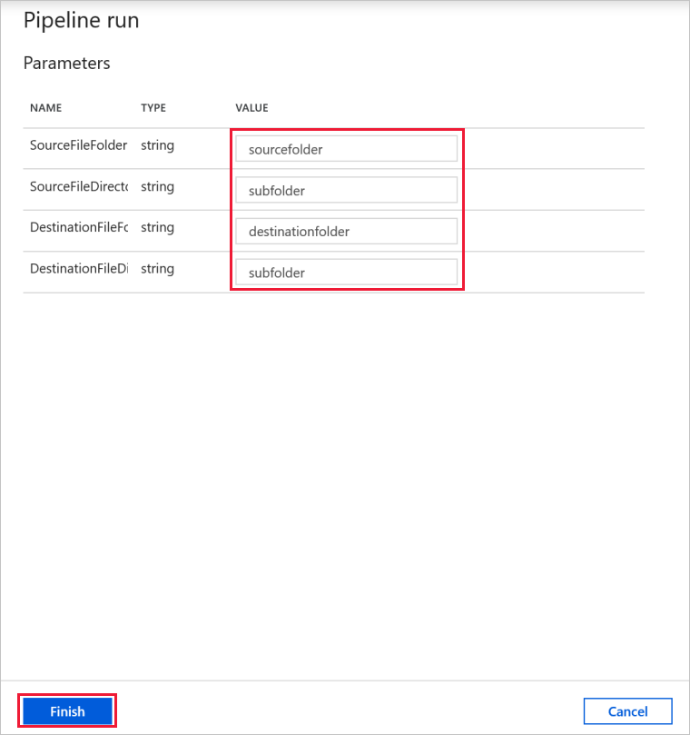

# Copy multiple folders with Azure Data Factory

[!INCLUDE[appliesto-adf-xxx-md](includes/appliesto-adf-xxx-md.md)]

This article describes a solution template that you can use multiple copy activities to copy containers or folders between file based stores, where each copy activity is supposed to copy single container or folder. 

> [!NOTE]
> If you want to copy files from a single container, it's more efficient to use the [Copy Data Tool](copy-data-tool.md) to create a pipeline with a single copy activity. The template in this article is more than you need for that simple scenario.

## About this solution template

This template enumerates the folders from a given parent folder on your source storage store. It then copies each of the folders to the destination store.

The template contains three activities:
- **GetMetadata** scans your source storage store and gets the subfolder list from a given parent folder.
- **ForEach** gets the subfolder list from the **GetMetadata** activity and then iterates over the list and passes each folder to the Copy activity.
- **Copy** copies each folder from the source storage store to the destination store.

The template defines the following parameters:
- *SourceFileFolder* is part the parent folder path of your data source store: *SourceFileFolder/SourceFileDirectory*, where you can get a list of the subfolders. 
- *SourceFileDirectory* is part the parent folder path of your data source store: *SourceFileFolder/SourceFileDirectory*, where you can get a list of the subfolders. 
- *DestinationFileFolder* is part the parent folder path: *DestinationFileFolder/DestinationFileDirectory* where the files will be copied to your destination store. 
- *DestinationFileDirectory* is part the parent folder path: *DestinationFileFolder/DestinationFileDirectory* where the files will be copied to your destination store. 

If you want to copy multiple containers under root folders between storage stores, you can input all four parameters as */*. By doing so, you will replicate everything between storage stores.

## How to use this solution template

1. Go to the **Copy multiple files containers between File Stores** template. Create a **New** connection to your source storage store. The source storage store is where you want to copy files from multiple containers from.

    

2. Create a **New** connection to your destination storage store.

    

3. Select **Use this template**.

    
	
4. You'll see the pipeline, as in the following example:

    

5. Select **Debug**, enter the **Parameters**, and then select **Finish**.

    

6. Review the result.

    

## Next steps

- [Bulk copy from a database by using a control table with Azure Data Factory](solution-template-bulk-copy-with-control-table.md)

- [Copy files from multiple containers with Azure Data Factory](solution-template-copy-files-multiple-containers.md)
