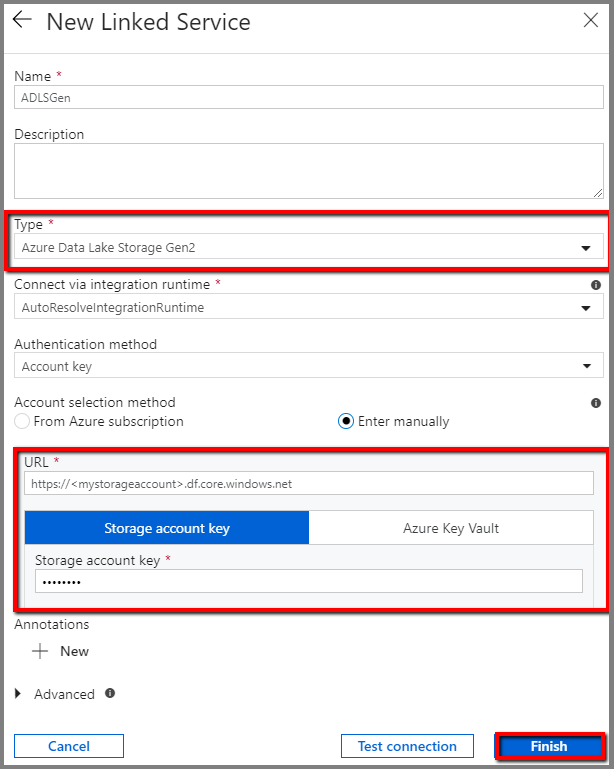
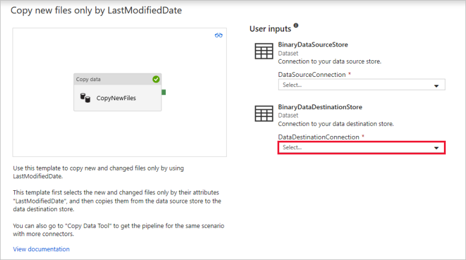
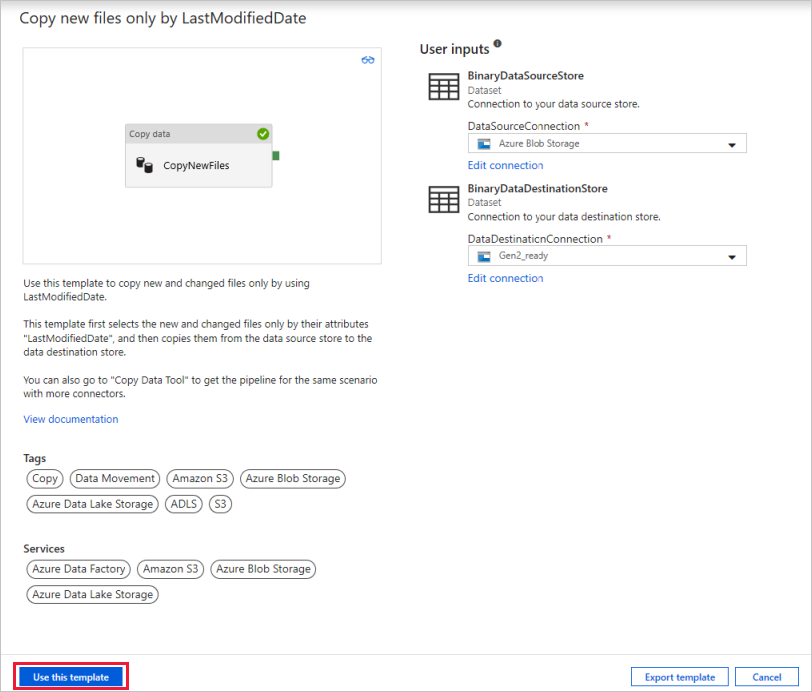
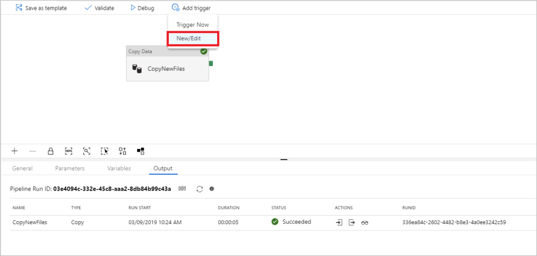
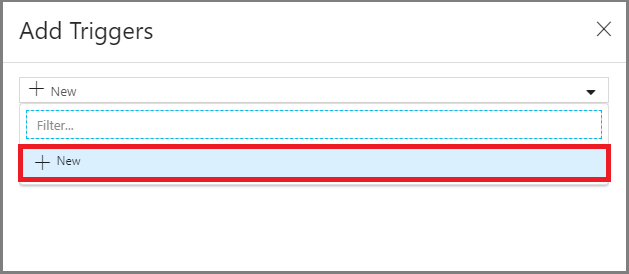
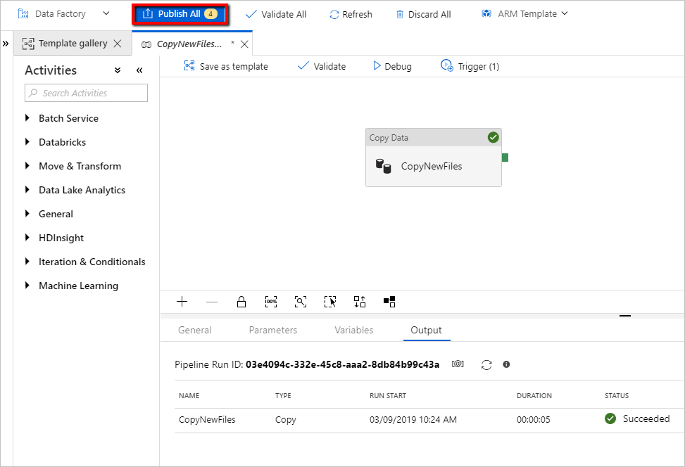
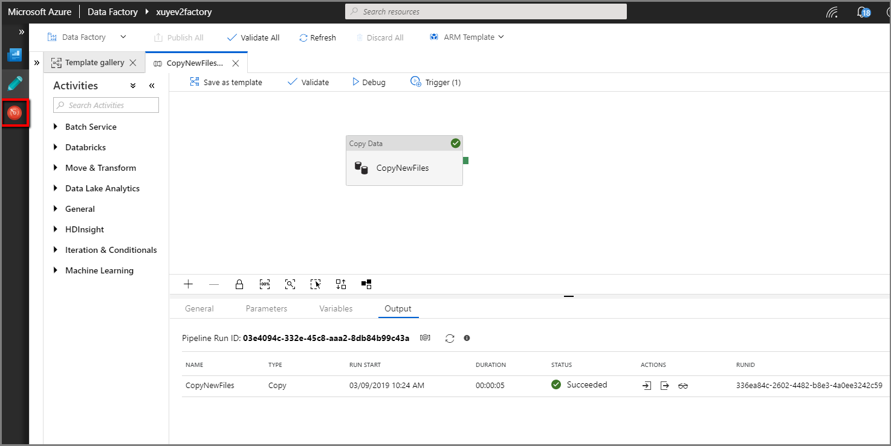

# Copy new and changed files by LastModifiedDate with Azure Data Factory

This article describes a solution template that you can use to copy new and changed files only by LastModifiedDate from a file store to a destination store. 

## About this solution template

This template first selects the new and changed files only by their attributes **LastModifiedDate**, and then copies those selected files from the data source store to the data destination store.

The template contains one activity:
- **Copy** to copy new and changed files only by LastModifiedDate from a file store to a destination store.

The template defines four parameters:
-  *FolderPath_Source* is the folder path where you can get the files from the source store. You need to replace the default value '/<myfolder>/<sub_folder>/' to your own folder path.
-  *FolderPath_Destination* is the folder path where you want to copy files to the destination store. You need to replace the default value '/<myfolder>/<sub_folder>/' to your own folder path.
-  *LastModified_From* is used to select the files whose LastModifiedDate attribute is after or equal to this datatime value.  In order to select the new files only which has not been copied last time, this datetime value can be the time when the pipeline was triggered last time. You can replace the default value '2019-02-01T00:00:00Z' to your expected LastModifiedDate in UTC timezone. 
-  *LastModified_To* is used to select the files whose LastModifiedDate attribute is before this datatime value. In order to select the new files only which has not been copied last time, this datetime value can be the present time.  You can replace the default value '2019-02-01T00:00:00Z' to your expected LastModifiedDate in UTC timezone. 

## How to use this solution template

1. Go to template **Copy new files only by LastModifiedDate**. Create a **New** connection to your source storage store. The source storage store is where you want to copy files from.

    
	
2. First select the storage **Type**. After that input the storage **account name** and the **account key**. Finally, select **Finish**.

    
	
3. Create a **New** connection to your destination store. The destination store is where you want to copy files to. You also need input the connection information of data destination store similar as you did in step 2.

    

4. Select **Use this template**.

    
	
5. You will see the pipeline available in the panel, as shown in the following example:

    

6. Select **Debug**, write the value for the **Parameters** and select **Finish**.  In the picture below, we set the parameters as following:
	-  **FolderPath_Source** = **/source/**
    -  **FolderPath_Destination** = **/destination/**
	-  **LastModified_From** =  **2019-02-01T00:00:00Z**
    -  **LastModified_To** = **2019-03-01T00:00:00Z**
	
	The example is saying the files which has been last modified within the timespan between *2019-02-01T00:00:00Z* and *2019-03-01T00:00:00Z* will be copied from a folder */source/* to a folder */destination/*.  You can replace these with your own parameters.
	
    

7. Review the result. You will see only the files last modified within the configured timespan has been copied to the destination store.

    
	
8. Now you can add a tumbling windows trigger to automate this pipeline, so that the pipeline can always copy new and changed files only by LastModifiedDate periodically.  Select **Add trigger**, and select **New/Edit**.

    
	
9. In the **Add Triggers** window, select **+ New**.

    

10. Select **Tumbling Window** for the trigger type, input **Every 15 minute(s)** as the recurrence, and then select **Next**.

    	
	
11. Write the value for the **Trigger Run Parameters** as following, and select **Finish**.
	-  **FolderPath_Source** = **/source/**.  You can replace with your folder in source data store.
    -  **FolderPath_Destination** = **/destination/**.  You can replace with your folder in destination data store.
	-  **LastModified_From** =  **@trigger().outputs.windowStartTime**.  It is a system variable from the trigger determines the time when the pipeline was triggered last time.
    -  **LastModified_To** = **@trigger().outputs.windowEndTime**.  It is a system variable from the trigger determines the time when the pipeline is triggered this time.
	
    
	
12. Select **Publish All**.
	
    

13. Creat new files in your source folder of data source store.  You are now waiting for the pipeline to be triggered automatically and only copy the new files to the destination store.

14. Select **Monitoring** tab in the left nevigation pannel, and wait for about 15 minutes if the recurrence of trigger has been set to every 15 minutes. 

    

15. Review the result. You will see your pipeline will be triggered automatically every 15 minutes, and only the new or changed files from source store will be copied to the destination store in each pipeline run.

    
	
## Next steps

- [Introduction to Azure Data Factory](introduction.md)