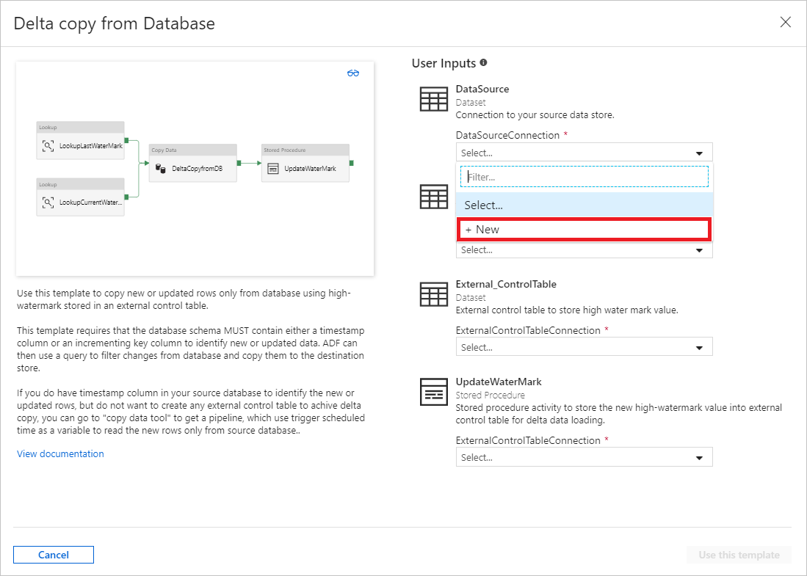
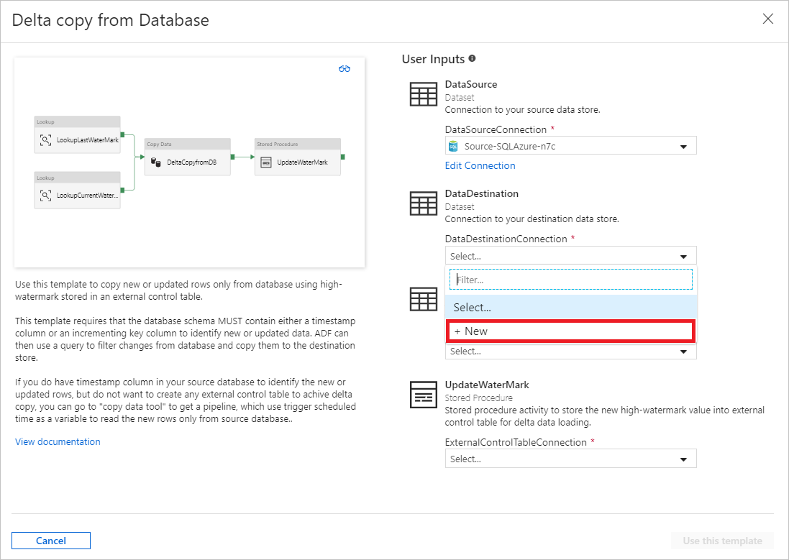
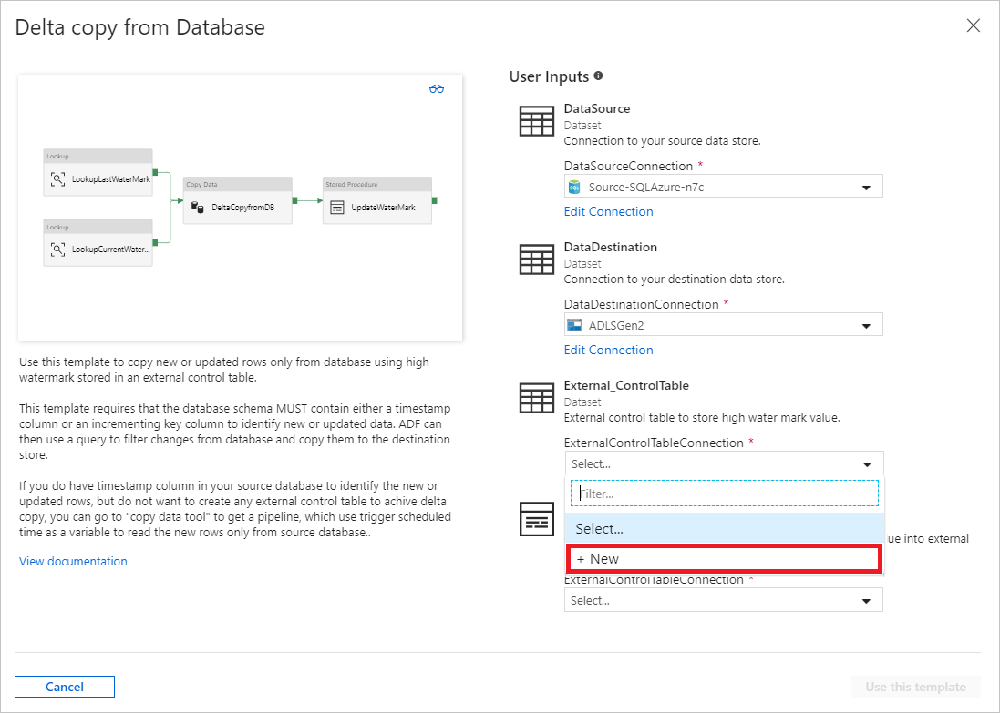
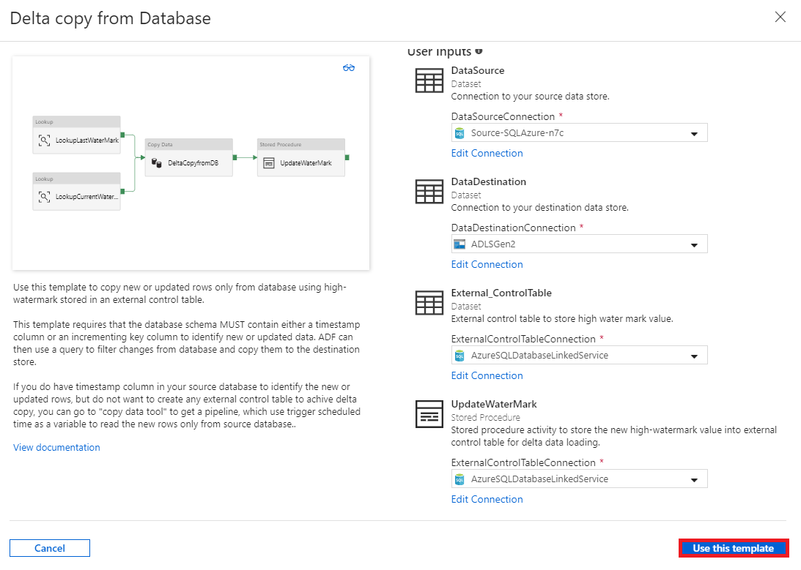
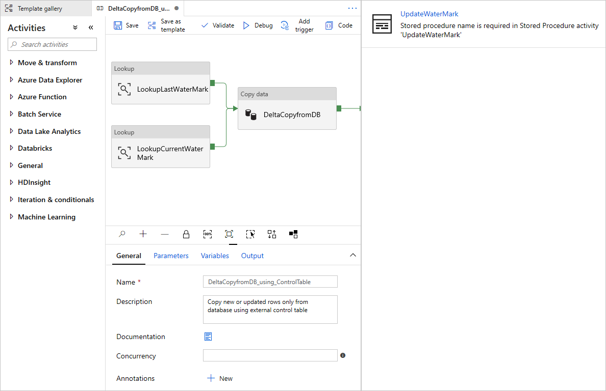
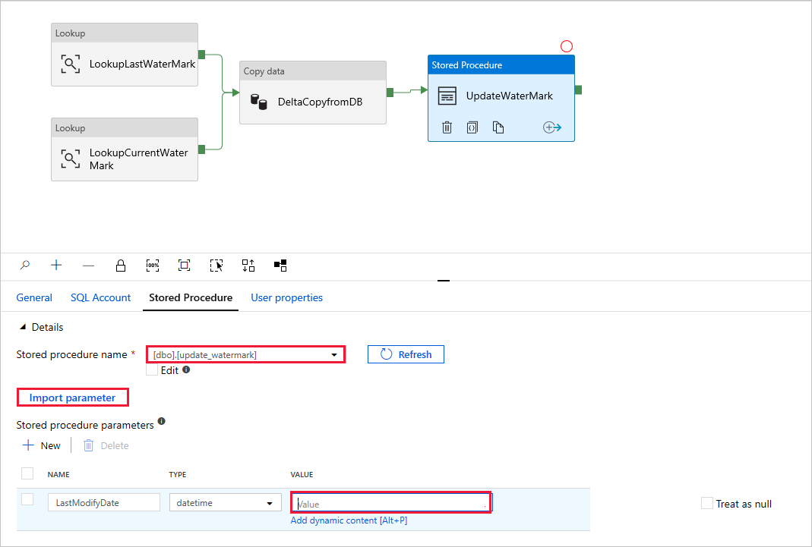
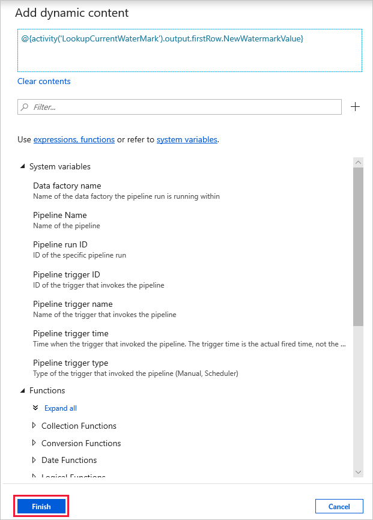
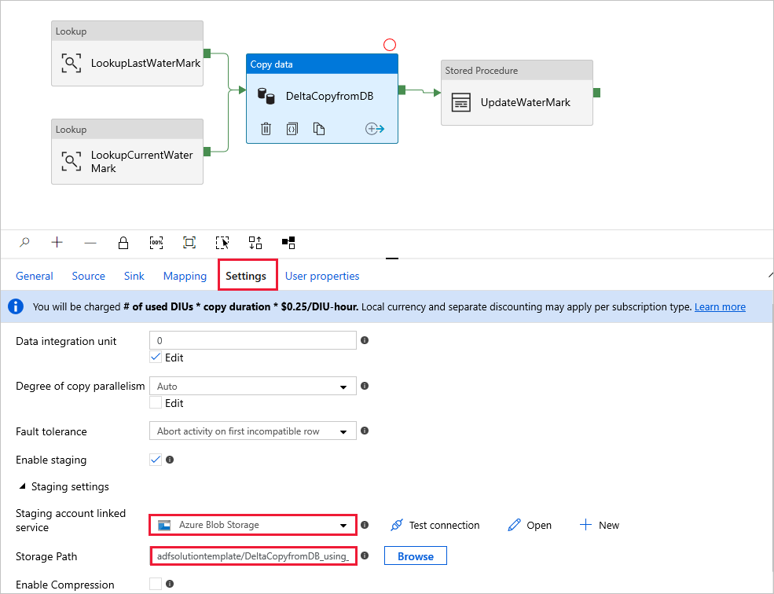

# Delta copy from a database with a control table
[!INCLUDE[appliesto-adf-asa-md](includes/appliesto-adf-asa-md.md)]

This article describes a template that's available to incrementally load new or updated rows from a database table to Azure by using an external control table that stores a high-watermark value.

This template requires that the schema of the source database contains a timestamp column or incrementing key to identify new or updated rows.

>[!NOTE]
> If you have a timestamp column in your source database to identify new or updated rows but you don't want to create an external control table to use for delta copy, you can instead use the [Azure Data Factory Copy Data tool](copy-data-tool.md) to get a pipeline. That tool uses a trigger-scheduled time as a variable to read new rows from the source database.

## About this solution template

This template first retrieves the old watermark value and compares it with the current watermark value. After that, it copies only the changes from the source database, based on a comparison between the two watermark values. Finally, it stores the new high-watermark value to an external control table for delta data loading next time.

The template contains four activities:
- **Lookup** retrieves the old high-watermark value, which is stored in an external control table.
- Another **Lookup** activity retrieves the current high-watermark value from the source database.
- **Copy** copies only changes from the source database to the destination store. The query that identifies the changes in the source database is similar to 'SELECT * FROM Data_Source_Table WHERE TIMESTAMP_Column > “last high-watermark” and TIMESTAMP_Column <= “current high-watermark”'.
- **SqlServerStoredProcedure** writes the current high-watermark value to an external control table for delta copy next time.

The template defines five parameters:
- *Data_Source_Table_Name* is the table in the source database that you want to load data from.
- *Data_Source_WaterMarkColumn* is the name of the column in the source table that's used to identify new or updated rows. The type of this column is typically *datetime*, *INT*, or similar.
- *Data_Destination_Folder_Path* or *Data_Destination_Table_Name* is the place where the data is copied to in your destination store.
- *Control_Table_Table_Name* is the external control table that stores the high-watermark value.
- *Control_Table_Column_Name* is the column in the external control table that stores the high-watermark value.

## How to use this solution template

1. Explore the source table you that want to load, and define the high-watermark column that can be used to identify new or updated rows. The type of this column might be *datetime*, *INT*, or similar. This column's value increases as new rows are added. From the following sample source table (data_source_table), we can use the *LastModifytime* column as the high-watermark column.

	```sql
			PersonID	Name	LastModifytime
			1	aaaa	2017-09-01 00:56:00.000
			2	bbbb	2017-09-02 05:23:00.000
			3	cccc	2017-09-03 02:36:00.000
			4	dddd	2017-09-04 03:21:00.000
			5	eeee	2017-09-05 08:06:00.000
			6	fffffff	2017-09-06 02:23:00.000
			7	gggg	2017-09-07 09:01:00.000
			8	hhhh	2017-09-08 09:01:00.000
			9	iiiiiiiii	2017-09-09 09:01:00.000
	```
	
2. Create a control table in SQL Server or Azure SQL Database to store the high-watermark value for delta data loading. In the following example, the name of the control table is *watermarktable*. In this table, *WatermarkValue* is the column that stores the high-watermark value, and its type is *datetime*.

	```sql
			create table watermarktable
			(
			WatermarkValue datetime,
			);
			INSERT INTO watermarktable
			VALUES ('1/1/2010 12:00:00 AM')
	```
	
3. Create a stored procedure in the same SQL Server or Azure SQL Database instance that you used to create the control table. The stored procedure is used to write the new high-watermark value to the external control table for delta data loading next time.

	```sql
			CREATE PROCEDURE update_watermark @LastModifiedtime datetime
			AS

			BEGIN

				UPDATE watermarktable
				SET [WatermarkValue] = @LastModifiedtime 

			END
	```
	
4. Go to the **Delta copy from Database** template. Create a **New** connection to the source database that you want to data copy from.

    

5. Create a **New** connection to the destination data store that you want to copy the data to.

    

6. Create a **New** connection to the external control table and stored procedure that you created in steps 2 and 3.

    

7. Select **Use this template**.

     
	
8. You see the available pipeline, as shown in the following example:

     

9. Select **Stored Procedure**. For **Stored procedure name**, choose **[update_watermark]**. Select **Import parameter**, and then select **Add dynamic content**.  

     	

10. Write the content **\@{activity('LookupCurrentWaterMark').output.firstRow.NewWatermarkValue}**, and then select **Finish**.  

     		 
	 
11. Select **Debug**, enter the **Parameters**, and then select **Finish**.

    

12. Results similar to the following example are displayed:

    

13. You can create new rows in your source table. Here is sample SQL language to create new rows:

	```sql
			INSERT INTO data_source_table
			VALUES (10, 'newdata','9/10/2017 2:23:00 AM')

			INSERT INTO data_source_table
			VALUES (11, 'newdata','9/11/2017 9:01:00 AM')
	```
14. To run the pipeline again, select **Debug**, enter the **Parameters**, and then select **Finish**.

    

    You see that only new rows were copied to the destination.

15. (Optional:) If you selected SQL Data Warehouse as the data destination, you must also provide a connection to Azure Blob storage for staging, which is required by SQL Data Warehouse Polybase. Make sure that the container has already been created in Blob storage.
    
    
	
## Next steps

- [Bulk copy from a database by using a control table with Azure Data Factory](solution-template-bulk-copy-with-control-table.md)
- [Copy files from multiple containers with Azure Data Factory](solution-template-copy-files-multiple-containers.md)
